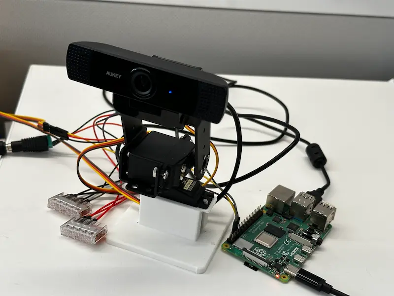
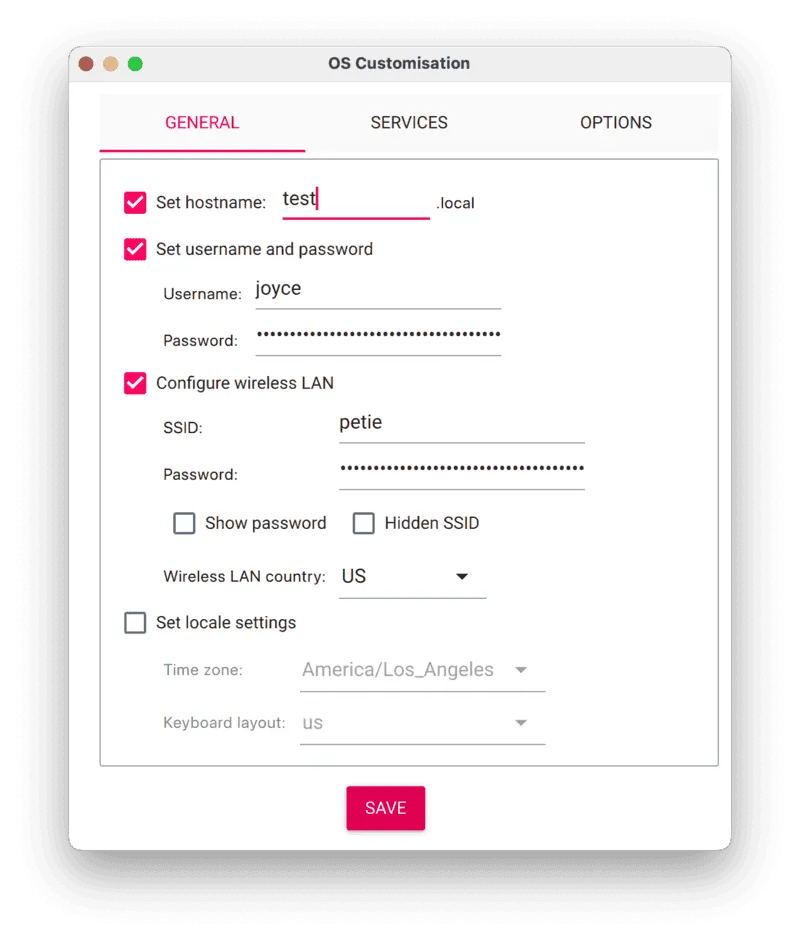
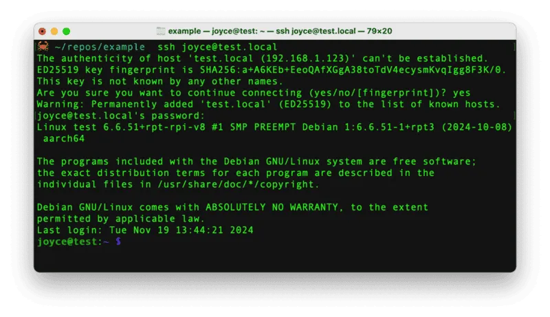
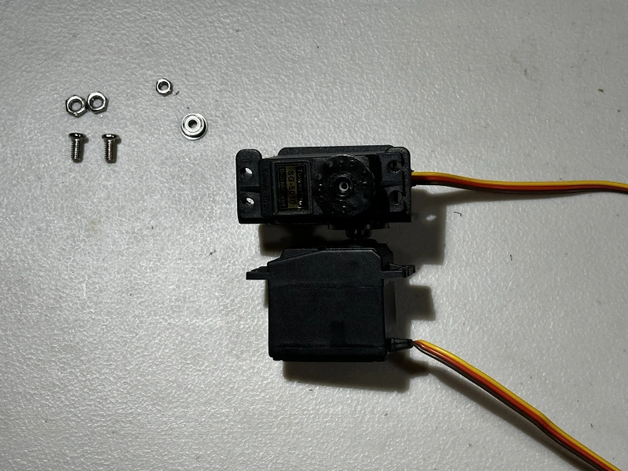
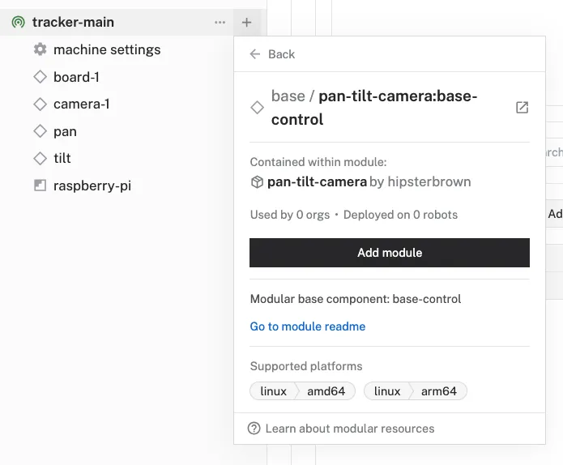

author: HipsterBrown
id: ai-camera-tracking
summary: Build an object tracking camera with servos and computer vision
categories: Getting-Started, Developer
environments: web
status: Published 
feedback link: https://github.com/viam-devrel/viamcodelabs/issues
tags: Getting Started, Developer

# Use Computer Vision to build an AI Tracking Webcam
<!-- ------------------------ -->
## Overview 
Duration: 1

In this tutorial, we'll show you how to build your own pan-tilt camera that can track any object using computer vision.
If you've ever been curious how those smart webcams from Insta360 or gimbals from DJI work, you'll learn those fundamentals while building this project.

### What You’ll Build

- An object tracking camera with servos and computer vision



### Prerequisites

- A computer with MacOS, Windows, or Linux to flash your Raspberry Pi and configure the device's components using the Viam app
- Hardware and supplies requirements
  - 1 - [Raspberry Pi 4](https://a.co/d/fc3JUMm)
  - 1 - microSD card to use with your Pi
  - 1 - power supply for your Pi
  - 1 - [USB webcam with a screw mount](https://a.co/d/6NtuD24)
  - 2 - [TowerPro SG-5010 servos](https://a.co/d/9reLRjo)
  - 1 - [pan-tilt servo mount brackets](https://a.co/d/6CqN1h7)
  - 1 - [5V barrel jack power supply with DC terminal header adapter](https://a.co/d/fJvOjch)
  - 1 - [Assortment of WAGO lever nuts](https://a.co/d/2uE9KNc)
  - 1 - [Assortment of jumper wires](https://www.amazon.com/dp/B077X99KX1)
  - 1 - Phillips screwdriver
- 1 - [3D printed base](https://www.printables.com/model/1251325-tower-servo-base) (optional)

### What You’ll Learn 
- How to configure and test a device's components using Viam
- How to use modules from the Viam registry
- How to deploy an ML model for computer vision
- How to use a vision service for object detection
- How to use custom modules for automated behavior

### What You’ll Need

- All the hardware components listed in prerequisites.
- Sign up for a free Viam account, and then [sign in](https://app.viam.com/fleet/dashboard) to the Viam app

<!-- ### Watch the Video -->

<!-- See a demonstration of the smart snack dispenser in action: -->

<!-- <video id="fpK4J9NzD2Q"></video> -->


<!-- ------------------------ -->
## Set up your Raspberry Pi
Duration: 5

The Raspberry Pi boots from a storage device, such as a USB flash drive or microSD card. You need to install Raspberry Pi OS on that storage device that you will use with your Pi. For more details about alternative methods of setting up your Raspberry Pi, refer to the [Viam docs](https://docs.viam.com/installation/prepare/rpi-setup/#install-raspberry-pi-os).

### Install Raspberry Pi OS

1. Connect the storage device to your computer.
1. Download the [Raspberry Pi Imager](https://www.raspberrypi.com/software/) and launch it.
   
1. Click **CHOOSE DEVICE**. Select your model of Pi, which is Raspberry Pi 4.
1. Click **CHOOSE OS**. Select **Raspberry Pi OS (64-bit)** from the menu.
1. Click **CHOOSE STORAGE**. From the list of devices, select the storage device you intend to use in your Raspberry Pi.
   
1. Configure your Raspberry Pi for remote access. Click **Next**. When prompted to apply OS customization settings, select **EDIT SETTINGS**.
1. Check **Set hostname** and enter the name you would like to access the Pi by in that field, for example, `test`.
1. Select the checkbox for **Set username and password** and set a username (for example, your first name) that you will use to log into the Pi. If you skip this step, the default username will be `pi` (not recommended for security reasons). And specify a password.
1. Connect your Pi to Wi-Fi so that you can run `viam-server` wirelessly. Check **Configure wireless LAN** and enter your wireless network credentials. SSID (short for Service Set Identifier) is your Wi-Fi network name, and password is the network password. Change the section `Wireless LAN country` to where your router is currently being operated.
   
1. Select the **SERVICES** tab, check **Enable SSH**, and select **Use password authentication**.
   
   > aside negative
   > Be sure that you remember the `hostname`, `username`, and `password` you set, as you will need this when you SSH into your Pi.
1. **Save** your updates, and confirm `YES` to apply OS customization settings. Confirm `YES` to erase data on your storage device. You may also be prompted by your operating system to enter an administrator password. After granting permissions to the Imager, it will begin writing and then verifying the Linux installation to your storage device.
1. Remove the storage device from your computer when the installation is complete.

### Connect with SSH

1. Place the storage device into your Raspberry Pi and boot the Pi by plugging it in to an outlet. A red LED will turn on to indicate that the Pi is connected to power.
   > aside negative
   > Make sure you are using a 5V 3A USB-C power supply to power your Raspberry Pi 4. Using a power supply with inadequate amperage can lead to instability, throttling, or unexpected behavior. Additionally, while USB boot is enabled by default on newer Raspberry Pi 4 models, older versions may require a firmware update to enable it. Refer to the [Raspberry Pi documentation](https://www.raspberrypi.com/documentation/computers/raspberry-pi.html) for detailed setup instructions and compatibility.
1. Once the Pi is started, connect to it with SSH. From a command line terminal window, enter the following command. The text in <> should be replaced (including the < and > symbols themselves) with the user and hostname you configured when you set up your Pi.
   ```bash
   ssh <USERNAME>@<HOSTNAME>.local
   ```
1. If you are prompted “Are you sure you want to continue connecting?”, type “yes” and hit enter. Then, enter the password for your username. You should be greeted by a login message and a command prompt.
   
1. Update your Raspberry Pi to ensure all the latest packages are installed
   ```bash
   sudo apt update
   sudo apt upgrade
   ```

<!-- ------------------------ -->

## Assemble the hardware
Duration: 20

Before we get to wiring up the components, let's assemble the servo brackets and mount the webcam.

If you prefer to follow along with video, you can find that [here](https://www.amazon.com/vdp/1ce3c357cb0b4197b5ec9928952dbea8?product=B07PQ12TXS&ref=cm_sw_em_r_ib_dt_qFFZJVGgxClph).

1. You should have the following parts ready for assembly

   - 2 servos
   - webcam
   - Philips Head screwdriver
   - top servo bracket (U-shaped)
   - bottom servo bracket
   - 2 round servo horns
   - assortment of screws and nuts (and one bearing) from the bracket kit

   
1. Grab one of the servos, round servo horns, the horn set screw, and your screwdriver.
   
1. Push the servo horn onto the head of the servo.
   
1. Screw the set screw into the servo to secure the horn in place.
   
1. Grab the bottom bracket and two small servo horn screws along with the servo you've been working on.
   
1. Place the bracket on top of the servo horn, aligning the far right holes to secure the bracket onto the horn with the small screws.
   
1. Grab the top bracket, a servo horn, a round bearing, the longest screw with matching nut, two of the thicker screws with matching nuts, the second servo along with the parts you've been working on.
   
1. Push the servo horn onto the head of the second servo.
   
1. Set the long screw into the center hole of the bottom bracket perpendicular to the bottom servo.
   
   
1. Place the top servo onto the bottom bracket.
   
   
1. Secure the top servo in place with the thicker screws in the bottom bracket, using the nuts to tighten by hand.
   
   
   
   
1. Grab four small servo horn screws along with the current parts.
   
1. Place the bearing on the long screw behind the top servo.
   
   
1. Fit the top bracket legs around the bearing and top servo horn.
   
1. Align the small holes of the leg over the servo horn with four holes to secure it in place with screws.
   
   
1. Secure the bearing in the place with the matching nut.
   
1. Grab the webcam, mount screw, and washer along with the currently assembled parts.
   
1. Set the mount screw into the washer with the flat part facing down.
   
1. Push the mount screw through the bottom of the center hole on the top bracket, then turn the webcam onto the screw, tighten by hand in the expected direction.
   
   

Nice work! With the servo bracket mount complete, you can wire the components to the power supply and Raspberry Pi. 


<!-- ------------------------ -->

## Wire the components
Duration: 10


1. Use the above wiring diagram to connect the hardware peripherals and power together. The power and ground connections from the barrel jack power supply with the DC screw-terminal adapter will be shared among the servos and Raspberry Pi using the WAGO lever nuts.

    The 5-port WAGO bridging all the ground connections will be known as "Common Ground".
    The 3-port WAGO bridging the servos and DC power connections will be known as "Common Power".

    > aside negative
    > Do not plug in the DC power supply while wiring your components. This will prevent you or your hardware from being harmed accidentally.

   #### Board to Pan Servo:
   Jumper wires are required to connect the servo wires to the Raspberry Pi.

   | **Raspberry Pi** | **Servo** |
   | ---------------- | -------------- |
   | Pin 8 (GPIO 14)   | Data wire (yellow) |

   #### Board to Tilt Servo:
   Jumper wires are required to connect the servo wires to the Raspberry Pi.

   | **Raspberry Pi** | **Servo** |
   | ---------------- | -------------- |
   | Pin 10 (GPIO 15)   | Data wire (yellow) |

   #### Board to Power:

   | **Raspberry Pi** | **Power** |
   | ---------------- | -------------- |
   | Pin 6 (Ground)   | Common Ground |

   #### Servo to Power:
   Jumper wires are required to connect the servo wires to each WAGO.


   | **Servo** | **Power** |
   | ---------------- | -------------- |
   | Power wire (red)   | Common Power |
   | Ground wire (brown)   | Common Ground |

   _repeat for each servo_

   > aside positive
   > The website [pinout.xyz](https://pinout.xyz/) is a helpful resource with the exact layout and role of each pin for Raspberry Pi. When working with Viam, make sure to reference the physical pin numbers, and not the GPIO numbers listed on `pinout.xyz`.
1. Connect the webcam USB plug to to any of the Raspberry Pi's USB-A ports.
   

Well done! 👏 

Now you can plug in the DC power supply for the servos.

In the next section, you'll configure your device in the Viam app and start controlling your hardware!
<!-- ------------------------ -->
## Configure your machine and peripherals
Duration: 10

### Configure your machine

1. In [the Viam app](https://app.viam.com/fleet/dashboard) under the **LOCATIONS** tab, create a machine by typing in a name and clicking **Add machine**.
   
1. Click **View setup instructions**.
1. To install `viam-server` on the Raspberry Pi device that you want to use, select the `Linux / Aarch64` platform for the Raspberry Pi, and leave your installation method as [`viam-agent`](https://docs.viam.com/how-tos/provision-setup/#install-viam-agent).
   
1. Use the `viam-agent` to download and install `viam-server` on your Raspberry Pi. Follow the instructions to run the command provided in the setup instructions from the SSH prompt of your Raspberry Pi.
   
1. The setup page will indicate when the machine is successfully connected.
   

### Configure your Raspberry Pi board

To access the GPIO pins, let's add our Raspberry Pi board to our machine in the Viam app.

1. In [the Viam app](https://app.viam.com/fleet/locations), find the **CONFIGURE** tab.
1. Click the **+** icon in the left-hand menu and select **Component**.
   
1. Select `board`, and find the `raspberry-pi:rpi4` module. This adds the module for working with the Raspberry Pi 4's GPIO pins. Leave the default name `board-1` for now.
   
1. Notice adding this module adds the board hardware component called `board-1`. The collapsible card on the right corresponds to the part listed in the left sidebar.
1. Click **Save** in the top right to save and apply your configuration changes.

### Configure your webcam

1. In [the Viam app](https://app.viam.com/fleet/locations) under the **CONFIGURE** tab, click the **+** icon in the left-hand menu and select **Component**.
1. Select `camera`, and find the `webcam` module. This adds the module for working with a USB webcam. Leave the default name `camera-1` for now.
1. Notice adding this component adds the webcam hardware component called `camera-1`. From the **Configure** section of the panel, switch to the JSON configuration mode using the `{}` icon in the top-right:
   
1. In this mode, configure your component with the following JSON in the **CONFIGURE** field. This will tell the component to look for the default camera connected to the device, which will be the USB webcam.
   ```json
   {
       "video_path": ""
   }
   ```
   
1. Click **Save** in the top right. This may take a moment to apply your configuration changes.
1. At the bottom of the `camera-1` panel, expand the **TEST** section to ensure you have configured the camera properly and see a video feed.
   


### Configure your pan servo

1. In [the Viam app](https://app.viam.com/fleet/locations), find the **CONFIGURE** tab.
1. Click the **+** icon in the left-hand menu and select **Component**.
1. Select servo, and find the `raspberry-pi:rpi-servo` module. This adds the module for controlling a servo with a Raspberry Pi's GPIO pins. Set the name to `pan` to help indicate the responsibility of this servo.
   
1. Notice adding this module adds the servo hardware component called `pan`. The collapsible card on the right corresponds to the part listed in the left sidebar.
1. In the new `pan` panel, configure your component with the following JSON in the **CONFIGURE** field. This tells your servo component to use a specific pin on a specific board (called `board-1` in the Viam app).
   ```json
   {
       "board": "board-1",
       "pin": "8"
   }
   ```
   
1. Click **Save** in the top right to save and apply your configuration changes.
1. At the bottom of the `pan` panel, expand the **TEST** section to ensure you have configured the servo correctly. You should see the servo move the camera mount left and right using the **Quick move** controls.
   

### Configure your tilt servo

1. In [the Viam app](https://app.viam.com/fleet/locations), find the **CONFIGURE** tab.
1. Click on the **...** in the top-right corner of the `pan` servo panel to reveal an action menu. Select **Duplicate** to create a copy of the component for the tilt servo in the configuration.
   
1. A new component card will appear with the name of the `pan` servo component plus "-copy". Click on the name and rename it to `tilt`.
   
1. In the new `tilt` panel, configure your component with the following JSON in the **CONFIGURE** field. This tells your servo component to use a specific pin on a specific board (called `board-1` in the Viam app).
   ```json
   {
       "board": "board-1",
       "pin": "10"
   }
   ```
   
1. Click **Save** in the top right to save and apply your configuration changes.
1. At the bottom of the `tilt` panel, expand the **TEST** section to ensure you have configured the servo correctly. You should see the servo move the camera mount up and down using the **Quick move** controls.
   

### Configure your base

1. In [the Viam app](https://app.viam.com/fleet/locations) under the **CONFIGURE** tab, click the **+** icon in the left-hand menu and select **Component**.
1. Select `base`, and find the `pan-tilt-camera:base-control` module. This adds the module for sending directions to a pair of pan-tilt servos from a single component. Leave the default name `base-1` for now.
   
1. In the new `base-1` panel, configure your component with the following JSON in the **CONFIGURE** field. This tells your base component which servos to use for the pan and tilt functionalities.
   ```json
   {
       "pan": "pan",
       "tilt": "tilt"
   }
   ```
   
1. Click **Save** in the top right. This may take a moment to apply your configuration changes.
1. At the bottom of the `base-1` panel, expand the **TEST** section to ensure you have configured the base properly. After toggling the keyboard control under the **Quick move** section, you should see the appropriate servo move when using your keyboar's arrow keys or WASD.
   

> aside negative
> **TROUBLESHOOTING**: Double check the wiring on your components. Also check under the **LOGS** tab to see what might be going wrong.

With your hardware components confirmed working, now we will provide the intelligence to enable real-time object tracking!

<!-- ------------------------ -->
## Configure your services
Duration: 5

### Add an ML model service

1. In the Viam app, click the **+** icon in the left-hand menu and select **Service**, and then `ML model`.
1. Search for a module called `TFLite CPU`. Then click **Add module**, and **Create** a new [ML Model service](https://docs.viam.com/services/ml/) called `mlmodel-1`. This provides the ability to run Tensorflow Lite, a.k.a [LiteRT](https://ai.google.dev/edge/litert), models on the machine.
   
1. Notice this creates two new items in the left sidebar. The first is your new ML Model service called `mlmodel-1`, and the second is the `tflite_cpu` module from the Registry.
1. In the `mlmodel-1` panel, click "Select model" in the **Model** section, search for "EfficientDet-COCO" under the **Registry** tab, and select the model from the list.
   
   
   
1. Click **Save** in the top right to save and apply your configuration changes.

### Add a vision service

1. In the Viam app, click the **+** icon in the left-hand menu and select **Service**, and then `vision`.
1. Search for a module called `mlmodel`. Then click **Add module**, and **Create** a new [Vision service](https://docs.viam.com/services/vision/) called `vision-1`.
   
1. Notice adding this service adds the vision service called `vision-1`. From the **ML Model** section of the panel, select `mlmodel-1`.
   
1. **Save** your changes in the top right and wait a few moments for the configuration changes to take effect.
1. At the bottom of the `vision-1` panel, expand the **TEST** section to ensure you have configured the service properly and can see the labels detected by the model with bounding boxes around each detected object.
   

### Add the tracker service

1. In the Viam app, click the **+** icon in the left-hand menu and select **Service**, and then `generic`.
1. Search for a module called `pan-tilt-camera:tracker`. Then click **Add module**, and **Create** a new [tracker service](https://github.com/HipsterBrown/viam-pan-tilt-camera) called `tracking`.
   
   
1. Notice adding this service adds the generic service called `tracking`.
1. In the new `tracking` panel, configure the service by adding the following attributes in the **CONFIGURE** field. This tells the tracker service to use specific base and camera components along with a specific vision service to look for a certain object label:
   ```json
   {
     "base_name": "base-1",
     "camera_name": "camera-1",
     "vision_name": "vision-1",
     "auto_start": True,
     "object_label": "Person"
   }
   ```
   
1. **Save** your changes in the top right and wait a few moments for the configuration changes to take effect.
1. Test out the service by looking at the **TEST** panel of the vision service and move around in front of the camera. You will see it respond to your movements to keep you in the center of the frame.
   Experiment with changing the "object_label" field to any of the detected labels displayed by the vision service, such as "Cellphone", and use that object to guide the camera movement.

<!--  -->

> aside negative
> **TROUBLESHOOTING**: Double check your service configuration. Look at the **LOGS** tab to see what might be going wrong.
<!-- ------------------------ -->
## Conclusion And Resources
Duration: 1

Congratulations! Now you have an automated camera system that can track objects in real time using off-the-shelf components!
While this project looks just a bit different from those commercial tracking webcams, it's given you a taste of key hardware hacking concepts - from servo control to computer vision to hardware automation.

### What You Learned
- How to configure and test a device's components using Viam
- How to use modules from the Viam registry
- How to deploy an ML model for computer vision
- How to use a vision service for object detection
- How to use custom modules for automated behavior

### Building advanced scenarios with Viam and the AI tracking camera

At this point, you have configured and tested your machine to track objects. Consider adding features like:

- use, or [train](https://docs.viam.com/data-ai/ai/train-tflite/), a model to detect faces for more precise people tracking.
- add voice control using a [speech module](https://app.viam.com/module/viam-labs/speech)
- build a custom web or mobile application to monitor and control using the [Viam SDKs](https://docs.viam.com/dev/reference/sdks/)
- add tracking alerts when the camera detects something and is currently following that object

### Real-world applications and projects for AI tracking camera

This project is fun for personal use, and it has practical uses in other places as well:

- Provide more comprehensive security for a building or workspace than a stationary camera
- Mount on a rover for object following or avoidance
- Track activity during a soccer match or basketball game

### Related Viam Resources

- [Viam documentation](https://docs.viam.com/)
- [Viam how-to guides](https://docs.viam.com/how-tos/)
- [Viam Discord community](http://discord.gg/viam)
