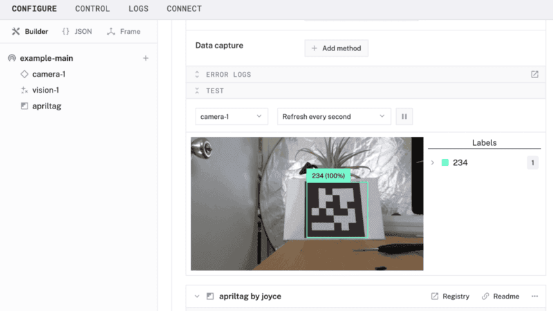
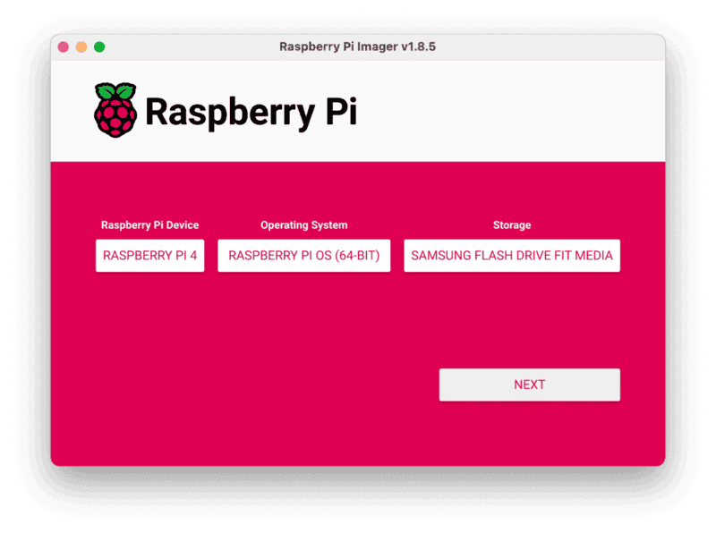
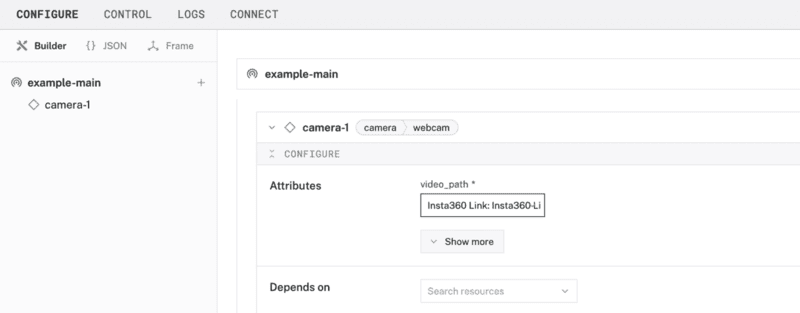
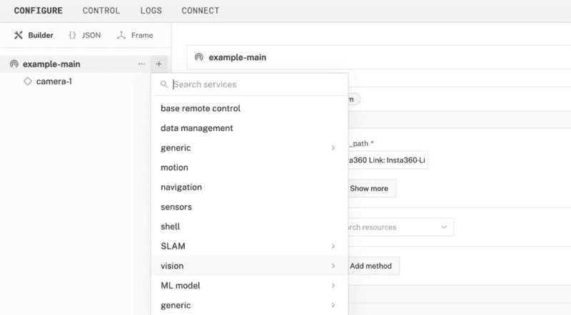
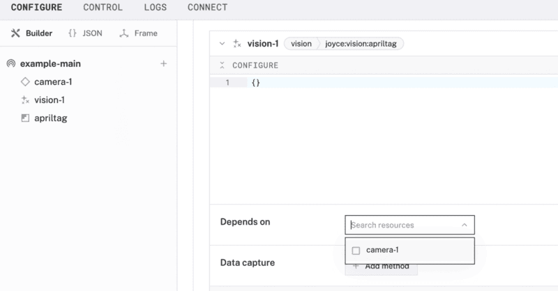

author: Joyce
id: apriltag
summary: Detect AprilTags on a camera using apriltag and OpenCV
categories: Getting-Started, Developer
environments: web
status: Published
feedback link: https://github.com/viam-labs/viamcodelabs/issues
tags: Getting Started, Developer

# Use an AprilTag scanner

<!-- ------------------------ -->

## Overview

Duration: 2

**Why would you want to detect AprilTags?** [AprilTags](https://april.eecs.umich.edu/software/apriltag), similar to QR codes, can encode a variety of information and are widely used in robotics and computer vision applications. Unlike QR codes, AprilTags are designed for scenarios where precise localization, identification, and orientation are critical. They are commonly used for tasks such as guiding autonomous vehicles, tracking objects, and enhancing augmented reality systems.

In this codelab, you'll learn how to detect and decode AprilTags using a Viam module. We'll leverage the [`apriltag`](https://pypi.org/project/apriltag/) and [OpenCV](https://pypi.org/project/opencv-python/) Python libraries to process images from a camera and extract information encoded in AprilTags. By the end, you'll have a working solution that can identify AprilTags in real-time, enabling customizable actions for a variety of applications, from navigation to interactive robotics.



### What You’ll Build

- A camera that can detect and decode AprilTags

### Prerequisites

- A computer with MacOS, Windows, or Linux to flash your Raspberry Pi and configure the device's components using the Viam app
- Hardware and supplies requirements

  - 1 - [Raspberry Pi 4](https://a.co/d/fc3JUMm)
  - 1 - microSD card to use with your Pi
  - 1 - power supply for your Pi
  - 1 - USB web camera

### What You’ll Need

- All the hardware components listed in prerequisites.
- Sign up for a free Viam account, and then [sign in](https://app.viam.com/fleet/dashboard) to the Viam app

### What You’ll Learn

- How to use a webcam to scan and detect AprilTags
- How to configure and test a device's components using Viam
- How to use a vision service in Viam
- How to use modules from the Viam registry

### Watch the Video

See a demonstration and overview of the AprilTags scanner in this video.

<!-- <video id="anHPD2vT8Zw"></video> -->

<!-- ------------------------ -->

## Set up your Raspberry Pi

Duration: 6

The Raspberry Pi boots from a USB flash drive (or microSD card). You need to install Raspberry Pi OS on a USB flash drive that you will use with your Pi. For more details about alternative methods of setting up your Raspberry Pi, refer to the [Viam docs](https://docs.viam.com/installation/prepare/rpi-setup/#install-raspberry-pi-os).

### Install Raspberry Pi OS

1. Connect the USB flash drive (or microSD card) to your computer.
1. Download the [Raspberry Pi Imager](https://www.raspberrypi.com/software/) and launch it.
   
1. Click **CHOOSE DEVICE**. Select your model of Pi, which is Raspberry Pi 5.
1. Click **CHOOSE OS**. Select **Raspberry Pi OS (64-bit)** from the menu.
1. Click **CHOOSE STORAGE**. From the list of devices, select the USB flash drive you intend to use in your Raspberry Pi.
   
1. Configure your Raspberry Pi for remote access. Click **Next**. When prompted to apply OS customization settings, select **EDIT SETTINGS**.
1. Check **Set hostname** and enter the name you would like to access the Pi by in that field, for example, `test`.
1. Select the checkbox for **Set username and password** and set a username (for example, your first name) that you will use to log into the Pi. If you skip this step, the default username will be `pi` (not recommended for security reasons). And specify a password.
1. Connect your Pi to Wi-Fi so that you can run `viam-server` wirelessly. Check **Configure wireless LAN** and enter your wireless network credentials. SSID (short for Service Set Identifier) is your Wi-Fi network name, and password is the network password. Change the section `Wireless LAN country` to where your router is currently being operated.
   
1. Select the **SERVICES** tab, check **Enable SSH**, and select **Use password authentication**.
   
   > aside negative
   > Be sure that you remember the `hostname` and `username` you set, as you will need this when you SSH into your Pi.
1. **Save** your updates, and confirm `YES` to apply OS customization settings. Confirm `YES` to erase data on the USB flash drive. You may also be prompted by your operating system to enter an administrator password. After granting permissions to the Imager, it will begin writing and then verifying the Linux installation to the USB flash drive.
1. Remove the USB flash drive from your computer when the installation is complete.

### Connect with SSH

1. Place the USB flash drive into your Raspberry Pi and boot the Pi by plugging it in to an outlet. A red LED will turn on to indicate that the Pi is connected to power.
   > aside negative
   > Make sure you are using a 5V 3A USB-C power supply to power your Raspberry Pi 4. Using a power supply with inadequate amperage can lead to instability, throttling, or unexpected behavior. Additionally, while USB boot is enabled by default on newer Raspberry Pi 4 models, older versions may require a firmware update to enable it. Refer to the [Raspberry Pi documentation](https://www.raspberrypi.com/documentation/computers/raspberry-pi.html) for detailed setup instructions and compatibility.
1. Once the Pi is started, connect to it with SSH. From a command line terminal window, enter the following command. The text in <> should be replaced (including the < and > symbols themselves) with the user and hostname you configured when you set up your Pi.
   ```bash
   ssh <USERNAME>@<HOSTNAME>.local
   ```
1. If you are prompted “Are you sure you want to continue connecting?”, type “yes” and hit enter. Then, enter the password for your username. You should be greeted by a login message and a command prompt.
   
1. Update your Raspberry Pi to ensure all the latest packages are installed
   ```bash
   sudo apt update
   sudo apt upgrade
   ```

<!-- ------------------------ -->

## Configure your machine and peripherals

Duration: 3

### Configure your machine

1. In [the Viam app](https://app.viam.com/fleet/dashboard) under the **LOCATIONS** tab, create a machine by typing in a name and clicking **Add machine**.
   
1. Click **View setup instructions**.
   
1. To install `viam-server` on the Raspberry Pi device that you want to use to communicate with and control your webcam, select the `Linux / Aarch64` platform for the Raspberry Pi, and leave your installation method as [`viam-agent`](https://docs.viam.com/how-tos/provision-setup/#install-viam-agent).
   
1. Use the `viam-agent` to download and install `viam-server` on your Raspberry Pi. Follow the instructions to run the command provided in the setup instructions from the SSH prompt of your Raspberry Pi.
   
1. The setup page will indicate when the machine is successfully connected.
   

### Add your USB webcam

1. Connect the USB webcam to the Raspberry Pi.
1. In [the Viam app](https://app.viam.com/fleet/locations), find the **CONFIGURE** tab. It's time to configure your hardware.
1. Click the **+** icon in the left-hand menu and select **Component**.
   
1. Select `camera`, and find the `webcam` module. This adds the module for working with a USB webcam. Leave the default name `camera-1` for now.
   
1. Notice adding this component adds the webcam hardware component called `camera-1`. The collapsible panel on the right corresponds to the part listed in the left sidebar. From the **Attributes** section of the panel, select a `video_path`.
   
1. Click **Save** in the top right to save and apply your configuration changes.
1. At the bottom of the `camera-1` panel, expand the **TEST** section to ensure you have configured the camera properly.
   
   > aside negative
   > If any problems occur, check under the **LOGS** tab to see what might be going wrong. [Refer to the troubleshooting guide if needed.](https://docs.viam.com/components/camera/webcam/#troubleshooting)

<!-- ------------------------ -->

## Add a vision service

Duration: 3

Now that your hardware is working the way you want it, it's time to add a vision service to detect and decode an AprilTag.

1. In the Viam app, click the **+** icon in the left-hand menu and select **Service**, and then `vision`.
   
1. Search for a module called `apriltag`. Then click **Add module**, and **Create** a new vision service called `vision-1`.
   
1. Notice this creates two new items in the left sidebar. The first is your new vision service called `vision-1`, and the second is your new `apriltag` module.
1. In the `vision-1` panel under the **Depends on** section, check the `camera-1` resource. This configures the vision service to depend on data coming in from the webcam.
   
1. **Save** your changes in the top right and wait a few moments for the configuration changes to take effect.
1. At the bottom of the `vision-1` panel, expand the **TEST** section to ensure you have configured the vision service properly. Point the webcam towards an AprilTag to see if the camera detects it.
1. If the camera detects an AprilTag, a bounding box will highlight the item in the video feed, decode the data, and display it on the right under **Labels**. In the example shown here, the data decoded was unique ID `234`.
   

   > aside negative
   > **Troubleshooting:**
   >
   > - Check under the **LOGS** tab of the Viam app to see what might be going wrong.
   > - Make sure you are testing with a valid AprilTag. You can generate AprilTags [here](https://chaitanyantr.github.io/apriltag.html). Make sure to select tag family `tag36h11` since the module we are using defaults to that tag family.

<!-- ------------------------ -->

## Next Steps

Duration: 3

### What you learned

- How to use a webcam to scan and detect AprilTags
- How to configure and test a device's components using Viam
- How to use a vision service in Viam
- How to use modules from the Viam registry

### Building advanced features with Viam and AprilTags

At this point, you have configured and tested your machine and webcam to detect and decode AprilTags, but nothing else is happening automatically, you can create [automatic processes](https://docs.viam.com/configure/processes/) that trigger actions when AprilTags are detected, similar to the [steps in this QR code detection codelab](https://codelabs.viam.com/guide/qrcode/index.html?index=..%2F..index#3).

Now that you have a camera that detects and decodes AprilTags, you can:

- [train and deploy a custom vision model](https://docs.viam.com/how-tos/train-deploy-ml/) to detect and classify other objects alongisde AprilTags
- extend the [apriltag module](https://app.viam.com/module/joyce/apriltag) in the Viam registry to use different tag families, add custom functionality such as pose detection, or trigger specific actions based on detected tags
- [add more components and services](https://docs.viam.com/platform/#the-things-that-make-up-a-machine) to enhance the functionality of your machine, such as integrating advanced robotics controls or feedback systems

### Real-world applications and projects for AprilTags

AprilTags are used in the physical world for tasks that require precise localization, identification, and orientation. They are used across various industries and projects, including:

- **Navigation and Localization**: AprilTags serve as waypoints for autonomous navigation, enabling [roving robots](https://docs.viam.com/tutorials/configure/configure-rover/) to traverse offices, homes, or outdoor spaces with high accuracy.
- **Access Control**: Secure access systems can link specific AprilTags to trigger actions like unlocking doors, disabling alarms, or raising barriers.
- **Interactive Robotics**: Robots can use AprilTags to identify objects or trigger specific actions, such as picking up or delivering items to designated areas.
- **Augmented Reality**: Physical objects tagged with AprilTags can be recognized and interacted with in augmented reality applications.
- **Logistics and Warehousing**: AprilTags track and identify packages or inventory in warehouses and distribution centers, streamlining operations.
- **Manufacturing**: They guide assembly line operations, ensuring precision in automated workflows.

### Notable real-world use cases

- **New York City Subway**: AprilTags are being used [to improve accessibility for visually impaired and non-English speakers](https://www.timeout.com/newyork/news/qr-codes-will-make-navigating-the-subway-easier-for-the-visually-impaired-and-non-english-speakers-011724) by aiding navigation.
- **FIRST Tech Challenge**: AprilTags [provide precise location and orientation for robots during competitions](https://ftc-docs.firstinspires.org/en/latest/apriltag/vision_portal/apriltag_intro/apriltag-intro.html), enabling autonomous navigation and task execution.


### Related Viam resources

- [Viam documentation](https://docs.viam.com/)
- [Viam how-to guides](https://docs.viam.com/how-tos/)
- [Viam Discord community](http://discord.gg/viam)
