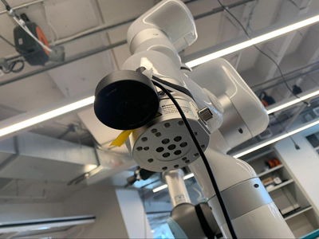

author: Joyce
id: claw-game
summary: Create your own arcade claw game using a robotic arm, an arcade claw grabber, and Jetson
categories: Getting-Started, Developer
environments: web
status: Published
feedback link: https://github.com/viam-devrel/viamcodelabs/issues
tags: Getting Started, Developer

# Build a Robotic Claw Game with a Jetson

<!-- ------------------------ -->

## Overview

Duration: 1

In this tutorial, you'll create an arcade claw game using a robotic arm, an arcade claw grabber, and a Jetson. Learn how to fine-tune the machine, from the precision of each grab, to the claw’s strength, and even the aesthetics of your control interface.

<!--  -->

### Prerequisites

- Sign up for a free Viam account, and then [sign in](https://app.viam.com/fleet/locations/) to the Viam app
- Hardware and supplies requirements

  - 1 - Jetson with Jetpack 5, set up so you can SSH into it, with a microSD card, and power supply

  - 1 - [uFactory xarm 6](https://www.ufactory.us/product/ufactory-xarm-6) robotic arm assembled and mounted securely on a surface. This requires a wired ethernet connection to get the control box online
  - 1 - An arcade claw with 24V power supply
  - 1 - 3D printer to print the claw mount
  - 1 - Hex 4 screwdriver
  - 600 - Small items for the claw to grab

### What You’ll Learn

- How to use modules from [the Viam registry](https://docs.viam.com/registry/)
- How to use the motion service using the Viam Python SDK
- How to create a custom control interface using the Viam TypeScript SDK

### What You’ll Build

- An arcade claw game that lets players

### Watch the Video

See a demonstration and overview of the arcade claw game in this video.

<!-- <video id="WFlZlPSefqc"></video> -->

<!-- ------------------------ -->

## Assemble your components

Duration: 15

### Set up the claw

1. **3D print the claw mount**: [Download the STL](https://github.com/viam-labs/claw-game/blob/main/xarm6ClawMount.stl) for the claw mount, and use a 3D printer to print the mount for in between the claw and the xArm6.
   
1. **Attach the claw to the printed mount**:
   - With a screwdriver, remove the metal top cap from the claw by removing the side screws.
   - Remove the string that came with the claw, it is not needed.
   - Extend 2 or 3 M3 button socket cap screws through the recessed inner holes of the printed mount and through the slots on the top of the claw cap.
   - Secure the M3 screws with nuts and tighten.
   - Attach the printed mount and claw end cap to the claw, add the previously removed screws and tighten.
1. **Mount the claw to the arm**: Using two M20 screws, attach the printed mount to the end of the arm and tighten.
   
   
1. Using hook-and-loop cable ties, run the claw’s cable along each segment of the arm to the arm base, making sure the cord is secure but with some slack to allow for movement.
   

### Wire and test the claw

The arcade claw is actuated when a solenoid is powered, acting as a magnet to pull the claw shut. For this project, we use a relay, which allows us to programmatically control when power flows to the claw’s solenoid.

1. Using a barrel jack adapter, connect the positive (red) wire from the claw to the positive terminal of the adapter.
1. Then, connect the negative (black) wire from the claw to the `COM` terminal on the relay.
1. Cut a length of wire and connect it between the `NO` terminal on the relay and the negative terminal on the barrel jack adapter. This creates a normally open circuit, which means the circuit is normally not complete and the claw is therefore normally not powered.

In order to control the claw through Viam, you will now wire the relay to the Jetson.

<!-- ------------------------ -->

## Configure your machine

Duration: 15

### Configure

<!-- ------------------------ -->

## Test your components

Duration: 15

### Configure

<!-- ------------------------ -->

## Use the Viam motion service

Duration: 15

### Create obstacles and a world state

<!-- ------------------------ -->

## Create a custom interface using TypeScript

Duration: 15

### Create

<!-- ------------------------ -->

## Finishing touches

Duration: 15

### Enclosure

<!-- ------------------------ -->

## Next Steps

Duration: 2

### Find the red ball
