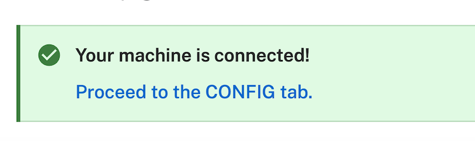

author: Joyce
id: claw-game
summary: Create your own arcade claw game using a robotic arm, an arcade claw grabber, and Nvidia Jetson
categories: Getting-Started, Developer
environments: web
status: Published
feedback link: https://github.com/viam-devrel/viamcodelabs/issues
tags: Getting Started, Developer

# Use motion planning with a Robotic Claw Game powered by Nvidia Jetson

<!-- ------------------------ -->

## Overview

Duration: 1

In this tutorial, you'll create an arcade claw game using a robotic arm, an arcade claw grabber, and an Nvidia Jetson. Learn how to fine-tune the machine, from the precision of each grab, to the claw’s strength, and even the aesthetics of your control interface.

### Prerequisites

- Sign up for a free Viam account, and then [sign in](https://app.viam.com/fleet/locations/) to Viam
- Hardware and supplies requirements

  - 1 - [Nvidia Jetson Orin Nano](https://developer.nvidia.com/buy-jetson) with [Jetpack 5](https://www.jetson-ai-lab.com/initial_setup_jon.html), set up so you can SSH into it, with a microSD card, and power supply
  - 1 - [uFactory xarm 6](https://www.ufactory.us/product/ufactory-xarm-6) robotic arm assembled and mounted securely on a surface. This requires a wired ethernet connection to communicate with the control box over the local network.
  - 1 - [An arcade claw](https://a.co/d/0zdeCQ2)
  - 1 - [24V power supply w/ barrel jack to screw terminal adapter](https://a.co/d/02IrvaE)
  - 1 - 3D printer to print the claw mount
  - 2 - [M4 12mm hex screws](https://a.co/d/4Aw6LVh) for mounting the claw
  - 1 - Hex 4 screwdriver
  - 3 - M3 button socket cap screws w/ matching nuts
  - 600 - Small items for the claw to grab

### What You’ll Learn

- How to use modules from [the Viam registry](https://docs.viam.com/registry/)
- How to control a robot arm
- How to use the motion service through the Viam TypeScript SDK
- How to create a custom control interface using the Viam TypeScript SDK

### What You’ll Build

- An arcade claw game that lets players control a robot arm to pick up items

### Watch the Video

See a demonstration and overview of the arcade claw game in this video.

<!-- <video id="WFlZlPSefqc"></video> -->

<!-- ------------------------ -->

## Assemble your components

Duration: 15

### Set up the claw

1. **3D print the claw mount**: [Download the STL](https://github.com/viam-labs/claw-game/blob/main/xarm6ClawMount.stl) for the claw mount, and use a 3D printer to print the mount for in between the claw and the xArm6.
   
1. **Attach the claw to the printed mount**:
   - With a screwdriver, remove the metal top cap from the claw by removing the side screws.
   - Remove the string that came with the claw, it is not needed.
   - Extend 2 or 3 M3 button socket cap screws through the recessed inner holes of the printed mount and through the slots on the top of the claw cap.
   - Secure the M3 screws with nuts and tighten.
   - Attach the printed mount and claw end cap to the claw, add the previously removed screws and tighten.
1. **Mount the claw to the arm**: Using two M20 screws, attach the printed mount to the end of the arm and tighten.
   
   
1. Using hook-and-loop cable ties, run the claw’s cable along each segment of the arm to the arm base, making sure the cord is secure but with some slack to allow for movement.
   

### Wire and test the claw

The arcade claw is actuated when a solenoid is powered, acting as a magnet to pull the claw shut. For this project, we use a relay, which allows us to programmatically control when power flows to the claw’s solenoid.

1. Using a barrel jack adapter, connect the positive (red) wire from the claw to the positive terminal of the adapter.
1. Then, connect the negative (black) wire from the claw to the `COM` terminal on the relay.
1. Cut a length of wire and connect it between the `NO` terminal on the relay and the negative terminal on the barrel jack adapter. This creates a normally open circuit, which means the circuit is normally not complete and the claw is therefore normally not powered.

In order to control the claw through Viam, you will now wire the relay to the Jetson.


<!-- ------------------------ -->

## Configure your machine

Duration: 5

1. In [Viam](https://app.viam.com/fleet/dashboard) under the **LOCATIONS** tab, create a machine by typing in a name like "claw-game" and clicking **Add machine**.
   
1. Click **View setup instructions**.
   
1. To install `viam-server` on the Jetson device that you want to use, select the `Linux / Aarch64` platform for the Jetson, and leave your installation method as [`viam-agent`](https://docs.viam.com/how-tos/provision-setup/#install-viam-agent).
   
1. Use the `viam-agent` to download and install `viam-server` on your Jetson. SSH into your Jetson device, then follow the instructions to run the command provided in the setup instructions:
   
1. The setup page will indicate when the machine is successfully connected.
   

<!-- ------------------------ -->

## Configure your components

Duration: 15

### Add your Jetson board
1. In [Viam](https://app.viam.com/fleet/locations) under the **CONFIGURE** tab, click the **+** icon in the left-hand menu and select **Component or service**.
   <br>
   
1. Select `board`, and find the `nvidia:jetson` module. This adds the module for working with a Jetson device. Click **Add module**.
   <br>
   
1. Give your component a more descriptive name, like `jetson-board`. Click **Create**.
   <br>
   
1. Notice this adds the board hardware component called `jetson-board`. 
   <br>
   
1. Click **Save** in the top right. This may take a moment to apply your configuration changes.

### Configure your arm
1. In [Viam](https://app.viam.com/fleet/locations) under the **CONFIGURE** tab, click the **+** icon in the left-hand menu and select **Component or service**.
1. Select `arm`, and find the `ufactory:xArm6` module. This adds the module for working with a uFactory xArm6 arm. Click **Add module**.
   <br>
   
1. Leave the default name `arm-1` for now. Click **Create**.
1. Notice this adds the arm hardware component called `arm-1`. 
   <br>
   
1. In the JSON configuration section of your arm component, add the `host`, `speed_degs_per_sec`, and `acceleration_degs_per_sec_per_sec` attributes (with your preferred values). `host` refers to your arm's IP address (which you can find [here](https://docs.ufactory.cc/user_manual/ufactoryStudio/3.connection.html#_3-2-software-connection)), `speed_degs_per_sec` refers to the rotational speed of the joints (between 3 and 180, default is 50 degrees/second), and `acceleration_degs_per_sec_per_sec` refers to the acceleration of joints in radians per second increase per second (default is 100 degrees/second ^2):
   ```json
      {
         "host": "10.1.1.26",
         "speed_degs_per_sec": 20,
         "acceleration_degs_per_sec_per_sec": 0
      }
   ```
1. Scroll down a bit to find the **Frame** section, which is still within the **Configure** area. Click **Add frame**.
   <br>
   
1. This adds a default frame with initial default values. Leave these default values for now.
   
1. Click **Save** in the top right. This may take a moment to apply your configuration changes.


### Configure your gripper
1. In [Viam](https://app.viam.com/fleet/locations) under the **CONFIGURE** tab, click the **+** icon in the left-hand menu and select **Component or service**.
1. Select `gripper`, and find the `viam_gripper_gpio:gripper` module. This adds the module for working with a gripper via GPIO pins. Click **Add module**.
   <br>
   
1. Leave the default name `gripper-1` for now. Click **Create**.
1. Notice this adds the gripper component called `gripper-1`. 
   <br>
   
1. In the JSON configuration section of your arm component, add the following attributes:
   ```json
      {
         "board": "jetson-board",
         "pin": "7"
      }  
   ```
1. Click **Save** in the top right. This may take a moment to apply your configuration changes.


<!-- ------------------------ -->

## Test your components

Duration: 5

### Testing the board component
1. In your board component, expand the TEST section. Here, you'll find a testing panel where you can test individual GPIO pins by reading from or writing to them.
2. Set the **Pin** field to `7`, the **Pin type** to `GPIO`, and the **Mode** to `Write`.
3. Assuming the gripper is in the default open state, test closing it by setting the **State** to `High`, then pressing **Set**. To test opening it, set the **State** to `Low`, then press **Set**:
   

### Testing the arm component
1. In your arm component, expand the TEST section. Here, you'll find a testing panel where you can test various arm and joint actions.
3. To test the movement of specific joints,  you can use the `MoveToJointPositions` panel. For example, to move joint 0 (the lowest on the arm), change the angle for joint 0's input, the press **Execute**. To test the top-most joint (in our case, where the gripper is mounted), change the angle for joint 5, then press **Execute**:
   
1.  Try also testing the movement to specific positions using the `MoveToPosition` panel. For example, to move the arm down, change the `Z` input to a smaller number. To move it back up, change the `Z` to a higher number. To test the rotation of the wrist, try changing the `θ`'s input:
   

### Testing the gripper component
1. In your gripper component, expand the TEST section. Here, you'll find a testing panel where you can test opening and closing the gripper.
3. Assuming the gripper is in the default open state, test the Grab action by selecting the **Grab** button. To test the open action, select the **Open** button:
   

<!-- ------------------------ -->

## Use the Viam motion service

Duration: 15

### Create obstacles and a world state

The claw game machine will use the [motion service](https://docs.viam.com/operate/reference/services/motion/) to plan its movements. To make sure the arm doesn’t hit the walls and ceiling of the enclosure or the prize drop hole, you need to create representations of these obstacles around the arm that the motion service can use when planning.

Obstacles are defined as [geometries](https://ts.viam.dev/classes/commonApi.Geometry.html) located in 3D space (defined as a [pose](https://ts.viam.dev/classes/commonApi.Pose.html)) relative to some known object or position around it, or [frame](https://ts.viam.dev/classes/commonApi.PoseInFrame.html), which is typically the origin of the "world".

> aside positive
> The following code examples use the [Viam TypeScript SDK](https://github.com/viamrobotics/viam-typescript-sdk/) since it will be used to make a custom web app for the claw game in the next step.
> The concepts are reusable across Viam's other SDKs, such as Go, Python, and C++. 

```typescript
import type { Geometry } from '@viamrobotics/sdk';

const ceiling: Geometry = {
    label: "ceiling",
    center: { // the Pose of the center of the ceiling obstacle
      x: 0,
      y: 0,
      z: 1000, // 1000 mm above the origin of the "world"
      oX: 1, // orient in a horizontal plane
      oY: 0,
      oZ: 0,
      theta: 0,
    },
    geometryType: {
      case: "box",
      value: { // the shape of the box
        dimsMm: {
          x: 15, // 15 millimeters thick
          y: 1500, // 1500 millimeters along one side
          z: 1500, // 1500 millimeters along the perpendicular side
        }
      }
    },
};
```
When coming up with a motion plan that involves multiple objects that move in tandem, for example parts of the arm, the solved path is constrained such that none of those parts will overlap, or collide, with the defined obstacles.

You can pass information about the robot’s environment, including obstacles, to the motion service through a data structure named [WorldState](https://ts.viam.dev/classes/commonApi.WorldState.html).

```typescript
import type { GeometriesInFrame, ResourceName, WorldState } from '@viamrobotics/sdk';

const myObstaclesInFrame: GeometriesInFrame = {
  referenceFrame: "world",
  geometries: [ceiling],
}

const myWorldState: WorldState = {
  obstacles: [myObstaclesInFrame],
  transforms: [],
}

const getArmName = (name: string): ResourceName => ({
  namespace: 'rdk',
  type: 'component',
  subtype: 'arm',
  name,
})

// other setup code above this
// getArmName creates a ResourceName object to reference the arm component
// new_pose is a Pose, explained later
await motionClient.move(new_pose, getArmName(armName), myWorldState)
```

To help manage the definition of all the obstacles around the claw game, you can create a JSON file similar to [this one](https://github.com/viam-labs/claw-game/blob/main/obstacles-office.json). Represented in that file are obstacles for the prize drop hole, each of the four walls, and the ceiling based on measurements we took for our enclosure.

Example JSON definition:
```json
[
  {
    "label": "hole",
    "translation": {
      "x": 470,
      "y": 30,
      "z": 70
    },
    "orientation": {
      "type": "ov_degrees",
      "value": {
        "x": 0,
        "y": 0,
        "z": 1,
        "th": 0
      }
    },
    "x": 250,
    "y": 360,
    "z": 140
  }
]
```
If the dimensions of your enclosure differ from ours, adjust your JSON file to match.

> aside positive
> Remember to measure in millimeters relative to the center of the base of the arm, which is set at the origin of the "world" reference when we selected "Add frame" while configuring the arm component in an earlier step.

You can create your list of obstacles from that JSON file:

```typescript
import type { Geometry, GeometriesInFrame, WorldState } from '@viamrobotics/sdk';
import obstacles from '../obstacles-office.json';

const geomList: Geometry[] = [];
for (const obs of obstacles) {
  const geom: Geometry = {
    label: obs.label,
    center: {
      x: obs.translation.x,
      y: obs.translation.y,
      z: obs.translation.z,
      oX: obs.orientation.value.x,
      oY: obs.orientation.value.y,
      oZ: obs.orientation.value.z,
      theta: obs.orientation.value.th
    },
    geometryType: {
      case: "box",
      value: {
        dimsMm: {
          x: obs.x,
          y: obs.y,
          z: obs.z,
        }
      }
    },
  }
  geomList.push(geom);
}

const myObstaclesInFrame: GeometriesInFrame = {
  referenceFrame: "world",
  geometries: geomList,
}

const myWorldState: WorldState = {
  obstacles: [myObstaclesInFrame],
  transforms: [],
}
```

### Define poses and constraints

By moving the arm through the Control tab, you can determine the ideal home pose for the end of arm, which is the position the arm starts each game and the one it returns to after making a grab.
You can also determine the best height to move at when navigating around the enclosure and the pick up level, which is how you determine how far to lower the claw.


You can define these values like the following:
```typescript
import type { Pose, PoseInFrame } from '@viamrobotics/sdk';

const moveHeight = 500; // 500 millimeters from the bottom of the base of the arm
// home position - where ball should be dropped and each game starts
let home_pose: Pose = {
    x: 310, // 310 millimeters forward from the center of the base
    y: 10, // 10 millimeters to the left of the center of the base
    z: moveHeight,
    theta: 0,
    oX: 0,
    oY: 0,
    oZ: -1, // the claw should point down towards the "world"
};

// motion service needs a PoseInFrame to know if the pose values are relative to the "world" or another object
let home_pose_in_frame: PoseInFrame = {
    referenceFrame: "world",
    pose: home_pose
}

await motionClient.move(home_pose_in_frame, getArmName(armName), myWorldState)
```

To make it easier players of the claw game to quickly position the arm, you can define "quadrant" coordinates by breaking up the space around it into a 3x3 grid:

```ascii

-1  x | x | x
   ---|---|---
 0  x | a | x
   ---|---|---
 1  x | h | x
   ---|---|---
   -1   0   1 

x = quadrant position
a = arm base
h = home position
```

Because the `z` coordinate is the height at which the claw moves, it should stay the same when moving to each quadrant, so you can store a map of the quadrants with the `x` and `y` values found in the Control tab after moving the claw into position.
It's ok for these values to not be exact, rather a rough estimate based on what you determine to be the center of each quadrant.

```typescript
import type { Pose, PoseInFrame } from '@viamrobotics/sdk';

const gridPositions = {
  '1,1': { x: 270, y: 450 },
  '1,-1': { x: 300, y: -283 },
  '-1,-1': { x: -373, y: -463 },
  '-1,0': { x: -373, y: -90 },
  '-1,1': { x: -373, y: 283 },
  '0,1': { x: 0, y: 373 },
  '0,-1': { x: 0, y: -373 }
}

async function moveToQuadrant(motionClient: MotionClient, x: number, y: number, armName: string) {
  let gridPosition = gridPosition[`${x},${y}`]
  let pose: Pose = {
    x: gridPosition.x,
    y: gridPosition.y,
    z: moveHeight,
    theta: 0,
    oX: 0,
    oY: 0,
    oZ: -1,
  }

  let new_pose_in_frame: PoseInFrame = {
    referenceFrame: "world",
    pose: pose
  }

  await motionClient.move(new_pose_in_frame, getArmName(armName), myWorldState)
}
```

By default, the motion service will attempt to plan the most efficient path from the end of the arm to the proposed "Pose" (position & orientation in 3D space).
If we want to prevent the plan from altering the orientation of the claw or require it to take as straight a path as possible, we can define those as [constraints](https://docs.viam.com/operate/reference/services/motion/constraints/) that are passed to the motion service when calling `move()`. 
For example, we want the claw to always be pointing down (much like a traditional arcade claw game), so we'll define an orientation constraint.

```typescript
import type { Constraints } from '@viamrobotics/sdk';

const constraints: Constraints = {
  orientationConstraint: [
    { orientationToleranceDegs: 5 }, // allow 5 degrees of deviation from the expected orientation
  ],
  linearConstraint: [],
  collisionSpecification: [],
};

await motionClient.move(pose_in_frame, getArmName(armName), myWorldState, constraints)
```

That was a lot to learn! Great work getting through all that. In the next step, we'll use all this knowledge to create and deploy a custom web application to control the robotic arm claw game.

<!-- ------------------------ -->

## Create a custom interface using TypeScript

Duration: 15

### Review the web app code

You can find the source code for the claw game app on GitHub: [https://github.com/viam-labs/claw-game/](https://github.com/viam-labs/claw-game/)
This app is built as a "single page app", so it can be deployed to any static hosting provider, run locally on your laptop, or packaged as a [module](https://docs.viam.com/operate/get-started/other-hardware/create-module/) to be deployed to your machine running viam-server.
We'll be demonstrating that last option, but first we'll note some features of the web app to help you make updates for your version.

Taking a look at [`src/module-main.ts`](https://github.com/viam-labs/claw-game/blob/main/src/module-main.ts), the initial set up code should look familiar from the previous step:

```typescript
import { Client, GripperClient, BoardClient, MotionClient, ArmClient, createRobotClient } from '@viamrobotics/sdk';
import type { Credential, ResourceName, Constraints, Pose } from '@viamrobotics/sdk';
import * as SDK from '@viamrobotics/sdk';
import { parse as parseCookies } from 'cookie-es';
import { setup, fromPromise, assign, assertEvent, createActor } from 'xstate'
import obstacles from '../obstacles-office.json';

const geomList: SDK.Geometry[] = [];
for (const obs of obstacles) {
    // create list of obstacles
}

const myObstaclesInFrame: SDK.GeometriesInFrame = {
  referenceFrame: "world",
  geometries: geomList,
}

const myWorldState: SDK.WorldState = {
  obstacles: [myObstaclesInFrame],
  transforms: [],
}

// other global variable setup code

const constraints: Constraints = {
  orientationConstraint: [
    { orientationToleranceDegs: 5 },
  ],
  linearConstraint: [],
  collisionSpecification: [],
};

const getArmName = (name: string): ResourceName => ({
  namespace: 'rdk',
  type: 'component',
  subtype: 'arm',
  name,
})
const gridPositions = {
  '1,1': { x: 270, y: 450 },
  '1,-1': { x: 300, y: -283 },
  '-1,-1': { x: -373, y: -463 },
  '-1,0': { x: -373, y: -90 },
  '-1,1': { x: -373, y: 283 },
  '0,1': { x: 0, y: 373 },
  '0,-1': { x: 0, y: -373 }
}
```

> aside positive
> If you want to learn more about the state machine code (i.e. `xstate`) in the web app, check out [our post on the Stately blog](https://stately.ai/blog/2024-07-29-claw-game-state-machine).

To get the necessary credentials to connect to viam-server running on the Jetson from the web app, the module sets a "cookie" with that information:

```typescript
const cookieStore = parseCookies(document.cookie)

const robotAPIKey = cookieStore['api-key']
const robotAPIKeyID = cookieStore['api-key-id']
const robotHost = cookieStore['host']

// connect to viam-server with createRobotClient in the state machine
// "input" is a reference to some internal state
const credentials: Credential = {
  type: "api-key",
  payload: input.apiKey,
  authEntity: input.apiKeyId,
}

//This is the host address of the main part of your robot.
const host = input.locationAddress

return createRobotClient({
  host,
  credentials,
  signalingAddress:
    "https://app.viam.com:443",
})
```

With the robot client set to "machineClient", we can create clients for each of the components and services we can to control in the app:

```typescript
"assignClients": assign({
  motionClient: ({ context }) =>
    new MotionClient(context.machineClient, context.motionClientName),

  boardClient: ({ context }) =>
    new BoardClient(context.machineClient, context.boardClientName),

  armClient: ({ context }) =>
    new ArmClient(context.machineClient, context.armClientName),

  gripperClient: ({ context }) =>
    new GripperClient(context.machineClient, context.gripperClientName),
}),
```

These clients can be used for the actions provided by the UI of the web app, including moving to the home position, different quadrants, and "nudges" in various directions:

```typescript
"moveHandler": fromPromise<void, MoveInput>(async ({ input }) => {
  if (input.target == "quadrant") {
    await moveToQuadrant(input.motionClient, input.armClient, input.x, input.y, input.armClientName)
  }
  if (input.target == "planar") {
    await inPlaneMove(input.motionClient, input.armClient, input.x, input.y, input.armClientName)
  }
  if (input.target == "home") {
    await home(input.motionClient, input.armClient, input.armClientName)
  }
}),
// try to pick up a prize and move to the hole to drop it
"dropHandler": fromPromise<void, ClawMachineContext & { moveHeight: number }>(async ({ input }) => {
  await zMove(input.motionClient, input.armClient, input.pickingHeight, input.armClientName)
  await grab(input.boardClient, input.gripperClient)
  await delay(1000)
  await zMove(input.motionClient, input.armClient, input.moveHeight, input.armClientName)
  await home(input.motionClient, input.armClient, input.armClientName)
  await delay(1000)
  await release(input.boardClient, input.gripperClient)
})
```

The `main` function fetches for the module configuration, creates the state machine, and sets up all the events for the UI:

```typescript
async function main() {
  const host = window.location.host
  const config = await fetch(`http://${host}/config.json`).then(res => res.json())
  const armClientName = config.attributes.arm as string
  const boardClientName = config.attributes.board as string
  const gripperClientName = config.attributes.gripper as string
  const motionClientName = config.attributes.motion as string
  const pickingHeight = (config.attributes.pickingHeight ?? 240) as number

  const clawMachineActor = createActor(clawMachine.provide({
    actions: {
      styleMove,
    }
  }), {
    input: {
      armClientName,
      boardClientName,
      gripperClientName,
      motionClientName,
      pickingHeight
    }
  })

  document.body.addEventListener('pointerdown', (event) => {
    if (event.target instanceof HTMLElement && "event" in event.target.dataset) {
      const { event: machineEvent, target, x = "0", y = "0" } = event.target.dataset;

      if (machineEvent === "move") {
        if (target === "home") {
          clawMachineActor.send({ type: machineEvent, target })
        }
        if (target === "planar" || target === "quadrant") {
          clawMachineActor.send({ type: machineEvent, target, x: parseInt(x, 10), y: parseInt(y, 10) })
        }
      }
      if (machineEvent === "dropAndHome") clawMachineActor.send({ type: machineEvent })
    }
  })

  clawMachineActor.start();
  clawMachineActor.send({ type: 'connect' })
}

main().catch(console.error);
```

Check out the [`static/index.html` file]() for the complete UI markup, but here is a snippet of how the HTML looks for the event listener in the TypeScript file:

```html
<div id="forward-button" class="grid-arrow grid-arrow-up" data-event="move" data-target="planar" data-x="-20"
      data-y="0"></div>
    <table>
      <tr>
        <td class="grid-border">
          <div id="left-button" class="grid-arrow grid-arrow-left" data-event="move" data-target="planar" data-x="0"
            data-y="-20"></div>
        </td>
        <td>
          <div class="nes-table-responsive">
            <table class="nes-table is-centered grid-table">
              <tbody>
                <tr>
                  <td>
                    <div id="grid-back-left" class="grid-quad" data-event="move" data-target="quadrant" data-x="-1"
                      data-y="-1"></div>
                  </td>
                  <td>
                    <div id="grid-back" class="grid-quad" data-event="move" data-target="quadrant" data-x="-1"
                      data-y="0"></div>
                  </td>
                  <td>
                    <div id="grid-back-right" class="grid-quad" data-event="move" data-target="quadrant" data-x="-1"
                      data-y="1"></div>
                  </td>
                </tr>
```


### Configure the web app module

We can host our web server directly on the Jetson using a [module](https://docs.viam.com/operate/get-started/other-hardware/).

1. In [Viam](https://app.viam.com/fleet/locations), find the **CONFIGURE** tab. Click the **+** icon in the left-hand menu and select **Component or service**.
1. Search for `claw-game`, then select it.
   
1. Give this module a more descriptive name, for example `web-app`. Click **Create**
   
1. Notice that this adds two cards, one for the module information and one to configure the module itself. Update the JSON to use port 80 and tell the module which components and services to use:
   
   ```json
   {
     "port": 80,
     "arm": "arm-1",
     "board": "jetson-board",
     "gripper": "gripper-1",
     "motion": "builtin"
   }
   ```
1. Click **Save**. Verify that you can access the web app on your local network, using the IP address of your machine found in the "Live" dropdown at the top of the page.
   


Now you can control the claw game from this interactive web app!

<!-- ------------------------ -->

## Finishing touches

Duration: 15

That's it! We added some finishing touches to enhance the experience and personalize for our use in the Viam office.

### Enclosure

We mounted the arm onto a platform constructed 2x4s and plywood sheets, with the control box and Jetson hidden away underneath.


The bottom of the platform was enclosed with more painted plywood and the top surrounded by plexiglass to complete the arcade aesthetic.

### Tablet

To make it easy to access the web app, we [mounted an iPad](https://a.co/d/j31rwFc) to the front of the enclosure with a charging cable running to a power strip underneath the arm.

### Lighting

The inside of the game is illuminated by [RGB light strips](https://a.co/d/8fwmZ8c) with adhesive backing to line the edges of the enclosure.

<!-- ------------------------ -->

## Next Steps
Duration: 1

Congratulations! You've just built an arcade claw game using a robotic arm, an arcade claw grabber, and an Nvidia Jetson.

### What You Learned
- How to use modules from [the Viam registry](https://docs.viam.com/registry/)
- How to control a robot arm
- How to use the motion service through the Viam TypeScript SDK
- How to create a custom control interface using the Viam TypeScript SDK

### Expanding Your Robot's Capabilities

Now that you have the foundation in place, consider these exciting next steps:

**Computer Vision & AI**
- Mount a camera in the enclosure and to the end of the arm.
- Use a [color detector](https://docs.viam.com/operate/reference/services/vision/color_detector/) to identify certain prizes.
- Train custom machine learning models using captured data from the cameras

**Automation & Scheduling**
- Set up alerts based on data from the arm, such as errors from motion planning or detecting prize inventory

**Fleet Management**
- Scale to multiple claw machines across many locations
- Implement centralized monitoring and control
- Share data and models across your robot fleet

### Real-world applications for robotic arms

This project is a great way to learn about combining different components to produce something useful; it has practical applications as well (especially when using a real gripper!):
- Picking out items from bins or a manufacturing line to place into packable boxes or totes
- Combined with a mobile base, clear a path for the base; picking up items for disposal or organization
- Plan and execute complex camera movements for dynamic video effects that can be replayed over and over again
- Material prep, such as sanding or polishing, as part of an assembly finishing process

### Related Resources
- [Viam documentation](https://docs.viam.com/) 
- Other [Viam codelabs](https://codelabs.viam.com/)
- [Viam Discord community](http://discord.gg/viam)
