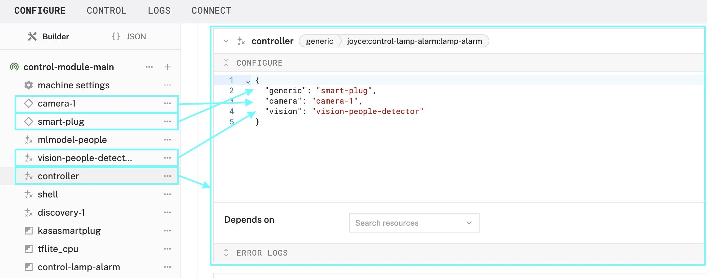

author: Joyce
id: control-module
summary: Add control logic to your machine to run in a loop in the background
categories: Getting-Started, Developer
environments: web
status: Published
feedback link: https://github.com/viam-devrel/viamcodelabs/issues
tags: Getting Started, Developer

# Deploy custom control logic as a module

<!-- ------------------------ -->

## Overview

Duration: 1

Let’s say you have a machine in Viam with a sensor and an actuator, like a webcam and a lamp plugged into a smart outlet. You want the machine to monitor the video feed, in this case, turning on the lamp when a person is detected.

To do that, you'll write a control module that checks sensor data and triggers actions automatically. For example, in the [automatic plant watering workshop](https://codelabs.viam.com/guide/workshop-plant-watering/index.html), the control module is the brains behind the real-world robot that orchestrates activities between sensors and actuators.


In this codelab, you'll learn how to build and deploy control logic in a module running directly on the machine, for this or any other use case.


### What You’ll Build

- A control logic module that runs on a Raspberry Pi

  > aside negative
  > **🛠️ This is a template pattern**: You can use this exact control logic pattern with any input/output (like temperature sensors, motors, or other smart plugs) not just the webcam and lamp setup shown here.

### Prerequisites

- A computer with MacOS or Linux to flash your Raspberry Pi and configure the device's components using the Viam app

  - Preferred IDE, such as [VS Code](https://code.visualstudio.com/download)
  - Download the [Viam CLI](https://docs.viam.com/dev/tools/cli/)
  - You’ll need Python3 (at least 3.11) installed on your computer (and your device)

- Hardware and supplies requirements

  - 1 - [Raspberry Pi 5](https://www.amazon.com/Raspberry-Single-2-4GHz-Quad-core-Cortex-A76/dp/B0CLV7DFD2)
    - Follow the [Raspberry Pi setup guide](https://docs.viam.com/installation/prepare/rpi-setup/) to make sure your Pi is flashed with a Viam-compatible operating system, and that you are able to SSH into it.
  - 1 - microSD card or USB storage to use with your Pi
  - 1 - power supply for your Pi
  - **Optional**: additional peripherals. To follow the example scenario, you will need:
    - 1 - [Kasa smart plug](https://www.amazon.com/Kasa-Smart-Supported-Scheduling-KP125/dp/B0CRRY18Z4/) (supported Kasa models: EP10, EP25, HS100, HS103, HS105, HS110, KP100, KP105, KP115, KP125, KP125M, KP401)
    - 1 - USB web camera

### What You’ll Need

- All the hardware components listed in prerequisites.
- Sign up for [a free GitHub account](https://github.com/signup)
  - Create a repository to contain your module source code and enable the cloud build functionality
  - You will also set up a GitHub action later on in this codelab
- Sign up for a free Viam account
  - Log in to the [Viam app](https://app.viam.com/fleet/dashboard) in your browser
  - Log in to the [Viam CLI](https://docs.viam.com/dev/tools/cli/) in your terminal too

### What You’ll Learn

- How to generate, develop, and upload a module using Viam
- How to customize control logic within a module
- How to configure and use a module

<!-- ------------------------ -->

## Configure your machine and peripherals

Duration: 3

### Configure your machine

1. In [the Viam app](https://app.viam.com/fleet/dashboard) under the **LOCATIONS** tab, create a machine by typing in a name and clicking **Add machine**.
   
1. Click **View setup instructions**.
   
1. To install `viam-server` on the Raspberry Pi device that you want to use to communicate with and control your webcam, select the `Linux / Aarch64` platform for the Raspberry Pi, and leave your installation method as [`viam-agent`](https://docs.viam.com/how-tos/provision-setup/#install-viam-agent).
   
1. From the terminal window, run the following command to [SSH (Secure Shell) into your board](https://docs.viam.com/operate/reference/prepare/rpi-setup/#connect-with-ssh), where the text in `<>` should be replaced (including the `<` and `>` symbols themselves) with the `user` and `hostname` you configured when you set up your machine.
   ```bash
   ssh <USERNAME>@<REMOTE-HOSTNAME>.local
   ```
   > aside negative
   > On some networks, if the `hostname.local` alias fails to resolve, you can use the static IP address found in the Viam app status dropdown. For example, instead of `username@hostname.local`, you could use `username@192.168.2.197`.
1. Use the `viam-agent` to download and install `viam-server` on your Raspberry Pi. Follow the instructions to run the command provided in the setup instructions from the SSH prompt of your Raspberry Pi.
   
1. The setup page will indicate when the machine is successfully connected.
   

### Configure your peripherals

1. **Optional**: Now that you set up a machine, configure any hardware and software resources that you will use with your machine and that you want to drive with your control logic. For example, you could use this same pattern to turn on a fan when a temperature sensor crosses a threshold, or trigger a motor when an object is detected.

   Or you can skip this step and proceed to the next section.

   > aside positive
   > **Example**: Here's how this codelab sets up a webcam and smart plug, but you can configure any resources your machine needs. Any of the example steps marked **optional** can be skipped.
   >
   > In this example, we have several modules configured in the Viam machine:
   >
   > - USB webcam (called `camera-1`)
   > - [Smart plug](https://app.viam.com/module/joyce/kasasmartplug) (called `smart-plug`) to turn on and off a lamp
   > - [ML model](https://app.viam.com/module/viam/tflite_cpu) (called `mlmodel-people`) to classify objects
   > - Vision service (called `vision-people-detector`) to detect people.
   >   
   >   If you have a USB webcam and TP-link Kasa smart plug, you can follow along with this example. Next, let's create a module containing control logic to turn on the smart plug when a person is detected.
   >   

<!-- ------------------------ -->

## Generate the module

Duration: 2

In this section, let's learn how to create a module and [deploy the control logic to our machine](https://docs.viam.com/manage/software/control-logic).

### Generate stub files

1. On your working computer, open your terminal window, and make sure you are still logged in to the [Viam CLI](https://docs.viam.com/dev/tools/cli/)

   ```bash
   viam login
   ```

   > aside negative
   > Your working computer can be your Raspberry Pi if you have a monitor and keyboard set up to do your development. In the example shown, we are creating a module on a Macbook, before testing and deploying it to a Raspberry Pi.

1. Run the command to generate a Viam module.
   ```bash
   viam module generate
   ```
1. Follow the prompts, selecting the following options:

   - **Module name**: `control-lamp-alarm`
     - This can be anything you choose to identify your control logic module.
   - **Language**: `Python`
   - **Visibility**: `Private`
   - **Namespace/Organization ID**: In the Viam app, navigate to your organization settings through the menu in upper right corner of the page. Find the Public namespace and copy that string.
     
   - **Resource to be added to the module**: `Generic Service`
     - This is a [Generic Service](https://docs.viam.com/dev/reference/apis/services/generic/). If you choose a different resource type to add your control logic to, you must implement any required API methods for the chosen component.
   - **Model name**: `lamp-alarm`
     - This can be anything you choose to identify your control logic model.
   - **Enable cloud build**: `Yes`
     - This enables Viam to build your module via GitHub action.
   - **Register module**: `Yes`
     - This lets Viam know that the module exists.

1. Press the **Enter** key and the generator will create a folder for your control logic component.

   

1. Open the code files using your preferred IDE. Find the Python file within the `src/models/` directory with the same name as your model name, `lamp_alarm.py` shown here. This is where we can add our control logic.
   

Next, let's add our control logic.

<!-- ------------------------ -->

## Develop the module

Duration: 5

Now that you created the initial module, let's add our control logic, and deploy it to our Raspberry Pi.

**Final code sample**: You can refer to [the sample code](https://github.com/loopDelicious/control-module-example/blob/main/src/models/lamp_alarm.py) to see how everything fits together. In this section, let's break it down step-by-step to learn how the module works.

### Update the module code


1.  **Review scaffolding**: Let's take a closer look at the generated files, and find the Python file within the `src/models/` directory with the same name as your model name, `lamp_alarm.py` shown here.
    - Review the other generated files within the project directory
    - Review the imports within `lamp_alarm.py`
    - Review the class definition within `lamp_alarm.py`
      - It includes the public namespace, module name, and model name that you specified in the module generation prompts (`joyce`, `control-lamp-alarm`, and `lamp-alarm` shown here).
      - It also includes four default class methods `new()`, `validate_config()`, `reconfigure()`, and `do_command()`.
1.  **Add dependencies**: Add these imports near the top of the file to support our control loop and provide more visibility during debugging. If your control logic requires external dependencies, be sure to also update the `requirements.txt` file.

    ```python
    import asyncio
    from threading import Event
    from viam.logging import getLogger
    ```

    > aside positive
    > **Optional**: Add more imports, for example, if you rely on methods in other modules within the Viam machine. In this example, our control code requires detections from our vision service and must be able to control our smart plug which is defined as a generic component. Refer to the [Viam API documentation](https://docs.viam.com/dev/reference/apis/) for more details about the methods associated with each Viam resource.
    >
    > ```python
    > from viam.services.vision import VisionClient
    > from viam.components.generic import Generic as GenericComponent
    > from viam.components.camera import Camera
    > ```

1.  **Initialize helper elements**: Initialize the Viam logger after the imports so that we have more visibility during development. The name of the logger is the model name, `lamp-alarm` shown here.

    ```python
    LOGGER = getLogger("lamp-alarm")
    ```

1.  **Initialize variables in the class**: At the beginning of the class definition, initialize some variables to support the control loop.
    ```python
    running = None
    task = None
    event = Event()
    ```
1.  **Add helper functions**: Within the class definition, add some functions to support the control loop.

    ```python
    def start(self):
           loop = asyncio.get_event_loop()
           self.task = loop.create_task(self.control_loop())
           self.event.clear()

     def stop(self):
         self.event.set()
         if self.task is not None:
             self.task.cancel()

     async def control_loop(self):
         while not self.event.is_set():
             await self.on_loop()
             await asyncio.sleep(0)

     async def on_loop(self):
         try:
             self.logger.info("Executing control logic")
             # TODO: ADD CONTROL LOGIC

         except Exception as err:
             self.logger.error(err)
         await asyncio.sleep(10)

     def __del__(self):
         self.stop()

     async def close(self):
         self.stop()
    ```

1.  **Add control logic**: Within your newly defined `on_loop()` method, you can add custom control logic. Swap in your own logic here! Replace the example `vision` and `lamp` control with your own sensor and actuator. If your goal is a working version that does nothing, proceed to the next step.

    > aside positive
    > **Optional**: In this example, we will turn on the smart plug when people are detected.
    >
    > ```python
    > async def on_loop(self):
    >   try:
    >       LOGGER.info("Executing control logic")
    >       detections = await self.vision.get_detections_from_camera(self.camera_name)
    >       has_person = any(
    >           d.class_name.lower() == "person" and d.confidence > 0.7
    >           for d in detections
    >       )
    >
    >       now = asyncio.get_event_loop().time()
    >       if has_person:
    >           LOGGER.info("Person detected. Turning on lamp.")
    >           await self.lamp.do_command({"toggle_on": []})
    >           self.last_seen = now
    >       else:
    >           if not hasattr(self, "last_seen"):
    >               self.last_seen = now
    >           elapsed = now - self.last_seen
    >           if elapsed > 180:
    >               LOGGER.info("No person detected for 3 minutes. Turning off lamp.")
    >               await self.lamp.do_command({"toggle_off": []})
    >   except Exception as err:
    >       LOGGER.error(f"Error in control logic: {err}")
    >   await asyncio.sleep(10)
    > ```

1.  **Validate configuration**: In the `validate_config()` method, you can ensure the user correctly provides the required dependencies, formatted as expected. If your goal is a working version that validates nothing, proceed to the next step.

    > aside positive
    > **Optional**: In the example shown here, the validation requires `struct_to_dict`, so we've added it to our imports.
    >
    > ```python
    > from viam.utils import struct_to_dict
    > ```
    >
    > The user must configure a vision service and generic component. An error message is returned if the requirements are not provided as the correct data type.
    >
    > ```python
    > @classmethod
    > def validate_config(cls, config: ComponentConfig) -> Sequence[str]:
    >    """This method allows you to validate the configuration object received from the machine, as well as to return any implicit dependencies based on that `config`.
    >    Args:
    >        config (ComponentConfig): The configuration for this resource
    >    Returns:
    >        Sequence[str]: A list of implicit dependencies
    >    """
    >    attrs = struct_to_dict(config.attributes)
    >    required_dependencies = ["vision", "generic"]
    >    implicit_dependencies = []
    >
    >    for component in required_dependencies:
    >        if component not in attrs or not isinstance(attrs[component], str):
    >            raise ValueError(f"{component} is required and must be a string")
    >        else:
    >            implicit_dependencies.append(attrs[component])
    >     return implicit_dependencies
    > ```

<<<<<<< HEAD
1.  **Initialize required resources**: In the `reconfigure()` method, initialize any required resources if your control logic relies on other parts of the machine (like sensors or services). This method is called when your model is first added to the machine, and again whenever the machine configuration is updated.
=======
1.  **Start the control loop and initialize other resources**: In the `reconfigure()` method, start the control logic to run in a background loop. This method is called when your model is first added to the machine, and again whenever the machine configuration is updated. If your control logic relies on other parts of the machine (like sensors or services), you should also initialize those resources here.
    ```python
    def reconfigure(
      self, config: ComponentConfig,
      dependencies: Mapping[ResourceName, ResourceBase]
      ):
      # starts automatically
      if self.running is None:
          self.start()
      else:
          self.logger.info("Already running control logic.")
    ```
>>>>>>> 8434e1ab293aa9c6700436a2400274d9f55597f1
    > aside positive
    > **Optional**: In this example, the control logic relies on other parts of the machine, specifically a [Vision service](https://docs.viam.com/dev/reference/apis/services/vision/) and a [Generic component](https://docs.viam.com/dev/reference/apis/components/generic/), so we use `cast` to safely access them from the dependencies mapping according to which Viam API it implements.
    > Add this to your imports:
    >
    > ```python
    > from typing import cast
    > ```
    >
    > And later in your `reconfigure()` method, you'll cast the resources like this
    >
    > ```python
    > attrs = struct_to_dict(config.attributes)
    > vision_resource = dependencies.get(VisionClient.get_resource_name(str(attrs.get("vision"))))
    > self.vision = cast(VisionClient, vision_resource)
    > lamp_resource = dependencies.get(Generic.get_resource_name(str(attrs.get("generic"))))
    > self.lamp = cast(Generic, lamp_resource)
    > camera_resource = dependencies.get(Camera.get_resource_name(str(attrs.get("camera"))))
    > self.camera_name = cast(Camera, camera_resource).name
    > ```
1.  **Start the control loop**: In the `reconfigure()` method, start the control logic to run in a background loop.
    ```python
    def reconfigure(
      self, config: ComponentConfig,
      dependencies: Mapping[ResourceName, ResourceBase]
      ):
      # starts automatically
      if self.running is None:
          self.start()
      else:
          LOGGER.info("Already running control logic.")
    ```
1.  **Add Do Command for manual testing**: Replace the [`do_command()`](https://docs.viam.com/dev/reference/apis/services/generic/#docommand) method with the following code, so that we can manually test the control loop with `stop` and `start`.

    ```python
    async def do_command(
        self,
        command: Mapping[str, ValueTypes],
        *,
        timeout: Optional[float] = None,
        **kwargs
    ) -> Mapping[str, ValueTypes]:

        result = {key: False for key in command.keys()}
        for name, args in command.items():
            if name == "action" and args == "start":
                self.start()
                result[name] = True
            if name == "action" and args == "stop":
                self.stop()
                result[name] = True
        return result
    ```

<!-- ------------------------ -->

## Test the module

Duration: 5

Now that you've added control logic to the module, let's test it locally on our device.

### Configure hot reloading

1. **Create reloading script**: Since we enabled cloud build during the module generation, we can create a [hot reloading](https://docs.viam.com/operate/get-started/other-hardware/#test-your-module-locally) script to bundle and run our code. Create a reloading script file called `reload.sh` in the project root directory.

   ```bash
   touch reload.sh
   ```

1. Copy and paste the following code into the new file.

   ```bash
   #!/usr/bin/env bash

   # bash safe mode. look at `set --help` to see what these are doing
   set -euxo pipefail

   cd $(dirname $0)
   MODULE_DIR=$(dirname $0)
   VIRTUAL_ENV=$MODULE_DIR/venv
   PYTHON=$VIRTUAL_ENV/bin/python
   ./setup.sh

   # Be sure to use `exec` so that termination signals reach the python process,
   # or handle forwarding termination signals manually
   exec $PYTHON src/main.py $@
   ```

1. **Grant permissions**: Make the reload script executable by running the following command.

   ```bash
   chmod 755 reload.sh
   ```

1. **Set up virtual environment**: Create a virtual Python environment with the necessary packages by running the `setup.sh` file.
   ```bash
   sh setup.sh
   ```
1. **Point to reload script**: In the `meta.json` file, replace the path for `entrypoint`, `build`, and `path`.
   ```json
   "entrypoint": "reload.sh",
   "first_run": "",
   "build": {
     "build": "rm -f module.tar.gz && tar czf module.tar.gz requirements.txt src/*.py src/models/*.py meta.json setup.sh reload.sh",
     "setup": "./setup.sh",
     "path": "module.tar.gz",
     "arch": [
       "linux/amd64",
       "linux/arm64"
     ]
   }
   ```
1. **Get Part ID**: To run the module code on a different machine besides the computer that you are working on, Raspberry Pi in this example, you'll need the part ID of the remote machine. Go to the machine status dropdown in the Viam app, and copy the part ID to your clipboard.
   
1. **Add module to the device**: From the command line, bundle and move the module code to the target machine with `viam module reload` and include the `-part-id` flag and replace the placeholder with your own part ID from the previous step. Doing this also registers and restarts the module.
   ```bash
   viam module reload --part-id ff05e799-e323-4027-84b8-5c703bcf652f
   ```
1. Once the script completes, you can see two new elements in [the Viam app](https://app.viam.com/fleet/locations) under the **CONFIGURE** tab.
   - A `shell` service for Viam to connect to your target device.
   - Your local module called `control-lamp-alarm`.
     
1. Click the **+** icon in the left-hand menu and select **Local module** and then **Local service** to create a new local service called `controller`.
   - Enter the model namespace **triplet**, for example `joyce:control-lamp-alarm:lamp-alarm`. You can find the triplet in the `model` field of your `meta.json` file.
   - Select **Type**: `generic`
   - Enter the module **Name**: `controller`
     
1. **Configure dependencies**: Configure any required dependencies using proper JSON syntax.

   > aside positive
   > **Optional**: The example module depends on detections from the vision service and actuating the smart plug generic component. The required user inputs were defined as `dependencies` under the `validate_config()` class method in the previous steps. So add the vision service, camera, and generic component using the proper JSON syntax under **CONFIGURE** panel of the local module.
   > 

1. **Save** your changes in the top right and wait a few moments for the configuration changes to take effect.

> aside negative
> **Troubleshooting:**
>
> - Check under the **ERROR LOGS** panel within the component card for specific errors.
> - Check under the **LOGS** tab of the Viam app to see what might be going wrong.
> - See other examples that implement control logic:
>   - [event-manager](https://github.com/viam-modules/event-manager)
>   - [refill-controller](https://github.com/viam-devrel/refill-controller)
>   - [re-id-object-tracking](https://github.com/viam-modules/re-id-object-tracking)
>   - [detection-dock](https://github.com/viam-labs/detection-dock)

### Continue refining the control logic

As you continue debugging and making updates to your control logic, use `viam module reload` for Viam to rebuild the module and restart the instance on your machine with the latest code, again using your part ID.

```bash
viam module reload --part-id ff05e799-e323-4027-84b8-5c703bcf652f
```

<!-- ------------------------ -->

## Upload the module

Duration: 5

Now that your module is working the way you want, upload it to the Viam registry so that it can be re-used by your future self, your team, or the general public.

### Publish the module

1. **Update README**: Update the `README.md` file, following the suggested template. This provides details to your future self and others about what your module does and how to use it.
1. **Commit to GitHub**: Commit the module source code to your GitHub repository. Add the link to that repository as the `url` in the `meta.json` file. This is required for the cloud build to work.
   
1. **Update metadata**: Make any final edits to the `meta.json` file such as including a `description` or updating the visibility to `public` if you want the module to be visible to all Viam users (which also requires running `viam module update` from the command line).
1. **Package and upload**: Revert the edits you made in the `meta.json` for local testing, so the values for `entrypoint`, `build`, and `path` are in the original state as shown below.
   ```json
   "entrypoint": "dist/main",
   "first_run": "",
   "build": {
     "build": "./build.sh",
     "setup": "./setup.sh",
     "path": "dist/archive.tar.gz",
     "arch": [
       "linux/amd64",
       "linux/arm64"
     ]
   }
   ```
1. **Commit and push your updates**: Commit and push your latest updates to your remote GitHub repository.
1. **Set up GitHub action**: The `viam module generate` command already generated the `build-action` file in your `.github/workflows` folder, so you just need to set up authentication in GitHub, and then create a new release to trigger the action. In your terminal, run the following command to view your organization ID.
   ```bash
   viam organizations list
   ```
1. **Create API key**: Create an API key for your organization, using your organization ID and a name for the API key.
   ```bash
   viam organization api-key create --org-id YOUR_ORG_UUID --name descriptive-key-name
   ```
1. **Add new repository secrets**: In the GitHub repository for your project, go to **Settings** → **Secrets and variables** → **Actions**.
   
1. **Create new secrets**: Create two new secrets using the **New repository secret** button:
   - `VIAM_KEY_ID` with the UUID from `Key ID` in your terminal
   - `VIAM_KEY_VALUE` with the string from `Key Value` in your terminal
     
1. **Create a new release**: From the main code page of your GitHub repo, find **Releases** in the right side menu and click **Create a new release**.
   
1. **Add a release tag**: In the **Choose a tag** dropdown, create a new tag such as `1.0.0`. Do not prepend the tag with `v` or the GitHub action will not trigger. For details about versioning, see [Module versioning](https://docs.viam.com/operate/reference/module-configuration/#module-versioning).
   
1. **Publish release**: Click **Publish release**. The cloud build action will begin building the new module version for each architecture listed in your `meta.json`.
   
   > aside negative
   > **Troubleshooting:**
   >
   > **GitHub action fails**: Check under the **Actions** tab in GitHub to view the status of the latest release. You can click on a failed workflow run to see more details. If the workflow fails and you need to retry the same version, you'll need to delete the tag from GitHub and re-push it to trigger the workflow again.
   >
   > **Update module**: If you make changes to the module code, remember to commit and push your updates to the remote GitHub repository, and then run `viam module update` from the command line if you made changes to the `meta.json`.

### Add your new modular resource to your machines

Now that your module is in the registry, you can configure the component you added on your machines just as you would configure other components and services.

1. **Delete local module configuration**: In the Viam app under your machine's **CONFIGURE** tab, delete the resource. There’s no more need for local module configuration since it is primarily for testing purposes. In our example, the local module configuration was called `controller`.
1. **Delete local module**: For the same reasons, delete the local module. In our example, the local module was called `control-lamp-alarm`.
   
1. **Add modular resource**: Click the **+** button, select "Component or service", and search for your model name to add your new modular resource.
   
1. Configure the modular resource with the required attributes. Notice the beautiful documentation that you impressively added to your module, and the label in the top right corner of the resource panel indicating the module comes from the Viam registry.
   
1. **Save** your changes in the top right and wait a few moments for the configuration changes to take effect.

   > aside negative
   > **Troubleshooting:**
   >
   > If you're working within the same machine, you may need to **delete** the local module and local module configuration, instead of just disabling the resources.

<!-- ------------------------ -->

## Next Steps

Duration: 2

### What you learned

- How to generate, develop, and upload a module using Viam
- How to customize control logic within a module
- How to configure and use a module

### Advanced scenarios for Viam modules

At this point, you have created and tested your own control logic module. See other examples that implement control logic:

- [event-manager](https://github.com/viam-modules/event-manager)
- [refill-controller](https://github.com/viam-devrel/refill-controller)
- [re-id-object-tracking](https://github.com/viam-modules/re-id-object-tracking)
- [detection-dock](https://github.com/viam-labs/detection-dock)

You can also [create your own module](https://docs.viam.com/how-tos/hello-world-module/) to integrate custom functionality for other components and services.

<div>
  
</div>

### More about the Viam Registry

Modules are a very important part of the Viam platform. They enable robots to be built in a composable and versatile manner. Browse more modules in [the Viam registry](https://app.viam.com/registry).

- [How the modular registry works](https://www.viam.com/post/announcing-the-viam-modular-registry) blog
- [Viam registry](https://www.viam.com/product/registry) marketing landing page

### Related Viam resources

- [Viam documentation](https://docs.viam.com/)
- Other [Viam codelabs](https://codelabs.viam.com/)
- [Viam Discord community](http://discord.gg/viam)
