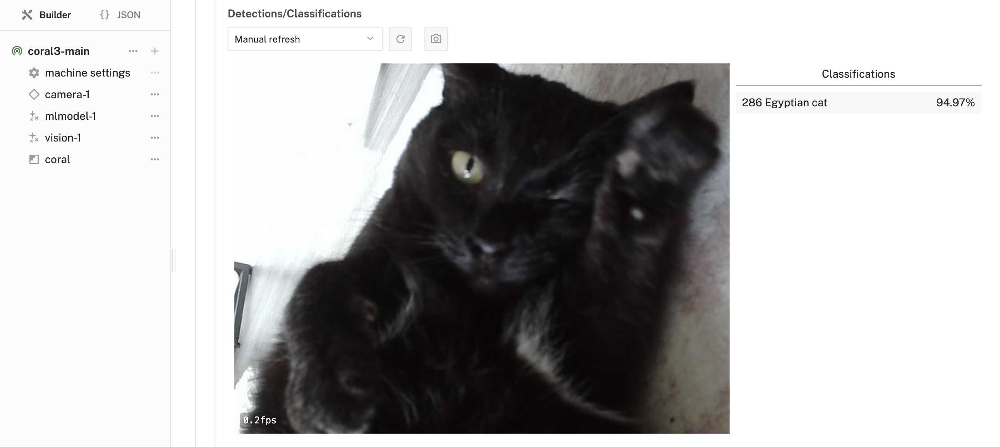
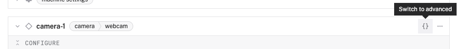

author: Joyce
id: coral
summary: Use Google Coral Edge TPU for AI inference on edge devices
categories: Getting-Started, Developer
environments: web
status: Published
feedback link: https://github.com/viam-devrel/viamcodelabs/issues
tags: Getting Started, Developer, Data

# Optimize AI inference with Google Coral Edge TPU

<!-- ------------------------ -->

## Overview

Duration: 1

Edge computing changes how we run AI models by moving the processing closer to where the data is created. This helps cut down on delays (latency) and keeps more data private.

Google’s Coral Edge TPU (Tensor Processing Unit) is a small, specialized chip made to speed up AI tasks on edge devices. It’s designed to run TensorFlow Lite models very efficiently, performing up to 4 trillion operations per second (4 TOPS) while using only about 2 watts of power. That makes it ideal for devices that need to run AI models in real time without draining too much energy.

In this codelab, you'll learn how to set up and use the Coral Edge TPU with Viam to perform real-time computer vision inference. By the end, you'll have a working system that can classify objects using a webcam - all running efficiently at the edge!



### What You'll Build

- A system using Google Coral Edge TPU for AI inference at the edge


### Prerequisites

- A computer with MacOS, Windows, or Linux to configure your device's components using the Viam app
- Hardware and supplies requirements
  - 1 - [Raspberry Pi 4](https://a.co/d/fc3JUMm)
  - 1 - microSD card to use with your Pi
  - 1 - power supply for your Pi
  - 1 - [Coral USB Accelerator](https://coral.ai/products/accelerator/)
  - 1 - [USB webcam](https://a.co/d/1qxYv8w) (if using USB Accelerator)

### What You'll Learn

- How to set up a Coral Edge TPU device with Viam
- How to configure a webcam component
- How to configure the Coral ML model service
- How to run inference on the model with the mlmodel vision service
- Best practices for optimizing AI models on edge devices

### What You'll Need

- All the hardware components listed in prerequisites
- Sign up for a free Viam account, and then [sign in](https://app.viam.com/fleet/dashboard) to the Viam app

<!-- ------------------------ -->

## Set up your Raspberry Pi

Duration: 5

The Raspberry Pi boots from a microSD card. You need to install Raspberry Pi OS on the microSD card that you will use with your Pi. For more details about alternative methods of setting up your Raspberry Pi, refer to the [Viam docs](https://docs.viam.com/installation/prepare/rpi-setup/#install-raspberry-pi-os).

### Install Raspberry Pi OS

1. Connect the microSD card to your computer.
1. Download the [Raspberry Pi Imager](https://www.raspberrypi.com/software/) and launch it.
   
1. Click **CHOOSE DEVICE**. Select your model of Pi, which is Raspberry Pi 4.
1. Click **CHOOSE OS**. Select **Raspberry Pi OS (64-bit)** from the menu.
1. Click **CHOOSE STORAGE**. From the list of devices, select the microSD card you intend to use in your Raspberry Pi.
   
1. Configure your Raspberry Pi for remote access. Click **Next**. When prompted to apply OS customization settings, select **EDIT SETTINGS**.
1. Check **Set hostname** and enter the name you would like to access the Pi by in that field, for example, `coral-pi`.
1. Select the checkbox for **Set username and password** and set a username (for example, your first name) that you will use to log into the Pi. If you skip this step, the default username will be `pi` (not recommended for security reasons). And specify a password.
1. Connect your Pi to Wi-Fi so that you can run `viam-server` wirelessly. Check **Configure wireless LAN** and enter your wireless network credentials. SSID (short for Service Set Identifier) is your Wi-Fi network name, and password is the network password. Change the section `Wireless LAN country` to where your router is currently being operated.
   
1. Select the **SERVICES** tab, check **Enable SSH**, and select **Use password authentication**.
   
   > aside negative
   > Be sure that you remember the `hostname`, `username`, and `password` you set, as you will need this when you SSH into your Pi.
1. **Save** your updates, and confirm `YES` to apply OS customization settings. Confirm `YES` to erase data on your microSD card. You may also be prompted by your operating system to enter an administrator password. After granting permissions to the Imager, it will begin writing and then verifying the Linux installation to your microSD card.
1. Remove the microSD card from your computer when the installation is complete.

### Connect with SSH

1. Place the microSD card into your Raspberry Pi and boot the Pi by plugging it in to an outlet. A red LED will turn on to indicate that the Pi is connected to power.
   > aside negative
   > Make sure you are using a 5V 3A power supply to power your Raspberry Pi. Using a power supply with inadequate amperage can lead to instability, throttling, or unexpected behavior.
1. Once the Pi is started, connect to it with SSH. From a command line terminal window, enter the following command. The text in <> should be replaced (including the < and > symbols themselves) with the user and hostname you configured when you set up your Pi.
   ```bash
   ssh <USERNAME>@<HOSTNAME>.local
   ```
1. If you are prompted "Are you sure you want to continue connecting?", type "yes" and hit enter. Then, enter the password for your username. You should be greeted by a login message and a command prompt.
   
1. Update your Raspberry Pi to ensure all the latest packages are installed
   ```bash
   sudo apt update
   sudo apt upgrade -y
   ```

<!-- ------------------------ -->

## Configure your machine

Duration: 5

### Configure your machine in Viam

1. In [the Viam app](https://app.viam.com/fleet/dashboard) under the **LOCATIONS** tab, create a machine by typing in a name like "coral-edge" and clicking **Add machine**.
   
1. Click **View setup instructions**.
   
1. To install `viam-server` on the Raspberry Pi device that you want to use, select the `Linux / Aarch64` platform for the Raspberry Pi, and leave your installation method as [`viam-agent`](https://docs.viam.com/how-tos/provision-setup/#install-viam-agent).
   
1. Use the `viam-agent` to download and install `viam-server` on your Raspberry Pi. Follow the instructions to run the command provided in the setup instructions from the SSH prompt of your Raspberry Pi.
   
1. The setup page will indicate when the machine is successfully connected.
   

<!-- ------------------------ -->

## Configure your webcam

Duration: 3

### Connect your webcam

1. Connect the webcam to any USB port on your Raspberry Pi.

### Configure your webcam

1. In [the Viam app](https://app.viam.com/fleet/locations) under the **CONFIGURE** tab, click the **+** icon in the left-hand menu and select **Component or service**.
   
1. Select `camera`, and find the `webcam` module. This adds the module for working with a USB webcam. Leave the default name `camera-1` for now.
   
1. Notice adding this component adds the webcam hardware component called `camera-1`.
   
1. From the **Configure** section of the panel, switch to the JSON configuration mode using the `{}` icon in the top-right:
   
1. In this mode, configure your component with the following JSON in the **CONFIGURE** field. This will tell the component to look for the default camera connected to the device, which will be the USB webcam.
   ```json
   {
     "video_path": ""
   }
   ```
   
1. Click **Save** in the top right. This may take a moment to apply your configuration changes.

   > aside positive
   > If multiple webcams are connected to your Pi, you'll need to specify the correct video path. To list available camera devices, you can use the [`rand:find-webcams:webcam-discovery`](https://app.viam.com/module/rand/find-webcams) > 

1. At the bottom of the `camera-1` panel, expand the **TEST** section to ensure you have configured the camera properly and see a video feed.
   

<!-- ------------------------ -->

## Configure the Coral ML model

Duration: 5

Now, let's add the Coral ML model service to our machine. This will let us run optimized neural networks using the Edge TPU.

### Add the ML model service

1. In [the Viam app](https://app.viam.com/fleet/locations) under the **CONFIGURE** tab, click the **+** icon in the left-hand menu and select **Component or service**.
1. Select `ML Model`, and find the `joyce:mlmodel:coral` module. This adds the module for running optimized neural networks with the Coral Edge TPU. Leave the default name `mlmodel-1` for now.
   
   
1. Notice adding this service adds the ML model service called `mlmodel-1`.
   
1. In the new `mlmodel-1` panel, configure your service with the following JSON in the JSON configuration section:

   ```json
   {
     "model_name": "mobilenet_v1_1.0_224",
     "task_type": "classification"
   }
   ```

   This tells the ML model service to use the pre-trained MobileNet V2 model optimized for the Edge TPU for classification.

   > aside positive
   > The MobileNet V2 model is a lightweight image classification model that can identify 1000 different object categories from the [ImageNet dataset](https://image-net.org/challenges/LSVRC/2012/browse-synsets). You can view the complete list of class names in the [ImageNet class index](https://gist.github.com/yrevar/942d3a0ac09ec9e5eb3a).
   > 

1. Click **Save** in the top right to save and apply your configuration changes. This may take a few minutes to set up the required dependencies. If you want to follow along with the progress, look under the **LOGS** tab.
1. Once the robot has successfully reconfigured, expand the **TEST** panel of `mlmodel-1` to review information about the ML model serrvice.

<!-- ------------------------ -->

## Configure the Vision Service

Duration: 5

Now, let's add a vision service that will use our ML model to perform object classification on images from the webcam.

### Add the vision service

1. In [the Viam app](https://app.viam.com/fleet/locations) under the **CONFIGURE** tab, click the **+** icon in the left-hand menu and select **Component or service**.
1. Select `vision`, and find the `ML Model` module. This adds a vision service that uses ML models. Leave the default name `vision-1` for now.
   
   
1. Notice adding this service adds the vision service called `vision-1`.
   
1. In the **ML Model** section of the panel, select your ML model service (`mlmodel-1`).
1. In the **Default Camera** section of the panel, select your camera (`camera-1`).
1. Set the confidence level to 0.5 to reduce the amount of false positive detections.
   
1. Click **Save** in the top right to save and apply your configuration changes.
1. At the bottom of the `vision-1` panel, expand the **TEST** section.
1. You should see the video feed from your camera with a list of detected objects on the right-side of the panel. The model will detect what it sees in the camera's field of view, showing confidence scores for object classification.
   
1. Try holding different objects in front of the camera to see how well the model identifies them!
   > aside positive
   > The MobileNet V2 model is a lightweight image classification model that can identify 1000 different object categories from the [ImageNet dataset](https://image-net.org/challenges/LSVRC/2012/browse-synsets). You can view the complete list of class names in the [ImageNet class index](https://gist.github.com/yrevar/942d3a0ac09ec9e5eb3a).

<!-- ------------------------ -->

## Conclusion and Resources

Duration: 1

Congratulations! 🎉 You've successfully built an edge AI system that runs optimized computer vision models on a Google Coral Edge TPU. This setup allows you to perform real-time object classification with minimal latency and power consumption - all without requiring cloud connectivity or powerful hardware.

### What You Learned

- How to set up a Coral Edge TPU device with Viam
- How to configure a webcam component
- How to use the Coral ML model service for efficient edge AI
- How to run inference using a vision service
- How to optimize ML model performance on edge devices


### Why edge AI matters

Edge AI is transforming how we build intelligent systems by:

- Reducing latency for real-time applications
- Enhancing privacy by keeping data local
- Enabling operation in offline environments
- Reducing bandwidth and cloud computing costs
- Making AI accessible on affordable hardware like the Raspberry Pi

### Next steps

Here are some ways to extend your project:

- **Try different pre-trained models**: Explore other models available in [the Coral model zoo](https://coral.ai/models/)
- **Custom applications**: Create a Viam app that uses the vision service data for specific use cases
- **Integrate with other hardware**: Connect motors, servos, or other actuators to build a responsive robot
- **Data collection**: Capture and analyze object classification data over time
- **Build a custom model**: Train your own model for specific classification needs

### Exploring other edge AI options

The Coral TPU excels at efficient inference for supported model architectures. Depending on your specific requirements, you might also consider:

- **Other runtimes**: [NCNN for mobile deployment](https://codelabs.viam.com/guide/ncnn-edge-ai), [ONNX Runtime](https://app.viam.com/module/viam/onnx-cpu) for cross-platform compatibility
- **Alternative accelerators and hardware**: [Raspberry Pi AI Hat for integrated solutions](https://codelabs.viam.com/guide/pi-ai-hat/index.html), [Raspberry Pi AI Camera](https://app.viam.com/module/hipsterbrown/pi-ai-camera)

Each option has different performance characteristics, model support, and integration requirements.

### Related resources

- [Viam Documentation](https://docs.viam.com/)
- [Coral AI Documentation](https://coral.ai/docs/)
- [ML Model Service Documentation](https://docs.viam.com/services/ml/)
- [Vision Service Documentation](https://docs.viam.com/services/vision/)
- [Viam Community Discord](https://discord.gg/viam)
