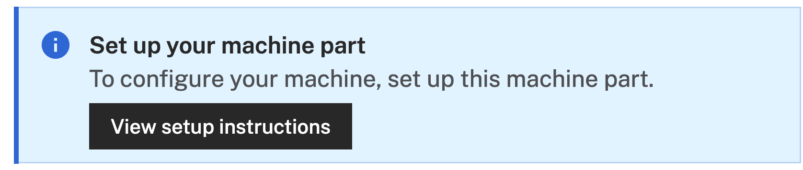
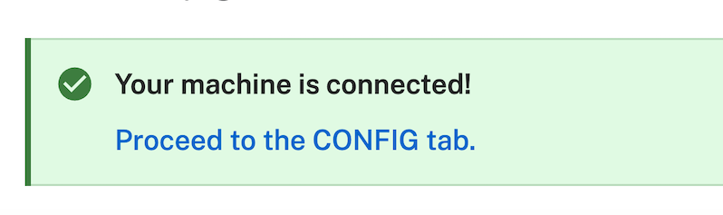

author: Adrienne Braganza Tacke
id: cube-into-bowl
summary: Place an object into a bowl with a Lite6 Arm
categories: Getting-Started, Developer
environments: web
status: Published 
feedback link: https://github.com/viam-devrel/viamcodelabs/issues
tags: Getting Started, Developer, Data

# Viam Guide Template
<!-- ------------------------ -->
## Overview 
Duration: 1


### Prerequisites
- Sign up for a free Viam account, and then [sign in](https://app.viam.com/fleet/locations/) to Viam
- Basic familiarity with SSH and command line operations
- Hardware and supplies requirements
  - 1 - Assembled [uFactory Lite 6 arm](https://www.ufactory.us/product/lite-6), mounted securely on a surface. This requires a wired ethernet connection to communicate with the control box over the local network.
  - 1 - [Intel RealSense camera (we're using model 435)](https://realsenseai.com/stereo-depth-cameras/stereo-depth-camera-d435/)
  -  1 - [Nvidia Jetson Orin Nano](https://developer.nvidia.com/buy-jetson) with [Jetpack 5](https://www.jetson-ai-lab.com/initial_setup_jon.html), set up so you can SSH into it, with a microSD card, and power supply
  - MicroSD card and power supply for your single-board computer, if needed
  - USB data cable for connecting computer to arm control board
  - Power supply for arm
  - 3D printed objects for picking and placing (see our STL files)


### What You’ll Learn 
- How to configure and use a uFactory lite6 arm with Viam
- How to configure and use a RealSense camera for object detection
- How to work with point cloud systems
- How to create a custom computer vision model for object detection
- How to create a TypeScript Viam app to control the arm
- How to create a custom logic module to control picking and placing motions

### What You’ll Build 
- A fully configured uFactory Lite 6 arm and RealSense camera that can detect a cube, uses motion planning to pick it up and place it into a bowl, and a Viam app to control the arm.


<!-- ------------------------ -->
## Setup your Jetson Orin Nano
Duration: 1


<!-- ------------------------ -->
## Setup your hardware
Duration: 2

### Connect vacuum gripper to arm

### Connect camera to arm

### Connect arm to board

<!-- ------------------------ -->
## Configure your machine
Duration: 5

1. In [the Viam app](https://app.viam.com/fleet/dashboard) under the **LOCATIONS** tab, create a machine by typing in a name and clicking **Add machine**.
   
1. Once your machine is created, you are brought to your machine overview page. Click **View setup instructions**.
   
1. To install `viam-server` on your device, select `Linux/x86`. Leave the default installation method of `viam-agent`:
   
1. Follow the instructions that are shown for your platform. If you are following along with a Pi, you'll copy the command shown and run it in your SSH session on your Pi. 
1. The setup page will indicate when the machine is successfully connected.
    

With a machine configured, we now need to configure the arm's components next!


<!-- ------------------------ -->
## Configure your lite6 arm
Duration: 10

1. In [the Viam app](https://app.viam.com/fleet/locations), find the **CONFIGURE** tab.
1. Click the **+** icon in the left-hand menu and select **Component or service**.
1. Select `arm`, and find the `ufactory:lite6` module. 
  
1. Change the name to something descriptive, like `lite6-arm`, then click **Create**. This adds the module for working with the uFactory Lite 6 arm.
  
1. Notice adding this module adds the camera hardware component called `lite6-arm`. You'll see a collapsible card on the right, where you can configure the camera component, and the corresponding `lite6-arm` part listed in the left sidebar.
   
1. To configure the arm component, you'll need to add the IP address of your machine and specific the motion planning service to use. For example: 
    ```
      {
        "host": "192.168.1.187",
        "motion": "builtin"
      }
    ``` 
1. Click **Save** in the top right to save and apply your configuration changes. 

Great, your machine has an arm configured! Let's add the gripper next.

### Configure your vacuum gripper
1. Click the **+** icon in the left-hand menu and select **Component or service**.
1. Search for the `ufactory:vacuum_gripper` module and select it. 
  
1. Change the name to something descriptive, like `vacuum-gripper`, then click **Create**. This adds the module for working with the uFactory vacuum gripper.
  <br>
  
1. Notice adding this module adds the gripper hardware component called `vacuum-gripper`. You'll see a collapsible card on the right, where you can configure the gripper component, see any errors originating from the component, and test the component directly, and the corresponding `vacuum-gripper` part listed in the left sidebar. 
  <br>
  
1. To configure the gripper, we need to specify the arm it is connected. This needs to match the component name of your machine's arm. For example, for us, that would be:
    ```
      {
        "arm": "lite6-arm"
      }
    ``` 
1. Click **Save** in the top right to save and apply your configuration changes.

Now our arm can pick things up! Let's give it some "eyes"

### Configure your RealSense camera
1. In [the Viam app](https://app.viam.com/fleet/locations), find the **CONFIGURE** tab.
1. Click the **+** icon in the left-hand menu and select **Component or service**.
1. Select `camera`, and find the `camera:realsense` module. 
  
1. Change the name to something descriptive, like `realsense-cam`, then click **Create**. This adds the module for working with a supported RealSesnse camera.
  
1. Notice adding this module adds the camera hardware component called `realsense-cam`. You'll see a collapsible card on the right, where you can configure the camera component, and the corresponding `realsense-cam` part listed in the left sidebar.
   
1. To configure the camera component, a few options need to be set.
    ```
    {
      "serial_number": "REPLACE WITH YOUR LITE6 ARM SERIAL NUMBER",
      "width_px": 1280,
      "height_px": 720,
      "little_endian_depth": false,
      "sensors": [
        "color",
        "depth"
      ]
    }
    ```
1. Click **Save** in the top right to save and apply your configuration changes. 
1. TODO: ADD calibration steps here or as own step?

<!-- ------------------------ -->
## Configure color detector

<!-- ------------------------ -->
## Configure segment detections module

<!-- ------------------------ -->
## Configure home pose

<!-- ------------------------ -->
## Create a dataset and capture some training data
Duration: 15

To train a custom model based on our 3D printed cubes, you'll need a dataset, Here, you'll create a dataset and add some images of your cubes using the RealSense camera you configured. 

1. In [the Viam app](https://app.viam.com/data/), find the **DATASETS** tab.
1. Click the **+ Create dataset** button and give your dataset a name, like `cubes`. Click the **Create dataset** button again to save.
   
1. Switch back to your machine in [the Viam app](https://app.viam.com/fleet/locations). You can navigate back by going to Fleet > All Machines Dashboard, then clicking on the name of your machine.
1. Expand your camera component's **TEST** panel. Here, you'll see the live feed of your camera as well the "Add image to dataset" icon, which looks like a camera.
   
1. Using the live feed as a viewfinder, position your cube so that you can fully in the frame. The less visual clutter in the background the better!
   
   > aside positive
   > **Good test data**: If you're able to set up a little "photo shoot" booth to capture images of your beverages, do so! Great images are clear, well-lit, minimize visual noise or clutter, and clearly isolate the object you are trying to capture. If possible, capturing different angles and different lighting scenarios are great additions to your dataset as well. Remember, for each object you are trying to detect, at least 10 images are needed to train a model!
1. When you are happy with the image, click the **Add image to dataset** button.
   
1. In the list of datasets that appear, select the dataset you wish to add your captured image to. For example, `cubes`:
   <br>
   
1. Confirm the dataset you've selected, then click **Add**.
   <br>
   
1. A success message will appear at the top-right once your image is added to your selected dataset.
   <br>
   
1. Repeat steps 5 - 8 to capture at least **10 images of each beverage** you will be detecting. Be sure to vary angles and positions!

 TODO: add test images here of cubes


Phew, that was a lot, but your custom model will thank you! Let's make our images smarter by annotating them in the next step.

<!-- ------------------------ -->

## Annotate your dataset
Duration: 10

Having images to train a model is a good start. However, they won't be useful unless the training framework has a bit more information to work with. In this step, you'll draw bounding boxes around your cubes and label them accordingly.

1. In [the Viam app](https://app.viam.com/data/datasets), find the **DATASETS** tab.
1. Click on the name of your dataset, for example `cubes`:
   <br>
   
1. Here, you'll see all of the images you've captured, neatly grouped into its own space.
   
1. Select one image from the dataset. A side panel will appear on the right-hand side. You can see details about this image, such as any objects annotated, associated tags, which datasets the image belongs to, among other details. Click on the **Annotate** button in this panel.
   
1. The selected image opens to a larger screen. To detect an object within an image, a label must be given. Create an appropriate label for the cube you have selected, for example `blue_cube`:
      
1. With the appropriate label now chosen, hold the _Command_ or _Windows_ key down while you use your mouse to draw a bounding box around your cube.
   
1. In the **OBJECTS** panel on the right, you'll see your cube listed, with an object count of `1`. If you hover over this item, you'll see the `blue_cube` label appear in the image and the bounding box fill with color.
   
1. Repeat this for the rest of the images that match the label. You can quickly navigate between images by pressing the `>` (right arrow) or `<` (left arrow) keys on your keyboard.
1. Once you get to a different type of cube, create another descriptive label, draw the bounding box, and repeat for the rest of the images of the same cube. Double check that each image has bounding boxes in the correct areas (meaning, it actually surrounds a cube) and is using the correct label for each cube!
   
1. When you are finished annotating all of your images, you can exit out of the annotation editor by clicking on the "X" in the top-left corner. Notice that a breakdown of your bounding box labels are calculated and displayed:
   
1. Be sure that all your images are labeled, that there are no `Unlabeled` images left, and that there are at least 10 images of each cube you are planning to detect.

Great work annotating all of that. (so..many..cubes...) Your model will be the better for it. Let's finally train your custom model!

<!-- ------------------------ -->

## Train your custom model
Duration: 5

<!-- ------------------------ -->
## Configure Triton ML Model

<!-- ------------------------ -->
## Configure cube-detection service

<!-- ------------------------ -->
## Create a Viam app to control the arm
Duration: 15

### Review the web app code

<!-- ------------------------ -->

## Conclusion And Resources
Duration: 1

Congratulations! You've just built a fully configured uFactory Lite 6 arm and RealSense camera that can detect a cube, use motion planning to pick it up and place it into a bowl, and a Viam app to control the whole thing. This gives you a great foundation on working with robotic arms with Viam! Do [let me know](https://bsky.app/profile/abt.bsky.social) if you've built this!

### What You Learned
- How to configure and use a uFactory lite6 arm with Viam
- How to configure and use a RealSense camera for object detection
- How to work with point cloud systems
- How to create a custom computer vision model for object detection
- How to create a TypeScript Viam app to control the arm
- How to create a custom logic module to control picking and placing motions

### Related Resources
