author: Adrienne Braganza Tacke
id: dofbot-arm-quickstart
summary: Get started with the Yahboom Dofbot arm in Viam
categories: Getting-Started, Developer
environments: web
status: Published 
feedback link: https://github.com/viam-devrel/viamcodelabs/issues
tags: Getting Started, Developer

# Control a Yahboom DOFBOT arm with Viam
<!-- ------------------------ -->
## Overview 
Duration: 1

### What You’ll Build 
A Viam-powered Yahboom DOFBOT arm. Get started quickly with this codelab! 


   

### Prerequisites
- An [assembled Yahboom Dofbot](https://www.yahboom.net/study/Dofbot-Pi) arm with a Raspberry Pi (you won't need the Yahboom mobile app!)
- A microSD card to use with your Pi

### What You’ll Need
- Sign up for a free Viam account, and then [sign in](https://app.viam.com).

### What You’ll Learn 
- How to configure a Yahboom Dofbot arm in Viam
- How to control the Yahboom Dofbot arm through Viam

### Watch the video

Coming soon!

<!-- ------------------------ -->
## Set up your Raspberry Pi
Duration: 15

The Raspberry Pi boots from a microSD card. You need to install Raspberry Pi OS on a microSD card that you will use with your Pi. For more details about alternative methods of setting up your Raspberry Pi, refer to the [Viam docs](https://docs.viam.com/installation/prepare/rpi-setup/#install-raspberry-pi-os).

### Install Raspberry Pi OS

1. Connect the microSD card to your computer.
1. Launch the [Raspberry Pi Imager](https://www.raspberrypi.com/software/).
   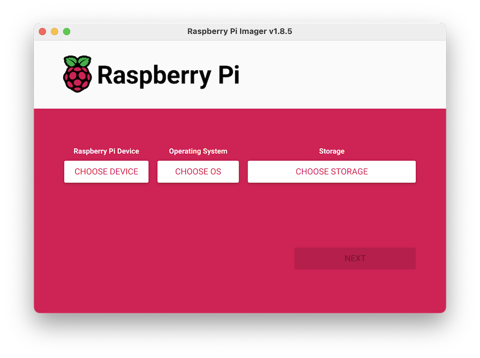
1. Click **CHOOSE DEVICE**. Select your Raspberry Pi model.
1. Click **CHOOSE OS**. Select **Raspberry Pi OS (64-bit)** from the menu.
1. Click **CHOOSE STORAGE**. From the list of devices, select the microSD card you intend to use in your Raspberry Pi.
   
1. Configure your Raspberry Pi for remote access. Click **Next**. When prompted to apply OS customization settings, select **EDIT SETTINGS**.
   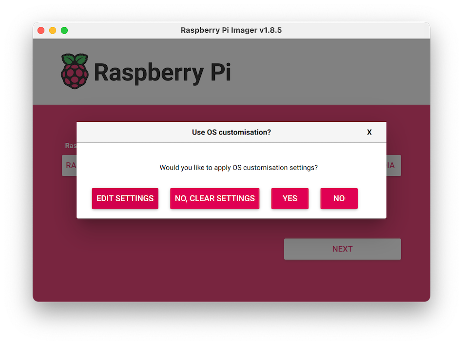
1. Check **Set hostname** and enter the name you would like to access the Pi by in that field, for example, `echo`.
1. Select the checkbox for **Set username and password** and set a username (for example, your first name) that you will use to log into the Pi. If you skip this step, the default username will be `pi` (not recommended for security reasons). Also specify a password.
1. Check **Configure wireless LAN** and enter your wireless network credentials. SSID (short for Service Set Identifier) is your Wi-Fi network name, and password is the network password. Also change the section **Wireless LAN country** to where your router is currently being operated. This will allow your Pi to connect to your Wi-Fi so that you can run `viam-server` wirelessly. 
1. Check **Set locale settings** and set your time zone and keyboard layout.
   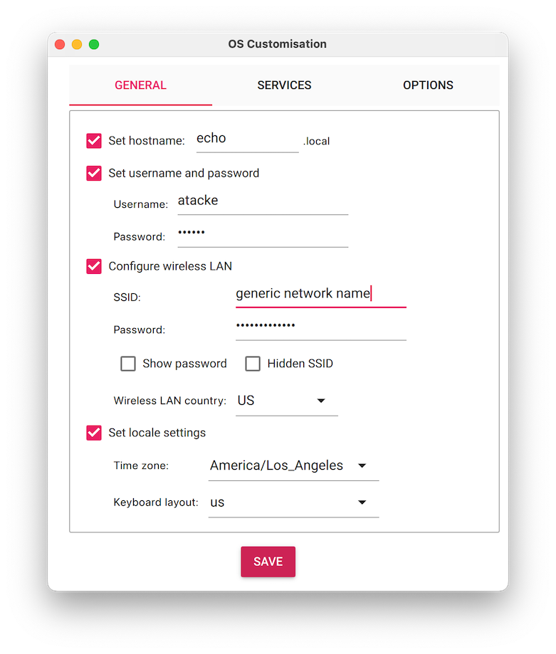
   > aside negative
   > Be sure that you remember the `hostname`, `username`, and `password` you set, as you will need this when you SSH into your Pi.
1. Select the **SERVICES** tab, check **Enable SSH**, and select **Use password authentication**.
   
1. **Save** your updates, and confirm `YES` to apply OS customization settings. Confirm `YES` to erase data on the microSD card. You may also be prompted by your operating system to enter an administrator password. 
  
After granting permissions to the Imager, it will begin writing and then verifying the Linux installation to the microSD card.
1. Remove the microSD card from your computer when the installation is complete.

### Connect with SSH

1. Place the microSD card into your Raspberry Pi and boot the Pi by turning on the dofbot arm. A red LED will turn on to indicate that the Pi is connected to power.
1. Once the Pi is started, connect to it with SSH. From a command line terminal window, enter the following command. The text in <> should be replaced (including the < and > symbols themselves) with the username and hostname you configured when you set up your Pi.
   ```bash
   ssh <USERNAME>@<HOSTNAME>.local

   # for example, my command would look like this:
   ssh atacke@echo.local
   ```
1. If you are prompted “Are you sure you want to continue connecting?”, type “yes” and hit enter. Then, enter the password for your username. You should be greeted by a login message and a command prompt.
   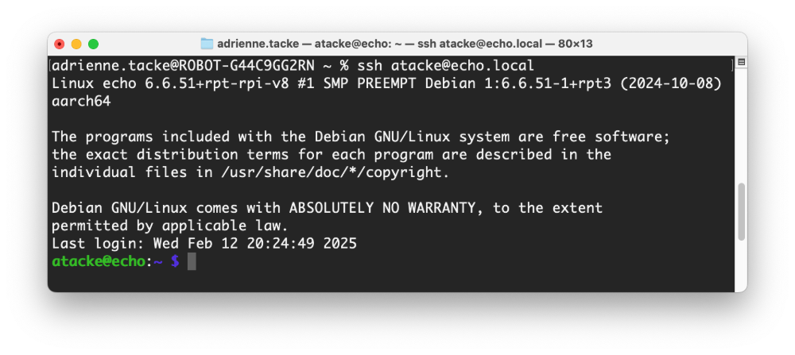
1. Update your Raspberry Pi to ensure all the latest packages are installed
   ```bash
   sudo apt update
   sudo apt upgrade
   ```
### Enable communication protocols

1. Launch the Pi configuration tool by running the following command
   ```bash
   sudo raspi-config
   ```
1. Use your keyboard to select “Interface Options”, and press return.
   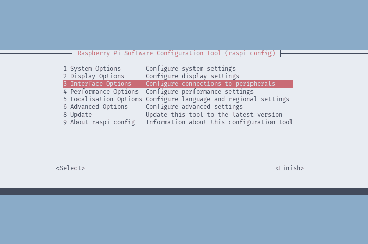
1. [Enable the relevant protocols](https://docs.viam.com/installation/prepare/rpi-setup/#enable-communication-protocols) to allow communication with the dofbot's expansion board. One of those is I<sup>2</sup>C (Inter-Integrated Circuit), a two-wire serial communication protocol used for short-distance communication between electronic devices. Enable **I2C**.
   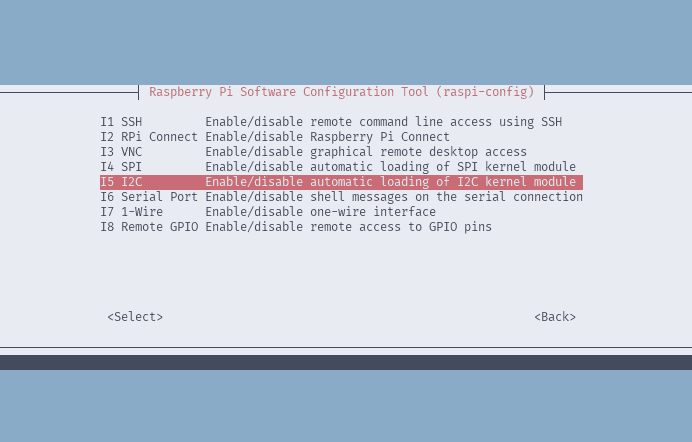
1. Confirm the options to enable the I2C interface. And reboot the Pi when you're finished.
   ```bash
   sudo reboot
   ```
<!-- ------------------------ -->
## Configure your machine
Duration: 5

1. In [the Viam app](https://app.viam.com/fleet/dashboard) under the **LOCATIONS** tab, create a machine by typing in a name and clicking **Add machine**.
   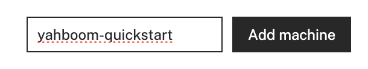
1. Once your machine is created, you are brought to your machine overview page. Click **View setup instructions**.
   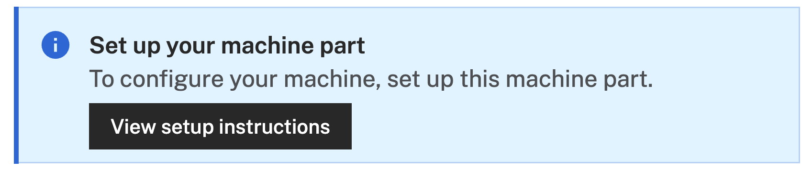
1. To install `viam-server` on your device, select the operating system you are running. For example, I'll be using a Raspberry Pi as my device, so I'll select `Linux / Aarch64`. Leave the default installation method of `viam-agent`:
   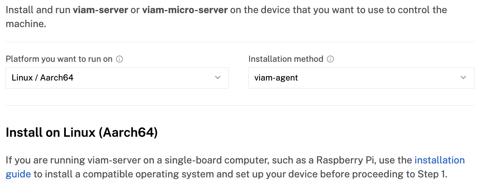
1. Follow the instructions that are shown for your platform. If you are following along with a Pi, you'll copy the command shown and run it in your SSH session on your Pi. 
1. The setup page will indicate when the machine is successfully connected.
    

With a machine configured, we now need to configure the arm's components next!

<!-- ------------------------ -->
## Configure your dofbot (JSON approach)
Duration: 5

This approach will walk you through the JSON configuration of the dofbot components you'll need to configure. You'll primarily work within the JSON editor of your machine.

> aside negative
> For a more beginner-friendly, step-by-step explanation of how to configure your machine, please skip to the next step **Configure your dofbot (Visual approach)**. This approach will walk you through the same concepts that are on this page, but in a more visual manner; You'll click through the Viam platform to add your components instead of working with JSON directly. 

### Configure your machine via JSON
1. In [the Viam app](https://app.viam.com/fleet/locations), find the **CONFIGURE** tab.
1. Click on the `{} JSON` tab to open the machine's JSON configuration page.
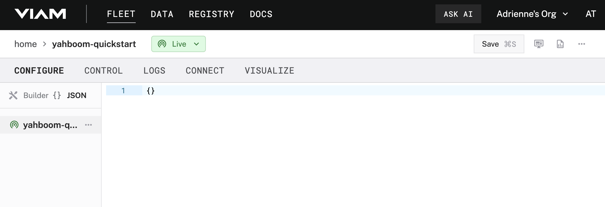
1. Copy the following code and paste it into the JSON editor (don't worry, we'll go through each of the components and explain what's happening). Be sure to click **Save** in the top right to apply your changes.
    ```JSON
    {
      "components": [
        {
          "name": "dofbot-camera",
          "api": "rdk:component:camera",
          "model": "rdk:builtin:ffmpeg",
          "attributes": {
            "video_path": "/dev/video0"
          }
        },
        {
          "name": "dofbot-arm",
          "api": "rdk:component:arm",
          "model": "hipsterbrown:dofbot:arm",
          "attributes": {},
          "frame": {
            "parent": "world",
            "translation": {
              "x": 0,
              "y": 0,
              "z": 0
            },
            "orientation": {
              "type": "ov_degrees",
              "value": {
                "x": 0,
                "y": 0,
                "z": 1,
                "th": 0
              }
            }
          }
        },
        {
          "name": "dofbot-gripper",
          "api": "rdk:component:gripper",
          "model": "hipsterbrown:dofbot:gripper",
          "attributes": {},
          "frame": {
            "parent": "dofbot-arm",
            "translation": {
              "x": 0,
              "y": 0,
              "z": 0
            },
            "orientation": {
              "type": "ov_degrees",
              "value": {
                "x": 0,
                "y": 0,
                "z": 1,
                "th": 0
              }
            }
          }
        }
      ],
      "modules": [
        {
          "type": "registry",
          "name": "hipsterbrown_dofbot",
          "module_id": "hipsterbrown:dofbot",
          "version": "latest"
        }
      ]
    }
    ```
1. Let's step through what we configured. You'll notice that within the components array, there are three objects: one for the camera (`dofbot-camera`), one for the arm (`dofbot-arm`), and one for the gripper (`dofbot-gripper`):
    ```JSON
    {
      "components": [
        {
          "name": "dofbot-camera",
          "api": "rdk:component:camera",
          "model": "rdk:builtin:ffmpeg",
          "attributes": {
            "video_path": "/dev/video0"
          }
        },
        {
          "name": "dofbot-arm",
          "api": "rdk:component:arm",
          "model": "hipsterbrown:dofbot:arm",
          "attributes": {},
          "frame": {
            "parent": "world",
            "translation": {
              "x": 0,
              "y": 0,
              "z": 0
            },
            "orientation": {
              "type": "ov_degrees",
              "value": {
                "x": 0,
                "y": 0,
                "z": 1,
                "th": 0
              }
            }
          }
        },
        {
          "name": "dofbot-gripper",
          "api": "rdk:component:gripper",
          "model": "hipsterbrown:dofbot:gripper",
          "attributes": {},
          "frame": {
            "parent": "dofbot-arm",
            "translation": {
              "x": 0,
              "y": 0,
              "z": 0
            },
            "orientation": {
              "type": "ov_degrees",
              "value": {
                "x": 0,
                "y": 0,
                "z": 1,
                "th": 0
              }
            }
          }
        }
      ],
    ```
1. You'll see specific configuration options for each component. For example, the camera component uses the [`rdk:builtin:ffmpeg`](https://pkg.go.dev/go.viam.com/rdk@v0.82.1/components/camera/ffmpeg?source=searchResultItem#viewport) model, [`rdk:component:camera`](https://docs.viam.com/dev/reference/apis/components/camera/) api, and has a `video_path` attribute that points to the default location for cameras on Raspberry Pis. 
    ```JSON
        {
          "name": "dofbot-camera",
          "api": "rdk:component:camera",
          "model": "rdk:builtin:ffmpeg",
          "attributes": {
            "video_path": "/dev/video0"
          }
        },
    ```
  1. For the arm component, you'll see it's respective api [`rdk:component:arm`](https://docs.viam.com/dev/reference/apis/components/arm/) and model [`hipsterbrown:dofbot:arm`](https://github.com/hipsterbrown/viam-yahboom-dofbot) as well as a `frame` attribute. This represents a coordinate system that describes the position and orientation of the arm within the machine's spatial environment. For now, this is a single, default frame added to the arm.
      ```JSON
        {
          "name": "dofbot-arm",
          "api": "rdk:component:arm",
          "model": "hipsterbrown:dofbot:arm",
          "attributes": {},
          "frame": {
            "parent": "world",
            "translation": {
              "x": 0,
              "y": 0,
              "z": 0
            },
            "orientation": {
              "type": "ov_degrees",
              "value": {
                "x": 0,
                "y": 0,
                "z": 1,
                "th": 0
              }
            }
          }
        }
      ```
  1. For the gripper component, you'll see a similar configuration to the arm. One difference is within the `frame` attribute for the gripper: it's parent is now the arm, rather than the world.
      ```JSON
        {
          "name": "dofbot-gripper",
          "api": "rdk:component:gripper",
          "model": "hipsterbrown:dofbot:gripper",
          "attributes": {},
          "frame": {
            "parent": "dofbot-arm",
            "translation": {
              "x": 0,
              "y": 0,
              "z": 0
            },
            "orientation": {
              "type": "ov_degrees",
              "value": {
                "x": 0,
                "y": 0,
                "z": 1,
                "th": 0
              }
            }
          }
        }
      ```
1. Lastly, you'll see a module array. This will list any module from the [Viam Registry](https://app.viam.com/registry) or [custom module](https://docs.viam.com/operate/get-started/other-hardware/create-module/) you are running on your machine. You'll notice that you can set a `version` of the module to use as well. For now, we have a single module, the [`hipsterbrown_dofbot`](https://github.com/hipsterbrown/viam-yahboom-dofbot) module which allows us to seamlessly integrate with the dofbot arm in Viam:
    ```JSON
     "modules": [
        {
          "type": "registry",
          "name": "hipsterbrown_dofbot",
          "module_id": "hipsterbrown:dofbot",
          "version": "latest"
        }
      ]
    ```  

    > aside negative
    > Troubleshooting: If you receive the following error `error while loading shared libraries: libnlopt.so.0: cannot open shared object file: No such file or directory`, you may have to manually install the missing package on your Pi. To do so, you can run `sudo su` to assume root user control, then `sudo apt-get install libnlopt0` to install the missing package via your SSH session on your Pi. Alternatively, you can connect a monitor and keyboard to your Pi, switch to your Pi's OS, and run the same commands on a terminal in the Pi's OS. Once you've finished this, be sure to reload your machine's page. 

    > aside negative
    > If your camera feed is not showing or you have errors, your video path might be different. Refer to the discovery service steps to capture the exact video path of your dofbot's camera.

Great, you've configured your machine via JSON! Skip ahead to the **Test your arm** step. 

<!-- ------------------------ -->
## Configure your dofbot (Visual approach)
Duration: 10

**This step accomplishes the same tasks as the last step**, but in a beginner-friendly, visual manner. If you've already completed the previous step _Configure your dofbot (JSON-approach)_, please skip ahead to **Test your arm**! Otherwise, you will duplicate components in your machine.

### Configure your dofbot's camera
1. In [the Viam app](https://app.viam.com/fleet/locations), find the **CONFIGURE** tab.
1. Click the **+** icon in the left-hand menu and select **Component or service**.
1. Select `camera`, and find the `ffmpeg` module. 
  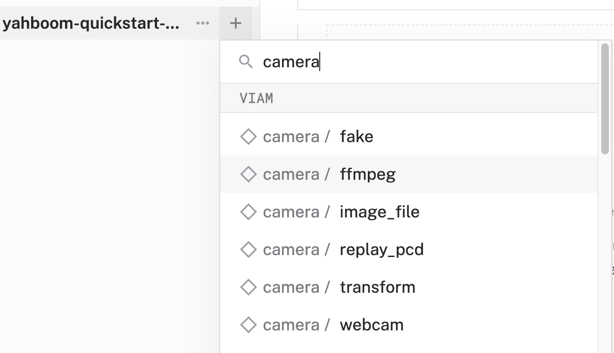
1. Change the name to something descriptive, like `dofbot-camera`, then click **Create**. This adds the module for working with the default camera that comes with the Yahboom Dofbot.
  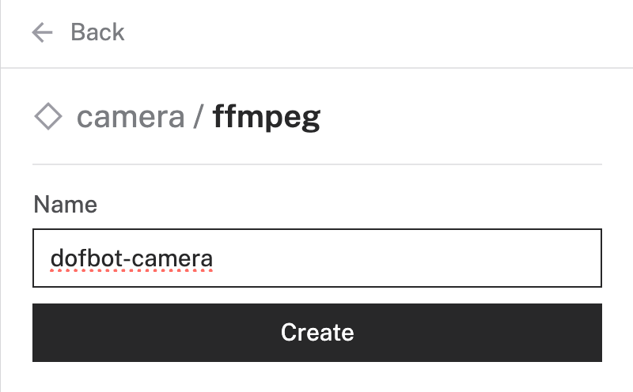
1. Notice adding this module adds the camera hardware component called `dofbot-camera`. You'll see a collapsible card on the right, where you can configure the camera component, and the corresponding `dofbot-camera` part listed in the left sidebar.
   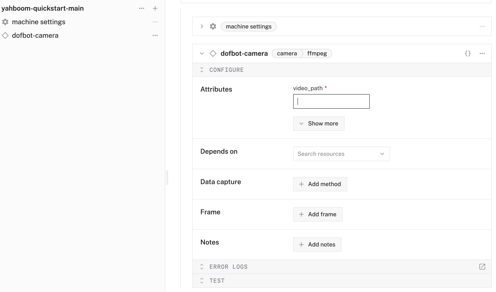
1. To configure the camera component, the `video_path` of the intended device needs to be set. You can quickly find which devices are connected to your machine by adding a discovery service. Click **Add webcam discovery service** that appears in the prompt.
   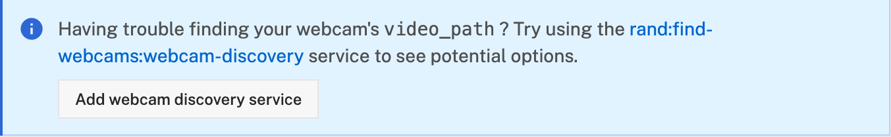
1. Notice that this adds the `discovery-1` service and `find-webcams` module to your machine in the left sidebar. Corresponding cards to these items also appear on the right. (If you don't see the prompt in the previous step, you can always manually add the `find-webcams` module to your machine by searching for it through the **+** icon, selecting **Component or service**, then searching for `find-webcams`. Don't forget to click **Save**)
1. Click **Save** in the top right to save and apply your configuration changes. 
1. Expand the **TEST** panel of the `discovery-1` card. Here, you'll find attributes of all discoverable cameras connected to your machine. Find the `video_path` of the device you'd like to use as your webcam, then copy the value. For example, I'll use the detected camera from the dofbot, so I'll copy `/dev/video0`.
1. Paste the copied `video_path` value into your camera component's `video_path` input, which is in the **Attributes** section:
  <br>
  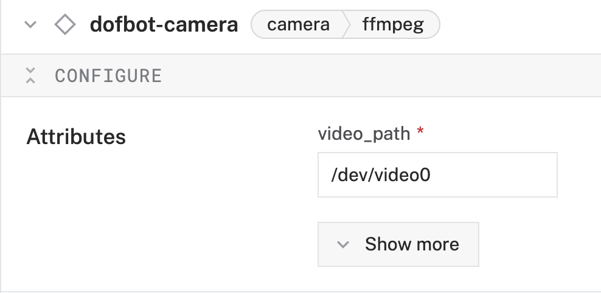
1. Click **Save** in the top right once more to save and apply your configuration changes.


Great, your machine now has eyes! Let's add the arm next.

### Configure your dofbot's arm
1. Click the **+** icon in the left-hand menu and select **Component or service**.
1. Search for the `dofbot :arm` module and select it. 
    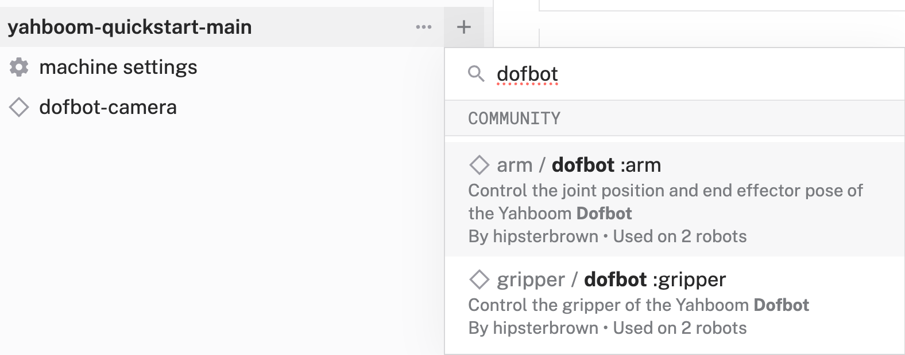
1. A helpful card about the module is shown. Information such as what the module does, its usage, and supported platforms are all available. Click **Add module**.
  <br>
  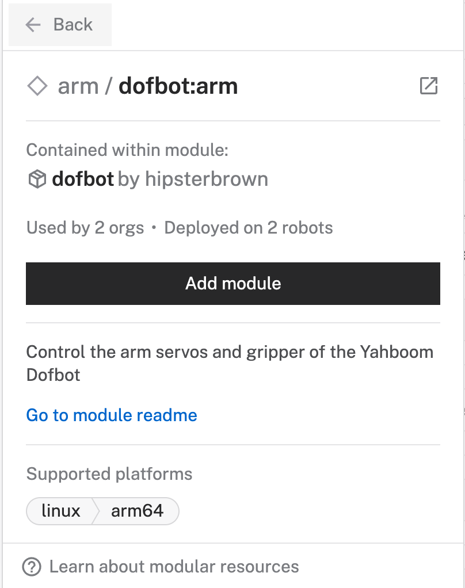
1. Change the name to something descriptive, like `dofbot-arm`, then click **Create**. This adds the module for working with the Dofbot's arm, particularly its joints.
  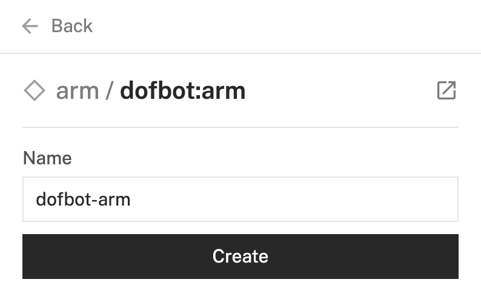
1. Notice adding this module adds the arm hardware component called `dofbot-arm`. You'll see a collapsible card on the right, where you can configure the arm component, see any errors originating from the component, and test the component directly, and the corresponding `dofbot-arm` part listed in the left sidebar. 
   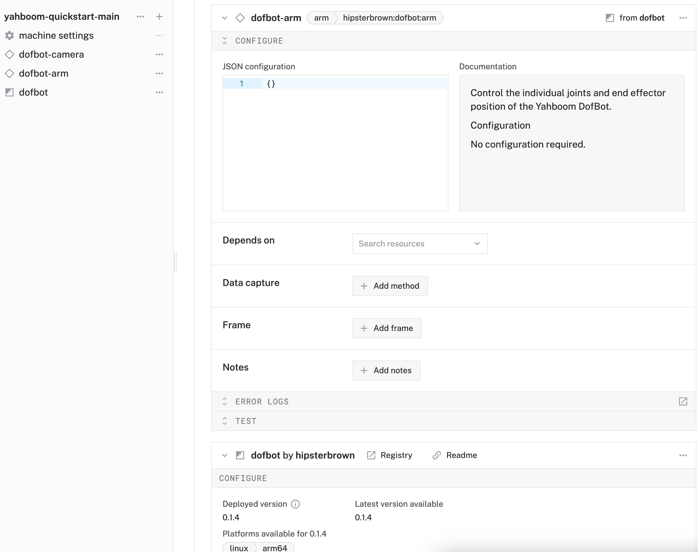
1. To give the arm a reference to its position and orientation within the machine's spatial environment, we'll need to add a frame. Within the Configure panel within the arm component, click **Add Frame**.
   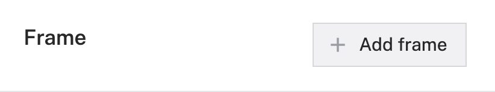
1. Notice that this adds a default frame with some default values.
   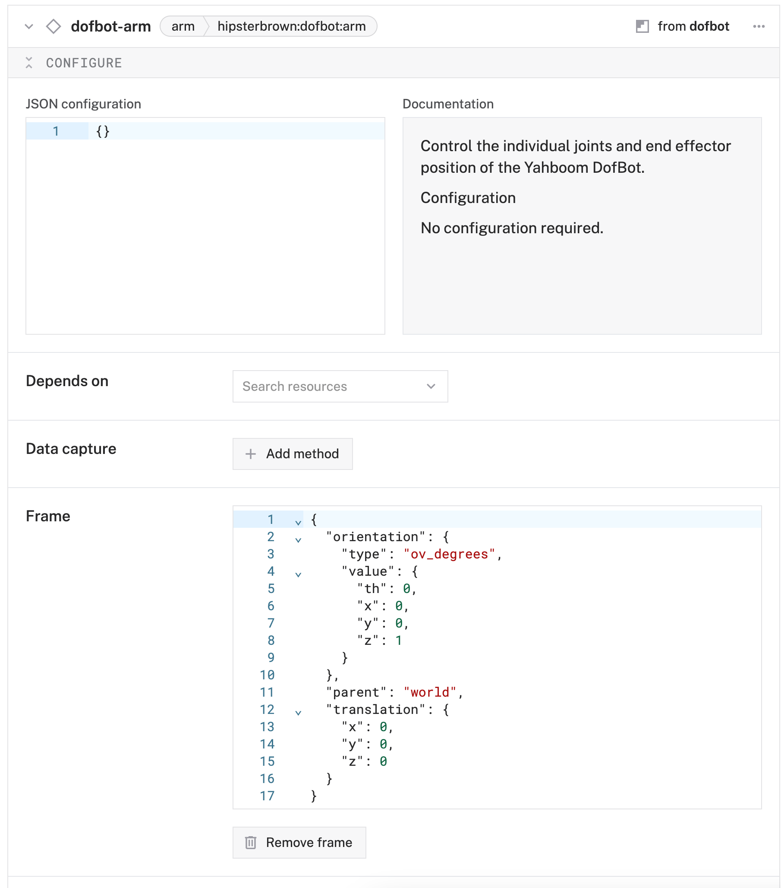
1. Click **Save** in the top right to save and apply your configuration changes.

We now have a connection to the arm (and its joints). Last thing to add is the gripper.

### Configure your dofbot's gripper
1. Click the **+** icon in the left-hand menu and select **Component or service**.
1. Search for the `dofbot :gripper` module and select it. 
  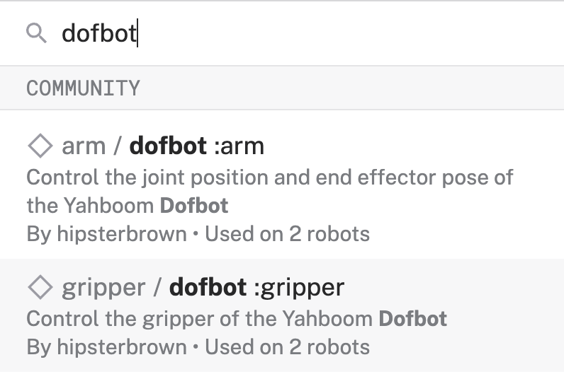
1. Change the name to something descriptive, like `dofbot-gripper`, then click **Create**. This adds the module for working with the Dofbot's gripper, particularly its joints.
  <br>
  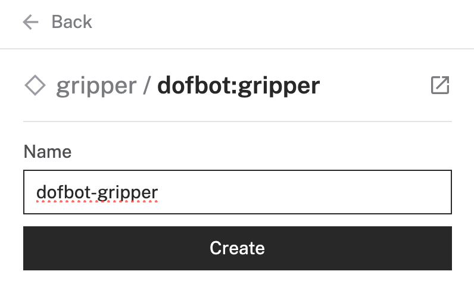
1. Notice adding this module adds the gripper hardware component called `dofbot-gripper`. You'll see a collapsible card on the right, where you can configure the gripper component, see any errors originating from the component, and test the component directly, and the corresponding `dofbot-gripper` part listed in the left sidebar. 
  <br>
  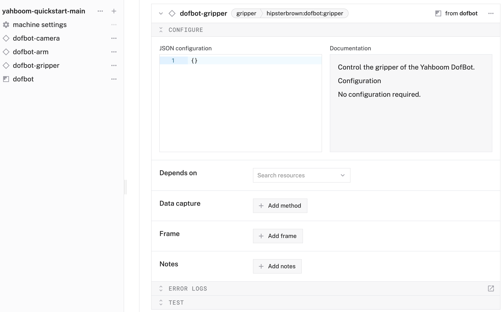
1. To give the gripper a reference to its position and orientation within the machine's spatial environment, we'll need to add a frame. In th eConfigure panel (within the gripper component), click **Add Frame**.
  
1. Notice that this adds a default frame with some default values. For the `parent` key, change the value to the name of your arm, so `dofbot-arm`:
   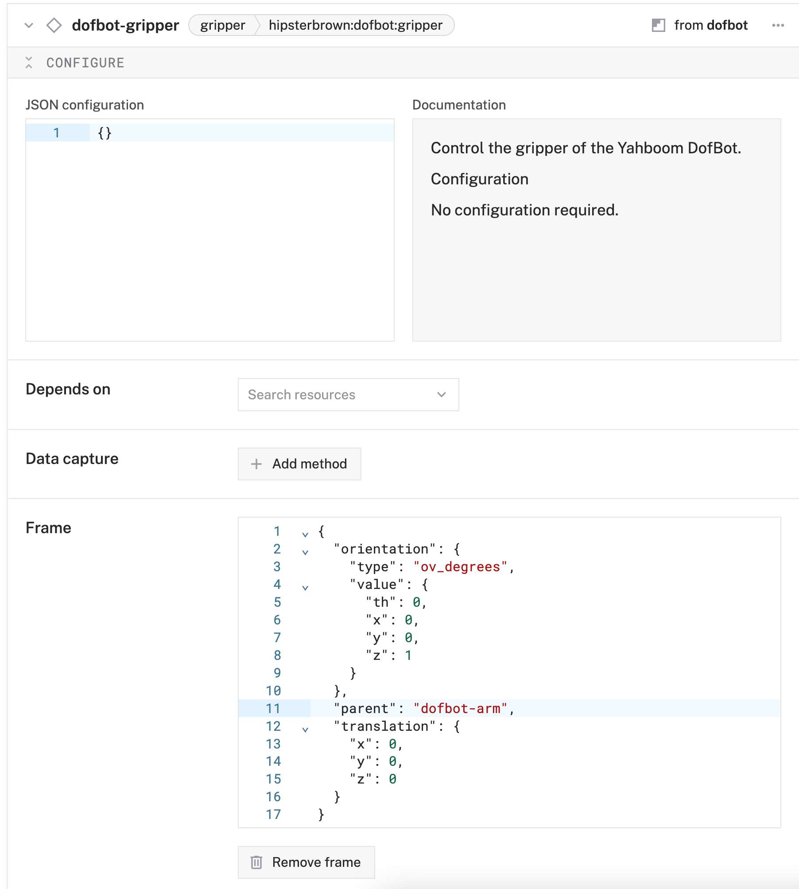
1. Click **Save** in the top right to save and apply your configuration changes.

Now that all of your dofbot arm's components are configured in Viam, it's time to test them out.

<!-- ------------------------ -->

## Test your arm
Duration: 5

1. Click the **CONTROL** tab. If properly configured, you'll find testing panels for your dofbot's arm, camera, and gripper. You should see a set of Joint Position Movement panels for the arm, a live camera feed for the dofbot's camera, and an Open/Close testing panel for the gripper.


### Test your dofbot camera
1. Expand the dofbot camera's TEST panel. You should see a live feed from your dofbot camera. You can change the rate of refresh for your camera and test the feed. You can also enable a picture-in-picture window by clicking **Toggle picture-in-picture**:
    

    > aside negative
    > If your camera feed is not showing or you have errors, your video path might be different. Refer to the [discovery service](https://docs.viam.com/operate/reference/components/camera/webcam/#using-video_path) steps to capture the exact video path of your dofbot's camera. Also check the components error logs and the machine level logs for further information.

### Test your dofbot arm
1. Expand your dofbot arm's TEST panel. Here, you can test the movement of your arm's joints in different ways.
1. To test the movement of specific joints,  you can use the `MoveToJointPositions` panel. For example, to move joint 0 (the lowest on the arm), change the angle for joint 0's input, the press **Execute**. To test the top-most joint (in our case, where the gripper is mounted), change the angle for joint 4, then press **Execute**:
    
1.  Try also testing the movement to specific positions using the `MoveToPosition` panel. For example, to move the arm forward and backward (relative to its orientation in the world and known coordinate system), change the `Y` input value, then press **Execute**. To move the arm up, change the `Z` input value to a higher number. To move it back down, change the `Z` input value to a lower number. To test the rotation of the wrist, try changing the `θ`'s input value:
 

### Test your dofbot gripper
1. Expand your dofbot gripper's TEST panel. Here, you can test opening and closing the gripper.
3. Assuming the gripper is in the default open state, test the Grab action by selecting the **Grab** button. To test the open action, select the **Open** button:
   

Congratulations! You now have a working Yahboom Dofbot arm connected to Viam. 

<!-- ------------------------ -->
## Conclusion And Resources
Duration: 1

Congratulations! You've just connected your Yahboom DOFBOT arm to Viam and can work with it through the platform. This foundational step allows you to remotely access and manage the arm, extend its functionality with some of [Viam's SDKs](https://docs.viam.com/dev/reference/sdks/), or extend its functionality with modules from the [Viam Registry](https://app.viam.com/registry).  Do [let me know](https://bsky.app/profile/abt.bsky.social) if you've built this!

### What You Learned
- How to configure a Yahboom Dofbot arm in Viam
- How to control the Yahboom Dofbot arm through Viam

### Extend your Viam-powered Yahboom DOFBOT arm
Right now, you have a Yahboom DOFBOT arm that can take advantage of Viam's capabilities and can be controlled remotely. Why not:

- Create a custom [CV model](https://codelabs.viam.com/guide/cv-checkout/index.html) to detect objects and a [custom module](https://codelabs.viam.com/guide/control-module/index.html) to sort them.
- Build your own [arcade claw game](https://codelabs.viam.com/guide/claw-game/index.html)!
- Add [AI tracking support](https://codelabs.viam.com/guide/ai-camera-tracking/index.html) to your arm's webcam and the arm itself.

### Related Resources
- [Viam documentation](https://docs.viam.com/) 
- Other [Viam codelabs](https://codelabs.viam.com/)
- [Viam Discord community](http://discord.gg/viam)
