author: Joyce
id: emily-door-lock
summary: Monitor door lock position using an infrared sensor
categories: Getting-Started, Developer
environments: web
status: Published
feedback link: https://github.com/viam-devrel/viamcodelabs/issues
tags: Getting Started, Developer

# Detect door lock status with an infrared sensor

<!-- ------------------------ -->

## Overview

**Is my door locked?** If you leave your home, and you're unsure whether you locked your front door, this is a smarter way to check whether your front door is locked or unlocked.

In this codelab, you'll learn how to use an infrared sensor to see whether a door is locked or unlocked in realtime.

### What You’ll Build

- A Viam-powered internet-connected device that tells you whether your door is locked

  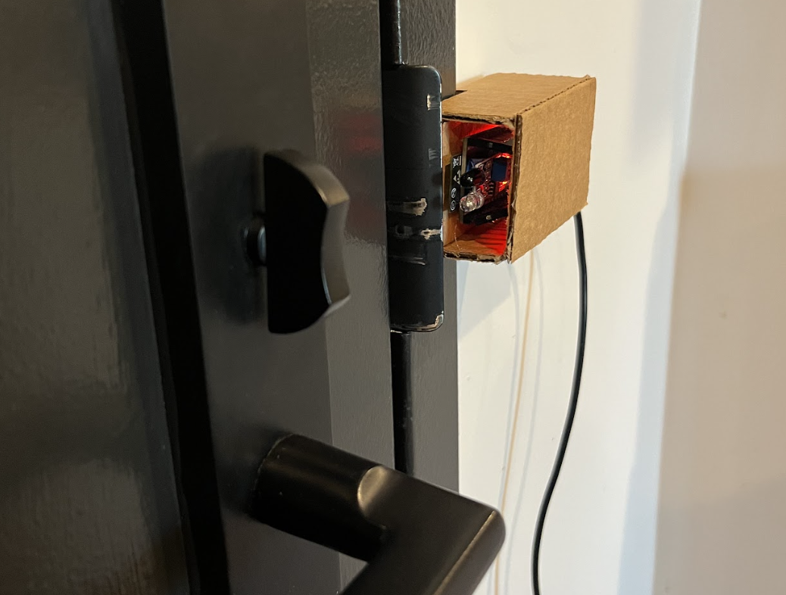

### Prerequisites

- A computer with MacOS, Windows, or Linux to flash your ESP32 and configure the device's components using the Viam app
- Hardware and supplies requirements

  - 1 - [ESP32 development board](https://a.co/d/0liXUKP) - check the Viam docs for [specific resource requirements](https://docs.viam.com/operate/get-started/setup-micro/)
  - 1 - USB data cable - make sure the cable is capable of data transfer (not just charging); refer to this resource for [How To Tell If A USB Cable Is For Charging Or Data Transfer](https://glidedigital.com/how-to-tell-if-a-usb-cable-is-for-charging-or-data-transfer)
  - 3 - jumper wires
  - 1 - [Infrared sensor](https://a.co/d/izETGBR)
  - 1 - [Infrared reflective tape](https://a.co/d/h0vzUB0) - other reflective materials can work well, like white electrical tape or matte white paper; to test IR reflectivity, you can shine a television remote at it while watching through your phone camera to see if it lights up brightly

### What You’ll Need

- All the hardware components listed in prerequisites.
- Sign up for a free Viam account, and then [sign in](https://app.viam.com/fleet/dashboard) to the Viam app

### What You’ll Learn

- How to use an IR sensor to detect state
- How to configure and test a device's components using Viam
- How to use an ESP32 with Viam
- How to configure OTA updates

<!-- ------------------------ -->

## Set up a new Viam machine

Duration: 5

### Install the viam-micro-server on ESP32

Let's start by flashing the viam-micro-server to the ESP32 dev board. This will allow us to connect the Viam machine to Wifi so that we can subsequently add custom firmware over-the-air (OTA) by changing the machine configuration.

1. Connect your ESP32 board to your computer with a data cable. Make sure the cable is capable of data transfer (not just charging).
1. In the [Viam app](https://app.viam.com/) under the **LOCATIONS** tab, enter a name for a new machine, and **Add machine**.
   
1. Under the **CONFIGURE** tab, click the **View setup instructions** button.
   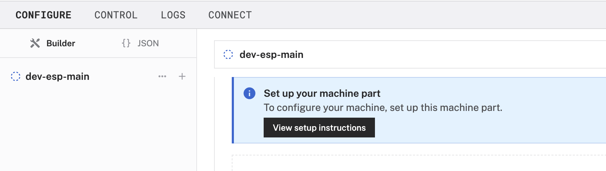
1. Select the platform you want to run on, ESP32.
1. Select the platform of the computer you're using to flash the ESP32. The example shown below will be for a Mac, but the steps to follow for other operating systems is similar.
   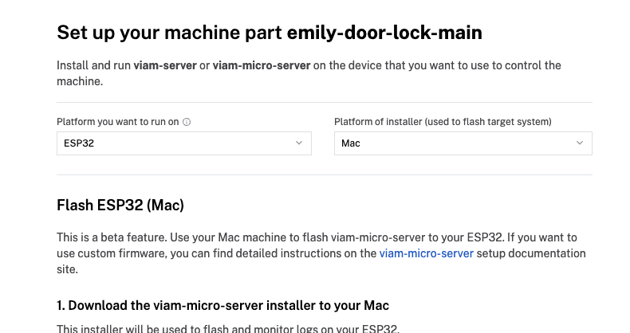
1. Follow the instructions to download the file for the `viam-micro-server` installer used to flash and monitor logs on your ESP32.
1. Download the file for the machine credentials used to connect the ESP32 to the Viam app.
1. In the terminal window, navigate to the directory where the previous files downloaded. In the example shown below, files were downloaded to the `~/Downloads` directory of the computer.
   ```bash
   $ cd ~/Downloads
   ```
1. Copy the installation command from the setup instructions in the Viam app.
1. Paste it into your terminal window at the command line prompt. Replace the `&lt;WIFI-SSID&gt;` placeholder (including the angle brackets`<`and`>`) with your own SSID.
   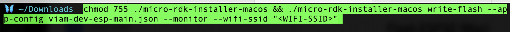
1. Run the command. Enter your WiFi password when prompted. If you receive a warning that the program is unsigned, go to Settings -> Privacy & Security and allow the application to run.
1. When prompted to select your connection type, select `/dev/cu.*`. In most cases, including flashing firmware on the ESP32, you’ll typically use `cu` (call-up) instead of `tty` (teletype).
   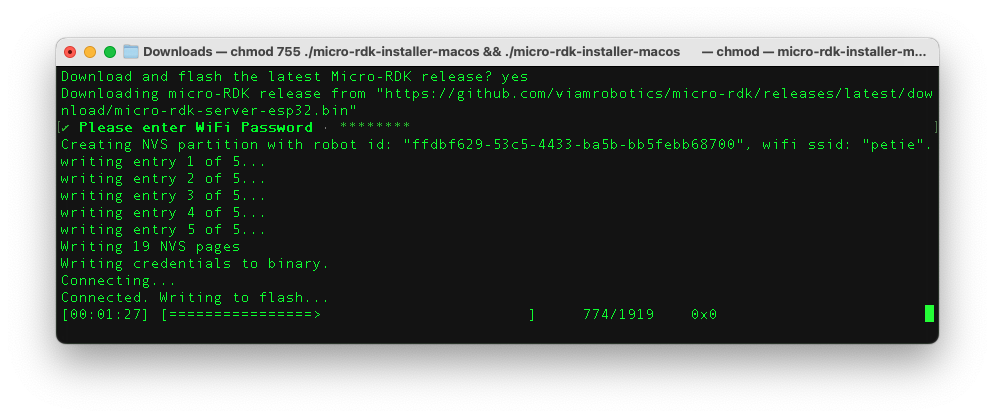
1. In the Viam app, wait for confirmation that your machine has successfully connected, and status is "Live". This might take a few minutes to complete depending on your connection.
   > aside negative
   > Check out the [troubleshooting tips](https://docs.viam.com/operate/reference/viam-micro-server/micro-troubleshooting) if you encounter any issues with the installation. Or refer to [the video demonstration](https://www.youtube.com/watch?v=yUZMo8l8up4).

<!-- ------------------------ -->

## Wire the IR sensor

Duration: 1

1. The IR sensor has three wires: black (GND), red (VCC), and a third wire for signal (OUT). Color conventions can vary, so double-check your sensor’s labels or datasheet.
   
1. Use the jumper wires to connect the IR sensor to the ESP32 headers.

   | HW104 IR Sensor Pin | Connects To (ESP32) | Description                  |
   | ------------------- | ------------------- | ---------------------------- |
   | VCC                 | Pin 1 (3.3V)        | Power for the sensor         |
   | GND                 | Pin 3 (GND)         | Ground connection            |
   | OUT                 | Pin 18 (GPIO18)     | Signal output (LOW = detect) |

   > aside positive
   > [This website](https://www.circuitstate.com/pinouts/doit-esp32-devkit-v1-wifi-development-board-pinout-diagram-and-reference/) is a helpful resource with the exact layout and role of each pin for ESP32. When working with Viam, make sure to reference the physical pin numbers, and not the GPIO numbers.

   The OUT wire is the signal output from the sensor. It sends a `LOW` (0V) signal when it detects an object, and stays `HIGH` (3.3V or 5V) when nothing is in front of it.

<!-- ------------------------ -->

## Configure the ESP32 with custom firmware

Duration: 3

Now that we've connected the Viam machine to WiFi, we can add custom firmware using the over-the-air (OTA) service.

### Add custom firmware via OTA service

1. Under the CONFIGURE tab, select JSON mode.
   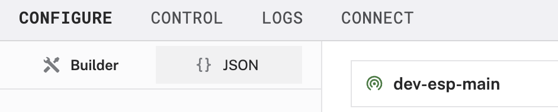
1. Paste the following JSON configuration. Notice we are using an IR sensor and an OTA service that requires a URL from which to fetch the new firmware. Refer to the documentation for more details about [configuring OTA updates](https://docs.viam.com/operate/get-started/setup-micro/#configure-over-the-air-updates).
   ```json
   {
     "components": [
       {
         "name": "IR",
         "api": "rdk:component:sensor",
         "model": "hw201",
         "attributes": {
           "meta": "0 is locked, 1 is unlocked",
           "pin": 18
         }
       }
     ],
     "services": [
       {
         "name": "OTA",
         "api": "rdk:service:generic",
         "model": "rdk:builtin:ota_service",
         "attributes": {
           "url": "https://github.com/ehhong/micro-rdk-with-IR-sensor/releases/download/v0.0.5/rusty-door-ota.bin",
           "version": "v0.0.5"
         }
       }
     ]
   }
   ```
   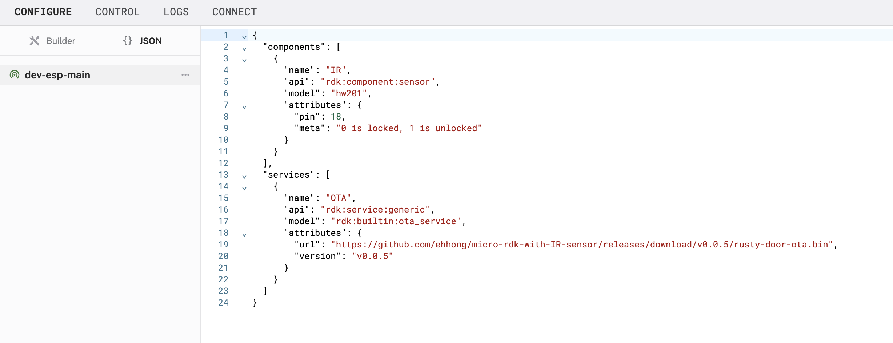
1. Click **Save** to apply your configuration changes. This may take a moment for the device to update.

### Test the IR sensor

1. Notice an IR sensor component in the left sidebar that corresponds to a panel with more details on the right. There is also an OTA service in the left sidebar that corresponds to a panel on the right.
1. Find the IR panel, and then expand the **TEST** section to view the readings detected by the IR sensor. See what happens when you point the sensor towards the IR tape (or similar reflective surface).
   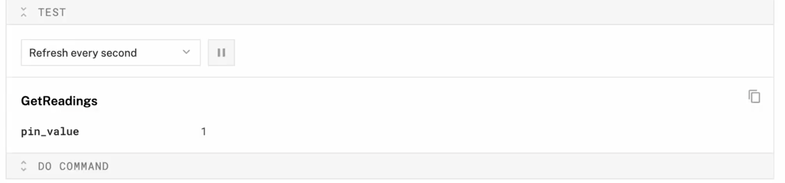

In the next step, let's position the detector so that a value of `0` indicates a locked state, and `1` is unlocked.

<!-- ------------------------ -->

## Position the detector

Duration: 3

Now that the detector is working as expected, let's position it near the door lock to dial in the sensitivity settings.

1. Mount the device next to the door you want to monitor, pointing the sensor in the direction of the door lock.
   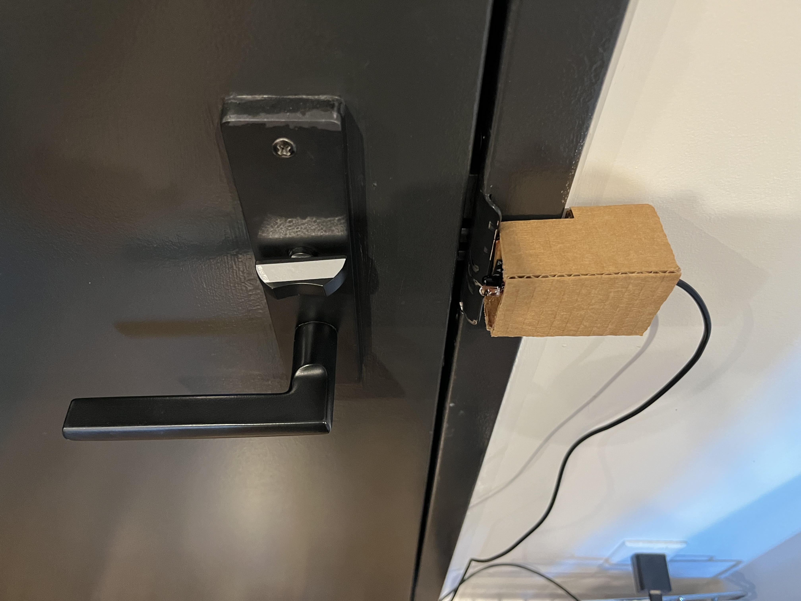
1. Add IR tape (or similar reflective material) to the deadbolt.
   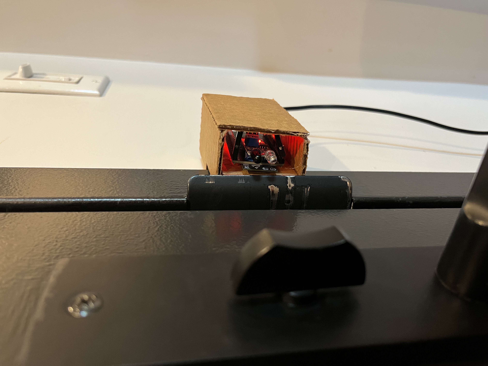
1. Test it again to make sure the sensor placed in the new position captures the readings accurately and reliably. A value of `0` should indicate a locked state, and `1` is unlocked.

### Remote access to door lock status

Now that your sensor is set up, you may not want to log in to the Viam app every time you want to check whether your door is locked or unlocked. There's a few options to consider:

- Download the Viam mobile application from the [Apple](https://apps.apple.com/us/app/viam-robotics/id6451424162) and [Google Play](https://play.google.com/store/apps/details?id=com.viam.viammobile&hl=en&gl=US) app stores to keep track of all your Viam machines, including this door lock status detector
- Develop your own custom mobile application using one of [Viam's SDKs](https://docs.viam.com/dev/reference/sdks/#mobile-sdk)
- Set up a notification to alert you when you've left your home and your door is still unlocked, by [creating your own custom Viam module](https://docs.viam.com/operate/get-started/other-hardware/micro-module/)

<!-- ------------------------ -->

## Next Steps

Duration: 3

### What you learned

- How to use an IR sensor to detect state
- How to configure and test a device's components using Viam
- How to use an ESP32 with Viam
- How to configure OTA updates

### Real-world applications and projects for IR sensors

IR sensors are widely used for their simplicity, reliability, and low power consumption. Here are some real-world use cases where IR lock-state detection is useful:

- **Smart Home Security**: Detect whether a door is physically locked, and integrate with smart systems to send alerts or trigger automations based on the lock state.
- **Line-Following Robots**: Robots use multiple IR sensors to detect contrast between a black line and a white surface to follow predefined paths on warehouse floors or for material transport in manufacturing lines.
  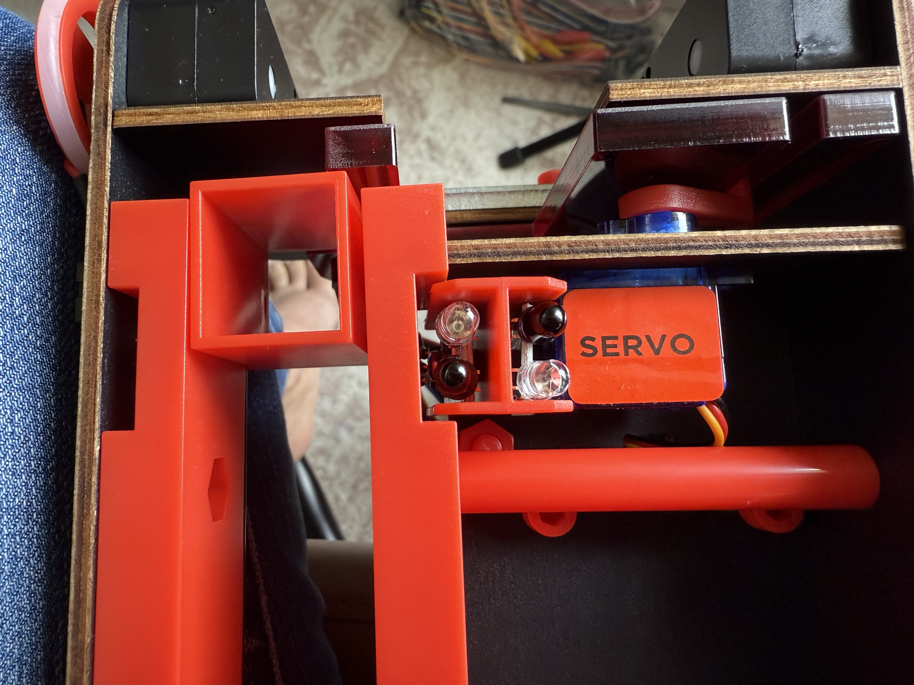
- **Logging and Compliance**: Maintain a time-stamped record of door lock events for audit trails, particularly in healthcare or high-security environments.

### Building advanced features with Viam and IR sensors

Now that you have an IR sensor that detects whether a door is locked or unlocked based on reflected light, you can:

- [Build your own Viam module](https://docs.viam.com/operate/get-started/other-hardware/micro-module/) to create custom logic to trigger alerts or actions when the door state changes, for example, send a notification or activate an alarm if the door is unlocked unexpectedly or left unlocked for a certain period of time
- Extend the sensor's functionality by integrating it with actuators to trigger a servo mechanism or LED based on the sensor reading
- [Add more components and services](https://docs.viam.com/platform/#the-things-that-make-up-a-machine) to enhance your automation setup, such as an office sentry that lights an LED indicator if a room door is not properly closed and locked after hours

### Related Viam resources

- [Viam documentation](https://docs.viam.com/)
- [Viam hands-on codelabs](https://codelabs.viam.com)
- [Viam Discord community](http://discord.gg/viam)
