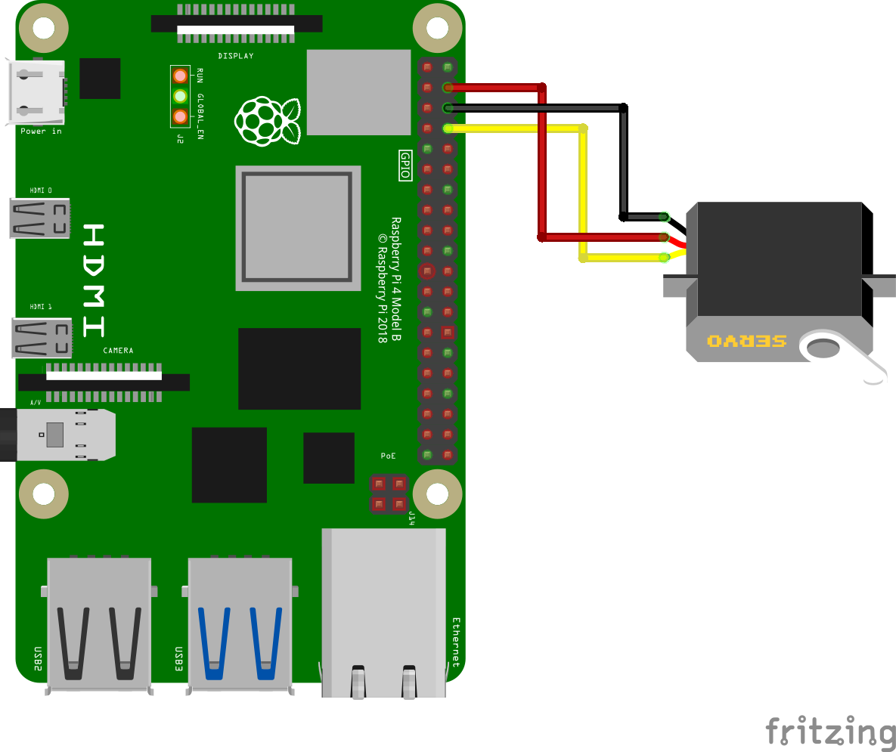

author: Joyce
id: fingerprint
summary: Use the R503 fingerprint sensor to enable physical access
categories: Getting-Started, Developer
environments: web
status: Published
feedback link: https://github.com/viam-devrel/viamcodelabs/issues
tags: Getting Started, Developer, Data

# Enable physical access using a fingerprint sensor

<!-- ------------------------ -->

## Overview

Duration: 1

You can use a fingerprint sensor to unlock a geocache box, open a garage door, or enable access to just about anything.

In this tutorial, you'll use the R503 fingerprint sensor with Viam to unlock a servo-powered latch when an enrolled fingerprint is detected. This project demonstrates how to use biometric input as a trigger for a physical access control system.


### Prerequisites

- Sign up for a free Viam account, and then [sign in](https://app.viam.com/fleet/locations/) to the Viam app
- Hardware and supplies requirements
  - 1 - [Raspberry Pi 4](https://a.co/d/fc3JUMm)
  - 1 - [USB flash drive](https://www.amazon.com/Samsung-MUF-128AB-AM-Plus-128GB/dp/B07D7PDLXC/) or microSD card to use with your Pi
  - 1 - USB cable to power your Pi
  - 1 - [R503 fingerprint sensor](https://www.adafruit.com/product/4651)
  - 1 - Servo motor ([SG90](https://a.co/d/aVTvXlc) or similar)
  - 1 - [CP2102 USB 2.0 to TTL Serial Adapter](https://a.co/d/8P5ljFT)
  - 7 - Jumper wires
  - 1 - Phillips screwdriver to mount the servo motor
  - 1 - 3D printed mount and enclosure (optional)

### What You’ll Learn

- How to use modules from [the Viam registry](https://docs.viam.com/registry/)
- How to run control logic on your Viam achine
- How to configure a biometric sensor with Viam
- How to use control logic to actuate a servo on fingerprint match
- How to use Viam's `do_command()` interface for testing

### What You’ll Build

- A physical access system that unlocks a servo latch on fingerprint recognition

  

<!-- ------------------------ -->

## Wire your components

Duration: 5

### Wire your fingerprint sensor

1. **Connect the adapter**: Connect the USB to serial adapter to a USB port in your Raspberry Pi. Jumper wires may be required to connect the R503 sensor to your Raspberry Pi.
   > aside negative
   > UART pins are easier for compact setups, but USB adapters simplify voltage matching.
1. **Wire the R503 sensor to the adapter**: Refer to the following wiring diagram to see how to connect the adapter to the LD2410 mmwave sensor. Make sure the transmitting pin (TX) on the adapter is connected to the receiving pin (RX) on the sensor, and vice versa.

   | **CP2102**         | **R503**                                                                |
   | ------------------ | ----------------------------------------------------------------------- |
   | Transmitting (TXO) | Receiving (RX), Purple/brown wire (4th when counting from the Red wire) |
   | Receiving (RXI)    | Transmitting (TX), Yellow wire (3rd when counting from the Red wire)    |
   | Power (3V3)        | VCC, Red wire                                                           |
   | Ground (GND)       | GND, Black wire                                                         |

   > aside negative
   > The wiring diagram below shows a similar model of fingerprint sensor. Follow the sensor specification sheets if there's any doubts about the wiring schema. Adafruit has [a detailed summary of wiring different fingerprint sensors](https://learn.adafruit.com/adafruit-optical-fingerprint-sensor/wiring-for-use-with-arduino).
   > 

   > aside negative
   > In the photo show below, Wago lever nuts are used to quickly facilitate the connection to the USB serial adapter. You can choose a different method of connecting the wires, such as soldering. The blue and white wires of the fingerprint sensor are not being used.
   > 

### Wire your servo motor

1. **Connect the servo to the Pi**: Jumper wires are required to connect the servo wires to the Raspberry Pi.

   | **Servo**           | **Raspberry Pi** |
   | ------------------- | ---------------- |
   | Power wire (red)    | Pin 4 (VCC 5V)   |
   | Ground wire (black) | Pin 39 (GND)     |
   | Data wire (yellow)  | Pin 32 (GPIO 12) |

   > aside negative
   > The website [pinout.xyz](https://pinout.xyz/) is a helpful resource with the exact layout and role of each pin for Raspberry Pi. When working with Viam, make sure to reference the physical pin numbers, and not the GPIO numbers listed on `pinout.xyz`.
   > 

<!-- ------------------------ -->

## Set up your Raspberry Pi

Duration: 6

The Raspberry Pi boots from a USB flash drive (or microSD card). You need to install Raspberry Pi OS on a USB flash drive that you will use with your Pi. For more details about alternative methods of setting up your Raspberry Pi, refer to the [Viam docs](https://docs.viam.com/installation/prepare/rpi-setup/#install-raspberry-pi-os).

### Install Raspberry Pi OS

1. Connect the USB flash drive (or microSD card) to your computer.
1. Download the [Raspberry Pi Imager](https://www.raspberrypi.com/software/) and launch it.
   
1. Click **CHOOSE DEVICE**. Select your model of Pi, which is Raspberry Pi 4.
1. Click **CHOOSE OS**. Select **Raspberry Pi OS (64-bit)** from the menu.
1. Click **CHOOSE STORAGE**. From the list of devices, select the USB flash drive you intend to use in your Raspberry Pi.
   
1. Configure your Raspberry Pi for remote access. Click **Next**. When prompted to apply OS customization settings, select **EDIT SETTINGS**.
1. Check **Set hostname** and enter the name you would like to access the Pi by in that field, for example, `test`.
1. Select the checkbox for **Set username and password** and set a username (for example, your first name) that you will use to log into the Pi. If you skip this step, the default username will be `pi` (not recommended for security reasons). And specify a password.
1. Connect your Pi to Wi-Fi so that you can run `viam-server` wirelessly. Check **Configure wireless LAN** and enter your wireless network credentials. SSID (short for Service Set Identifier) is your Wi-Fi network name, and password is the network password. Change the section `Wireless LAN country` to where your router is currently being operated.
   
1. Select the **SERVICES** tab, check **Enable SSH**, and select **Use password authentication**.
   
   > aside negative
   > Be sure that you remember the `hostname` and `username` you set, as you will need this when you SSH into your Pi.
1. **Save** your updates, and confirm `YES` to apply OS customization settings. Confirm `YES` to erase data on the USB flash drive. You may also be prompted by your operating system to enter an administrator password. After granting permissions to the Imager, it will begin writing and then verifying the Linux installation to the USB flash drive.
1. Remove the USB flash drive from your computer when the installation is complete.

### Connect with SSH

1. Place the USB flash drive into your Raspberry Pi and boot the Pi by plugging it in to an outlet. A red LED will turn on to indicate that the Pi is connected to power.
   > aside negative
   > Make sure you are using a 5V 3A USB-C power supply to power your Raspberry Pi 4. Using a power supply with inadequate amperage can lead to instability, throttling, or unexpected behavior. Additionally, while USB boot is enabled by default on newer Raspberry Pi 4 models, older versions may require a firmware update to enable it. Refer to the [Raspberry Pi documentation](https://www.raspberrypi.com/documentation/computers/raspberry-pi.html) for detailed setup instructions and compatibility.
1. Once the Pi is started, connect to it with SSH. From a command line terminal window, enter the following command. The text in <> should be replaced (including the < and > symbols themselves) with the user and hostname you configured when you set up your Pi.
   ```bash
   ssh <USERNAME>@<HOSTNAME>.local
   ```
1. If you are prompted “Are you sure you want to continue connecting?”, type “yes” and hit enter. Then, enter the password for your username. You should be greeted by a login message and a command prompt.
   
1. Update your Raspberry Pi to ensure all the latest packages are installed
   ```bash
   sudo apt update
   sudo apt upgrade
   ```

### Enable communication protocols

1. Launch the Pi configuration tool by running the following command
   ```bash
   sudo raspi-config
   ```
1. Use your keyboard to select “Interface Options”, and press return.
   
1. [Enable the relevant protocols](https://docs.viam.com/installation/prepare/rpi-setup/#enable-communication-protocols) to support our hardware. Since you are using a sensor that communicates over the serial port, enable **Serial Port**.
   
1. Confirm the options to enable the serial login shell and serial interface. And reboot the Pi when you're finished.

<!-- ------------------------ -->

## Configure your components

Duration: 2

### Configure your machine

1. In [the Viam app](https://app.viam.com/fleet/dashboard) under the **LOCATIONS** tab, create a machine by typing in a name and clicking **Add machine**.
   
1. Click **View setup instructions**.
   
1. To install `viam-server` on the Raspberry Pi device that you want to use to communicate with and control your webcam, select the `Linux / Aarch64` platform for the Raspberry Pi, and leave your installation method as [`viam-agent`](https://docs.viam.com/how-tos/provision-setup/#install-viam-agent).
   
1. Use the `viam-agent` to download and install `viam-server` on your Raspberry Pi. Follow the instructions to run the command provided in the setup instructions from the SSH prompt of your Raspberry Pi.
   
1. The setup page will indicate when the machine is successfully connected.
   

### Add your Raspberry Pi

1. In [the Viam app](https://app.viam.com/fleet/locations), find the **CONFIGURE** tab. It's time to configure your hardware.
1. Click the **+** icon in the left-hand menu and select **Component or service**.
1. Select `board`, and find the `rpi` model. This adds the `raspberry-pi` module for working with the Raspberry Pi 4's GPIO pins. Leave the default name `board-1` for now.
   
1. Notice adding this module adds the board hardware component called `board-1`. The collapsible card on the right corresponds to the part listed in the left sidebar.
   
1. Click **Save** in the top right to save and apply your configuration changes.
   > aside negative
   > If any problems occur, check under the **LOGS** tab to see what might be going wrong.

### Add your fingerprint sensor

1. Click the **+** icon in the left-hand menu and select **Component or service**.
1. Select `sensor`, and find the `adafruit-r503` model. This adds the `fingerprint` module for working with the fingerprint sensor. Rename the default name to `fingerprint-sensor`.
   
1. Notice adding this module adds the board hardware component called `fingerprint-sensor`.
   
1. Click **Save** in the top right to save and apply your configuration changes.

### Add your servo

1. Click the **+** icon in the left-hand menu and select **Component or service**.
1. Select `servo`, and find the `rpi-servo` model. This adds the module to run a servo with Raspberry Pi 0 to 4. Leave the default name `servo-1` for now.
1. Notice adding this module adds the board hardware component called `servo-1`. Add the following JSON object under the **CONFIGURE** section of the new corresponding panel. This configuration allows Viam to accept data inputs from physical pin 32 on the Raspberry Pi.
   ```json
   {
     "pin": "32",
     "board": "board-1"
   }
   ```
   
1. Click **Save** in the top right to save and apply your configuration changes.

<!-- ------------------------ -->

## Test your components

Duration: 3

Now that we have added and configured these components in the Viam app, we can test them.

### Test your servo

1. Find the component `servo-1` and expand the **TEST** section of the corresponding panel.
1. Input a value between `0` and `180` within the **Desired angle (º)** field, and click the **Execute** button to see what happens.
   
1. Continue experimenting with different inputs to see what happens. In the upcoming steps, you will mount the servo in a way that an angle of `0` represents a closed latch position and `180` represents an open latch position, in order to secure our lockbox.

### Test your fingerprint sensor

1. Find the component `fingerprint-sensor` and expand the **TEST** section of the corresponding panel.
1. Under the **Get Readings** header, you should see `finger_detected` with a value of `false`.
   
1. Now go to the **CONTROL** tab within the Viam app and find the `fingerprint-sensor` component where you should see the same **Get Readings** header beneath the **TEST** section. This time, expand the **DO COMMAND** section and input the following JSON object, and click the Execute button while watching the fingerprint sensor to see an LED effect.
   ```json
   { "test_led": true }
   ```
   

In the next section we will execute more [do commands](https://docs.viam.com/dev/reference/apis/components/sensor/#docommand) to enroll our fingerprints.

<!-- ------------------------ -->

## Enroll your fingerprint

Duration: 4

The [`fingerprint` module](https://github.com/loopDelicious/viam-fingerprint-R503) supports several commands for fingerprint enrollment, matching, template management, and LED testing. Each command can be triggered using a [do command](https://docs.viam.com/dev/reference/apis/components/sensor/#docommand) request with a corresponding JSON payload. The enrollment process captures two fingerprint scans and stores them to a slot in memory.

### Enroll your fingerprint

1. **Start the enrollment**: Go to the **CONTROL** tab within the Viam app and find the `fingerprint-sensor` component to again expand the **DO COMMAND** section. Input the following JSON object, and click the **Execute** button to begins enrollment for slot `1`. The sensor will now wait for fingerprint scans.
   ```json
   { "start_enrollment": 1 }
   ```
1. **Capture 2 scans**: Run the following command twice. First with finger pressed on the sensor.
   Then remove and re-place the same finger for the second scan. If there’s an issue (e.g. misaligned finger), repeat this step. The enrollment state tracks progress automatically.
   ```json
   { "capture": true }
   ```
1. **Create fingerprint model**: Run the following command to create a model from the two captured scans. If the prints don't match, it will prompt to retry the second scan (capture again).
   ```json
   { "create_model": true }
   ```
1. **Store the model**: Run the following command to store the created model in slot `1` (or the slot used in `start_enrollment`). You can enroll the same fingerprint multiple times in different slots to improve match reliability under varying finger angles or pressure.
   ```json
   { "store_model": 1 }
   ```
1. **Repeat**: Repeat these steps with any other fingerprints you'd like to enroll, using a different numbered slot for each model. You can even enroll the same finger multiple times to improve the reliability of resulting in a positive match.

   > aside negative
   > **Troubleshooting**: If your sensor isn't responding to your finger placement:
   >
   > - Check sensor placement and connection
   > - Try adjusting finger position or cleaning the sensor
   > - Finger might have moved during scanning
   > - Finger positions were too different between scans
   > - Make sure your finger is clean and not too dry.
   > - Apply firm, even pressure, but don't press too hard.
   > - Try enrolling the same fingerprint multiple times in different slots to improve match reliability under varying angles or pressure. In other words, you will have multiple slots dedicated to enrolling the same finger.

### Verify your fingerprint

1. **Check enrolled print**: Place your finger on the sensor to see what happens. Look under the **Get Readings** section of the `fingerprint-sensor` component. Also look at the LED ring surrounding the sensor.
   
1. **Check un-enrolled print**: Place a different finger on the sensor to see what happens.
   

   <!-- ------------------------ -->

## Add your control logic

Duration: 2

Now that you have a sensor and a servo functioning separately, let's bring it all together by adding a control logic module. This module will move the servo to an open position if a fingerprint match is detected.


### Add a control logic module

1. Under the **CONFIGURE** tab, click the **+** icon in the left-hand menu and select **Component or service**.
1. Search for a model `fingerServo` and add the `control-access-fingerServo` module. This adds a generic service move the servo to an open position when a fingerprint match is detected. Rename the default name to `controller`.
1. Add the following JSON object to configure the module to connect to various components within the machine. As optional dependencies, the `leave_open_timeout` is the seconds the servo remains in the open position, and `servo_open_angle` and `servo_closed_angle` can be adjusted according to how your servo horn is positioned.
   ```json
   {
     "sensor": "fingerprint-sensor",
     "board": "board-1",
     "servo": "servo-1",
     "leave_open_timeout": 30,
     "servo_open_angle": 180,
     "servo_closed angle": 90
   }
   ```
   
1. **Save** your updates, and wait for the change to take effect.
1. **Test the control logic**: Place a finger on the sensor to see if it opens the servo. Then place a finger that has not been enrolled to see what happens. If it's helpful, view the **Get Readings** section of the `fingerprint-sensor` component to see what the sensor is detecting in real time.

<!-- ------------------------ -->

## Finishing touches

Duration: 2

Now that your sensor and servo are working, it's time to tidy up our project so it's not a loose jumble of wires and parts.

1. **Design an enclosure(s)**: Gather your Pi, sensor, and servo together so you can start sketching out how you want the components to come together. In this example, everything but the sensor can be contained within the split-body enclosure with hinge. This can be a 3D printed or laser-cut enclosure, a cardboard prototype, or a store-bought container.
1. **Print and assemble servo latch**: Print a housing for the servo latch mechanism, [such as this one](https://www.thingiverse.com/thing:4737545) that can be mounted on the interior of the box.

   

   > aside negative
   > If you're using [this particular design](https://www.thingiverse.com/thing:4737545):
   >
   > - The cam may need to be sized up or down to fit the servo axle (horn) depending on your servo model in the comments. For my SG90, the cam fit snuggly when scaled down 97%. You could also use hot glue to make a tighter fit.
   > - To push against the back end of the latch down to the base, I added a spring from a ballpoint pen, cut down to use 30% of the original height.

   > aside negative
   > No 3D printer? No problem. You can search for "servo latch" or "servo lock" to find a prebuilt mechanism. Or prototype with cardboard and household materials first to see if this project is worth a bigger investment.

1. **Mount servo latch and fingerprint sensor**: The servo latch can be mounted on the interior of the box. The fingerprint sensor can be mounted on the box so the sensor is open to the exterior of the box.
   
1. **Invite others to enroll fingerprints**: If you want other people to have access too, you can:
   - Enroll fingerprints using **do commands** in the Viam app just like you did previously.
   - Build a mobile app or web app using one of [Viam's SDKs](https://docs.viam.com/dev/reference/sdks/) to guide others through the enrollment steps.
     > aside positive
     > **Geocache box example**: If the fingerprint sensor is being used to enable physical access in a remote location, users can use a mobile app or web app that you create in order to guide others through the enrollment steps. For example, the app can prompt users to place a finger on the sensor to scan the first fingerprint. Behind the scenes, the app is calling `do_commands()` to `start_enrollment`, `capture`, `create_model`, and `store_model`. Once the fingerprint is successfully enrolled, users can place the finger on the sensor again to unlock the geocache.

<!-- ------------------------ -->

## Next Steps

Duration: 2

### What You Learned

- How to use modules from [the Viam registry](https://docs.viam.com/registry/)
- How to run control logic on your Viam machine
- How to configure a biometric sensor with Viam
- How to use control logic to actuate a servo on fingerprint match
- How to use Viam's `do_command()` interface for testing

### Enhance your fingerprint access system

Now that you have created a servo latch powered by a fingerprint sensor, you can customize and make it your own. Suggestions for extending your project include the following:

- **Modify the sensing**: Continue enrolling other fingerprints in other slots to let trusted friends access your box of secrets. Or `delete` their model to take away their access.
- **Modify the actuation**: Enhance the actuation mechanism to sound an alarm when a fingerprint is detected but doesn't match. Or open a garage door using your fingerprint.
  
- **Modify the control logic**: You can [create your own control logic module](https://codelabs.viam.com/guide/control-module/index.html?index=..%2F..index#0) to further customize your system. For example, update the LED colors or effects, or change the default `leave_open_timeout` to a longer duration.

### Other access control projects

There's many ways to control physical access to a box, physical spaces, or

- **Face identification for access control**: Use a webcam and Computer Vision to enable access to a physical space [by following this codelab](https://codelabs.viam.com/guide/securibot/index.html).
- **Smart door lock**: Use Android devices to directly control a lock through a Numato USB Relay with serial commands using [this Viam module](https://app.viam.com/module/mcvella/numato-relay-usb-android)
  
- **Door lock status**: Use an infrared sensor to detect whether your door is locked or unlocked [by following this codelab](https://codelabs.viam.com/guide/emily-door-lock/index.html)

### Related Viam resources

- [Viam documentation](https://docs.viam.com/)
- Other [Viam codelabs](https://codelabs.viam.com/)
- [Viam Discord community](http://discord.gg/viam)
