author: HipsterBrown
id: home-assistant
summary: Add Viam to your Home Assistant with the community integration.
categories: Developer
environments: web
status: Published
feedback link: https://github.com/viam-labs/viamcodelabs/issues
tags: Developer

# Set up people detection notifications in Home Assistant

<!-- ------------------------ -->

## Overview

Duration: 1

[Home Assistant](https://home-assistant.io) is one of the most popular smart home platforms in the world with a vast ecosystem of integrations to monitor and automate the devices around our homes.
The [Viam community integration](https://github.com/hipsterbrown/viam-home-assistant-integration) makes it possible to collect images and sensor data from those existing connected devices, train custom machine learning models, and run them locally as part of an automation workflow.

In this codelab, you'll learn how to install the integration through the [Home Assistant Community Store (HACS)](https://hacs.xyz) and use a [vision service](https://docs.viam.com/services/vision) to detect people from a camera connected to Home Assistant.

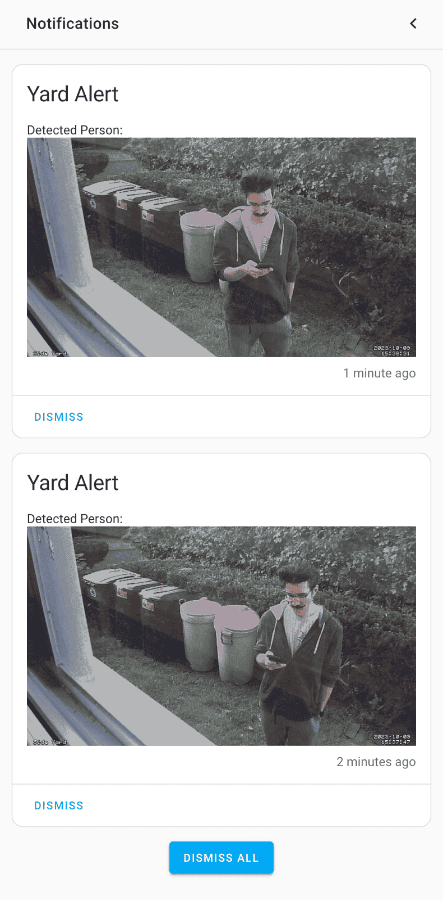

### What You’ll Build

- a machine running a local ML model
- a smart home automation for people detection notifications

### Prerequisites

- A computer with MacOS, Windows, or Linux to flash your Raspberry Pi and configure the device's components using the Viam app
- Hardware and supplies:
  - 1 - [Raspberry Pi 5](https://www.amazon.com/Raspberry-Single-2-4GHz-Quad-core-Cortex-A76/dp/B0CLV7DFD2)
    - Follow the [Raspberry Pi setup guide](https://docs.viam.com/installation/prepare/rpi-setup/) to make sure your Pi is flashed with a Viam-compatible operating system, and that you are able to SSH into it.
  - 1 - microSD card to use with your Pi
  - 1 - power supply for your Pi

### What You’ll Need

- All the hardware components listed in prerequisites.
- A Home Assistant instance with a [camera integration](https://www.home-assistant.io/integrations/#camera) and [HACS](https://hacs.xyz/docs/use/) installed
- Sign up for a free Viam account, and then [sign in](https://app.viam.com/fleet/dashboard) to the Viam app

### What You’ll Learn

- How to use a vision service in Viam
- How to install a community integration in Home Assistant
- How to configure an automation in Home Assistant

### Watch the Video

See a demonstration and overview of the integration in this video.

<!-- <video id=""></video> -->

<!-- ------------------------ -->

## Configure your machine

Duration: 3

### Create your machine

1. In [the Viam app](https://app.viam.com/fleet/dashboard) under the **LOCATIONS** tab, create a machine by typing in a name and clicking **Add machine**.
   
1. Click **View setup instructions**.
   
1. To install `viam-server` on the Raspberry Pi device that you want to use to communicate with and control your webcam, select the `Linux / Aarch64` platform for the Raspberry Pi, and leave your installation method as [`viam-agent`](https://docs.viam.com/how-tos/provision-setup/#install-viam-agent).
   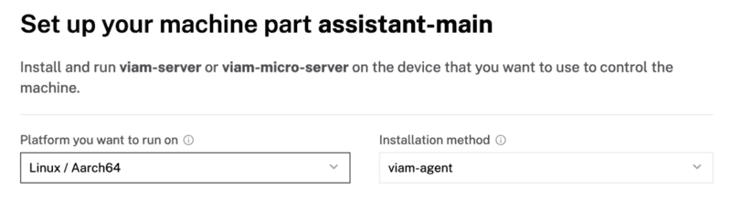
1. Use the `viam-agent` to download and install `viam-server` on your Raspberry Pi. Follow the instructions to run the command provided in the setup instructions from the SSH prompt of your Raspberry Pi.
   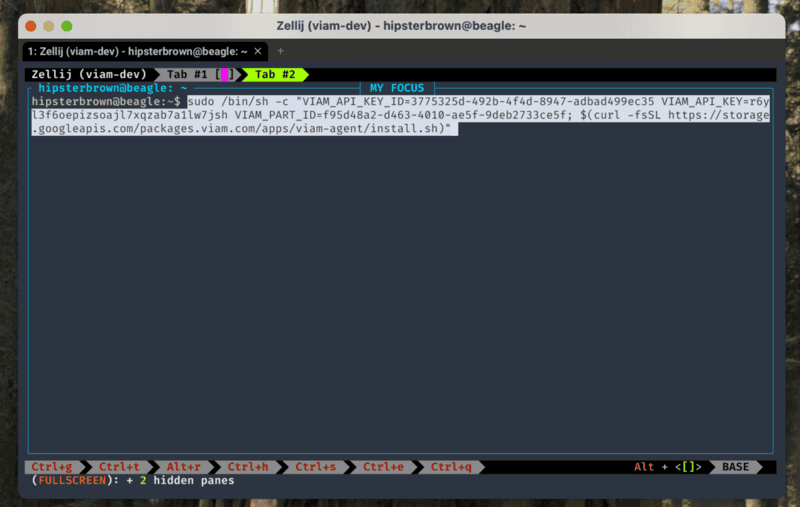
1. The setup page will indicate when the machine is successfully connected.
   

### Add an ML model service

1. In the Viam app, click the **+** icon in the left-hand menu and select **Service**, and then `ML model`.
   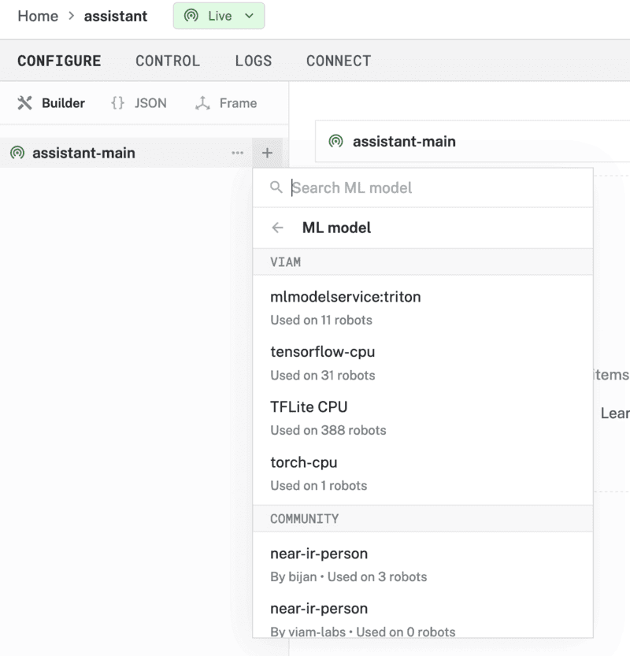
1. Search for a module called `TFLite CPU`. Then click **Add module**, and **Create** a new [ML Model service](https://docs.viam.com/services/ml/) called `mlmodel-1`. This provides the ability to run Tensorflow Lite, a.k.a [LiteRT](https://ai.google.dev/edge/litert), models on the machine.
   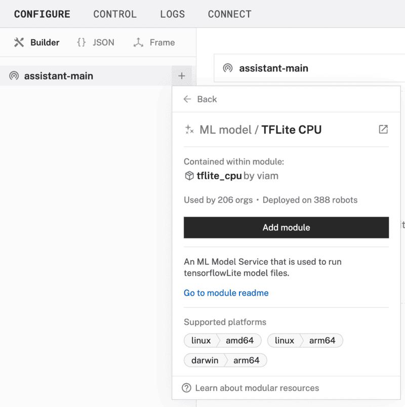
1. Notice this creates two new items in the left sidebar. The first is your new ML Model service called `mlmodel-1`, and the second is the `tflite_cpu` module from the Registry.
1. In the `mlmodel-1` panel, click "Select model" in the **Model** section, search for "COCO" under the **Registry** tab, and select the "EfficientDet-COCO" model from the list. This is a [general object detection model](https://research.google/pubs/efficientdet-scalable-and-efficient-object-detection/) that is very efficient, as the name implies, for resource-constrained devices like a Raspberry Pi.
   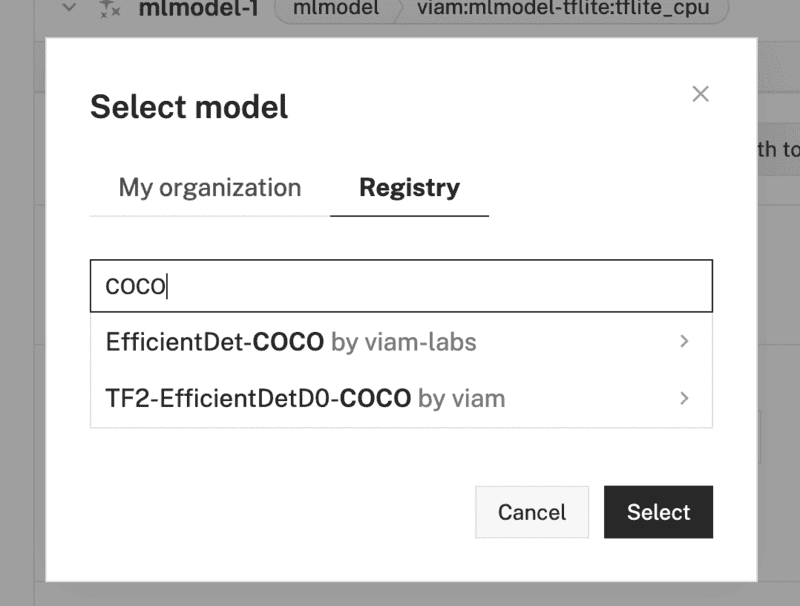
1. Click **Save** in the top right to save and apply your configuration changes.

### Add a vision service

1. In the Viam app, click the **+** icon in the left-hand menu and select **Service**, and then `vision`.
   
1. Search for a module called `mlmodel`. Then click **Add module**, and **Create** a new [Vision service](https://docs.viam.com/services/vision/) called `vision-1`.
   
1. Notice adding this service adds the vision service called `vision-1`. From the **ML Model** section of the panel, select `mlmodel-1`.
   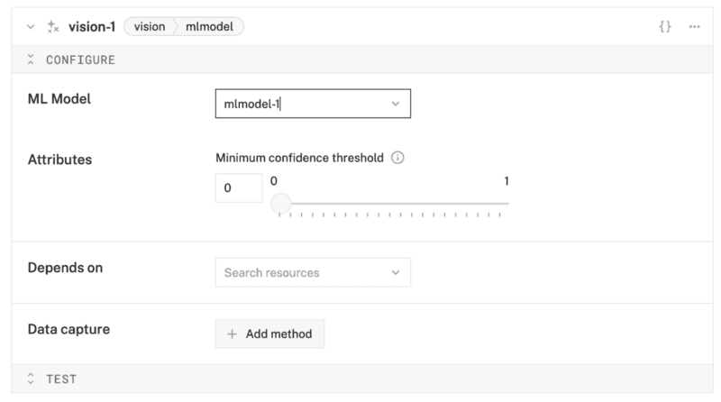
1. **Save** your changes in the top right and wait a few moments for the configuration changes to take effect.

> aside negative
> If any problems occur, check under the **LOGS** tab to see what might be going wrong.

<!-- ------------------------ -->

## Add Viam integration to Home Assistant

Duration: 5

As a community integration, Viam is available through the [Home Assistant Community Store (HACS)](https://hacs.xyz/).
After [getting started with HACS](https://hacs.xyz/docs/use/#getting-started-with-hacs), you can add the [Viam integration](https://github.com/HipsterBrown/viam-home-assistant-integration) from the store.

1. From the HACS dashboard in Home Assistant, search for Viam at the top, and select the top result.
   
1. The integration documentation will be displayed. Click on the blue "Download" button in the bottom right to install the code onto your Home Assistant device.
   
1. Once the installation is complete, go to the "Settings" page and select "Devices & services" to view the integrations dashboard.
   
1. Click on "Add Integration", search for Viam, and select the top result.
   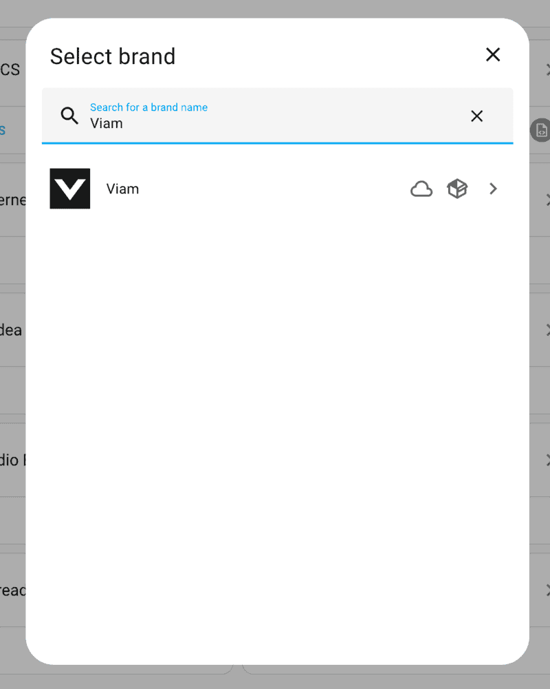
1. In the configuration form, enter the API key ID and API key for the machine you set up earlier. You can find those values under the "Connect" tab in the Viam app, in the API keys section.
   
   
1. Click "Submit" to create the connection between Home Assistant and the Viam app. Click "Finish" when the success message appears to confirm the setup is complete.
   
1. The Viam integration should now appear on your Integrations Dashboard.
   

<!-- ------------------------ -->

## Create People Detection Automation

Duration: 4

The Viam integration provides a few services that can be used in [Home Assistant automations](https://www.home-assistant.io/docs/automation/).
For this codelab, you'll use the [object detection service](https://github.com/HipsterBrown/viam-home-assistant-integration?tab=readme-ov-file#viamget_detections) to intelligently notify when people have been detected by existing cameras connected to your home.

1. In the Home Assistant app, go to the "Settings" page and select "Automations & scenes" to view the Automations Dashboard.
   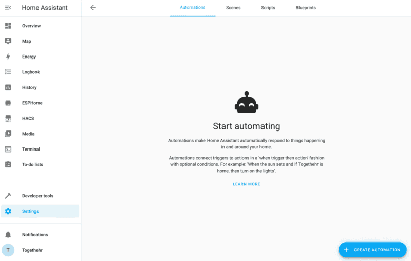
1. Click "Create Automation" and select "Create new automation" from the options in the modal.
   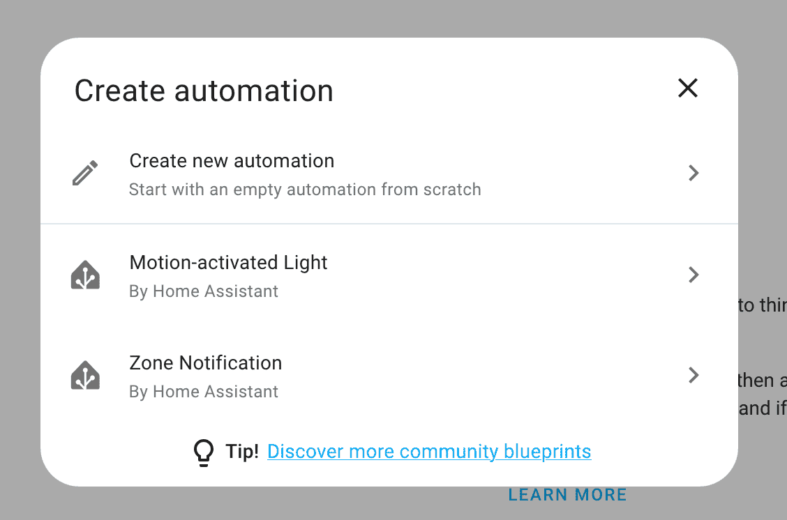
1. The "New automation" page will include sections for "When", "And if", "Then do" to configure for the workflow.
   
1. Click "+ Add Trigger" to open the selection modal, then search for "Time pattern" and select the top result.
   
1. Enter "/30" in the "Seconds" field to trigger the automation every 30 seconds. You can configure [different patterns](https://www.home-assistant.io/docs/automation/trigger/#time-pattern-trigger) if you wish to check more or less frequently.
   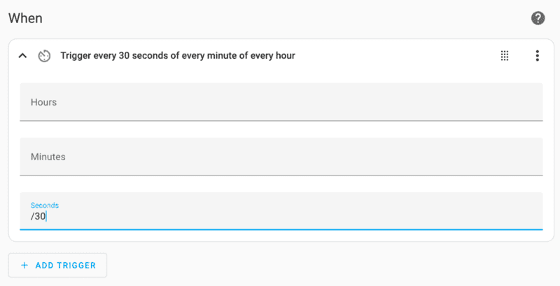
1. Click "+ Add Action" to open the selection modal, then search for "Detect object" and select the top result.
   
1. In the "Viam machine" field, select the configured machine from earlier. Enter the name of the vision service, "vision-1", in the "Detector Name" field. Check the "Camera Entity" box and select the connected camera you would like to use for this automation. Then set the "Response variable" to "people_detections".
   
1. Click "+ Add Action" to open the selection modal, then search for "Condition" and select the top result.
   
1. Select "Template" for the "Condition type" and enter the following into the "Value template" field:
   ```yaml
   { { people_detections.detections|count > 0 } }
   ```
   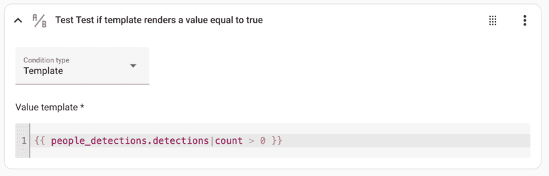
1. Click "+ Add Action" to open the selection modal, then search for "Persist" and select the top result.
   
1. Click the action menu (three vertical dots) on the new "Persistent Notifications: 'Create'" card, and select "Edit in YAML" to display the YAML editor for creating templated notifications. Replace the `data: {}` line with the following code:
   ```yaml
   data:
     title: People Alert
     message: >
       Detected {{ people_detections.detections|join(", ", "name")|default("nothing",
       true) }}: 
   ```
   This will create a notification with a list of detected people and the associated image.
   
1. Click the "Save" button in the bottom-right corner to enter a name for the automation and complete the setup.

   > aside negative
   > **Troubleshooting:**
   >
   > - Check the **Traces** page of the automation to display relevant errors.
   > - Check the "Settings" -> "System" -> "Logs" page to see more details about any errors.

<!-- ------------------------ -->

## Next Steps

Duration: 3

Congratulations, you now have automated people detection for your smart home! Building on this experience you can do the following to make it even smarter:

- [automatically collect images](https://github.com/HipsterBrown/viam-home-assistant-integration?tab=readme-ov-file#viamcapture_image) or [sensor data](https://github.com/HipsterBrown/viam-home-assistant-integration?tab=readme-ov-file#viamcapture_data) from your Home Assistant devices in Viam
- use that data to [train and deploy a custom vision model](https://docs.viam.com/how-tos/train-deploy-ml/) to detect and classify other objects besides people, or even identify specific people
- [visualize the collected sensor data](https://docs.viam.com/how-tos/sensor-data-visualize/) using tools like Grafana

### What You Learned

- How to use a vision service in Viam
- How to install a community integration in Home Assistant
- How to configure an automation in Home Assistant

### Additional Viam resources

- [Viam documentation](https://docs.viam.com/)
- [Viam how-to guides](https://docs.viam.com/how-tos/)
- [Viam Discord community](http://discord.gg/viam)
