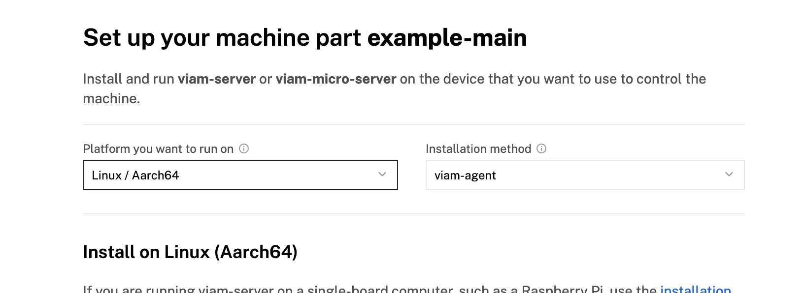
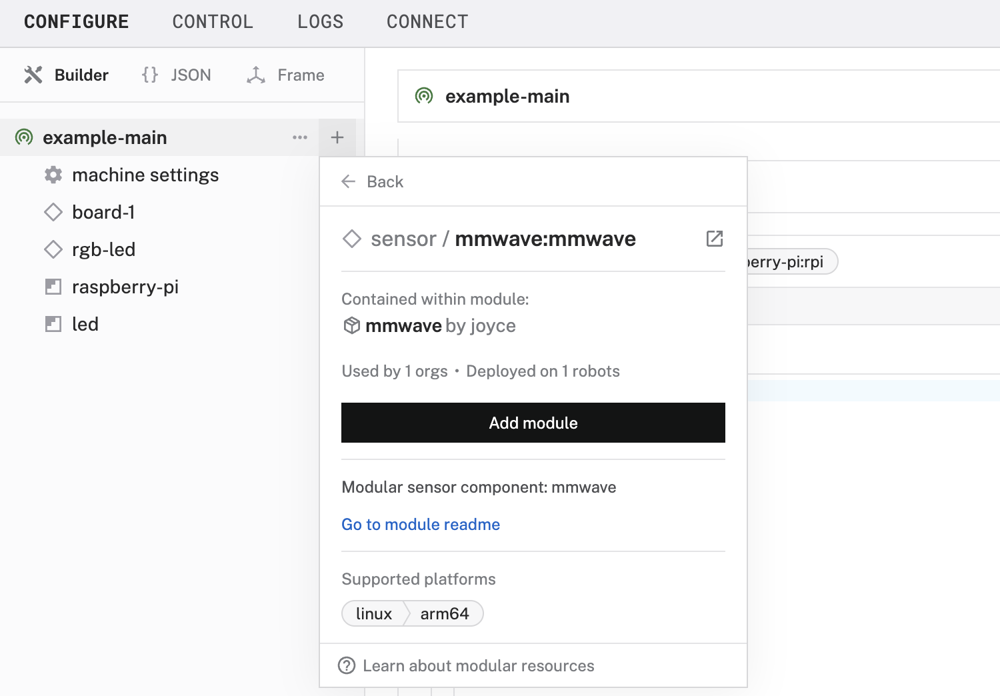

author: Joyce
id: mmwave
summary: Use an mmwave sensor to detect presence and display a visual indicator with an RGB LED
categories: Getting-Started, Developer
environments: web
status: Published
feedback link: https://github.com/viam-devrel/viamcodelabs/issues
tags: Getting Started, Developer

# Presence detector with an mmwave sensor

<!-- ------------------------ -->

## Overview

Duration: 1

[Millimeter-wave (mmWave) sensors](https://en.wikipedia.org/wiki/Mmwave_sensing) are advanced radar-based sensing devices that operate in the 30 GHz to 300 GHz frequency range. Unlike traditional motion detection technologies such as infrared (PIR) or ultrasonic sensors, mmWave sensors use radio waves to detect objects, motion, and even micro-movements (like a heartbeat) with high precision.

These sensors can distinguish between static and moving objects, detect motion at different distances, and provide real-time data about detected targets. Intelligent automation based on motion presence, rather than just movement alone, is ideal for home automation, security, and smart lighting.


### What You’ll Build

- A presence detector with a visual indicator light.


### Prerequisites

- A computer with MacOS, Windows, or Linux to flash your Raspberry Pi and configure the device's components using the Viam app
- Hardware and supplies requirements

  - 1 - [Raspberry Pi 4](https://a.co/d/fc3JUMm)
  - 1 - microSD card to use with your Pi
  - 1 - power supply for your Pi
  - 1 - [LD2410C mmwave sensor](https://a.co/d/0euTG9k)
  - 1 - [CP2102 USB 2.0 to TTL Serial Adapter](https://a.co/d/8P5ljFT)
  - 1 - [common cathode RGB LED](https://a.co/d/inuxrYr) with 3 resistors
  - 8 - jumper wires
  - 1 - breadboard
  - 1 - **optional**: solder, heat shrink tubing, and electrical tape
  - 1 - **optional** 3-D printed (or store bought) enclosures for the sensor and LED

### What You’ll Need

- All the hardware components listed in prerequisites.
- Sign up for a free Viam account, and then [sign in](https://app.viam.com/fleet/dashboard) to the Viam app

### What You’ll Learn

- How to configure and test hardware components using Viam
- How to configure and test a service using Viam
- How to use modules from the Viam registry

### Watch the Video

See a demonstration of detecting presence in this video.

<video id="vjwsI9xSlBI"></video>

<!-- ------------------------ -->

## Set up your Raspberry Pi

Duration: 5

The Raspberry Pi boots from a USB flash drive (or microSD card). You need to install Raspberry Pi OS on a USB flash drive that you will use with your Pi. For more details about alternative methods of setting up your Raspberry Pi, refer to the [Viam docs](https://docs.viam.com/installation/prepare/rpi-setup/#install-raspberry-pi-os).

### Install Raspberry Pi OS

1. Connect the USB flash drive (or microSD card) to your computer.
1. Download the [Raspberry Pi Imager](https://www.raspberrypi.com/software/) and launch it.
   
1. Click **CHOOSE DEVICE**. Select your model of Pi, which is Raspberry Pi 4.
1. Click **CHOOSE OS**. Select **Raspberry Pi OS (64-bit)** from the menu.
1. Click **CHOOSE STORAGE**. From the list of devices, select the USB flash drive you intend to use in your Raspberry Pi.
   
1. Configure your Raspberry Pi for remote access. Click **Next**. When prompted to apply OS customization settings, select **EDIT SETTINGS**.
1. Check **Set hostname** and enter the name you would like to access the Pi by in that field, for example, `test`.
1. Select the checkbox for **Set username and password** and set a username (for example, your first name) that you will use to log into the Pi. If you skip this step, the default username will be `pi` (not recommended for security reasons). And specify a password.
1. Connect your Pi to Wi-Fi so that you can run `viam-server` wirelessly. Check **Configure wireless LAN** and enter your wireless network credentials. SSID (short for Service Set Identifier) is your Wi-Fi network name, and password is the network password. Change the section `Wireless LAN country` to where your router is currently being operated.
   
1. Select the **SERVICES** tab, check **Enable SSH**, and select **Use password authentication**.
   
   > aside negative
   > Be sure that you remember the `hostname` and `username` you set, as you will need this when you SSH into your Pi.
1. **Save** your updates, and confirm `YES` to apply OS customization settings. Confirm `YES` to erase data on the USB flash drive. You may also be prompted by your operating system to enter an administrator password. After granting permissions to the Imager, it will begin writing and then verifying the Linux installation to the USB flash drive.
1. Remove the USB flash drive from your computer when the installation is complete.

### Connect with SSH

1. Place the USB flash drive into your Raspberry Pi and boot the Pi by plugging it in to an outlet. A red LED will turn on to indicate that the Pi is connected to power.
   > aside negative
   > Make sure you are using a 5V 3A USB-C power supply to power your Raspberry Pi 4. Using a power supply with inadequate amperage can lead to instability, throttling, or unexpected behavior. Additionally, while USB boot is enabled by default on newer Raspberry Pi 4 models, older versions may require a firmware update to enable it. Refer to the [Raspberry Pi documentation](https://www.raspberrypi.com/documentation/computers/raspberry-pi.html) for detailed setup instructions and compatibility.
1. Once the Pi is started, connect to it with SSH. From a command line terminal window, enter the following command. The text in <> should be replaced (including the < and > symbols themselves) with the user and hostname you configured when you set up your Pi.
   ```bash
   ssh <USERNAME>@<HOSTNAME>.local
   ```
1. If you are prompted “Are you sure you want to continue connecting?”, type “yes” and hit enter. Then, enter the password for your username. You should be greeted by a login message and a command prompt.
   
1. Update your Raspberry Pi to ensure all the latest packages are installed
   ```bash
   sudo apt update
   sudo apt upgrade
   ```

<!-- ------------------------ -->

## Set up the hardware

Duration: 5

### Add your RGB LED

1. **Review the wiring diagram**: The LED can be controlled via a GPIO pin on the Raspberry Pi. Refer to the following wiring diagram to see how to connect the Raspberry Pi to the RGB LED, using the breadboard and also resistors to control the flow of electricity.

   

   | Board | RGB LED |
   | ------ | --------- |
   | Pin 12 (GPIO 18) | Blue leg |
   | Pin 32 (GPIO 12) | Green |
   | Pin 33 (GPIO 13) | Red |
   | Pin 34 (GND) | Common |

   > aside positive
   > The website [pinout.xyz](https://pinout.xyz/) is a helpful resource with the exact layout and role of each pin for Raspberry Pi. When working with Viam, make sure to reference the physical pin numbers, and not the GPIO numbers listed on `pinout.xyz`.

1. **Review the LED orientation**: A common cathode RGB LED has four legs:

   - **Common Cathode (GND)**: The longest leg should be connected to ground.
   - **Red (R)**: Typically the leg next to the common cathode (to the left as shown below).
   - **Green (G)**: The leg on the other side of the cathode (to the right as shown below).
   - **Blue (B)**: The farthest leg from the cathode.

   

1. **Wire the RGB LED to the Raspberry Pi**: The breadboard simplifies the wiring process by providing a secure platform to connect components without soldering. Connect the longest leg of the LED (common cathode) to the ground (GND) pin (physical pin 34) on the Raspberry Pi. Then, connect the red, green, and blue legs of the LED to resistors (68Ω for red, 10Ω for green, and 10Ω for blue). These resistors should then be connected to pins 33, 32, and 12, respectively. Double-check connections to ensure correct polarity and avoid miswiring.

   > aside positive
   > Your LED may come with resistors of the recommended resistance. If the Ohm level is too high, then no power will get to the LED. You can figure out which ones you're using with [this handy tool](https://www.digikey.com/en/resources/conversion-calculators/conversion-calculator-resistor-color-code).

   

### Add your LD2410 mmwave sensor

1. **Connect the CP2102 serial adapter**: Plug the adapter into the USB-A port of the Raspberry Pi.
1. **Wire the LD2410 sensor to the adapter**: Refer to the following wiring diagram to see how to connect the adapter to the LD2410 mmwave sensor. Make sure the transmitting pin (TX) on the adapter is connected to the receiving pin (RX) on the sensor, and vice versa. Refer to the [sensor product specifications](https://www.hlktech.net/index.php?id=1095) for additional details.

   | CP2102 | LD2410 |
   | ------ | --------- |
   | Transmitting (TXO) | Receiving (RX) |
   | Receiving (RXI) | Transmitting (TX) |
   | Power (+5V) | VCC |
   | Ground (GND) | GND |


   


Now that you have physically connected the hardware components, let's configure the software in the next section.

---

## Configure your machine and peripherals

Duration: 3

### Configure your machine

1. In [the Viam app](https://app.viam.com/fleet/dashboard) under the **LOCATIONS** tab, create a machine by typing in a name and clicking **Add machine**.
   
1. Click **View setup instructions**.
   
1. To install `viam-server` on the Raspberry Pi device that you want to use to communicate with and control your webcam, select the `Linux / Aarch64` platform for the Raspberry Pi, and leave your installation method as [`viam-agent`](https://docs.viam.com/how-tos/provision-setup/#install-viam-agent).
   
1. Use the `viam-agent` to download and install `viam-server` on your Raspberry Pi. Follow the instructions to run the command provided in the setup instructions from the SSH prompt of your Raspberry Pi.
   
1. The setup page will indicate when the machine is successfully connected.
   

### Configure your Raspberry Pi board

To access the GPIO pins, let's add our Raspberry Pi board to our machine in the Viam app.

1. In [the Viam app](https://app.viam.com/fleet/locations), find the **CONFIGURE** tab.
1. Click the **+** icon in the left-hand menu and select **Component**.
   
1. Select `board`, and find the `raspberry-pi:rpi4` module. This adds the module for working with the Raspberry Pi 4's GPIO pins. Leave the default name `board-1` for now.
1. Notice adding this module adds the board hardware component called `board-1`. The collapsible card on the right corresponds to the part listed in the left sidebar.
   
1. Click **Save** in the top right to save and apply your configuration changes.
1. Expand the **TEST** section of the panel to experiment with writing to physical pin `12`. For example, try setting a `High` signal.
   
   > aside negative
   > Since we are using an RGB LED, you can provide a [PWM (Pulse Width Modulation)](https://en.wikipedia.org/wiki/Pulse-width_modulation) signal to control the brightness and mix colors by adjusting the `duty cycle` and `frequency` of each color channel (Red, Green, and Blue). A constant high signal would result in the LED staying at full brightness without any dimming effect, while PWM allows smooth transitions and precise color blending.
1. Set the signal to `Low` (for each pin previously set to `High`) to turn off the LED.

> aside negative
> **TROUBLESHOOTING**: Double check the wiring on your LED component. Also check under the **LOGS** tab to see what might be going wrong.

You can manually and programmatically use the GPIO pins of the [`board`](https://docs.viam.com/components/board/) component to send PWM signals to control your LED. However, to streamline the following steps, let's use a prebuilt module from the Viam registry in the next section.

### Configure your RGB LED

1. In [the Viam app](https://app.viam.com/fleet/locations) under the **CONFIGURE** tab, click the **+** icon in the left-hand menu and select **Component**.
1. Select `generic`, and find the `led:rgbled` module. This adds the module for controlling your RGB LED. Name the component `rgb-led`.
   
1. Name the component `rgb-led`.
   
1. In the new `rgb-led` panel, configure your component by adding the following attributes in the **CONFIGURE** field. This tells your LED component to use specific pins on a specific board (called `board-1` in the Viam app).
   ```json
   {
     "board": "board-1",
     "red_pin": "33",
     "green_pin": "32",
     "blue_pin": "12"
   }
   ```
   
1. Click **Save** to apply your configuration changes. This may take a moment.
1. Since we are using a generic component, let's test it out under the **CONTROL** tab. Find your `rgb-led` component on this page. Expand the **DO COMMAND** field, input the following code, and hit **Execute**.
   ```json
   {
     "control_rgb_led": {
       "red": 0.8,
       "green": 0.5,
       "blue": 0.2,
       "duration": 2.0
     }
   }
   ```
   
   You are executing a [`DoCommand`](https://docs.viam.com/components/generic/#api) on a generic component that has been predefined to accept parameters within a `control_rgb_led` command, such as `red`, `green`, `blue`, and `duration`. With these values, red will be at 80% brightness, green at 50% brightness, blue at 20% brightness - displaying a pulsating mixed color for a total duration of 2 seconds.

### Configure your mmwave sensor

1. In [the Viam app](https://app.viam.com/fleet/locations) under the **CONFIGURE** tab, click the **+** icon in the left-hand menu and select **Component**.
1. Select `sensor`, and find the `mmwave:mmwave` module. This adds the module for getting readings from your LD2410C mmwave sensor.
   
1. Name the component `mmwave-sensor`.
   
1. Click **Save** to apply your configuration changes. This may take a moment.
1. Expand the **TEST** section to view the readings detected by the mmwave sensor.
   

> aside negative
> **TROUBLESHOOTING**: Double check the wiring on your sensor component. Also check under the **LOGS** tab to see what might be going wrong.

<!-- ------------------------ -->

## Synchronize the LED with sensor readings

Duration: 3

Now that we've connected and configured both the RGB LED and the mmWave sensor, let's program the LED to change color dynamically based on the sensor's detected states.

We've already learned how to use a prebuilt Viam module to work with hardware components. In the next section, we'll set up a presence detection service using a prebuilt Viam module that contains the control code for working with the hardware that we've already configured.

### Configure the presence detection service

1. In [the Viam app](https://app.viam.com/fleet/locations) under the **CONFIGURE** tab, click the **+** icon in the left-hand menu and select **Service**.
1. Select `generic`, and find the `presence-detector:mmwave-rgbled` module. This adds the module for controlling the LED based on detected presence.
   
1. Name the service `presence-detector`.
   
1. In the new `presence-detector` panel, configure your service by adding the following attributes in the **CONFIGURE** field. This tells your presence detector service to use specific components within your Viam machine (identified by component names in the Viam app).
   ```json
   {
     "board": "board-1",
     "rgb_led": "rgb-led",
     "sensor": "mmwave-sensor"
   }
   ```
   
1. Click **Save** to apply your configuration changes. This may take a moment. The LED will display a ripple effect when the program begins.
1. Once the program begins, the LED should display the following colors according to the state detected by the sensor. You can view the logs under the **LOGS** tab for more details about what's happening behind the scenes, and the detected states as they correspond to the LED.
   


<!-- ------------------------ -->

## Finishing touches

Duration: 3

Now that your presence detector is working, it's time to tidy up our project so it's not a loose jumble of wires and parts.

  

### Provide enclosures

1. **Assemble an enclosure for the Pi**: 3D print (or buy) an enclosure for your Raspberry Pi. I found [an existing design that I liked](https://makerworld.com/en/models/62316#profileId-226178) to fit a Raspberry Pi 4 Model B that provides access to the GPIO pins. You can additionally modify an existing design to include a built-in mount for your sensor and LED.
1. **Assemble an mmwave sensor enclosure**: I found [an existing design that I liked](https://www.printables.com/model/462054-ld2410c-case-d1_miniesp32_d1_mini). Since the design had enough space to accommodate wires, I simply switched from female-to-male to female-to-female jumpers. You could also solder the connections if you wish. The enclosure includes a slot to securely slide the mmWave sensor into place, ensuring it is oriented correctly for detecting motion and presence.
   
1. **Assemble an LED display**: I found [an existing design that I liked](https://www.printables.com/model/234231-usb-led-minecraft-torchnightlight) to contain the soldered LED and wires, and also function as a lamp shade to illuminate more surface area.
   
   > aside negative
   > **Stuffed Mushroom**: In this other codelab [to control an RGB LED](https://codelabs.viam.com/guide/rgbled/index.html?index=..%2F..index#4), I used [this design for a 3D-printed mushroom](https://makerworld.com/en/models/95343?from=search#profileId-101704), along with solder, heat shrink tubing, and electrical tape to bundle everything together.
1. **Position the sensor enclosure**: If you're using presence detection for smart lighting, consider mounting the sensor in a case on the wall, ceiling, or a desktop enclosure. Position the sensor to best fit your automation needs. For example, if you want a light to turn on when someone enters a room, place the sensor above a doorway or in clear line of sight of the entrance for optimal detection.
   

### Customize the detection lights

1. **Configure colors**: The [`presence-detector`](https://github.com/loopDelicious/viam-control-mmwave-led) module accepts optional parameters to change the color of the lights to your liking. Update the configuration in the Viam app, by adding a `color_attributes` property, formatted like the following:
   ```json
   {
     "board": "board-1",
     "rgb_led": "rgb-led",
     "sensor": "mmwave-sensor",
     "color_attributes": {
       "no_target": {
         "red": 0.1,
         "green": 0.1,
         "blue": 0.8
       },
       "moving_target": {
         "red": 1,
         "green": 0.5,
         "blue": 0
       },
       "static_target": {
         "red": 0,
         "green": 1,
         "blue": 0.5
       },
       "moving_and_static_targets": {
         "red": 1,
         "green": 0.2,
         "blue": 1
       }
     }
   }
   ```
1. **Use a different module**: If you want to further customize the controller's logic, such as turning lights on when you enter a room and off when you leave, you can use a prebuilt module [like this one](https://github.com/loopDelicious/viam-control-mmwave-kasa), which works with a TP-Link Kasa smart plug. Alternatively, you can replace the `presence-detector:mmwave-rgbled` module by [creating your own custom module](https://docs.viam.com/operate/get-started/other-hardware/hello-world-module/)

<!-- ------------------------ -->

## Next Steps

Duration: 1

### What you learned

- How to configure and test hardware components using Viam
- How to configure and test a service using Viam
- How to use modules from the Viam registry


### Advanced scenarios for this presence detector

At this point, you have configured and tested your presence detector and have a helpful visual indicator light. There are more possibilities to explore to enhance this project.

- **Alternative sensors**: The LD2410C is only one type of mmwave sensor. Other mmwave sensors are designed for fall detection, sleep monitoring, or expansive exterior spaces.
- **Alternative actuation**: Incorporate more actuation, such as [triggering a piezo buzzer](https://codelabs.viam.com/guide/piezo/index.html?index=..%2F..index#0) as an alarm, [triggering smart switches](https://github.com/loopDelicious/viam-control-mmwave-kasa), or providing access to a secure space by removing a barricade.
- **Custom logic**: You can customize the logic of the controller, for example to require additional conditions prior to execution, by [creating your own module](https://docs.viam.com/operate/get-started/other-hardware/hello-world-module/) using [the original module repository](https://github.com/loopDelicious/viam-control-mmwave-led?tab=readme-ov-file) as a starting point for your code. The original module uses [this underlying Python library](https://www.piwheels.org/project/ld2410/), but there are others to choose from.
- **Scale up using affordable boards**: Manage a fleet of mmwave sensors throughout your home to automatically turn on (and turn off) lights throughout your home. To do this more cost effectively, you can migrate the project to an alternative board, such as an ESP32 or Raspberry Pi Zero W.

In addition to the project ideas mentioned above, consider other ways to continue your journey with Viam.

- Browse other modules in [the Viam registry](https://app.viam.com/registry) similar to the [prebuilt module for the mmwave sensor](https://app.viam.com/module/joyce/mmwave).
- Learn [how to create your own module](https://docs.viam.com/how-tos/hello-world-module/) with custom functionality for this and other components and services.

### Real-world applications and projects for mmwave sensors

Providing high precision and reliability in a variety of environmental conditions, mmWave sensors are widely-used in industrial and home automation, safety, and real-time decision-making across multiple domains.

- **Smart Home & Security**: mmWave sensors enhance motion detection and presence sensing in security systems, [lighting automation](https://github.com/loopDelicious/viam-control-mmwave-kasa), and fall detection for elderly care—working accurately even through walls or furniture.
  
- **Automotive & Transportation**: Used in collision avoidance and blind-spot detection, mmWave sensors improve safety and efficiency in modern vehicles.
- **Healthcare & Medical Monitoring**: These sensors enable contactless vital sign monitoring, tracking heart rate, respiration, and sleep patterns without requiring wearables.
- **Industrial & Robotics**: In warehouses and manufacturing, mmWave sensors assist in object tracking, people counting, and automation workflows, helping robots navigate and interact safely with humans.

### Related Viam resources

- [Viam documentation](https://docs.viam.com/)
- Other [Viam codelabs](https://codelabs.viam.com/)
- [Viam Discord community](http://discord.gg/viam)
