author: HipsterBrown
id: monitoring-automation-elastic
summary: Monitoring and automate the physical world using sensor data from machines with Elasticsearch and Kibana
categories: Getting-Started, Developer
environments: web
status: Published 
feedback link: https://github.com/viam-labs/viamcodelabs/issues
tags: Getting Started, Developer, Data

# Use Sensor Data with Elastic, Kibana, and Webhooks
<!-- ------------------------ -->
## Overview 
Duration: 1

Gathering sensor data starts out simple but over time it can be overwhelming to sift through all that information, especially as more and more sensors come online. If you've worked on a comprehensive web service in the past, you might already know about [Elasticsearch](https://www.elastic.co/elasticsearch) and the rest of the [ELK stack](https://www.elastic.co/elastic-stack) for indexing and analyzing data from any source, including sensors connected to Viam machines!
One neat feature of the ELK stack is configurable [alerting rules](https://www.elastic.co/guide/en/kibana/current/alerting-getting-started.html) and [actions](https://www.elastic.co/guide/en/kibana/current/alerting-getting-started.html#alerting-concepts-actions) that can be used to automate notifications or even affect the physical world using one of Viam's SDKs.

In this codelab, you'll learn how to continually index sensor data from Viam into Elasticsearch and display an alert in the real world. 

### Prerequisites
- A computer with MacOS, Windows, or Linux to flash your Raspberry Pi and configure the device's components using the Viam app
- Hardware and supplies:
  - 1 - [Raspberry Pi 5](https://www.amazon.com/Raspberry-Single-2-4GHz-Quad-core-Cortex-A76/dp/B0CLV7DFD2)
    - Follow the [Raspberry Pi setup guide](https://docs.viam.com/installation/prepare/rpi-setup/) to make sure your Pi is flashed with a Viam-compatible operating system, and that you are able to SSH into it.
  - 1 microSD card to use with your Pi
  - 1 power supply for your Pi
  - 1 [MPU6050 GY-521 sensor module](https://www.amazon.com/Pre-Soldered-Accelerometer-Raspberry-Compatible-Arduino/dp/B0BMY15TC4)
  - 1 [LED of any color](https://amzn.to/2Ex2v5q)
  - 1 [solderless breadboard](https://www.amazon.com/dp/B0135IQ0ZC)
  - 6 [jumper wires](https://www.amazon.com/dp/B077X99KX1) to connect the sensor to the Pi

### What You’ll Need 
- All the hardware components listed in prerequisites.
- [Python3](https://www.python.org/downloads/) installed on your computer
- [VS Code](https://code.visualstudio.com/download) installed, or another similar code editor of your choice.
- A [zrok](https://zrok.io/) account and [enabled environment](https://docs.zrok.io/docs/getting-started#enabling-your-zrok-environment).
- An [Elastic stack deployment](https://www.elastic.co/guide/en/cloud/current/ec-create-deployment.html)
- Sign up for a free Viam account, and then [sign in](https://app.viam.com/fleet/dashboard) to the Viam app


### What You’ll Learn 
- how to wire a movement sensor and LED to a Raspberry Pi
- how to capture sensor data in Viam
- how to use webhooks as an [ETL](https://en.wikipedia.org/wiki/Extract,_transform,_load) process between Viam and Elastic
- how to use webhooks to blink an LED based on an Elastic alert

### What You’ll Build 
- a production-ready sensor data monitoring and automation system built around Viam and Elastic

<!-- ------------------------ -->
## Set up your Raspberry Pi
Duration: 6

The Raspberry Pi boots from a microSD card. You need to install Raspberry Pi OS on an SD card that you will use with your Pi. For more details about alternative methods of setting up your Raspberry Pi, refer to the [Viam docs](https://docs.viam.com/installation/prepare/rpi-setup/#install-raspberry-pi-os).

### Install Raspberry Pi OS

1. Connect the microSD card to your computer.
1. Download the [Raspberry Pi Imager](https://www.raspberrypi.com/software/) and launch it.
   
1. Click **CHOOSE DEVICE**. Select your model of Pi, which is the Raspberry Pi 5.
1. Click **CHOOSE OS**. Select **Raspberry Pi OS (other)** then **Raspberry Pi OS Lite (64-bit)** from the menu.
1. Click **CHOOSE STORAGE**. From the list of devices, select the SD card you intend to use in your Raspberry Pi.
   
1. Configure your Raspberry Pi for remote access. Click **Next**. When prompted to apply OS customization settings, select **EDIT SETTINGS**.
1. Check **Set hostname** and enter the name you would like to access the Pi by in that field, for example, `monitor`.
1. Select the checkbox for **Set username and password** and set a username (for example, your first name) that you will use to log into the Pi. If you skip this step, the default username will be `pi` (not recommended for security reasons). And specify a password.
1. Connect your Pi to Wi-Fi so that you can run `viam-server` wirelessly. Check **Configure wireless LAN** and enter your wireless network credentials. SSID (short for Service Set Identifier) is your Wi-Fi network name, and password is the network password. Change the section `Wireless LAN country` to where your router is currently being operated.
   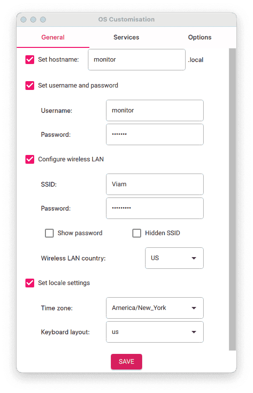
1. Select the **SERVICES** tab, check **Enable SSH**, and select **Use password authentication**.
   
   > aside negative
   > Be sure that you remember the `hostname` and `username` you set, as you will need this when you SSH into your Pi.
1. **Save** your updates, and confirm `YES` to apply OS customization settings. Confirm `YES` to erase data on the SD card. You may also be prompted by your operating system to enter an administrator password. After granting permissions to the Imager, it will begin writing and then verifying the Linux installation to the SD card.
1. Remove the SD card from your computer when the installation is complete.

### Connect with SSH

1. Place the SD card into your Raspberry Pi and boot the Pi by plugging it in to an outlet. A red LED will turn on to indicate that the Pi is connected to power.
1. Once the Pi is started, connect to it with SSH. From a command line terminal window, enter the following command. The text in <> should be replaced (including the < and > symbols themselves) with the user and hostname you configured when you set up your Pi.
   ```bash
   ssh <USERNAME>@<HOSTNAME>.local
   ```
1. If you are prompted “Are you sure you want to continue connecting?”, type “yes” and hit enter. Then, enter the password for your username. You should be greeted by a login message and a command prompt.
1. Update your Raspberry Pi to ensure all the latest packages are installed
   ```bash
   sudo apt update
   sudo apt upgrade
   ```

### Enable communication protocols

1. Launch the Pi configuration tool by running the following command
   ```bash
   sudo raspi-config
   ```
1. Use your keyboard to select “Interface Options”, and press return.
   
1. [Enable the relevant protocols](https://docs.viam.com/installation/prepare/rpi-setup/#enable-communication-protocols) to support our hardware. Since you are using a sensor that communicates over I<sup>2</sup>C, enable **I2C**.
   
1. Confirm the options to enable the I2C interface. And reboot the Pi when you're finished.
   ```bash
   sudo reboot
   ```


<!-- ------------------------ -->
## Wire your components
Duration: 5


### Movement sensor

The MPU6050 movement sensor measures angular velocity (X,Y, and Z axis), linear acceleration (X,Y, and Z axis), and ambient temperature (Celsius), all from a single component. This will give you plenty of data work with when integrating with Elastic.
It communicates over [I<sup>2</sup>C](https://en.wikipedia.org/wiki/I%C2%B2C) using 1 wire for data, 1 for the clock to keep messages in sync, 1 for power, and 1 for ground.


> aside positive
> The website [pinout.xyz](https://pinout.xyz/) is a helpful resource with the exact layout and role of each pin for Raspberry Pi.

Refer to the following wiring diagram to connect the Raspberry Pi to the MPU6050 movement sensor component.

- Pin 1 (3V) to VCC (Power)
- Pin 3 (SDA) to SDA (Data)
- Pin 5 (SCL) to SCL (Clock)
- Pin 6 (Ground) to GND (Ground)

### LED

The LED will be used to display the alert from the Elastic rule notification. It needs a wire to a generial purpose input/ouput (GPIO) pin and a wire to ground to toggle it on and off.

Refer to the following wiring diagram to connect the Raspberry Pi to the LED.

- Pin 9 (Ground) to the shorter leg on the LED
- Pin 11 (GPIO 17) to the longer led on the LED

### Powering the Pi

To power the Raspberry Pi, you can use the USB cord from earlier to continue providing power from your computer, or use a separate USB power supply.

> aside negative
> Make sure to use an appropriate 5V power supply to run the Raspberry Pi, so you don't damage the device.

<!-- ------------------------ -->
## Set up viam-server
Duration: 5

### Create your machine

1. In [the Viam app](https://app.viam.com/fleet/dashboard) under the **LOCATIONS** tab, create a machine by typing in a name and clicking **Add machine**.
   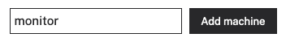
1. Click **View setup instructions**.
   
1. To install `viam-server` on the Raspberry Pi device that you want to use to communicate with and control your webcam, select the `Linux / Aarch64` platform for the Raspberry Pi, and leave your installation method as [`viam-agent`](https://docs.viam.com/how-tos/provision-setup/#install-viam-agent).
   
1. Use the `viam-agent` to download and install `viam-server` on your Raspberry Pi. Follow the instructions to run the command provided in the setup instructions from the SSH prompt of your Raspberry Pi.
   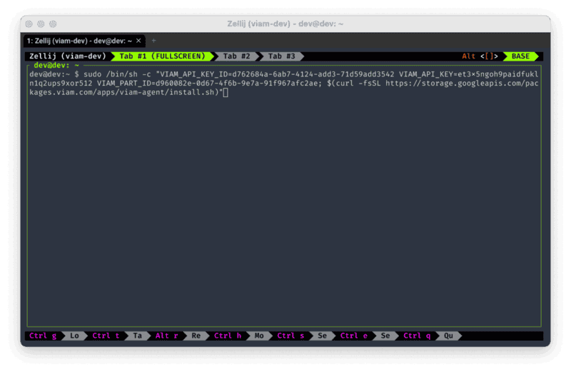
1. The setup page will indicate when the machine is successfully connected.
   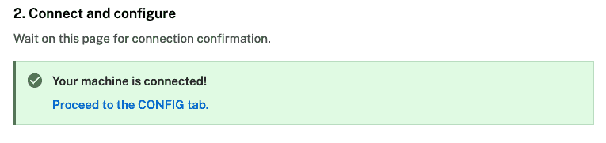

<!-- ------------------------ -->
## Configure your machine
Duration: 5

### Add your Raspberry Pi

1. In [the Viam app](https://app.viam.com/fleet/locations), find the **CONFIGURE** tab. It's time to configure your hardware.
1. Click the **+** icon in the left-hand menu and select **Component**.
   
1. Select `board`, and find the `pi5` module. This adds the module for working with the Raspberry Pi 5's GPIO pins. Leave the default name `board-1` for now.
   
1. Notice adding this module adds the board hardware component called `board-1`. The collapsible card on the right corresponds to the part listed in the left sidebar.
   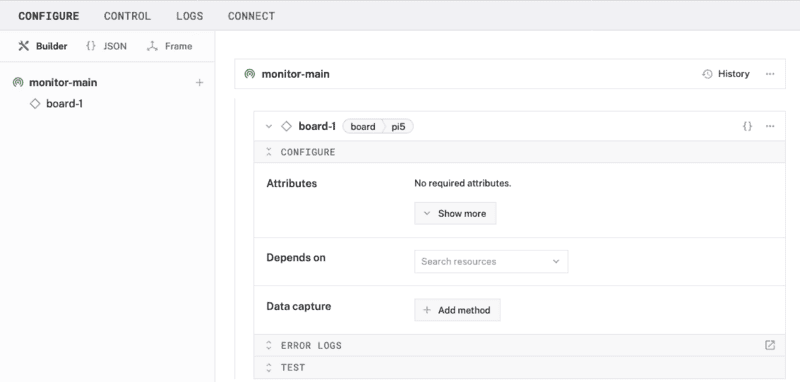
1. Click **Save** in the top right to save and apply your configuration changes.

### Add your movement sensor

1. In [the Viam app](https://app.viam.com/fleet/locations), click the **+** icon and select **Component**. Select `movement sensor`, find the `gyro-mpu6050` module, and click **Add module**. This module provides the movement sensor model that supports the specific hardware we are using for this tutorial. Leave the default name `movement_sensor-1` for now.
   
1. Notice adding this module adds the sensor hardware component called `movement_sensor-1`.
   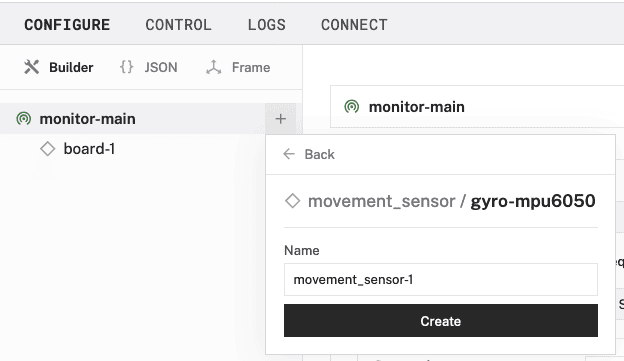
1. In the `movement_sensor-1` panel, fill in the "i2c_bus" field under the **Attributes** section with the number "1"
   
1. **Save** your updates.

### Add the data manager

1. In the Viam app, click the **+** icon in the left-hand menu and select **Service**, and then `data management`.
   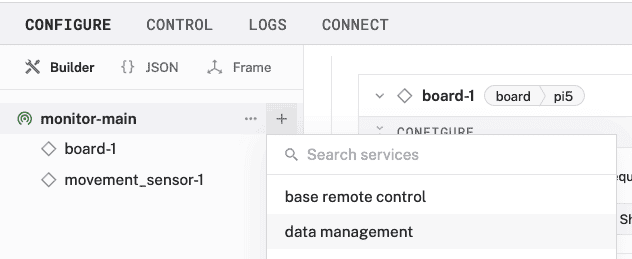
1. **Create** a new [Data Management service](https://docs.viam.com/services/data/) called `data_manager-1`.
   
1. Notice adding this service adds the data manager service called `data_manager-1`. It will default to the "Capturing" and "Syncing" toggles as enabled, leave them that way.
   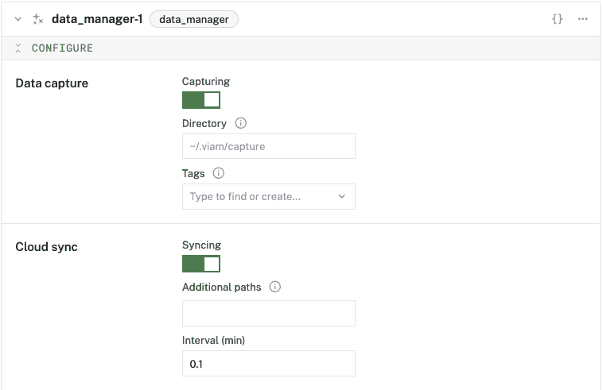
1. **Save** your updates.

### Capture movement data

1. In the `movement_sensor-1` panel, click the "+ Add method" button under the **Data capture** section.
   
1. For the "Method" dropdown, select "Readings", enter "0.5" in the "Frequency (hz)" field.
1. Make sure the data capture toggle is "On".
   
1. **Save** your updates.

> aside negative
> If any problems occur, check under the **LOGS** tab to see what might be going wrong.

<!-- ------------------------ -->
## Create an index in Elasticsearch
Duration: 5

This step assumes some knowledge of the Elastic console used to manage Elasticsearch, Kibana, and other services provided by the platform.

1. In the Elastic app, navigate to the **Search** -> **Content** dashboard, which should default to displaying Elasticsearch indices. Click the "+ Create a new index" button.
1. Enter a name for the index, like "movement-data", under the "Index name" field. Keep the "Language analyzer" as "Universal".
1. Click "Create index" to complete the creation of the index.
   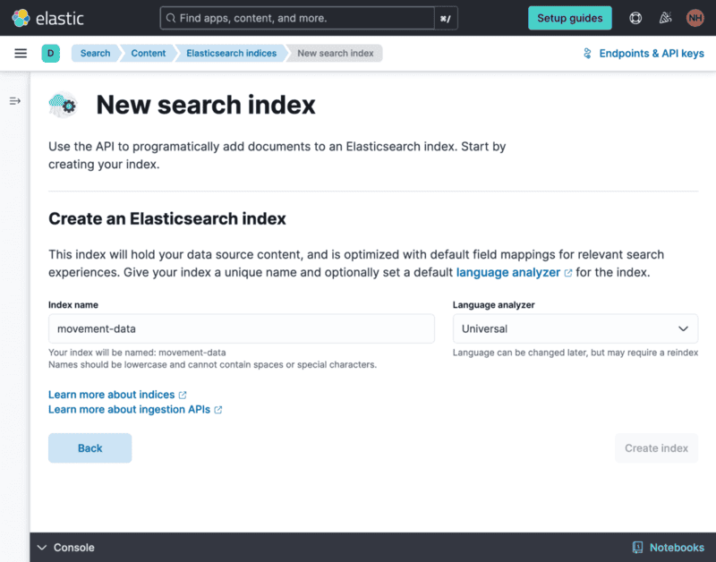

### Generate an API key 

On the **Overview** tab of the newly created index, there are instructions for getting start with the Elastic API.

1. Scroll down to the **Generate an API key** section of the page. Click "+ New".
   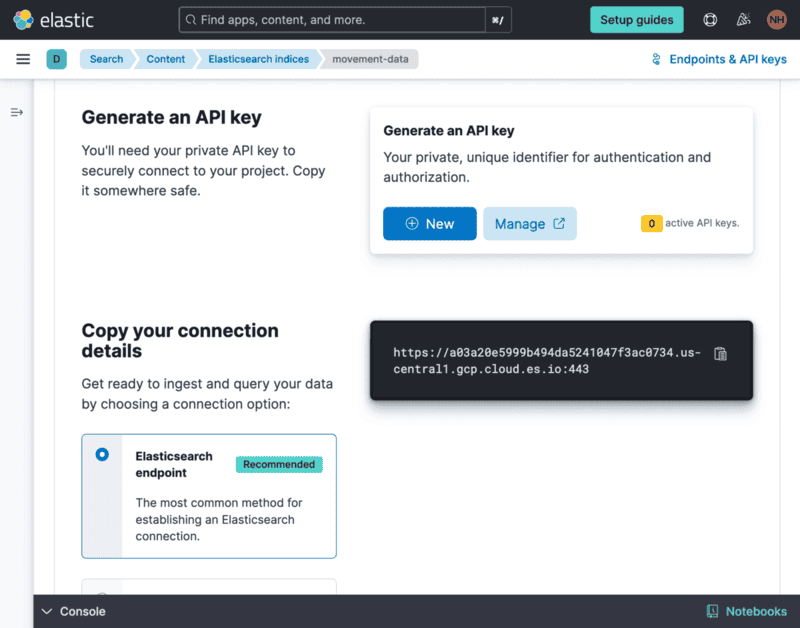
1. Name your API key "viam-data-ingest" and click "+ Generate API key".
   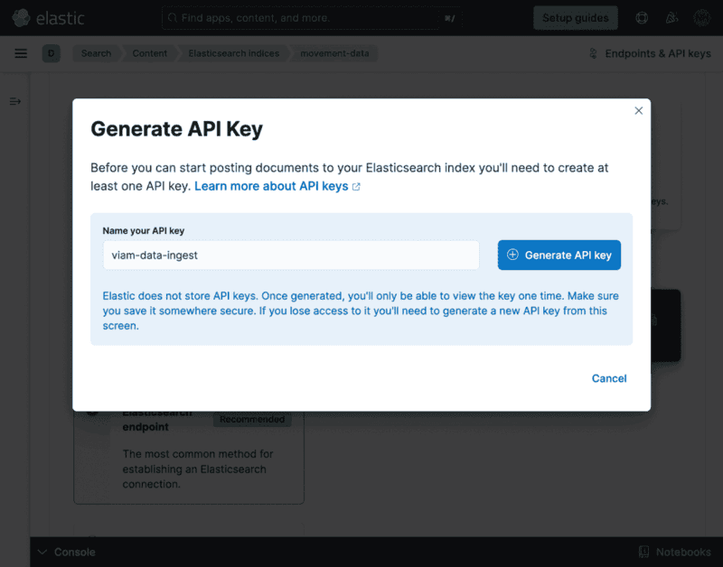
1. Copy or download the generated API key and store it in a secure place, like a password or secrets manager, for use in the next section. Click "Cancel" to close the modal.
   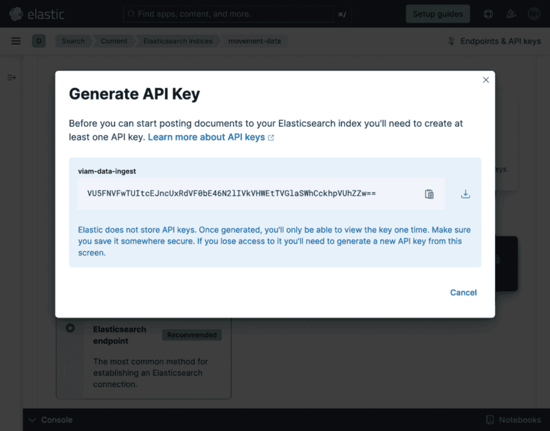
1. Back on the index overview page, scroll to **Copy your connection details** and copy the endpoint URL displayed to the right for use in the next section.
   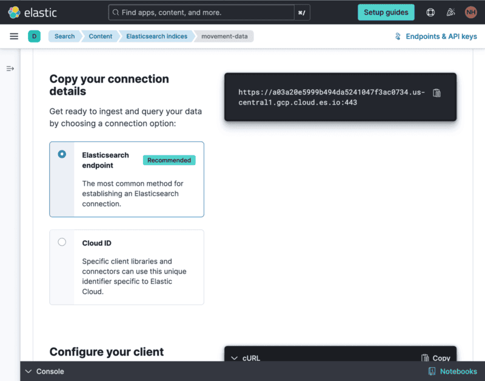


<!-- ------------------------ -->
## Sync data with a webhook
Duration: 8

To continually update the Elasticsearch index with sensor data, we're going to create a [serverless function](https://en.wikipedia.org/wiki/Function_as_a_service) to be used as a [trigger](https://docs.viam.com/configure/triggers/) whenever new data is synced from the machine.

The full example code is in the [project Github repository](https://github.com/viam-devrel/physical-world-monitoring).

### Create a function

The function is authored in Python using the [Functions Framework](https://github.com/GoogleCloudPlatform/functions-framework-python), which will make it easy to run locally and deploy to [Google Cloud Functions](https://cloud.google.com/functions/) when you're ready.

1. In your terminal, [clone the repository to your local development environment](https://docs.github.com/en/repositories/creating-and-managing-repositories/cloning-a-repository#cloning-a-repository): `git clone https://github.com/viam-devrel/physical-world-monitoring.git`
1. Change directories into the newly-cloned project: `cd physical-world-monitoring`
1. [Install the uv Python project manager](https://docs.astral.sh/uv/getting-started/installation/)
   On macOS and Linux
   ```console
   curl -LsSf https://astral.sh/uv/install.sh | sh
   ```
   On Windows
   ```console
   powershell -c "irm https://astral.sh/uv/install.ps1 | iex"
   ```
1. Install the project dependencies.
   ```console
   uv pip install -r pyproject.toml
   ```
1. Make a copy of the `.env.example` file called `.env` and fill out the necessary environment variables for the function. Set the `ELASTIC_API_KEY_ID` to "viam-data-ingest" and set the other variables to their respective values from the Elasticsearch index configuration earlier.
   ```env
   ELASTIC_API_KEY=""
   ELASTIC_API_KEY_ID=""
   ELASTIC_CONNECTION_ENDPOINT=""
   ```
1. Run the function server locally:
   ```console
   uv run functions-framework --source ./cloud-functions/ingest-sensor-data/main.py --target ingest_data --debug
   ```
   This will start a Flask Python server at [http://localhost:8080](http://localhost:8080).

### Expose the function to the public Internet

To test out the function without going through the process of deploying to a production cloud service, we will create a tunnel from the public Internet to the local server using [zrok](https://zrok.io/).
This step assumes you already have `zrok` installed and your [environment enabled](https://docs.zrok.io/docs/getting-started#enabling-your-zrok-environment) to start sharing the local server.

1. In a new terminal window or tab, run the command to create a public proxy:
   ```console
   zrok share public localhost:8080
   ```
1. The public URL will be displayed along with any request logs that come in when the webhook is triggered.
   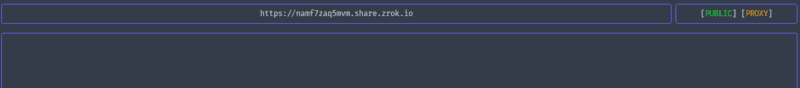

### Configure a trigger

The data sync [trigger](https://docs.viam.com/configure/triggers/) will send a request to the webhook whenever data from the sensor is synced to Viam Data in the cloud. That request will include that new data in the body.

1. In the Viam app, click the **+** icon in the left-hand menu and select **Trigger**.
   
1. Keep the name as `trigger-1` and click "Create".
   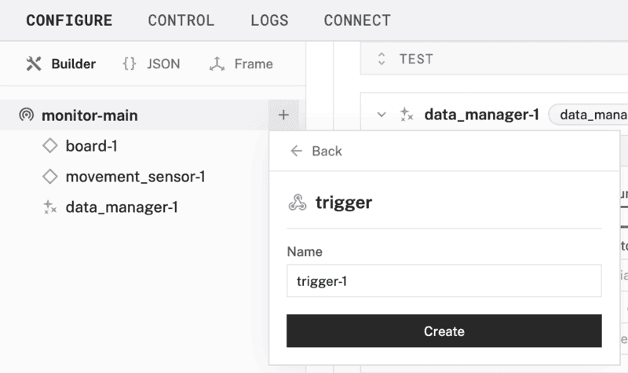
1. Notice adding this module adds a new panel called `trigger-1`.
   
1. In the **Event** section of the panel, select "Data has been synced to the cloud" as the Type and "Tabular (sensor)" from the list of Data Types.
1. In the **Webhooks** section, click "+ Add Webhook" then enter the public URL from zrok in the first field and keep the default 1 minute between notifications.
   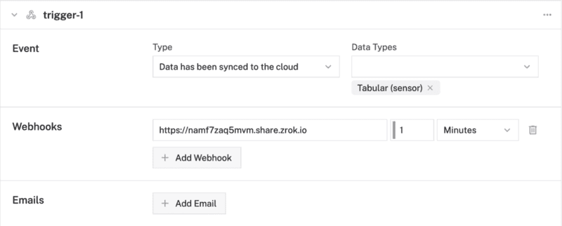
1. Click **Save** in the top right to save and apply your configuration changes.

You will then see requests start to come through the zrok logs:


The function server will also display logs while the request is being processed:


<!-- ------------------------ -->
## Blink an LED from a webhook
Duration: 5

In order to react to an alert based on the sensor data being monitored in Elastic, we will create another serverless function to handle the event and blink the LED connected to the Raspberry Pi.

The full example code is in the [project Github repository](https://github.com/viam-devrel/physical-world-monitoring).

### Create a function

The function is authored in Python using the [Functions Framework](https://github.com/GoogleCloudPlatform/functions-framework-python), which will make it easy to run locally and deploy to [Google Cloud Functions](https://cloud.google.com/functions/) when you're ready.

1. Within the "physical-world-monitoring" project directory that you cloned earlier, update the `.env` file by filling out the necessary environment variables for the function. The Viam API key, ID, and machine address can be found in the "Control" tab of your machine in the Viam app.
   The `PIN_NAME` is the physical GPIO pin number for the LED connected to the Raspberry Pi and the `BOARD_NAME` is the board component name in the machine configuration.
   ```env
   VIAM_API_KEY=""
   VIAM_API_KEY_ID=""
   MACHINE_ADDRESS=""
   PIN_NAME="11"
   BOARD_NAME="board-1"
   ```
1. Run the function server locally:
   ```console
   uv run functions-framework --source ./cloud-functions/movement-alert/main.py --target alert_movement --debug --port 8081
   ```
   This will start a Flask Python server at [http://localhost:8081](http://localhost:8081) to avoid conflicting with the other function server.

### Expose the function to the public Internet

To test out the function without going through the process of deploying to a production cloud service, we will create a tunnel from the public Internet to the local server using [zrok](https://zrok.io/).
This step assumes you already have `zrok` installed and your [environment enabled](https://docs.zrok.io/docs/getting-started#enabling-your-zrok-environment) to start sharing the local server.

1. In a new terminal window or tab, run the command to create a public proxy:
   ```console
   zrok share public localhost:8081
   ```
1. The public URL will be displayed along with any request logs that come in when the webhook is triggered.
   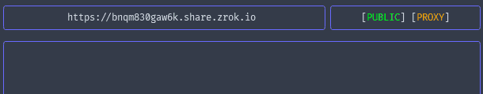

You can test the webhook using cURL, replacing the URL with the one displayed by zrok in your terminal:

```console
curl -X POST -d '{"hello":"world"}' https://bnqm830gaw6k.share.zrok.io
```
The data being sent doesn't matter at this point, as long as it is a valid JSON string.

<!-- ------------------------ -->
## Configure an Elastic alert rule
Duration: 5

This step assumes some knowledge of the Elastic console used to manage Elasticsearch, Kibana, and other services provided by the platform.

1. In the Elastic app, navigate to the **Observability** -> **Alerts** dashboard. Click on "Manage Rules".
   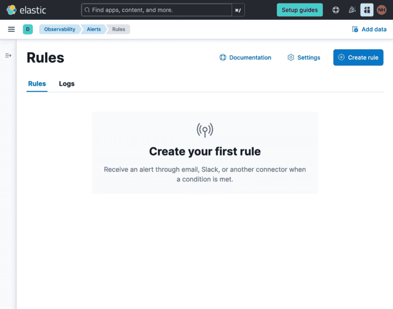
1. Click "Create rule" and select "Custom threshold".
   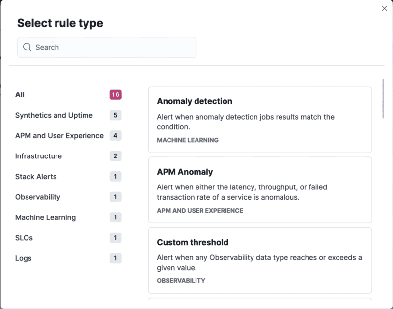
1. Enter "movement-threshold" for the name of the rule.
1. Scroll to the **Custom threshold** section, click on the "DATA VIEW" field followed by "Create a new data view".
   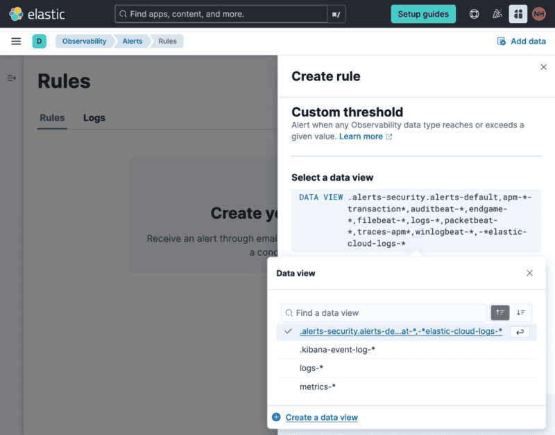
1. Enter "Movement Data" into the name of the view, then "movement-data" as the index pattern, followed by selecting "time_received" for the timestamp field.
1. Click "Save data view to Kibana" to complete the creation of the data view
   
1. In the **Define query filter** field, enter a custom query to trigger the alert based on the data you've gathered, for example:
   ```sql
   angular_velocity.y < -1
   ```
   
1. Scroll down to **Actions** and select the **Webhook** connector type, then click the "Create a connector" button.
   
1. Name the connector "Machine Alert", enter the public URL for your running webhook function, and select "None" for the authentication.
1. Click "Save" to complete creating the connector.
   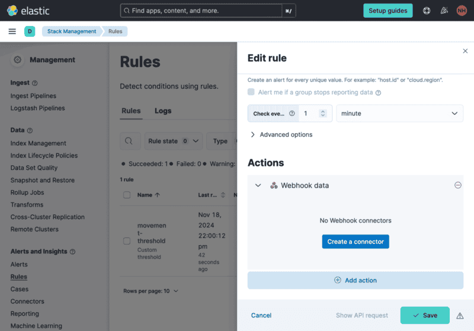
1. In the body field of the "Machine Alert" action, add some data to include in the request to the webhook.
   ```json
   {
      "alert_id": "{{alert.id}}",
      "alerted_at": "{{context.timestamp}}" 
   }
   ```
   This can be used in conditional logic added later to change the effect of the webhook based on that data.
   
1. Click "Save" to complete creating the rule.

### Test the connector

1. To test the webhook connector without waiting for the rule to trigger, navigate to the **Management** -> **Stack Management** -> **Connectors** dashboard.
   
1. Click on the triangular play icon in the row for "Machine Alert" to open the "Test" panel for the connector.
   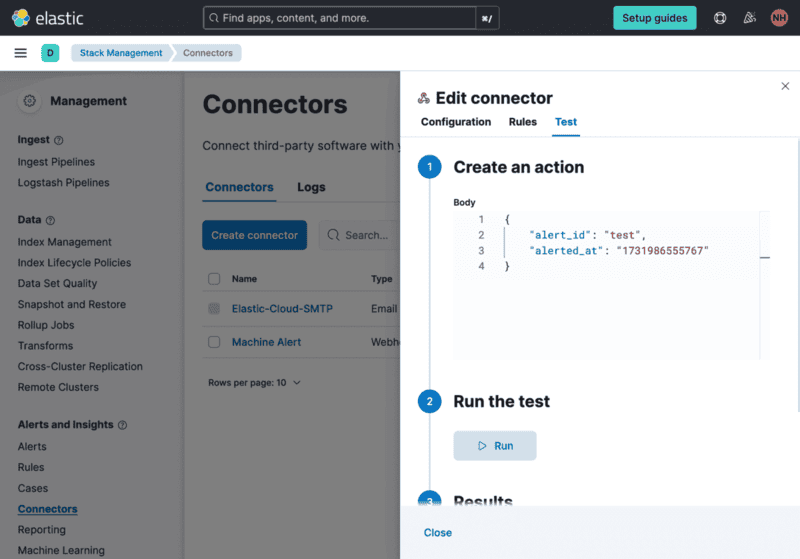
1. Enter some fake data in the body of the "Create an action" field.
   ```json
   {
       "alert_id": "test",
       "alerted_at": "1731986555767"
   }
   ```
1. Click the "Run" button and wait for your machine's LED to start blinking!

> aside negative
> If any problems occur, check under the **LOGS** tab of the **Connectors** dashboard or the output of running webhook function.

<!-- ------------------------ -->
## Conclusion and Resources
Duration: 1

Well done putting all those pieces together! 👏 Now you have a production-ready sensor data monitoring and automation system built around Viam and Elastic. 

Some great next steps include:

- [**Deploying the serverless functions**](https://cloud.google.com/functions/docs/create-deploy-gcloud#deploying_the_function): You don't need to run them indefinitely on your computer.
- **Modify the sensing**: Swap out the sensor to one that detects light, sound, or air quality.
- **Modify the actuation**: Instead of blinking an LED, the machine could move a servo or call out a notification with text-to-speech.


### What You Learned
- how to wire a movement sensor and LED to a Raspberry Pi
- how to capture sensor data in Viam
- how to use webhooks as an [ETL](https://en.wikipedia.org/wiki/Extract,_transform,_load) process between Viam and Elastic
- how to use webhooks to blink an LED based on an Elastic alert

### Related Resources
- [Source code repo](https://github.com/viam-devrel/physical-world-monitoring)
- [Configure data triggers](https://docs.viam.com/configure/triggers/)
- [Control a motor programmatically](https://docs.viam.com/how-tos/control-motor/#option-3-control-programmatically)
- [Automate air filtration with air quality sensors](/guide/air-quality)
