author: HipsterBrown
id: pi-ai-hat
summary: Use real-time object detection with the Raspberry Pi AI HAT
categories: Getting-Started, Developer
environments: web
status: Published 
feedback link: https://github.com/viam-labs/viamcodelabs/issues
tags: Getting Started, Developer

# Real-Time Object Detection with Raspberry Pi AI HAT
<!-- ------------------------ -->
## Overview 
Duration: 1

The Raspberry Pi 5 is a very useful and adaptable platform for various embedded and edge computing applications. However, when working with computer vision models, the performance on the single board computer can lack in either accuracy, speed, or both.
To address this use case, the Raspberry Pi company released the [Raspberry Pi AI Kit](https://www.raspberrypi.com/products/ai-kit/) and [Raspberry Pi AI HAT+](https://www.raspberrypi.com/products/ai-hat/) with dedicated neural network accelerators.


### What You’ll Build

- A live traffic monitoring dashboard 


### Prerequisites

- A computer with MacOS, Windows, or Linux to flash your Raspberry Pi and configure the device's components using the Viam app
- Hardware and supplies requirements

  - 1 - [Raspberry Pi 5 w/ active cooler](https://a.co/d/fqh4b7O)
  - 1 - microSD card to use with your Pi
  - 1 - power supply for your Pi
  - 1 - [Raspberry Pi AI HAT+](https://www.canakit.com/raspberry-pi-ai-hat-13.html?cid=USD)
  - 1 - [USB webcam](https://a.co/d/1qxYv8w)

The active cooler is [recommended by Raspberry Pi](https://www.raspberrypi.com/documentation/accessories/ai-kit.html#ai-kit-installation) for the best performance.

The Raspberry Pi AI Kit may still be for sale but it has been replaced by the AI HAT+ going forward, which is why it is recommended here. Either the 13 TOPS or 26 TOPS version will work in this codelab.

Follow the [official documentation](https://www.raspberrypi.com/documentation/accessories/ai-hat-plus.html#ai-hat-plus-installation) for instructions about installing the AI HAT+ on the Raspberry Pi 5.

### What You’ll Need

- All the hardware components listed in prerequisites.
- Sign up for a free Viam account, and then [sign in](https://app.viam.com/fleet/dashboard) to the Viam app

### What You’ll Learn

- How to configure and test a device's components using Viam
- How to use modules from the Viam registry
- How to use a vision service for object detection
- How to integrate vision service data into an application

### Watch the Video

See a demonstration of the traffic monitor in this video.

**TBD**

<!-- <video id="DH3kkFjmGss"></video> -->

<!-- ------------------------ -->

## Set up your Raspberry Pi

Duration: 5

The Raspberry Pi boots from a microSD card. You need to install Raspberry Pi OS on the microSD card that you will use with your Pi. For more details about alternative methods of setting up your Raspberry Pi, refer to the [Viam docs](https://docs.viam.com/installation/prepare/rpi-setup/#install-raspberry-pi-os).

### Install Raspberry Pi OS

1. Connect the microSD card to your computer.
1. Download the [Raspberry Pi Imager](https://www.raspberrypi.com/software/) and launch it.
   
1. Click **CHOOSE DEVICE**. Select your model of Pi, which is Raspberry Pi 5.
1. Click **CHOOSE OS**. Select **Raspberry Pi OS (64-bit)** from the menu.
1. Click **CHOOSE STORAGE**. From the list of devices, select the microSD card you intend to use in your Raspberry Pi.
   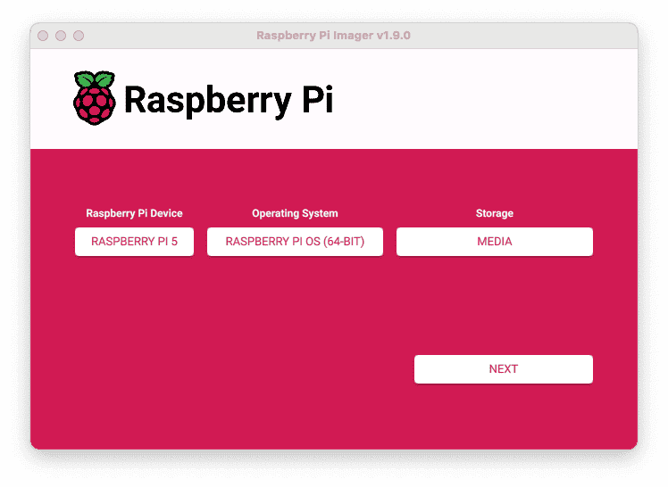
1. Configure your Raspberry Pi for remote access. Click **Next**. When prompted to apply OS customization settings, select **EDIT SETTINGS**.
1. Check **Set hostname** and enter the name you would like to access the Pi by in that field, for example, `test`.
1. Select the checkbox for **Set username and password** and set a username (for example, your first name) that you will use to log into the Pi. If you skip this step, the default username will be `pi` (not recommended for security reasons). And specify a password.
1. Connect your Pi to Wi-Fi so that you can run `viam-server` wirelessly. Check **Configure wireless LAN** and enter your wireless network credentials. SSID (short for Service Set Identifier) is your Wi-Fi network name, and password is the network password. Change the section `Wireless LAN country` to where your router is currently being operated.
   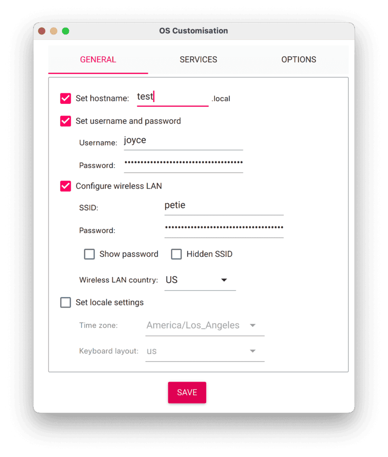
1. Select the **SERVICES** tab, check **Enable SSH**, and select **Use password authentication**.
   
   > aside negative
   > Be sure that you remember the `hostname` and `username` you set, as you will need this when you SSH into your Pi.
1. **Save** your updates, and confirm `YES` to apply OS customization settings. Confirm `YES` to erase data on the USB flash drive. You may also be prompted by your operating system to enter an administrator password. After granting permissions to the Imager, it will begin writing and then verifying the Linux installation to the USB flash drive.
1. Remove the USB flash drive from your computer when the installation is complete.

### Connect with SSH

1. Place the microSD card into your Raspberry Pi and boot the Pi by plugging it in to an outlet. A red LED will turn on to indicate that the Pi is connected to power.
1. Once the Pi is started, connect to it with SSH. From a command line terminal window, enter the following command. The text in <> should be replaced (including the < and > symbols themselves) with the user and hostname you configured when you set up your Pi.
   ```bash
   ssh <USERNAME>@<HOSTNAME>.local
   ```
1. If you are prompted “Are you sure you want to continue connecting?”, type “yes” and hit enter. Then, enter the password for your username. You should be greeted by a login message and a command prompt.
   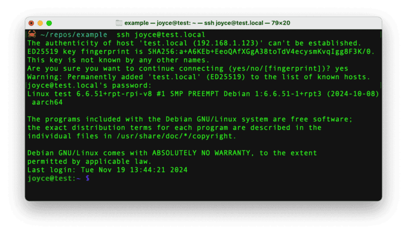
1. Update your Raspberry Pi to ensure all the latest packages are installed
   ```bash
   sudo apt update
   sudo apt upgrade
   ```

With the OS installed, it's time to set up the system packages for the AI HAT+.

<!-- ------------------------ -->

## Set up the hardware

Duration: 5


Connect to the Pi with SSH, if you're not still connected from the previous step.
```bash
ssh <USERNAME>@<HOSTNAME>.local
```

### Enable PCIe Gen 3.0 speeds for the best performance

1. Open the Raspberry Pi Configuration interface:
   ```console
   sudo raspi-config
   ```
1. Select `Advanced Options`
   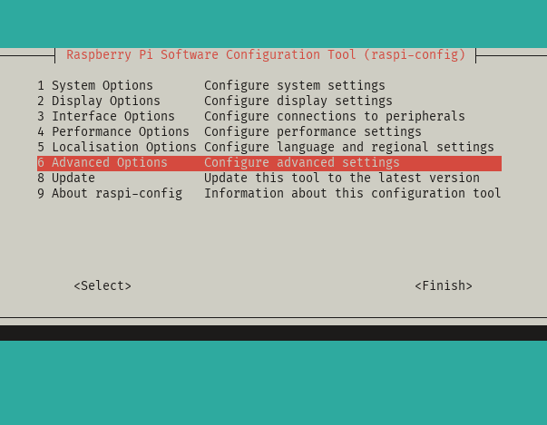
1. Select `PCIe Speed`
   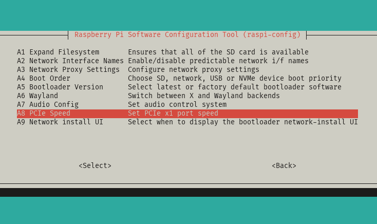
1. Choose `Yes` to enable PCIe Gen 3 mode
   
1. Select `Finish` to exit the configuration interface
   
1. Reboot the device
   ```console
   sudo reboot
   ```
1. Reconnect to the Pi with SSH to continue.

### Set up system dependencies

1. Install the `hailo-all` package, which contains the firmware, device drivers, and processing libraries for the AI HAT+:
   ```console
   sudo apt install -y hailo-all
   ```
   This may take a few minutes depending on your network speed.
1. Reboot the device
   ```console
   sudo reboot
   ```
1. Reconnect to the Pi with SSH
1. Verify everything is running correctly:
   ```console
   hailortcli fw-control identify
   ```
   You should see output similar to the follow:
   ```console
   Executing on device: 0000:01:00.0
   Identifying board
   Control Protocol Version: 2
   Firmware Version: 4.17.0 (release,app,extended context switch buffer)
   Logger Version: 0
   Board Name: Hailo-8
   Device Architecture: HAILO8L
   Serial Number: HLDDLBB234500054
   Part Number: HM21LB1C2LAE
   Product Name: HAILO-8L AI ACC M.2 B+M KEY MODULE EXT TMP
   ```

### Add your webcam

1. Connect the webcam's USB lead to any USB port on your Pi. The webcam transmits video data to the Raspberry Pi through the USB interface.

Now that we have physically connected our hardware components, let's configure the software in the next section.

<!-- ------------------------ -->

## Configure your machine and peripherals

Duration: 3

### Configure your machine

1. In [the Viam app](https://app.viam.com/fleet/dashboard) under the **LOCATIONS** tab, create a machine by typing in a name and clicking **Add machine**.
   
1. Click **View setup instructions**.
1. To install `viam-server` on the Raspberry Pi device that you want to use, select the `Linux / Aarch64` platform for the Raspberry Pi, and leave your installation method as [`viam-agent`](https://docs.viam.com/how-tos/provision-setup/#install-viam-agent).
   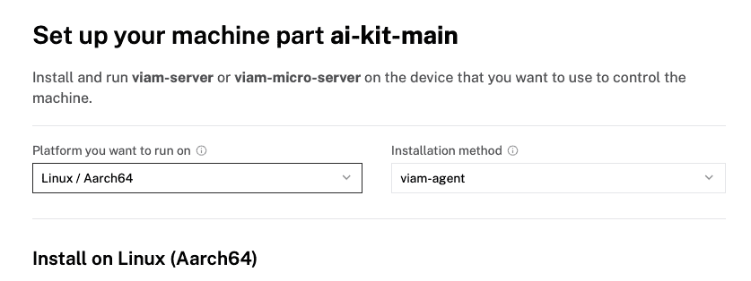
1. Use the `viam-agent` to download and install `viam-server` on your Raspberry Pi. Follow the instructions to run the command provided in the setup instructions from the SSH prompt of your Raspberry Pi.
   
1. The setup page will indicate when the machine is successfully connected.
   

### Configure your webcam

1. In [the Viam app](https://app.viam.com/fleet/locations) under the **CONFIGURE** tab, click the **+** icon in the left-hand menu and select **Component**.
1. Select `camera`, and find the `webcam` module. This adds the module for working with a USB webcam. Leave the default name `camera-1` for now.
1. Notice adding this component adds the webcam hardware component called `camera-1`. From the **Attributes** section of the panel, select a `video_path`.
   
1. Click **Save** in the top right. This may take a moment to apply your configuration changes.
1. At the bottom of the `camera-1` panel, expand the **TEST** section to ensure you have configured the camera properly and see a video feed.
   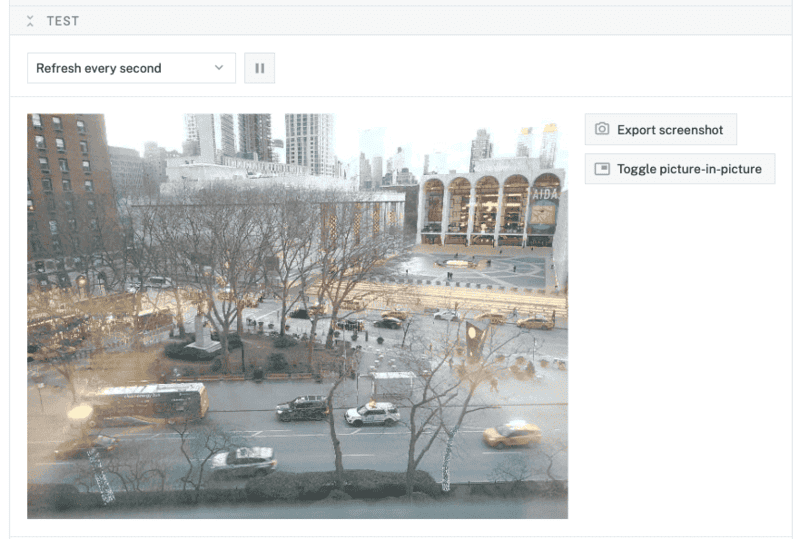

### Configure your vision service

1. In [the Viam app](https://app.viam.com/fleet/locations) under the **CONFIGURE** tab, click the **+** icon in the left-hand menu and select **Service**.
1. Select `vision`, and find the `hailo-rt` module. This adds the module for working with Hailo Runtime used by the AI HAT+. Select "Add module". Leave the default name `vision-1` for now.
1. Notice adding this service adds the computer vision software service called `vision-1`. From the **Depends on** section of the panel, select `camera-1` from the "Search resources" dropdown.
   
1. Click **Save** in the top right. This may take a moment to apply your configuration changes.
1. At the bottom of the `vision-1` panel, expand the **TEST** section to ensure you have configured the service properly and see images from `camera-1` with object detection boxes on top.
   

### Configure your detections sensor

1. In [the Viam app](https://app.viam.com/fleet/locations) under the **CONFIGURE** tab, click the **+** icon in the left-hand menu and select **Component**.
1. Select `sensor`, and find the `detections` module. This adds a module for capturing object detection data from a vision service. Leave the default name `sensor-1` for now.
1. Notice adding this component adds the sensor component called `sensor-1`. From the **Attributes** section of the panel, add the following JSON configuration.
   ```json
   {
       "camera": "camera-1",
       "detector": "vision-1",
       "labels": ["car", "bus", "person"]
   }
   ```
1. From the **Data capture** section of the panel, click "+ Add method". Set the "Method" as "Readings", "Frequency (hz)" as 1. Click "Create data management service" in the banner within the panel to automatically create a Data Management Service called `data_manager-1`.
   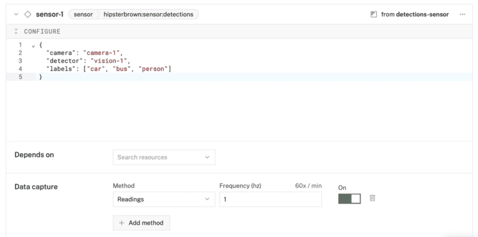
   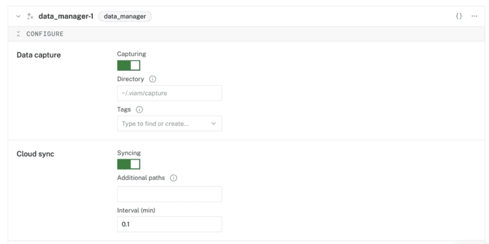
1. Click **Save** in the top right. This may take a moment to apply your configuration changes.
1. At the bottom of the `sensor-1` panel, expand the **TEST** section to ensure you have configured the sensor properly and see a list of the configured labels with the number of detections refreshed regularly.
   

With all the components and services in place, you can move on to creating a live tele-operations dashboard for your machine!

<!-- ------------------------ -->

## Create your traffic dashboard
Duration: 3

This step walks through how to use the [teleop (or tele-operations) feature](https://docs.viam.com/manage/troubleshoot/teleoperate/custom-interface/) of the Viam app.

### Configure your teleop workspace

1. In [the Viam app](https://app.viam.com/fleet/dashboard) under the **TELEOP** tab, create a new dashboard by clicking **Create workspace**.
   
1. Click on "untitle-workspace" to set the name of your dashboard.
   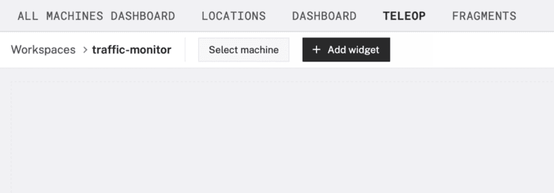
1. Click "Select machine" and choose your previously configured machine from the list.
   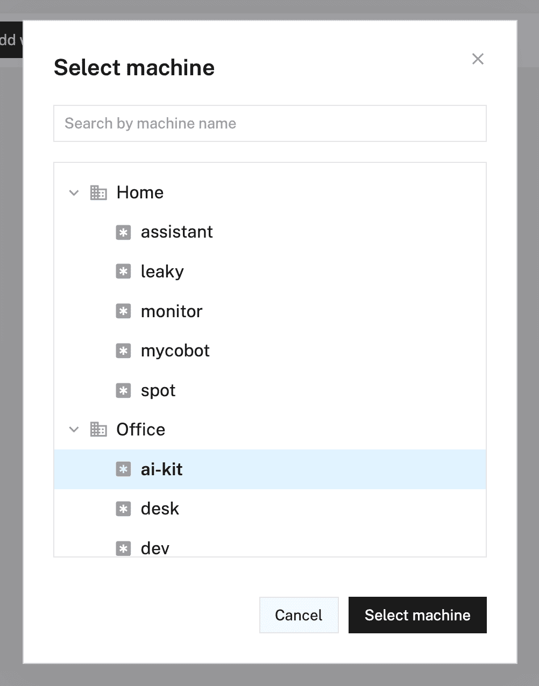

### Configure camera stream widget

1. Click "+ Add widget" and select "Camera stream".
   
1. Notice adding this widget creates a panel called `Camera`. Select `camera-1` from the "Camera name" field, keep the "Refresh type" as "Live".
   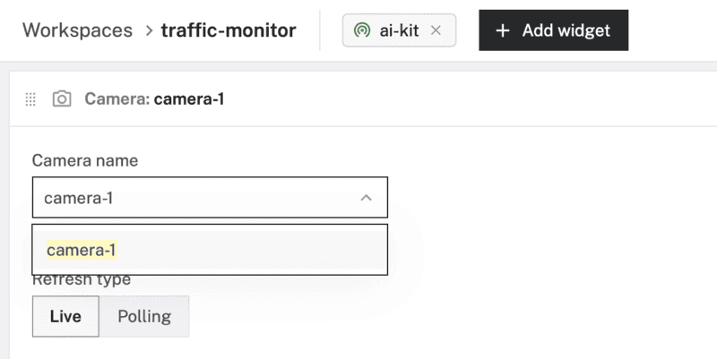

### Configure time series graph widget

1. Click "+ Add widget" and select "Time series".
   
1. Notice adding this widget creates a new panel called `Time series`. Set the "Title" to "Traffic" and "Time range (min)" to 30.
1. Under the **Lines** section of the panel, select `sensor-1` for the "Resource name", `Readings` for "Capture method", `cars` for "Title", and `readings.car` for "Path".
   
1. Add new lines by click "+ Add line". Create a line for each remaining label captured by the sensor: `bus` and `person`.
1. Click "Save changes" to see the camera stream and data updating live.

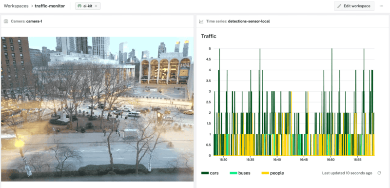

<!-- ------------------------ -->
## Conclusion And Resources
Duration: 1

### What you learned

- How to configure and test a device's components using Viam
- How to use modules from the Viam registry
- How to use a vision service for object detection
- How to integrate vision service data into an application

### Building advanced scenarios with Viam and the Raspberry Pi AI HAT+

At this point, you have created an edge device that can perform real-time object detection and monitor it remotely from anywhere! You can keep building on this project with additional features:

- Model out a smart city control system by connecting [red, yellow, and green LEDs](https://codelabs.viam.com/guide/led-blink/index.html?index=..%2F..index#0) to the Pi for simulated traffic light control.
- Make your smart home even smarter by [integrating with Home Assistant](https://codelabs.viam.com/guide/home-assistant/index.html?index=..%2F..index#0)
- Put it on a rover and [make it mobile](https://codelabs.viam.com/guide/drive-rover-ts/index.html?index=..%2F..index#0)

In addition to the project ideas mentioned above, consider other ways to continue your journey with Viam.

- Browse other modules in [the Viam registry](https://app.viam.com/registry) similar to the [prebuilt module for the AI HAT+](https://github.com/hipsterbrown/viam-pi-hailo-ml).
- Learn [how to create your own module](https://docs.viam.com/how-tos/hello-world-module/) with custom functionality for other computer vision runtimes or models.

### Related Viam resources

- [Viam documentation](https://docs.viam.com/)
- [Viam how-to guides](https://docs.viam.com/how-tos/)
- [Viam Discord community](http://discord.gg/viam)
