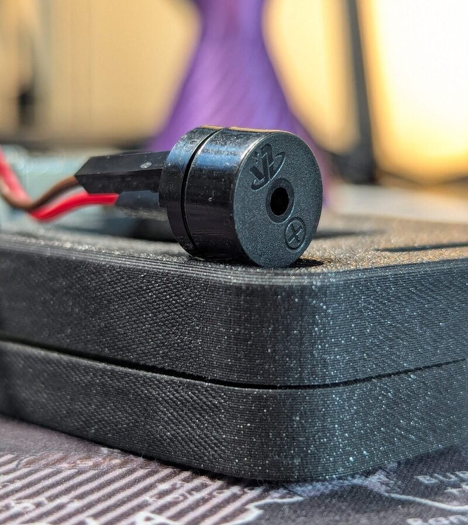
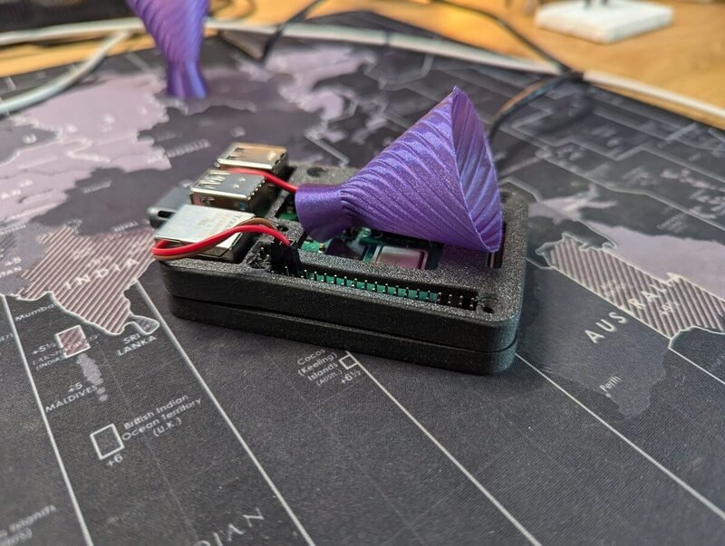
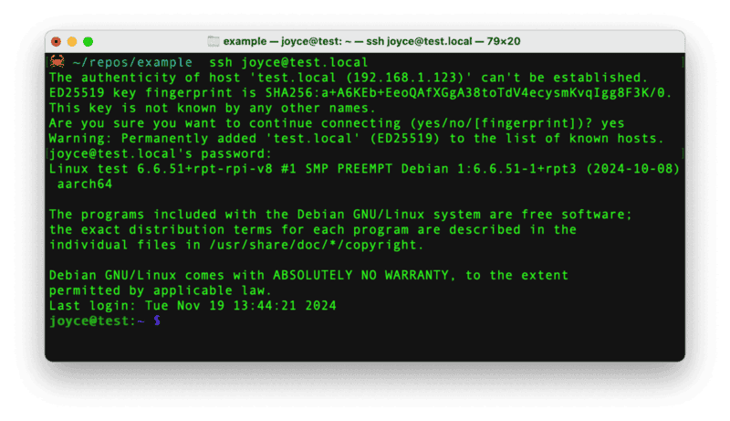
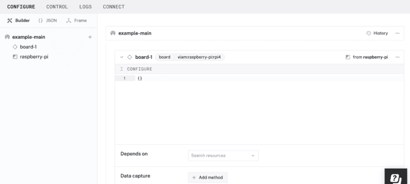
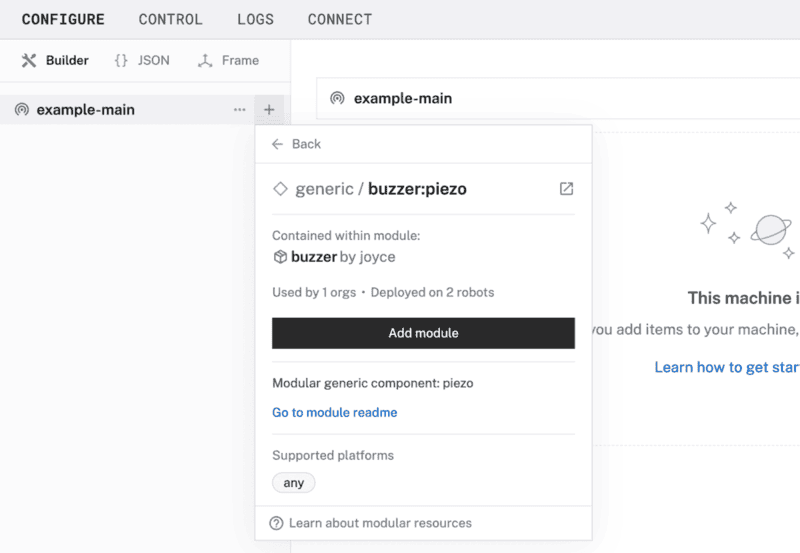
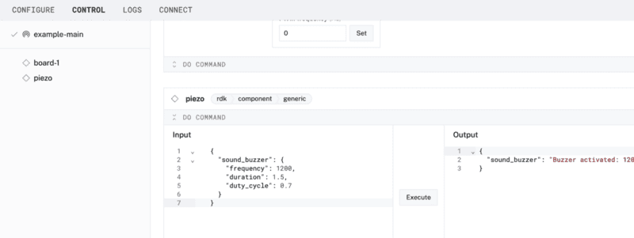

author: Joyce
id: piezo
summary: Sound a piezo buzzer with a Raspberry Pi
categories: Getting-Started, Developer
environments: web
status: Published
feedback link: https://github.com/viam-labs/viamcodelabs/issues
tags: Getting Started, Developer

# Use a piezo buzzer with a Raspberry Pi

<!-- ------------------------ -->

## Overview

Duration: 1

[Piezo buzzers](https://en.wikipedia.org/wiki/Piezoelectric_speaker) are basic components with versatility to emit tones, beeps, and even melodies. In this codelab, learn how to set up a piezo buzzer with your Raspberry Pi, and start making sound with just a few lines of code. Whether you're building a fun alert system or adding sound effects to a DIY project, you can integrate a piezo buzzer into your Viam project quickly using a prebuilt module.



### What You’ll Build

- A passive piezo buzzer that can emit a tone and a melody.



### Prerequisites

- A computer with MacOS, Windows, or Linux to flash your Raspberry Pi and configure the device's components using the Viam app
- Hardware and supplies requirements

  - 1 - [Raspberry Pi 4](https://a.co/d/fc3JUMm)
  - 1 - microSD card to use with your Pi
  - 1 - power supply for your Pi
  - 1 - [passive piezo buzzer](https://a.co/d/34QRLLo)
  - 2 - jumper wires

### What You’ll Need

- All the hardware components listed in prerequisites.
- Sign up for a free Viam account, and then [sign in](https://app.viam.com/fleet/dashboard) to the Viam app

### What You’ll Learn

- How to configure and test a device's components using Viam
- How to use modules from the Viam registry
- How to use pulse width modulation (PWM) to control the sound of a passive piezo

<!-- ### Watch the Video

See a demonstration and overview of the AprilTags scanner in this video.

<video id="7lknmKzZcn4"></video> -->

<!-- ------------------------ -->

## Set up your Raspberry Pi

Duration: 5

The Raspberry Pi boots from a USB flash drive (or microSD card). You need to install Raspberry Pi OS on a USB flash drive that you will use with your Pi. For more details about alternative methods of setting up your Raspberry Pi, refer to the [Viam docs](https://docs.viam.com/installation/prepare/rpi-setup/#install-raspberry-pi-os).

### Install Raspberry Pi OS

1. Connect the USB flash drive (or microSD card) to your computer.
1. Download the [Raspberry Pi Imager](https://www.raspberrypi.com/software/) and launch it.
   
1. Click **CHOOSE DEVICE**. Select your model of Pi, which is Raspberry Pi 4.
1. Click **CHOOSE OS**. Select **Raspberry Pi OS (64-bit)** from the menu.
1. Click **CHOOSE STORAGE**. From the list of devices, select the USB flash drive you intend to use in your Raspberry Pi.
   
1. Configure your Raspberry Pi for remote access. Click **Next**. When prompted to apply OS customization settings, select **EDIT SETTINGS**.
1. Check **Set hostname** and enter the name you would like to access the Pi by in that field, for example, `test`.
1. Select the checkbox for **Set username and password** and set a username (for example, your first name) that you will use to log into the Pi. If you skip this step, the default username will be `pi` (not recommended for security reasons). And specify a password.
1. Connect your Pi to Wi-Fi so that you can run `viam-server` wirelessly. Check **Configure wireless LAN** and enter your wireless network credentials. SSID (short for Service Set Identifier) is your Wi-Fi network name, and password is the network password. Change the section `Wireless LAN country` to where your router is currently being operated.
   
1. Select the **SERVICES** tab, check **Enable SSH**, and select **Use password authentication**.
   
   > aside negative
   > Be sure that you remember the `hostname` and `username` you set, as you will need this when you SSH into your Pi.
1. **Save** your updates, and confirm `YES` to apply OS customization settings. Confirm `YES` to erase data on the USB flash drive. You may also be prompted by your operating system to enter an administrator password. After granting permissions to the Imager, it will begin writing and then verifying the Linux installation to the USB flash drive.
1. Remove the USB flash drive from your computer when the installation is complete.

### Connect with SSH

1. Place the USB flash drive into your Raspberry Pi and boot the Pi by plugging it in to an outlet. A red LED will turn on to indicate that the Pi is connected to power.
   > aside negative
   > Make sure you are using a 5V 3A USB-C power supply to power your Raspberry Pi 4. Using a power supply with inadequate amperage can lead to instability, throttling, or unexpected behavior. Additionally, while USB boot is enabled by default on newer Raspberry Pi 4 models, older versions may require a firmware update to enable it. Refer to the [Raspberry Pi documentation](https://www.raspberrypi.com/documentation/computers/raspberry-pi.html) for detailed setup instructions and compatibility.
1. Once the Pi is started, connect to it with SSH. From a command line terminal window, enter the following command. The text in <> should be replaced (including the < and > symbols themselves) with the user and hostname you configured when you set up your Pi.
   ```bash
   ssh <USERNAME>@<HOSTNAME>.local
   ```
1. If you are prompted “Are you sure you want to continue connecting?”, type “yes” and hit enter. Then, enter the password for your username. You should be greeted by a login message and a command prompt.
   
1. Update your Raspberry Pi to ensure all the latest packages are installed
   ```bash
   sudo apt update
   sudo apt upgrade
   ```

<!-- ------------------------ -->

## Set up the hardware

Duration: 2

### Add your piezo buzzer

1. **Connect the piezo buzzer**: The passive piezo buzzer can be controlled via a GPIO pin on the Raspberry Pi. Refer to the following wiring diagram to connect the Raspberry Pi to the piezo buzzer.


- Pin 35 (GPIO 19) to Positive
- Pin 39 (GND) to Negative

> aside positive
> The website [pinout.xyz](https://pinout.xyz/) is a helpful resource with the exact layout and role of each pin for Raspberry Pi. When working with Viam, make sure to reference the physical pin numbers, and not the GPIO numbers listed on `pinout.xyz`.


Now that we have physically connected our hardware components, let's configure the software in the next section.

<!-- ------------------------ -->

## Configure your machine and peripherals

Duration: 3

### Configure your machine

1. In [the Viam app](https://app.viam.com/fleet/dashboard) under the **LOCATIONS** tab, create a machine by typing in a name and clicking **Add machine**.
   
1. Click **View setup instructions**.
   
1. To install `viam-server` on the Raspberry Pi device that you want to use to communicate with and control your webcam, select the `Linux / Aarch64` platform for the Raspberry Pi, and leave your installation method as [`viam-agent`](https://docs.viam.com/how-tos/provision-setup/#install-viam-agent).
   
1. Use the `viam-agent` to download and install `viam-server` on your Raspberry Pi. Follow the instructions to run the command provided in the setup instructions from the SSH prompt of your Raspberry Pi.
   
1. The setup page will indicate when the machine is successfully connected.
   

### Configure your Raspberry Pi board

To access the GPIO pins, let's add our Raspberry Pi board to our machine in the Viam app.

1. In [the Viam app](https://app.viam.com/fleet/locations), find the **CONFIGURE** tab.
1. Click the **+** icon in the left-hand menu and select **Component**.
   
1. Select `board`, and find the `raspberry-pi:rpi4` module. This adds the module for working with the Raspberry Pi 4's GPIO pins. Leave the default name `board-1` for now.
1. Notice adding this module adds the board hardware component called `board-1`. The collapsible card on the right corresponds to the part listed in the left sidebar.
   
1. Click **Save** in the top right to save and apply your configuration changes.
1. Expand the **TEST** section of the panel to experiment with writing to physical pin `35`. For example, try setting a `High` signal, along with `70`% duty cycle and `1200` Hz frequency.
   
   > aside negative
   > Since we are using a passive buzzer, you must provide a [PWM (Pulse Width Modulation)](https://en.wikipedia.org/wiki/Pulse-width_modulation) signal to generate different tones. A constant high signal will not produce a sound as they would for an active buzzer, since passive buzzers require varying frequencies to produce audible tones.
1. Set the signal to `Low` to turn off the buzzer.

> aside negative
> **TROUBLESHOOTING**: Double check the wiring on your piezo component. Also check under the **LOGS** tab to see what might be going wrong.

You can manually and programmatically use the GPIO pins of the [`board`](https://docs.viam.com/components/board/) component to send PWM signals to control your buzzer. However, to streamline the following steps, let's use a prebuilt module from the Viam registry in the next section.

### Configure your piezo buzzer

1. In [the Viam app](https://app.viam.com/fleet/locations) under the **CONFIGURE** tab, click the **+** icon in the left-hand menu and select **Component**.
1. Select `generic`, and find the `buzzer:piezo` module. This adds the module for controlling your buzzer. Name the component `piezo`.
   
1. In the new `piezo` panel, configure your component by adding the following attributes in the **CONFIGURE** field. This tells your piezo component to use a specific pin (physical pin 35) on a specific board (called `board-1` in the Viam app).
   ```json
   {
     "piezo_pin": "35",
     "board": "board-1"
   }
   ```
1. Select your board `board-1` from the **Depends on** field.
   
1. Click **Save** to apply your configuration changes. This may take a moment.
1. Since we are using a generic component, let's test it out under the **CONTROL** tab. Find your `piezo` component on this page. Expand the **DO COMMAND** field, input the following code, and hit **Execute**.
   ```json
   {
     "sound_buzzer": {
       "frequency": 1200,
       "duration": 1.5,
       "duty_cycle": 0.7
     }
   }
   ```
   
   You are executing a [`DoCommand`](https://docs.viam.com/components/generic/#api) on a generic component that has been predefined to accept parameters such as `frequency`, `duration`, and `duty_cycle`.
1. Experiment with different values in those fields to see what happens when you execute the command again. If you have extra time, try sending the following Do command.
   ```json
   {
     "play_harry_potter": {}
   }
   ```

<form>
  <name>What is the primary purpose for using PWM (Pulse Width Modulation) to control a passive piezo buzzer?</name>
  <input type="radio" value="To provide a constant high voltage to the buzzer.">
  <input type="radio" value="To generate varying tones by controlling the frequency of the signal.">
  <input type="radio" value="To make sure the buzzer operates at a fixed tone without additional wiring.">
  <input type="radio" value="To power the buzzer directly from a USB port.">
</form>

<!-- ------------------------ -->

## Next Steps

Duration: 1

### What you learned

- How to configure and test a device's components using Viam
- How to use modules from the Viam registry
- How to use pulse width modulation (PWM) to control the sound of the buzzer

### Building advanced scenarios with Viam and piezo buzzers

At this point, you have configured and tested your machine and piezo buzzer to make sound, but nothing is happening automatically. You can create [automatic processes](https://docs.viam.com/configure/processes/) that trigger actions when certain conditions are met, such as in the following examples.

- When a person is detected, as described in this workshop for [People detection alert with Computer Vision](https://codelabs.viam.com/guide/workshop-people/index.html?index=..%2F..index#0)
- When air quality values reach a certain threshold, as described in this codelab to [Automate air filtration with air quality sensors](https://codelabs.viam.com/guide/air-quality/index.html?index=..%2F..index#0)
- When a QR code is detected, as described in this codelab to [Use a QR code scanner](https://codelabs.viam.com/guide/qrcode/index.html?index=..%2F..index#3)


You can 3-D print a case for the Raspberry Pi that allows access to your GPIO pins for expanding your project ([like this one here](https://makerworld.com/en/models/62316#profileId-226178)). You can also design and 3-D print a custom mount to hold your buzzer in place, or 3-D print a megaphone ([like this one here](https://makerworld.com/en/models/946353?from=search#profileId-913226)) to amplify the buzzer volume.

In addition to the project ideas mentioned above, consider other ways to continue your journey with Viam.

- Browse other modules in [the Viam registry](https://app.viam.com/registry) similar to the [prebuilt module for the buzzer](https://github.com/loopDelicious/viam-piezo).
- Learn [how to create your own module](https://docs.viam.com/how-tos/hello-world-module/) with custom functionality for the piezo buzzer or other components and services.

### Real-world applications and projects for piezo buzzers

Piezo buzzers are small, but mighty components used in industries requiring audible feedback, alerts, or tone generation. Their applications include:

- **Alarms and Alerts**: Piezo buzzers create auditory signals in security systems, smoke detectors, and medical devices to notify users of critical events or malfunctions.
- **Interactive Robotics**: Robots use piezo buzzers to provide audio feedback to signal a task is completed or to prompt user interaction.
- **Home Automation**: Smart home devices and other consumer electronics utilize piezo buzzers for notifications, such as doorbell chimes, appliance alerts, or system warnings.
- **Gaming and Toys**: Toys and games use piezo buzzers for sound effects and melodies, enhancing the interactive user experience.

### Related Viam resources

- [Viam documentation](https://docs.viam.com/)
- [Viam how-to guides](https://docs.viam.com/how-tos/)
- [Viam Discord community](http://discord.gg/viam)
