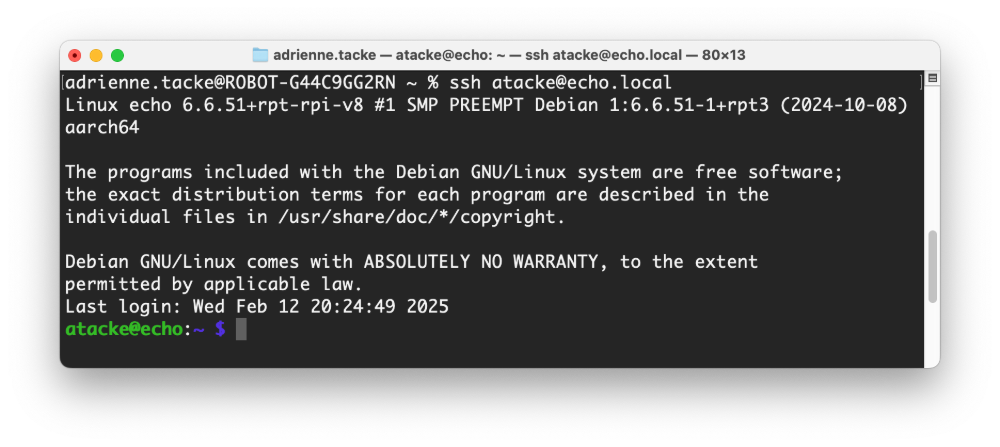
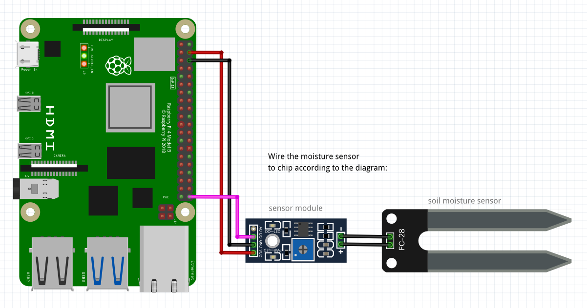

author: Hazal Mestci
id: plant-watering-device-workshop
summary: Build a Plant Watering Device
categories: Getting-Started, Developer
environments: web
status: Published
feedback link: <https://github.com/viam-devrel/viamcodelabs/issues>
tags: Getting Started, Developer, Hardware

# Plant watering with moisture sensor and pump

<!-- ------------------------ -->

## Overview
Duration: 5

Building a useful robot doesn’t have to require complicated code or expensive equipment. With a Raspberry Pi and some cheap, basic hardware, you can keep your plants healthy and happy from anywhere in the world!

Follow this workshop to learn how to set up an automatic plant watering system by wiring the components of the device, configuring it in the Viam app, and coding a simple script to activate the water pump motor.

### What You'll Build
A smart system that triggers a water pump to irrigate the plant when the soil moisture falls below a certain threshold.

### What You’ll Learn
- How to physically assemble a functional plant watering device by connecting and wiring the components.
- How to configure the device’s components using the Viam app.
- How to use Viam modules to control the plant watering device.
- How to test and adjust the system for optimal performance.

### Prerequisites
- Sign up for a free Viam account, and then [sign in](https://app.viam.com/fleet/locations/) to the Viam app.
- Purchase or acquire the hardware necessary for the workshop:
  - [a Raspberry Pi](https://www.amazon.com/dp/B07TD42S27)
  - [a micro-SD card](https://www.amazon.com/dp/B0C1Y87VT3)
  - [a power supply](https://www.amazon.com/CanaKit-Raspberry-Power-Supply-USB-C/dp/B07TYQRXTK)
  - [a 5V water pump with tubing](https://www.amazon.com/dp/B097F4576N)
  - [a relay module](https://www.amazon.com/HiLetgo-Channel-optocoupler-Support-Trigger/dp/B00LW15A4W)
  - [a moisture sensor](https://www.amazon.com/dp/B01DKISKLO)
  - [bunch of jumper wires](https://www.amazon.com/dp/B077X99KX1)
  - [wire connectors](https://www.amazon.com/Splicing-Connector-Lever-Nut-Assortment-Pocket/dp/B07NKSHVF6)
  - [a webcam (optional for the additional sections)](https://www.amazon.com/EMEET-1080P-Webcam-Microphone-Noise-Canceling/dp/B0CP6BTQKR)
- Have a planter box or flower pot with soil or coffee grounds, a screw driver and a water container ready.

### Watch the Video

Follow along with the step-by-step video.
<video id="Q6UuUKJpDn0"></video>

<!-- ------------------------ -->
## Set up your Raspberry Pi
Duration: 15

The Raspberry Pi boots from a microSD card. You need to install Raspberry Pi OS on a microSD card that you will use with your Pi. For more details about alternative methods of setting up your Raspberry Pi, refer to the [Viam docs](https://docs.viam.com/installation/prepare/rpi-setup/#install-raspberry-pi-os).

### Install Raspberry Pi OS

1. Connect the microSD card to your computer.
1. Launch the [Raspberry Pi Imager](https://www.raspberrypi.com/software/).
   
1. Click **CHOOSE DEVICE**. Select your model of Pi, i.e. Raspberry Pi 4 or Raspberry Pi 5.
1. Click **CHOOSE OS**. Select **Raspberry Pi OS (64-bit)** from the menu.
1. Click **CHOOSE STORAGE**. From the list of devices, select the microSD card you intend to use in your Raspberry Pi.
   
1. Configure your Raspberry Pi for remote access. Click **Next**. When prompted to apply OS customization settings, select **EDIT SETTINGS**.
   
1. Check **Set hostname** and enter the name you would like to access the Pi by in that field, for example, `echo`.
1. Select the checkbox for **Set username and password** and set a username (for example, your first name) that you will use to log into the Pi. If you skip this step, the default username will be `pi` (not recommended for security reasons). And specify a password.
1. Check **Configure wireless LAN** and enter your wireless network credentials. SSID (short for Service Set Identifier) is your Wi-Fi network name, and password is the network password. Also change the section **Wireless LAN country** to where your router is currently being operated. This will allow your Pi to connect to your Wi-Fi so that you can run `viam-server` wirelessly. 
1. Check **Set locale settings** and set your time zone and keyboard layout.
   
   > aside negative
   > Be sure that you remember the `hostname`, `username`, and `password` you set, as you will need this when you SSH into your Pi.
1. Select the **SERVICES** tab, check **Enable SSH**, and select **Use password authentication**.
   
1. **Save** your updates, and confirm `YES` to apply OS customization settings. Confirm `YES` to erase data on the microSD card. You may also be prompted by your operating system to enter an administrator password. 
  
After granting permissions to the Imager, it will begin writing and then verifying the Linux installation to the microSD card.
1. Remove the microSD card from your computer when the installation is complete.

### Connect with SSH

1. Place the microSD card into your Raspberry Pi and boot the Pi by plugging it in to an outlet. A red LED will turn on to indicate that the Pi is connected to power.
   > aside negative
   > Make sure you are using a 5V 3A USB-C power supply to power your Raspberry Pi 4. Using a power supply with inadequate amperage can lead to instability, throttling, or unexpected behavior. Additionally, while USB boot is enabled by default on newer Raspberry Pi 4 models, older versions may require a firmware update to enable it. Refer to the [Raspberry Pi documentation](https://www.raspberrypi.com/documentation/computers/raspberry-pi.html) for detailed setup instructions and compatibility.
1. Once the Pi is started, connect to it with SSH. From a command line terminal window, enter the following command. The text in <> should be replaced (including the < and > symbols themselves) with the username and hostname you configured when you set up your Pi.
   ```bash
   ssh <USERNAME>@<HOSTNAME>.local

   # for example, my command would look like this:
   ssh atacke@echo.local
   ```
1. If you are prompted “Are you sure you want to continue connecting?”, type “yes” and hit enter. Then, enter the password for your username. You should be greeted by a login message and a command prompt.
   
1. Update your Raspberry Pi to ensure all the latest packages are installed
   ```bash
   sudo apt update
   sudo apt upgrade
   ```


## Set up your Plant Watering Device
Duration: 15

Before programming the Pi to make the plant watering robot functional, you need to physically set up the plant watering robot by wiring the different components together. You will set up the robot to receive signals from the resistive soil moisture sensor and signal to the pump when it is time to pump water from the water’s container to the plant’s container.

Refer back to this full wiring diagram as you complete the steps to wire your hardware.


> aside positive
> The website [pinout.xyz](https://pinout.xyz/) is also a helpful resource where you can interact with the exact layout and role of each pin for Raspberry Pi. When working with Viam, make sure to reference the physical pin numbers, and not the GPIO numbers listed on `pinout.xyz`. 

First, wire the **sensor module** to the Raspberry Pi:

  

  | **Raspberry Pi** | <-> | **Sensor Module** |
  | -------- | ------- | ------- |
  | PIN 4 (5V)  | to | VCC (Power) |
  | PIN 6 (GND) | to | GND (Ground) |
  | PIN 40 (DIGITAL OUTPUT) | to | DO (Digital Output) |

  | **Soil Moisture Sensor** | <-> | **Sensor Module** |
  | -------- | ------- | ------- |
  | +  | to | + |
  | -  | to | - |


Next is the relay. The relay will connect to both the Raspberry Pi and the pump motor. First, wire the connections between the relay and the Raspberry Pi:


| **Raspberry Pi** | <-> | **Relay** |
| -------- | ------- | ------- |
| PIN 1 (3.3V)  | to | COM |
| PIN 2 (5V) | to | 5V |
| PIN 14 (GND) | to | GND |
| PIN 8 (IN) | to | IN |


Lastly, wire the connections between the relay and the pump motor. Use a wire connector (sometimes called wago connector) to connect a jumper wire from the relay to the wire on the pump motor.


| **Relay** | <-> | **Pump Motor** |
| -------- | ------- | ------- |
| NO (Normally Open)  | to | Pump Motor |
| PIN 39 (GND)  | to | Pump Motor |

> aside positive
> **TROUBLESHOOTING** Double check that wires have full contact on the relay and in the wire (wago) connectors. The wago connectors take a bit of effort to flip open and close shut - try gently pulling on the wires and see if they slip out. If they do, try reconnecting them in the wago connector. The wire should be pushed as far back into the connector as possible and then properly closed; this should keep the wire in place.

Now you are done!

### Take a Quiz

<form>
  <name>Where is the sensor module getting its power from?</name>
  <input type="radio" value="The Raspberry Pi">
  <input type="radio" value="Battery pack">
  <input type="radio" value="Electrical socket">
</form>

Make sure you understand these concepts before moving ahead.

## Configure your machine
Duration: 10

1. In [the Viam app](https://app.viam.com/fleet/dashboard) under the **LOCATIONS** tab, create a machine by typing in a name and clicking **Add machine**.
   
1. Click **View setup instructions**.
   
1. To install `viam-server` on your Raspberry Pi (so you can communicate with and control your sensor and the RGB LED), select the `Linux / Aarch64` platform for the Raspberry Pi, and leave your installation method as [`viam-agent`](https://docs.viam.com/how-tos/provision-setup/#install-viam-agent).
   
1. Use the `viam-agent` to download and install `viam-server` on your Raspberry Pi. Follow the instructions to run the command provided in the setup instructions from the SSH prompt of your Raspberry Pi.
1. The setup page will indicate when the machine is successfully connected.
    

With a machine configured and connected, it's time to add the peripherals.

<!-- ------------------------ -->

## Configure your Raspberry Pi
Duration: 5

1. In [the Viam app](https://app.viam.com/fleet/locations), find the **CONFIGURE** tab.
1. Click the **+** icon in the left-hand menu and select **Component**.
  
1. Select `board`, and find the `raspberry-pi:rpi4` (or `raspberry-pi:rpi5` for the Raspberry Pi 5) module. Click **Add Module**. Leave the default name `board-1` for now, then click **Create**. This adds the module for working with the Raspberry Pi's GPIO pins.
1. Notice adding this module adds the board hardware component called `board-1`. You'll see a collapsible card on the right, where you can configure the board component, and the corresponding `board-1` part listed in the left sidebar.
1. Click **Save** in the top right to save and apply your configuration changes.
1. Expand the **TEST** section of the panel to test your component. Here, you can specify which pin you want to interact with, whether to read or write to it, change its state, or get information from it.
  
1. Adjust the moisture sensor sensitivity from the blue screw top notch. Doing this sets a threshold - when the soil moisture level exceeds the threshold, the module outputs LOW (0), otherwise HIGH (1). Type `40` into the `Pin` field. Then try reading from your pin while you adjust and put the end of the sensor in water.
  
1. Next, test your relay and pump. Type in `8` into the `Pin` field, select `Write` as your Mode, enter `High` in the `State` field, then click **Set**. This equates to an inadequate soil moisture level, which should start the motor.
  


<!-- ------------------------ -->

## Program your Plant Watering Device
Duration: 5

To automate the pump motor based on sensor feedback, we can write some code to create a control loop that continuously monitors the pin values from the board. If moisture is detected from the sensor (low pin value), the relay pin should be set to `False` and will not pump water. If moisture is not detected (high pin value), the relay pin should be set to `True` and pump water. This logic could be added to your device as a custom service. Luckily, there is a [`watering-controller` module](https://github.com/viam-devrel/watering-controller) that does this for you! Let's go over how to add that module to your plant watering device and save you some time.


1. In [the Viam app](https://app.viam.com/fleet/locations), find the **CONFIGURE** tab.
1. Click the **+** icon in the left-hand menu and select **Service**.
1. Select `generic` and find the `watering-controller:plant-watering` module. Click **Add Module**. Be sure to change the default name to something more descriptive, like `watering-service`, then click **Create**.
  
1. Notice adding this module adds the generic service of your chosen name. You'll see a collapsible card on the right, where you can configure the watering controller module, and the corresponding part listed in the left sidebar.
1. In the **CONFIGURE** panel, add the following attributes. This tells the service which board to use (which should be the Raspberry Pi you've just configured).
    ```JSON
    {
      "board_name": "board-1"
    }
    ```
    
1. Click **Save** to apply your configuration changes. This may take a moment. 
1. After a few moments, your device should start running the pump motor and water your plants when low moisture is detected and automatically stop once it detects a high moisture level. Test it out by moving your sensor in and out of water. Be sure the other side of your tube is placed within an empty cup or plant - otherwise, it could get unintentionally splashy!

Congratulations on automating your plant watering device!


<!-- ------------------------ -->

## Next Steps
Duration: 1

Now that you have created your automatic plant watering device with a resistive soil moisture sensor, you can easily use Viam to automate other aspects of your garden. For example:

- You can use a [light sensor](https://www.amazon.com/Sensor-Module-Raspberry-Integrated-Circuits/dp/B07L15M5JG) or a [temperature sensor](https://www.amazon.com/KY-011-Cathode-Arduino-Starter-2-color/dp/B07869PKKF/ref=as_li_ss_tl?keywords=arduino+two+color+led+module&qid=1556591832&s=gateway&sr=8-2&th=1&linkCode=sl1&tag=murraynet-20&linkId=c36cd98be29498a9883b656c7011b6bb&language=en_US) to get readings to optimize the plant health.
- You can set up data capture and [graph your sensor data](/tutorials/services/visualize-data-grafana/), or [create your own custom Typescript dashboard](/tutorials/control/air-quality-fleet/) to display your sensor data.
- You can add a camera and [train a machine learning model](https://docs.viam.com/services/ml/train-model/#train-a-model) to track the health of your plant.

Check out our [documentation](https://docs.viam.com/) for more inspiration.

### What You Learned

- How to assemble and wire a plant watering device using a Raspberry Pi and various sensors.
- How to configure a Raspberry Pi to communicate with sensors and control hardware components.
- How to use the Viam app to configure and manage machine components.
- How to use Viam modules to leverage pre-built services and logic with your devices.
- How to test and adjust the system to ensure it functions correctly in monitoring soil moisture and automating plant watering.

### Related Resources

- [Github code repository](https://github.com/viam-labs/plant-watering-workshop)
- [Watering controller Module](https://github.com/viam-devrel/watering-controller)
- [Viam documentation](https://docs.viam.com/) 
- [Viam how-to guides](https://docs.viam.com/how-tos/)
- [Viam Discord community](http://discord.gg/viam)
