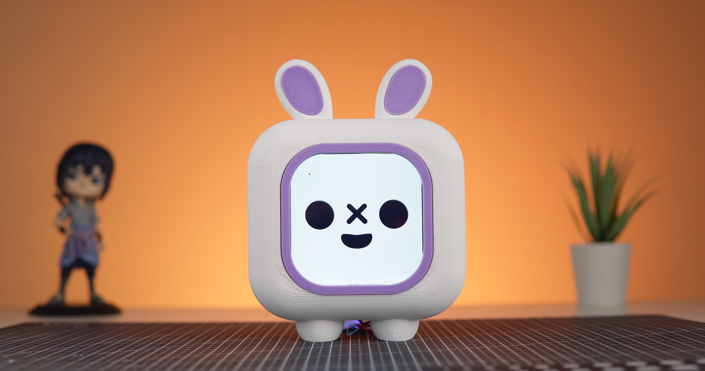
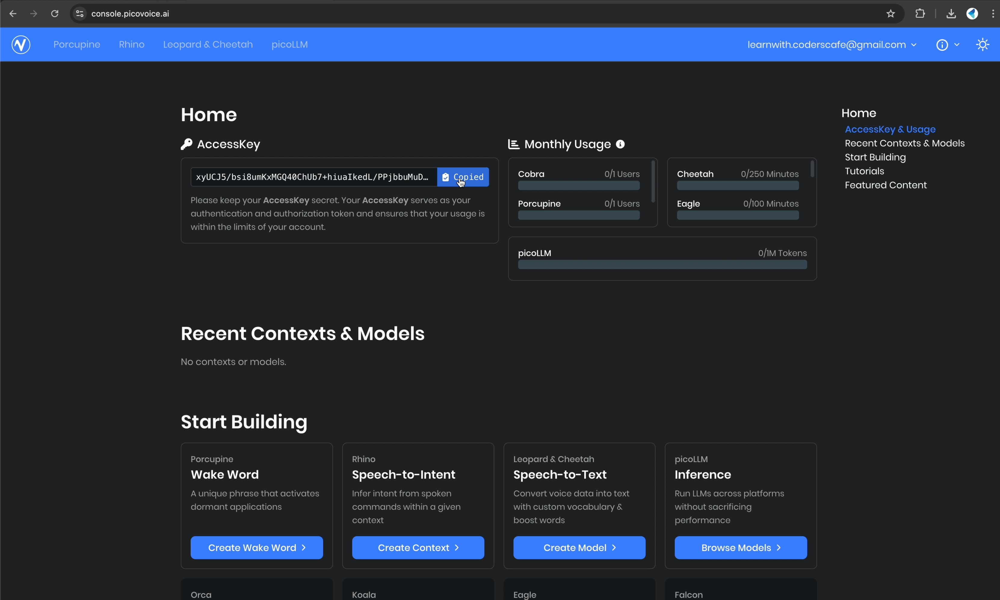

author: CodersCafe
id: pomodoro-bot-v2
summary: Build Your Own Pomodoro Bot With Viam And Raspberry Pi - V2
categories: Getting-Started, Developer
environments: web
status: Published 
feedback link: https://github.com/viam-labs/viamcodelabs/issues
tags: Getting Started, Developer, Data, Robotics, Environmental Monitoring, Sensors, Pomodoro, LLM, Local AI, ChatBot

# Add Voice Control and Local LLM to Pomodoro Bot

<!-- ------------------------ -->

## Introduction

Duration: 5

The **Pomodoro Bot V2** is a significant upgrade from its predecessor, featuring smart voice interaction, enhanced design, and streamlined hardware. This version goes beyond just tracking focus sessions—it can now respond to voice commands and provide real-time feedback. With LLM integration, the bot operates completely hands-free, eliminating the need for physical buttons.

To complement these advancements, we have redesigned the bot with a more compact form factor, custom PCB, and an adorable new look with ears.

The first iteration of the Pomodoro Bot featured a simple display for tracking focus sessions and physical buttons for manual control. While it served its purpose well, we aimed to take productivity to the next level with a more intelligent and interactive experience.

If you haven't seen the original version in action, you can check out the V1 documentation [here](https://codelabs.viam.com/guide/pomodoro-bot/index.html).

Let's dive in and see what's new in Pomodoro Bot V2!



### What's New in v2?
- **Voice Control** - No buttons needed! Interact using natural speech
- **LLM Integration** - Local AI processing with Deepseek R1 or any other LLMs of your choice
- **Audio System** - Built-in microphone and amplified speaker
- **New Design** - Adorable ears + compact PCB design
- **Custom PCB** - Streamlined sensor connections

### Watch The Video

Before getting into the build, let's start by seeing our **Pomodoro Bot V2** in action!

<video id="PwDoYDCD_g0"></video>

<!-- ------------------------ -->


### Prerequisites

Duration: 5

- All V1 components +
- **New Hardware:**
   - [USB microphone](https://www.adafruit.com/product/3367)
   - [4Ω 2.5W speaker](https://www.sparkfun.com/thin-speaker-4-ohm-2-5w-28mm.html) 
   - [PAM8403 amplifier](https://robu.in/product/pam8403-5v-two-channel-stereo-mini-class-d-3w3w-audio-amplifier/)
   - Custom PCB
   - [2 Pin JST Connectors](https://robodo.in/products/2-pin-connector-2mm-pitch-10-pcs)
   - [3 Pin JST Connectors](https://robodo.in/products/3-pin-male-and-female-cable-micro-male-and-female-connector-plug-with-silicone-10inch-wire)
   - [4 Pin JST Connectors](https://hitechxyz.in/products/4-pin-jst-xh-2-54mm-pitch-plug-and-socket-with-cable)
   - [2 Pin Screw Terminal Block](https://robu.in/product/xy300va-5-0-xinya-2-pin-screw-terminal-blockgreen/)
- **New Software:**
   - [Viam LOCAL-LLM service](https://app.viam.com/module/viam-labs/local-llm)
   - [Deepseek R1 GGUF model](https://huggingface.co/bartowski/DeepSeek-R1-Distill-Qwen-1.5B-GGUF)
   - [Picovoice wake word engine](https://picovoice.ai/platform/porcupine/)

## Audio System

Duration: 15

One of the most significant upgrades in **Pomodoro Bot v2** is the **audio system**, enabling **natural voice interaction**. We focused on **compact and efficient components** for both audio input and output, ensuring seamless integration into the design with minimal modifications.  

### Audio Input: USB Microphone  
For **voice commands and interaction**, we selected a **small USB microphone** that fits perfectly with just a **minor tweak to the 3D model**. This allows for **clear voice detection** without requiring additional circuitry.  


### Audio Output: Speaker & Amplifier  
For **audio feedback**, we chose a **compact 4Ω, 2.5W speaker**, powered by a **PAM8403 amplifier module**, ensuring **clear and crisp sound**.  


### Audio Routing: A Creative Solution  
Since the **Raspberry Pi 5 lacks a built-in audio output**, we needed an alternative approach:  
1. Instead of using an **external sound card**, we routed the **audio signal through the display’s 3.5mm jack**.  
2. This signal was fed into the **PAM8403 amplifier**, which then powered the **speaker**.  

### Power & Noise Reduction  
- To prevent **noise interference**, the **Raspberry Pi and PAM8403 amplifier** were powered separately.  
- A **USB breakout board** was used to **power the amplifier conveniently**.  

### Testing the Audio System  
To verify functionality, we ran **basic recording and playback tests** using the following commands:  

```bash
# Record audio
arecord -D plughw:1,0 -f cd -d 5 test.wav  

# Play recorded audio
aplay test.wav  
```
With these adjustments, Pomodoro Bot v2 now has a voice, making interactions more natural and engaging!


<!-- ------------------------ -->
## Integrating LLM for Voice Interactions 

Duration: 5 

With the **audio setup complete**, the next step is integrating **VIAM** and **Local LLM** to enable real-time voice interactions. This allows the **Pomodoro Bot** to process speech, understand queries, and respond intelligently.  

### Adding Local LLM to the Bot  
VIAM’s **[Local-LLM module](https://app.viam.com/module/viam-labs/local-llm)** enables running **offline AI models** without relying on the cloud. It supports **TinyLlama, Deepseek R1**, and other models using **llama.cpp**. 

#### Steps to Integrate Local LLM  
1. **Navigate to the CONFIGURE tab** in VIAM.  
2. **Search for LOCAL-LLM** under services and **add it** to the bot.  
3. To use a **custom model**, you'll need:  
   - **LLM-File:** The actual model file in **GGUF format**.  
   - **LLM-Repo:** The repository ID containing the model.  

#### Using Deepseek R1 Model  
1. **Search for Deepseek R1 GGUF** on [Hugging Face](https://huggingface.co/).  
   
2. **Download the [GGUF file](https://huggingface.co/bartowski/DeepSeek-R1-Distill-Qwen-1.5B-GGUF)** to the **Raspberry Pi** (this is the **LLM-File**).  
   
3. Note down the **repository ID** (this is the **LLM-Repo**).
   
4. Back in VIAM’s **CONFIGURE tab**, set:  
   - **LLM-File**: Path to the downloaded GGUF file.  
   - **LLM-Repo**: Repository ID of the model.  
   
5. **Save the configuration**, and the bot is now powered by an offline LLM!  

With **LLM integration**, the **Pomodoro Bot** can now **listen, understand, and respond in real time**, making it a truly hands-free experience.


<!-- ------------------------ -->
## Integrating a Wake Word Detector  

Duration: 15

To enable **hands-free interaction**, we’re integrating a **wake word detector** into the Pomodoro bot using **PicoVoice Porcupine Wake Word Engine**. **Porcupine** is:  
- **Fast and efficient**  
- **Works entirely offline**  
- **Optimized for low-power devices** like the Raspberry Pi  

### Setting Up the Wake Word 

#### Access PicoVoice Console  
- **Go to the [PicoVoice Console](https://console.picovoice.ai/)**.  
   
- If you don’t have an account, sign up first, then log in.
- Navigate to the **Porcupine** section.  
   

#### Choosing or Creating a Wake Word  
- You can select a **default wake word** like `"Hey Google"` or `"Alexa"`.  
- To create a **custom wake word**, follow these steps:  
  1. Click **"Create Wake Word"**.  
      
  2. Enter your **desired phrase** (e.g., `"Hey Pomo"`).
      
  3. PicoVoice will generate a **PPN model file** for your wake word.  

#### Downloading the Wake Word Model  
- Once the model is ready, **download the PPN file**.
   
- Save it in an **easily accessible location** on your device.  

#### Getting the PicoVoice API Key  
- Navigate to the **API Access Key** section in the PicoVoice Console.  
- **Copy the access key** and store it securely.
   
- This key is required in our **code** to authenticate with the **Porcupine engine**.  

Next, we’ll configure the **wake word engine in our code**. Here's a sample code to test whether your wake word detection is working fine or not.

```python

#wake_word_test.py

import pvporcupine
import pyaudio
import struct

# Replace with your actual access key and wake word model file path
ACCESS_KEY = "YOUR_ACCESS_KEY"
WAKE_WORD_MODEL = "path/to/your_wakeword.ppn"

# Initialize Porcupine wake word engine
porcupine = pvporcupine.create(access_key=ACCESS_KEY, keyword_paths=[WAKE_WORD_MODEL])

# Configure audio stream
pa = pyaudio.PyAudio()
stream = pa.open(
   rate=porcupine.sample_rate,
   channels=1,
   format=pyaudio.paInt16,
   input=True,
   frames_per_buffer=porcupine.frame_length
)

print("Listening for wake word...")

try:
   while True:
      pcm = stream.read(porcupine.frame_length, exception_on_overflow=False)
      pcm = struct.unpack_from("h" * porcupine.frame_length, pcm)
      result = porcupine.process(pcm)
      
      if result >= 0:
            print("Wake word detected! Activating voice interaction...")
except KeyboardInterrupt:
   print("Stopping wake word detection...")
finally:
   stream.stop_stream()
   stream.close()
   pa.terminate()
   porcupine.delete()

```

To run the above code install the required libraries using following commands

```
sudo apt-get install portaudio19-dev
pip install pvporcupine pyaudio
```

Now run the code as

```
python3 wake_word_test.py
```

And just like that, our Pomodoro bot is now intelligent, interactive, and fully voice-enabled!

<!-- ------------------------ -->
## Custom PCB Design

Duration: 10

To maintain a **neat and clutter-free assembly**, we designed a **custom two-layer PCB** using **EasyEDA**. The PCB layout was optimized to facilitate seamless connections between components, ensuring a compact and efficient design.

### Features
- **JST Connectors**: Used for attaching **sensors, speakers, and the audio jack** for easy and secure connections.
- **Direct Integration**: The **PAM8403 amplifier module** and **ADS1115 ADC module** are directly mounted onto the PCB, reducing additional wiring and improving reliability.


### Design Process
1. Designed the PCB using **EasyEDA**.
   
2. Exported **Gerber files** for manufacturing.
   

After the fabrication process was completed, we received our custom PCBs, precisely manufactured according to our design specifications.


This custom PCB simplifies the wiring process, enhances durability, and improves the overall aesthetics of the Pomodoro bot. You can get your own PCBs using this [Gerber File](https://github.com/CodersCafeTech/PomodoroBot-V2/blob/main/PCB).
<!-- ------------------------ -->

## 3D Design and Fabrication

Duration: 10

In addition to designing the custom PCB, we also gave the Pomodoro bot’s case a complete makeover. The updated design enhances both aesthetics and functionality, creating a more charming and efficient look. 


Below are the key features of the redesigned case:

- Personality Touch: The case now includes cute little ears, adding a fun and endearing element to the bot’s appearance.
- Component Space: A dedicated space was integrated for the USB microphone and other essential components, ensuring easy access and proper placement.
- Compact and Organized Layout: The new layout is both visually appealing and efficient, optimizing space while improving the overall look and feel of the bot.

### 3D Printing the New Design

Once the redesign was finalized, we moved on to preparing the 3D printing files and began printing the individual parts. The choice of materials and colors was carefully considered to complement the bot’s appearance:

- Body: The bot’s body was printed using white filament, providing a clean and sleek finish.
   

- Front Ring & Ears: The front ring and ears were printed separately using purple filament. This allows them to be attached easily and customized, adding a personal touch to each Pomodoro bot.
   

This redesign elevates the bot’s functionality and personality, creating a more cohesive and delightful user experience.

   

Find the 3D Files [here](https://github.com/CodersCafeTech/PomodoroBot-V2/blob/main/CAD).

## Assembly

Duration: 10


### Front Portion Assembly  

1. **Speaker Installation**  
   - Place the speakers onto the speaker grill and ensure proper alignment.
     <br/><br/>
       

2. **PCB Assembly**  
   - Solder all necessary components onto the PCB.
      
   - Use **female headers** for the **ADS1115** module to allow easy replacement.
      
   - Directly solder the **PAM8403** module for a secure connection.
      

3. **Mounting the PCB on the Raspberry Pi**  
   - Attach the **3.5mm audio jack** to the PCB.
      
   - Stack the assembled PCB onto the Raspberry Pi.
         
   - Insert the entire unit into the front portion of the case.
       
   - Connect the **speakers** to the PCB.
        

### Back Portion Assembly  

1. **Sensor and USB Module Installation**  
   - Solder **JST connectors** to both sensors.
        
   - Attach the **sensors** and **USB module** to the back side of the case.
       


2. **Final Wiring**  
   - Connect the wiring between the **back portion** and the **front portion**, completing the internal assembly. 
      


### Final Assembly  

1. **Securing the Outer Case**  
   - Glue the **front ring** and **ear portions** to the Pomodoro bot’s body. 
      <br/><br/>
      <br/><br/>
      

**Assembly process fully completed! The Pomodoro Bot is now ready for use.**  


## Giving Life To Our Pomodoro Bot

Duration: 5

### 1. Power Up the Raspberry Pi

Once the assembly process is complete, power up your Raspberry Pi. You can do this by connecting the power supply to the Raspberry Pi's power jack.

### 2. Verify Functionality

After powering up, take a moment to verify that everything is functioning as expected. This may involve checking the Raspberry Pi's LED indicators and ensuring the Waveshare display turns on.

### 3. Download Source Code

The next step is to download the source code for the Pomodoro Bot application on to your Raspberry Pi. You can download the code from the following GitHub repository:

* [https://github.com/CodersCafeTech/PomodoroBot-V2](https://github.com/CodersCafeTech/PomodoroBot-V2)

### 4. Edit the Source Code (main.py)

- Open the downloaded source code and navigate to the `Code` directory. Locate the file named `main.py`.
- Within `main.py`, you will need to replace the following placeholders with your own values:
    * **API Key:** Locate the section where the API key is stored and replace it with your own API key. 
    * **API Key ID:** Similarly, find the section where the API Key ID is stored and replace it with your unique ID.
    * **Robot Address:** Replace the address with Machine Address in the CONNECT tab.
    * **Porcupine Access Key:** Find the section containing the Porcupine Access Key and replace it with your own.
    * **Component Names (Optional):** If you have used different component names during configuration, you may need to modify the corresponding names within the code.

### 5. Run the Pomodoro Bot Code

- Once you've made the necessary edits to `main.py`, save the changes.
- Install the necessary python packages using the following command
   ```bash
      pip install -r requirements.txt
   ```
- Run the python code from the terminal using
   ```bash
      python3 main.py
   ```
 

### 6. See Your Pomodoro Bot Alive!

If everything is configured correctly, the Pomodoro Bot application should launch and your Raspberry Pi will transform into a functional Pomodoro Bot, ready to help you manage your work sessions and boost your productivity.

 