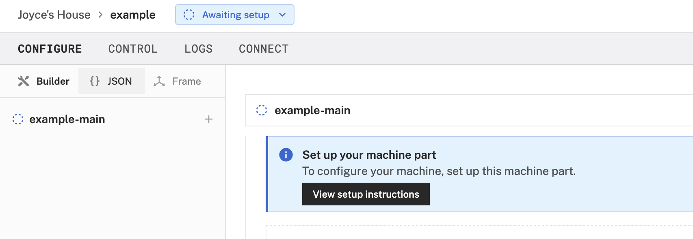
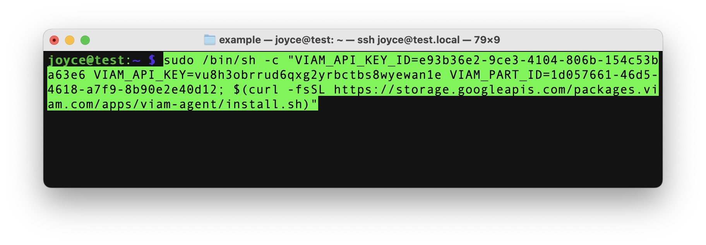
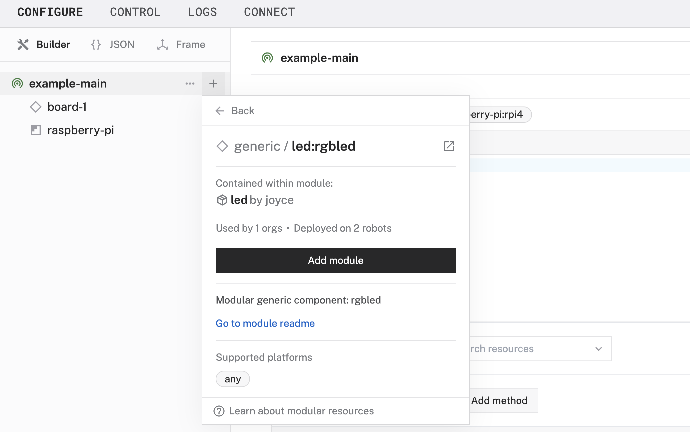

author: Joyce
id: rgbled
summary: Control an RGB LED with a Raspberry Pi
categories: Getting-Started, Developer
environments: web
status: Published
feedback link: https://github.com/viam-devrel/viamcodelabs/issues
tags: Getting Started, Developer, Data

# Control an RGB LED with a Raspberry Pi

<!-- ------------------------ -->

## Overview

Duration: 1

[RGB LEDs](https://en.wikipedia.org/wiki/Light-emitting_diode#RGB_systems) are light-emitting diodes that mix red, green, and blue to create many different hues of light. In this codelab, learn how to control an RGB LED with your Raspberry Pi. Whether you're building a fun alert system or adding light effects to a DIY project, you can integrate a RGB LEDs into your Viam project quickly using a prebuilt module.


### What You’ll Build

- A common cathode RGB LED that can display a specific color or light effect.


### Prerequisites

- A computer with MacOS, Windows, or Linux to flash your Raspberry Pi and configure the device's components using the Viam app
- Hardware and supplies requirements

  - 1 - [Raspberry Pi 4](https://a.co/d/fc3JUMm)
  - 1 - microSD card to use with your Pi
  - 1 - power supply for your Pi
  - 1 - [common cathode RGB LED](https://a.co/d/inuxrYr) with 3 resistors
  - 4 - jumper wires
  - 1 - breadboard
  - 1 - **optional**: solder, heat shrink tubing, and electrical tape

### What You’ll Need

- All the hardware components listed in prerequisites.
- Sign up for a free Viam account, and then [sign in](https://app.viam.com/fleet/dashboard) to the Viam app

### What You’ll Learn

- How to configure and test a hardware component using Viam
- How to use modules from the Viam registry
- How to use pulse width modulation (PWM) to control an RGB LED light

### Watch the Video

See a demonstration of controlling the RGB LED in this video.

<video id="J-wYpYclU78"></video>

<!-- ------------------------ -->

## Set up your Raspberry Pi

Duration: 5

The Raspberry Pi boots from a USB flash drive (or microSD card). You need to install Raspberry Pi OS on a USB flash drive that you will use with your Pi. For more details about alternative methods of setting up your Raspberry Pi, refer to the [Viam docs](https://docs.viam.com/installation/prepare/rpi-setup/#install-raspberry-pi-os).

### Install Raspberry Pi OS

1. Connect the USB flash drive (or microSD card) to your computer.
1. Download the [Raspberry Pi Imager](https://www.raspberrypi.com/software/) and launch it.
   
1. Click **CHOOSE DEVICE**. Select your model of Pi, which is Raspberry Pi 4.
1. Click **CHOOSE OS**. Select **Raspberry Pi OS (64-bit)** from the menu.
1. Click **CHOOSE STORAGE**. From the list of devices, select the USB flash drive you intend to use in your Raspberry Pi.
   
1. Configure your Raspberry Pi for remote access. Click **Next**. When prompted to apply OS customization settings, select **EDIT SETTINGS**.
1. Check **Set hostname** and enter the name you would like to access the Pi by in that field, for example, `test`.
1. Select the checkbox for **Set username and password** and set a username (for example, your first name) that you will use to log into the Pi. If you skip this step, the default username will be `pi` (not recommended for security reasons). And specify a password.
1. Connect your Pi to Wi-Fi so that you can run `viam-server` wirelessly. Check **Configure wireless LAN** and enter your wireless network credentials. SSID (short for Service Set Identifier) is your Wi-Fi network name, and password is the network password. Change the section `Wireless LAN country` to where your router is currently being operated.
   
1. Select the **SERVICES** tab, check **Enable SSH**, and select **Use password authentication**.
   
   > aside negative
   > Be sure that you remember the `hostname` and `username` you set, as you will need this when you SSH into your Pi.
1. **Save** your updates, and confirm `YES` to apply OS customization settings. Confirm `YES` to erase data on the USB flash drive. You may also be prompted by your operating system to enter an administrator password. After granting permissions to the Imager, it will begin writing and then verifying the Linux installation to the USB flash drive.
1. Remove the USB flash drive from your computer when the installation is complete.

### Connect with SSH

1. Place the USB flash drive into your Raspberry Pi and boot the Pi by plugging it in to an outlet. A red LED will turn on to indicate that the Pi is connected to power.
   > aside negative
   > Make sure you are using a 5V 3A USB-C power supply to power your Raspberry Pi 4. Using a power supply with inadequate amperage can lead to instability, throttling, or unexpected behavior. Additionally, while USB boot is enabled by default on newer Raspberry Pi 4 models, older versions may require a firmware update to enable it. Refer to the [Raspberry Pi documentation](https://www.raspberrypi.com/documentation/computers/raspberry-pi.html) for detailed setup instructions and compatibility.
1. Once the Pi is started, connect to it with SSH. From a command line terminal window, enter the following command. The text in <> should be replaced (including the < and > symbols themselves) with the user and hostname you configured when you set up your Pi.
   ```bash
   ssh <USERNAME>@<HOSTNAME>.local
   ```
1. If you are prompted “Are you sure you want to continue connecting?”, type “yes” and hit enter. Then, enter the password for your username. You should be greeted by a login message and a command prompt.
   
1. Update your Raspberry Pi to ensure all the latest packages are installed
   ```bash
   sudo apt update
   sudo apt upgrade
   ```

<!-- ------------------------ -->

## Set up the hardware

Duration: 2

### Add your RGB LED

1. **Review the wiring diagram**: The LED can be controlled via a GPIO pin on the Raspberry Pi. Refer to the following wiring diagram to see how to connect the Raspberry Pi to the RGB LED, using the breadboard and also resistors to control the flow of electricity.

   

   - Pin 12 (GPIO 18) to Blue
   - Pin 32 (GPIO 12) to Green
   - Pin 33 (GPIO 13) to Red
   - Pin 34 (GND) to Common

   > aside positive
   > The website [pinout.xyz](https://pinout.xyz/) is a helpful resource with the exact layout and role of each pin for Raspberry Pi. When working with Viam, make sure to reference the physical pin numbers, and not the GPIO numbers listed on `pinout.xyz`.

1. **Review the LED orientation**: A common cathode RGB LED has four legs:

   - **Common Cathode (GND)**: The longest leg should be connected to ground.
   - **Red (R)**: Typically the leg next to the common cathode (to the left as shown below).
   - **Green (G)**: The leg on the other side of the cathode (to the right as shown below).
   - **Blue (B)**: The farthest leg from the cathode.

   

1. **Wire the RGB LED to the Raspberry Pi**: The breadboard simplifies the wiring process by providing a secure platform to connect components without soldering. Connect the longest leg of the LED (common cathode) to the ground (GND) pin (physical pin 34) on the Raspberry Pi. Then, connect the red, green, and blue legs of the LED to resistors (68Ω for red, 10Ω for green, and 10Ω for blue). These resistors should then be connected to pins 33, 32, and 12, respectively. Double-check connections to ensure correct polarity and avoid miswiring.

   > aside positive
   > Your LED may come with resistors of the recommended resistance. If the Ohm level is too high, then no power will get to the LED. You can figure out which ones you're using with [this handy tool](https://www.digikey.com/en/resources/conversion-calculators/conversion-calculator-resistor-color-code).

   

Now that you have physically connected the hardware components, let's configure the software in the next section.

---

## Configure your machine and peripherals

Duration: 3

### Configure your machine

1. In [the Viam app](https://app.viam.com/fleet/dashboard) under the **LOCATIONS** tab, create a machine by typing in a name and clicking **Add machine**.
   
1. Click **View setup instructions**.
   
1. To install `viam-server` on the Raspberry Pi device that you want to use to communicate with and control your webcam, select the `Linux / Aarch64` platform for the Raspberry Pi, and leave your installation method as [`viam-agent`](https://docs.viam.com/how-tos/provision-setup/#install-viam-agent).
   
1. Use the `viam-agent` to download and install `viam-server` on your Raspberry Pi. Follow the instructions to run the command provided in the setup instructions from the SSH prompt of your Raspberry Pi.
   
1. The setup page will indicate when the machine is successfully connected.
   

### Configure your Raspberry Pi board

To access the GPIO pins, let's add our Raspberry Pi board to our machine in the Viam app.

1. In [the Viam app](https://app.viam.com/fleet/locations), find the **CONFIGURE** tab.
1. Click the **+** icon in the left-hand menu and select **Component**.
   
1. Select `board`, and find the `raspberry-pi:rpi4` module. This adds the module for working with the Raspberry Pi 4's GPIO pins. Leave the default name `board-1` for now.
1. Notice adding this module adds the board hardware component called `board-1`. The collapsible card on the right corresponds to the part listed in the left sidebar.
   
1. Click **Save** in the top right to save and apply your configuration changes.
1. Expand the **TEST** section of the panel to experiment with writing to physical pin `12`. For example, try setting a `High` signal.
   
   > aside negative
   > Since we are using an RGB LED, you can provide a [PWM (Pulse Width Modulation)](https://en.wikipedia.org/wiki/Pulse-width_modulation) signal to control the brightness and mix colors by adjusting the `duty cycle` and `frequency` of each color channel (Red, Green, and Blue). A constant high signal would result in the LED staying at full brightness without any dimming effect, while PWM allows smooth transitions and precise color blending.
1. Set the signal to `Low` (for each pin previously set to `High`) to turn off the LED.

> aside negative
> **TROUBLESHOOTING**: Double check the wiring on your LED component. Also check under the **LOGS** tab to see what might be going wrong.

You can manually and programmatically use the GPIO pins of the [`board`](https://docs.viam.com/components/board/) component to send PWM signals to control your LED. However, to streamline the following steps, let's use a prebuilt module from the Viam registry in the next section.

### Configure your RGB LED

1. In [the Viam app](https://app.viam.com/fleet/locations) under the **CONFIGURE** tab, click the **+** icon in the left-hand menu and select **Component**.
1. Select `generic`, and find the `led:rgbled` module. This adds the module for controlling your RGB LED. Name the component `rgb-led`.
   
1. In the new `rgb-led` panel, configure your component by adding the following attributes in the **CONFIGURE** field. This tells your LED component to use specific pins on a specific board (called `board-1` in the Viam app).
   ```json
   {
     "board": "board-1",
     "red_pin": "33",
     "green_pin": "32",
     "blue_pin": "12"
   }
   ```
1. Select your board `board-1` from the **Depends on** field.
   
1. Click **Save** to apply your configuration changes. This may take a moment.
1. Since we are using a generic component, let's test it out under the **CONTROL** tab. Find your `rgb-led` component on this page. Expand the **DO COMMAND** field, input the following code, and hit **Execute**.
   ```json
   {
     "control_rgb_led": {
       "red": 0.8,
       "green": 0.5,
       "blue": 0.2,
       "duration": 2.0
     }
   }
   ```
   
   You are executing a [`DoCommand`](https://docs.viam.com/components/generic/#api) on a generic component that has been predefined to accept parameters within a `control_rgb_led` command, such as `red`, `green`, `blue`, and `duration`. With these values, red will be at 80% brightness, green at 50% brightness, blue at 20% brightness - displaying a pulsating mixed color for a total duration of 2 seconds.
1. Experiment with different numerical values in those fields to see what happens when you execute the command again. If you have extra time, try sending the following Do command.
   ```json
   {
     "ripple": {
       "duration": 7.0
     }
   }
   ```

<form>
  <name>What is the primary purpose for using PWM (Pulse Width Modulation) to control an RGB LED?</name>
  <input type="radio" value="To provide a constant high voltage to the LED.">
  <input type="radio" value="To control the brightness and color of the LED by adjusting the signal duty cycle.">
  <input type="radio" value="To make sure the LED operates at full brightness without additional wiring.">
  <input type="radio" value="To power the LED directly from a USB port.">
</form>

<!-- ------------------------ -->

## Finishing touches

Duration: 3

Now that your RGB LED is working the way you want it, it's time to tidy up our project so it's not a loose jumble of wires and parts.

1. **Assemble an enclosure for the Pi**: 3D print (or buy) an enclosure for your Raspberry Pi. I found [an existing design that I liked](https://makerworld.com/en/models/62316#profileId-226178) to fit a Raspberry Pi 4 Model B that provides access to the GPIO pins. You can additionally modify an existing design to include a built-in mount for your LED.
1. **Assemble an LED display**: 3D print (or buy) a display for your RGB LED. I found [these mushrooms that I liked](https://makerworld.com/en/models/95343?from=search#profileId-101704) originally designed for wireless LEDs, but could contain the LED and wires, and also function as a lamp shade to illuminate more surface area.
   

   > aside negative
   > **Stuffed Mushroom**: In this example, I used solder, heat shrink tubing, and electrical tape to bundle everything together. I then used a soldering iron to create a hole for the jumper wires to exit from the bottom. If you prefer the mushroom to sit flush against a surface, you can route the wires out from the back instead.
   > You can also use a small development board or get creative with your breadboard!

   

1. **Position the LED**: The LED can be placed as near or far to the Raspberry Pi as your jumper wires allow.
   

<!-- ------------------------ -->

## Next Steps

Duration: 1

### What you learned

- How to configure and test a hardware component using Viam
- How to use modules from the Viam registry
- How to use pulse width modulation (PWM) to control an RGB LED

### Advanced scenarios for your Raspberry Pi projects

At this point, you have configured and tested your machine and LED to turn on, but nothing is happening automatically. You can create [automatic processes](https://docs.viam.com/configure/processes/) that trigger actions when certain conditions are met, such as in the following examples.

- When a person is detected, as described in this workshop for [People detection alert with Computer Vision](https://codelabs.viam.com/guide/workshop-people/index.html?index=..%2F..index#0)
- When air quality values reach a certain threshold, as described in this codelab to [Automate air filtration with air quality sensors](https://codelabs.viam.com/guide/air-quality/index.html?index=..%2F..index#0)

In addition to the project ideas mentioned above, consider other ways to continue your journey with Viam.

- Browse other modules in [the Viam registry](https://app.viam.com/registry) similar to the [prebuilt module for the LED](https://github.com/loopDelicious/viam-rgbled).
- Learn [how to create your own module](https://docs.viam.com/how-tos/hello-world-module/) with custom functionality for the LED or other components and services.

### Real-world applications and projects for RGB LEDs

RGB LEDs are small, but powerful components used in industries that require dynamic lighting and visual feedback. Their applications include:

- **Alarms and Notifications**: RGB LEDs provide visual alerts in security systems, home automation setups, and medical devices by changing colors to indicate different statuses or warnings.
- **Interactive Robotics**: Robots use RGB LEDs to signal task completion, indicate operational status, or prompt user interaction with color-coded feedback.
- **Home Automation**: Smart home devices use RGB LEDs for ambient lighting, mood setting, and visual notifications, such as turning red when a door is left open or blue for incoming notifications.
- **Gaming and Toys**: RGB LEDs are widely used in gaming consoles, controllers, and interactive toys to create immersive experiences with customizable lighting effects.

### Related Viam resources

- [Viam documentation](https://docs.viam.com/)
- [Viam how-to guides](https://docs.viam.com/how-tos/)
- [Viam Discord community](http://discord.gg/viam)
