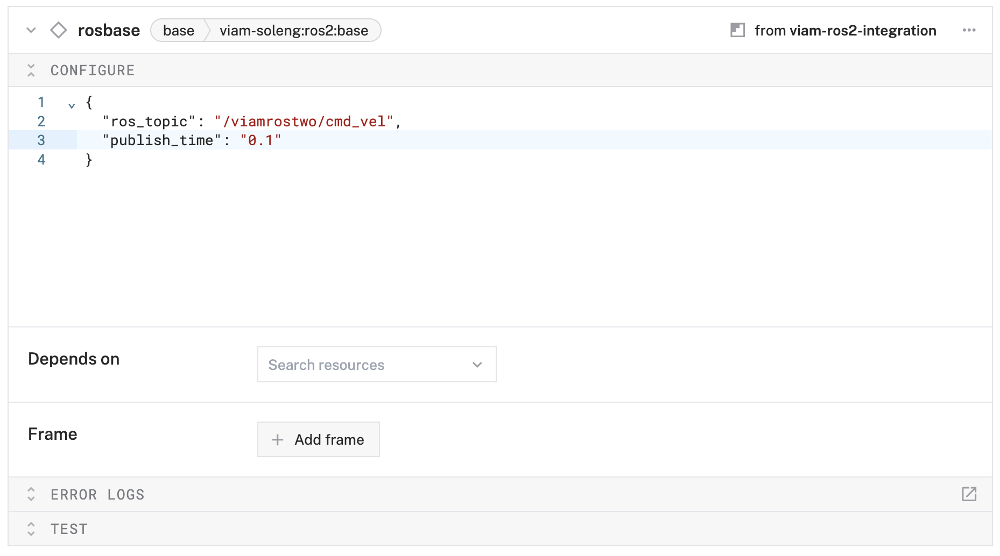
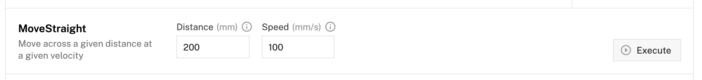

author: HipsterBrown
id: ros2-turtlebot
summary: Use Viam's ROS2 integration to provide cloud robotics features to TurtleBot 4
categories: Getting-Started, Developer
environments: web
status: Published 
feedback link: https://github.com/viam-devrel/viamcodelabs/issues
tags: Getting Started, Developer

# Enable remote teleop and data capture on a ROS2 TurtleBot 
<!-- ------------------------ -->

## Overview 
Duration: 1

The TurtleBot 4 Lite is a powerful ROS2-based mobile robot platform that's perfect for learning robotics, research, and development. By integrating Viam with your TurtleBot, you can unlock powerful remote control capabilities, cloud-based data management, and seamless integration with modern robotics workflows.


In this codelab, we'll transform your TurtleBot 4 Lite into a cloud-connected robot that you can control from anywhere and automatically capture sensor data for analysis and machine learning applications.


### What You'll Build

- A remotely controllable TurtleBot 4 Lite accessible from the Viam web interface, mobile app, and SDKs
- Automated data capture and syncing from camera and status sensors
- Real-time streaming of robot logs

### Prerequisites

- A TurtleBot 4 Lite with ROS2 pre-installed (Humble or Jazzy)
- SSH access to the TurtleBot's onboard Raspberry Pi 4
- Basic familiarity with ROS2 concepts (topics, nodes, messages)
- A computer with network access to your TurtleBot
- Sign up for a free Viam account, and then [sign in](https://app.viam.com/fleet/dashboard) to the Viam app

### What You'll Learn 
- How to prepare a TurtleBot 4 Lite for Viam integration
- How to configure the [viam-ros2-integration module](https://app.viam.com/module/viam-soleng/viam-ros2-integration) for TurtleBot components
- How to control through the Viam web interface
- How to configure automated data capture and cloud sync
- How to monitor robot logs

### What You'll Need

- All the hardware components listed in prerequisites
- Network connectivity between your computer and TurtleBot

<!-- ------------------------ -->
## Prepare your TurtleBot for Viam
Duration: 10

Before integrating Viam with your TurtleBot, we need to configure the ROS2 environment and ensure proper network connectivity.

### Connect to your TurtleBot

1. Power on your TurtleBot 4 Lite and wait for it to fully boot up.
1. Connect to your TurtleBot via SSH. Replace `&lt;TURTLEBOT_IP&gt;` with your robot's IP address:
   ```bash
   ssh ubuntu@<TURTLEBOT_IP>
   ```
   > aside positive
   > **Tip**: You can find your TurtleBot's IP address by checking your router's connected devices or using `nmap` to scan your network.

### Update system packages

1. Update the package lists and upgrade existing packages:
   ```bash
   sudo apt update
   sudo apt upgrade -y
   ```
1. Install Python virtual environment support (required for the Viam module):
   ```bash
   sudo apt install -y python3-venv
   ```
1. Install the ROS2 `cv_bridge` package for camera integration:
   ```bash
   # For ROS2 Humble
   sudo apt install -y ros-humble-cv-bridge
   
   # For ROS2 Jazzy (if applicable)
   sudo apt install -y ros-jazzy-cv-bridge
   ```

### Configure FastDDS for UDP-only mode

Viam requires UDP-only communication, so we need to disable shared memory.

1. Create the FastDDS configuration file:
   ```bash
   sudo nano /etc/turtlebot4/fastdds_rpi.xml
   ```
1. Add the following XML configuration:
   ```xml
   <?xml version="1.0" encoding="UTF-8" ?>
   <dds>
       <profiles xmlns="http://www.eprosima.com/XMLSchemas/fastRTPS_Profiles" >
           <transport_descriptors>
               <transport_descriptor>
                   <transport_id>CustomUdpTransport</transport_id>
                   <type>UDPv4</type>
               </transport_descriptor>
           </transport_descriptors>

           <participant profile_name="turtlebot4_default_profile" is_default_profile="true">
               <rtps>
                   <userTransports>
                       <transport_id>CustomUdpTransport</transport_id>
                   </userTransports>
                   <useBuiltinTransports>false</useBuiltinTransports>
               </rtps>
           </participant>
       </profiles>
   </dds>
   ```
1. Save and exit the file (Ctrl+X, then Y, then Enter).

### Configure the ROS2 namespace

To avoid conflicts with existing ROS2 nodes, we'll set up a dedicated namespace for Viam.

1. Edit the TurtleBot setup file to add our namespace and point to the FastDDS configuration:
   ```bash
   sudo nano /etc/turtlebot4/setup.bash
   ```
1. Add the following lines at the end of the file:
   ```bash
   export ROBOT_NAMESPACE=/viamrostwo
   export FASTRTPS_DEFAULT_PROFILES_FILE=/etc/turtlebot4/fastdds_rpi.xml
   ```
1. Save and exit the file (**Ctrl + X**, then **Y**, then **Enter**).


### Verify ROS2 functionality

1. Source the ROS2 environment:
   ```bash
   source /opt/ros/humble/setup.bash  # or /opt/ros/jazzy/setup.bash
   source /etc/turtlebot4/setup.bash
   ```
1. Check that ROS2 topics are available:
   ```bash
   ros2 topic list
   ```
   You should see topics like `/viamrostwo/cmd_vel`, `/viamrostwo/scan`, etc.


Your TurtleBot is now ready for Viam integration!

<!-- ------------------------ -->
## Create and configure your Viam machine
Duration: 5

### Create your machine in Viam

1. In [the Viam app](https://app.viam.com/fleet/dashboard) under the **LOCATIONS** tab, create a machine by typing in a name like "ros-two" and clicking **Add machine**.
   
1. Click **View setup instructions**.
1. Select the `Linux / Aarch64` platform for the Raspberry Pi, and leave your installation method as [`viam-agent`](https://docs.viam.com/manage/reference/viam-agent/).
   
1. Use the `viam-agent` to download and install `viam-server` on your TurtleBot. Follow the instructions to run the command provided in the setup instructions from the SSH prompt of your TurtleBot.
   
1. The setup page will indicate when the machine is successfully connected.
   

<!-- ------------------------ -->
## Configure robot components
Duration: 15

Now we'll configure the individual components that make up your TurtleBot system.

### Configure the base component

The base component will allow you to control the TurtleBot's movement.

1. Click the **+** icon in the left-hand menu and select **Component or service**.
   
1. Select `base`, then search for "ros" and select the `viam-soleng:ros2:base` model.
   
1. When prompted for the `viam-soleng:viam-ros2-integration` module, click **Add module**.
   
1. Name it `rosbase` and click **Create**.
   
1. In the **Attributes** section, configure:
   ```json
   {
     "ros_topic": "/viamrostwo/cmd_vel",
     "publish_rate": "0.1"
   }
   ```
   
1. Click on the JSON tab in the left sidebar above your machine name to display the full configuration JSON for your machine.
   <br/>
   
1. Configure the `viam-soleng:viam-ros2-integration` module environment variables by adding an `env` field with the relevant config, which should look like the following:
   ```json
   {
     "type": "registry",
     "name": "viam-soleng_viam-ros2-integration",
     "module_id": "viam-soleng:viam-ros2-integration",
     "version": "latest",
     "env": {
       "ROS_ENV": "/opt/ros/humble/setup.bash",
       "OVERLAYS": "/etc/turtlebot4/setup.bash",
       "VIAM_ROS_NAMESPACE": "/viamrostwo",
       "FASTRTPS_DEFAULT_PROFILES_FILE": "/etc/turtlebot4/fastdds_rpi.xml"
     }
   }
   ```
1. Click **Save** in the top right to save your configuration.

### Configure the camera component

1. Click the **+** icon in the left-hand menu and select **Component or service**.
1. Select `camera`, then search for and select the `viam-soleng:ros2:camera` model.
1. Name it `roscamera` and click **Create**.
1. In the **Attributes** section, configure:
   ```json
   {
     "ros_topic": "/viamrostwo/oakd/rgb/preview/image_raw",
     "encoding": "rgb8"
   }
   ```
   

### Configure the battery status sensor

1. Click the **+** icon in the left-hand menu and select **Component or service**.
1. Select `sensor`, then search for and select the `viam-soleng:ros2:sensor` model.
1. Name it `battery_state` and click **Create**.
1. In the **Attributes** section, configure:
   ```json
   {
     "ros_topic": "/viamrostwo/battery_state",
     "ros_msg_package": "sensor_msgs.msg",
     "ros_msg_type": "BatteryState"
   }
   ```
   

### Configure the dock status sensor

1. Click the **+** icon in the left-hand menu and select **Component or service**.
1. Select `sensor`, then search for and select the `viam-soleng:ros2:sensor` model.
1. Name it `dock_status` and click **Create**.
1. In the **Attributes** section, configure:
   ```json
   {
     "ros_topic": "/viamrostwo/dock_status",
     "ros_msg_package": "irobot_create_msgs.msg",
     "ros_msg_type": "DockStatus"
   }
   ```
   

### Configure the wheel status sensor

1. Click the **+** icon in the left-hand menu and select **Component or service**.
1. Select `sensor`, then search for and select the `viam-soleng:ros2:sensor` model.
1. Name it `wheel_status` and click **Create**.
1. In the **Attributes** section, configure:
   ```json
   {
     "ros_topic": "/viamrostwo/wheel_status",
     "ros_msg_package": "irobot_create_msgs.msg",
     "ros_msg_type": "WheelStatus"
   }
   ```
   

Click **Save** to apply all your component configurations.

Your Viam machine is now configured with ROS2 integration capabilities!

<!-- ------------------------ -->
## Configure data capture and cloud sync
Duration: 8

Now we'll set up automated data capture for your robot's sensors and camera, with automatic sync to the Viam cloud.

### Add the data management service

1. In the Viam app, click the **+** icon in the left-hand menu and select **Component or service**, and then `data management`.
1. **Create** a new [Data Management service](https://docs.viam.com/services/data/) called `datacapture`.
1. Notice adding this service adds the data manager service called `datacapture`. It will default to the "Capturing" and "Syncing" toggles as enabled.
1. In the "Additional paths" field of the **Cloud sync** section, type `/opt/rosbags` and hit the Enter key to also sync your [rosbag files](https://docs.ros.org/en/humble/Tutorials/Advanced/Recording-A-Bag-From-Your-Own-Node-Py.html).
   
1. Click **Save** in the top right. This may take a moment to apply your configuration changes.

### Configure camera data capture

1. Navigate to your `roscamera` component.
1. In the **Data capture** section, click **Add method**.
1. Configure the capture settings:
   - **Method**: `GetImage`
   - **Frequency (hz)**: `0.1` (capture one image every 10 seconds)
   - **MIME type**: `image/jpeg`
   

### Configure sensor data capture

1. Navigate to your `battery_state` component.
1. In the **Data capture** section, click **Add method**.
1. Configure:
   - **Method**: `Readings`
   - **Frequency (hz)**: `0.5` (capture every 30 seconds)
   

1. Repeat the same process for `dock_status` and `wheel_status` sensors with the same frequency.

### Verify data capture configuration

1. Click **Save** to apply all configurations.
1. Navigate to the **CONTROL** tab to verify all components are working.
1. Check that your camera shows a live feed and sensors display current readings.

Your TurtleBot will now automatically capture and sync data to the Viam cloud!

<!-- ------------------------ -->
## Configure ROS2 logger service
Duration: 5

The ROS2 logger service will stream your robot's debug logs directly to Viam for real-time monitoring.

### Add the ROS2 logger service

1. Click the **+** icon in the left-hand menu and select **Component or Service**.
1. Search for `ros2_logger` and select the `viam-soleng:ros2:logger` model.
1. Name it `ros2_logger` and click **Create**.
1. In the **Attributes** section, configure:
   ```json
   {
     "ros_topic": "/rosout",
     "log_level": "debug"
   }
   ```
   

### Test the logger service

1. Click **Save** to apply the configuration.
1. Navigate to the **LOGS** tab in the Viam app.
1. You should start seeing ROS2 log messages appearing in the Viam logs interface.
   

The logger service will now stream all ROS2 system messages with "debug" level and above directly to Viam for easy monitoring and debugging.

<!-- ------------------------ -->
## Control your TurtleBot remotely
Duration: 5

Now comes the exciting part - controlling your TurtleBot from anywhere using the Viam web interface!

### Test basic movement

1. Navigate to the **CONTROL** tab in the Viam app.
1. Find your `rosbase` component card.
1. Use the **Quick move** buttons to test basic movements:
   - Click **Forward** to move the robot forward
   - Click **Backward** to move the robot backward  
   - Click **Left** and **Right** to turn the robot
   

### Enable keyboard control

1. In the base component control card, toggle **Keyboard control** to ON.
1. Now you can use your computer's keyboard to drive the TurtleBot:
   - **W** or **↑**: Move forward
   - **S** or **↓**: Move backward
   - **A** or **←**: Turn left
   - **D** or **→**: Turn right
   

### Test advanced movements

1. Try the **Move straight** function:
   - Set distance (in mm) and velocity
   - Click **Execute** to move a precise distance
   

### Monitor live camera feed

1. Scroll to your `roscamera` component.
1. Set the refresh dropdown to "Live" to see the live camera feed from your TurtleBot.
   
1. You can now see what your robot sees while driving it remotely!

<video id="Wh7e9AMrIXE"></video>

Your TurtleBot is now fully controllable from Viam.


<!-- ------------------------ -->
## View captured data
Duration: 5

Let's explore the data your TurtleBot has been automatically capturing and syncing to the cloud.

### Access the data tab

1. In the Viam app, click on the document icon in the top-right of the machine configuration page to view captured data.
1. You'll see **Images** section by default to view photos captured by your TurtleBot's camera.
1. You can:
   - View individual images with timestamps
   - Filter by date range
   - Search by tags
   - Annotate for machine learning training
   

### Review sensor data

1. Click on the **Sensors** section to view captured sensor readings.
1. You'll see data from:
   - Battery status (charge level, voltage, temperature)
   - Dock status (whether robot is docked)
   - Wheel status (motor health and performance)
1. Data is displayed in a JSON format and can be queried using SQL or MQL by clicking on the "Query" in the top-right of your machine card.
   

Your TurtleBot's data is now safely stored in the cloud and ready for analysis!

<!-- ------------------------ -->
## Conclusion and Next Steps
Duration: 2

Congratulations! 🎉 You've successfully transformed your TurtleBot 4 Lite into a cloud-connected, remotely controllable robot with automated data capture capabilities.

The combination of TurtleBot's robust hardware platform, ROS2's flexible software ecosystem, and Viam's cloud-native robotics tools provides an incredibly powerful foundation for your robotics projects.

### What You've Accomplished

- **Remote Control**: Your TurtleBot can now be operated from anywhere via the Viam web interface
- **Data Collection**: Automated capture of camera images and sensor readings with cloud sync
- **Real-time Monitoring**: Live streaming of ROS2 logs and robot telemetry
- **Cloud Integration**: Seamless data storage and access through Viam's platform

### Expanding Your Robot's Capabilities

Now that you have the foundation in place, consider these exciting next steps:

**Computer Vision & AI**
- Add object detection models to identify and track people or objects
- Train custom machine learning models using your captured image data

**Advanced Sensors**
- Integrate the TurtleBot's lidar for mapping and obstacle avoidance
- Add the IMU sensor for better motion tracking and stability

**Automation & Scheduling**
- Set up alerts based on sensor thresholds (low battery, obstacles, etc.)
- Build custom workflows that respond to specific conditions

**Fleet Management**
- Scale to multiple TurtleBots for coordinated tasks
- Implement centralized monitoring and control
- Share data and models across your robot fleet

### Real-World Applications

Your enhanced TurtleBot setup opens doors to numerous practical applications:

- **Security & Surveillance**: Automated security patrols with real-time alerts
- **Research & Education**: Data collection for robotics research and classroom demos  
- **Facility Monitoring**: Regular inspections of warehouses, offices, or outdoor spaces
- **Environmental Sensing**: Mobile data collection for IoT and environmental studies

### Resources for Continued Learning

- [Integrate your ROS2 robot with Viam](https://www.viam.com/post/integrate-your-ros2-robot-with-viam) - Blog post covering why we built this integration and how it works.
- [Viam Documentation](https://docs.viam.com/) - Complete guides and API references
- [Viam Community Discord](http://discord.gg/viam) - Connect with other robotics developers
- [TurtleBot 4 Documentation](https://turtlebot.github.io/turtlebot4-user-manual/) - Hardware specifics and advanced configurations
- [ROS2 Humble Documentation](https://docs.ros.org/en/humble/) - Deep dive into ROS2 concepts
