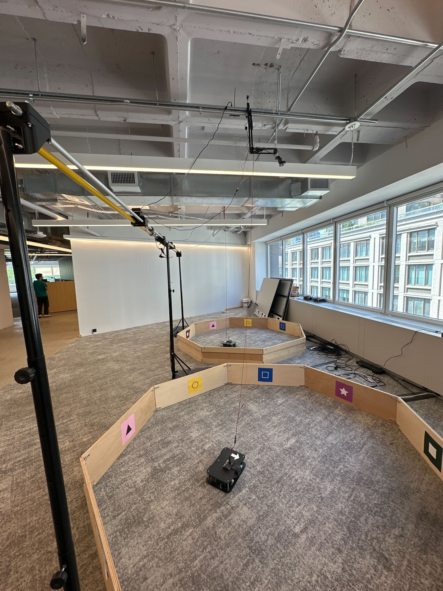
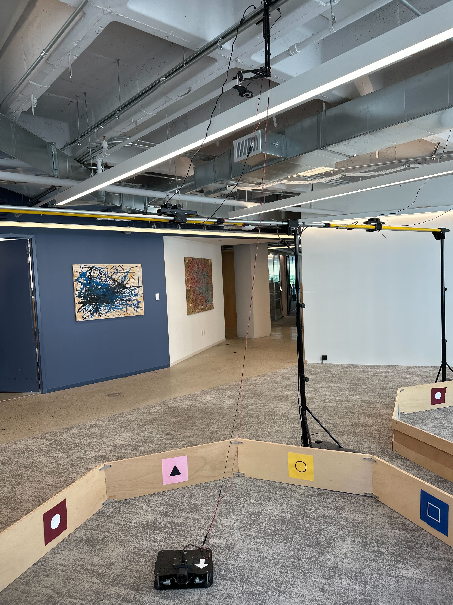

author: Joyce
id: rover-power
summary: Switch from batteries to wired power
categories: Getting-Started, Developer
environments: web
status: Published
feedback link: https://github.com/viam-devrel/viamcodelabs/issues
tags: Getting Started, Developer, Data

# Upgrade Viam Rover 2 to use wired or RC power

<!-- ------------------------ -->

## Overview

Duration: 1

This guide walks you through replacing the default 18650 battery pack in the [Viam Rover 2](https://www.viam.com/resources/rover) with a more reliable power source: a wired 15V DC supply or an RC LiPo battery. This is ideal for testing, long runtimes, or lab setups where battery charging is a hassle.

### What You'll Build

- A Viam Rover 2 powered by either a wired DC supply (or an RC LiPo battery) that doesn't require constant recharging

  

### Prerequisites

- 1 - A Viam Rover 2 with the stock power management board
- 1 - A 15V DC power supply or a 3S LiPo RC battery (11.1V nominal, 12.6V max)
- 1 - A barrel jack to screw terminal adapter (5.5mm/2.1mm)
- 1 - Phillips screwdriver
- 1 - Flathead screwdriver
- 2 - Jumper wires (18 AWG or thicker recommended for power)

### What You'll Learn

- How to safely disconnect the 18650 battery pack
- How to identify and wire into the VIN terminal on the Rover’s power management board
- How to power on and test the rover with an external source

### What You'll Need

- The hardware components listed above
- A safe workspace to disconnect and reconnect wires
- Basic knowledge of polarity and screw terminal wiring

<!-- ------------------------ -->

## Power off and remove batteries

Duration: 2

### Remove batteries and battery input

1. **Power off**: Power off the rover and unplug any power cables.
1. **Remove cover**: Remove the top cover of the Viam rover base so you can more easily access the internals.
1. **Remove batteries**: Remove the four 18650 batteries from the compartment underneath the Viam rover.
   
1. **Identify the VIN terminal**: Identify the battery input terminal block. It is the upper PCB in the corner of the base, which contains two screw terminal blocks labeled VIN and VOUT. Find the one labeled VIN.
   
   
1. **Remove wires**: Unscrew and remove the battery wires from the battery input terminal block (VIN). Optionally, you can tape off the loose ends to avoid accidental shorts.
1. The terminal labeled VIN is where your new power source will connect.

<!-- ------------------------ -->

## Prepare Your New Power Supply

Duration: 2

> aside negative
> Do not connect both the batteries and external power at the same time. Make sure you have completed the previous steps to remove the batteries.

### Wired 15V DC Supply

1. Plug your DC power supply into the barrel jack-to-screw terminal adapter.
1. Connect two jumper wires. Double-check polarity before applying. Power—reversed connections can damage your board. In the example below, the power (positive) wire is brown instead of a typical red color.
   - Brown (positive) wire to +
   - Black (ground) wire to –
     

> aside positive
> **RC LiPo Battery (3S)**
>
> - Connect the battery’s output leads to a screw terminal adapter.
> - Ensure polarity is correct. If using a LiPo battery, use a voltage alarm to avoid over-discharge.
>   - Red to +
>   - Black to –

<!-- ------------------------ -->

## Connect to the Rover

Duration: 2

### Connect power supply to the rover

1. Insert the brown (positive) wire into the VIN + terminal on the rover's upper PCB.
1. Insert the black (ground) wire into the VIN – terminal.
1. Tighten both screws firmly.

   

### Power On and Test

1. Plug in the power supply or connect the RC battery.
1. Observe the onboard voltage display should show the inbound voltage. The Viam Rover 2 has a buck converter to safely downgrades the voltage to 12V.
1. Confirm the rover powers on normally.

   

<!-- ------------------------ -->

## Finishing touches

Duration: 2

### Wired setup

For bench testing, navigating with a wired power supply can be awkward.

Depending on your power supply form factor, you may want to mount various components directly on top of the Viam Rover. You can also tape down wires to prevent them from coming loose or use wire fasteners to keep cables tidy.

- **Wall adapter connection**: Position the rover so the cable exits like a tail. However, this can still restrict movement and steering.
- **Ceiling-mounted cable**: In the Viam NY robotics lab, a ceiling-mounted adapter allows public users to reserve and operate a rover without cable interference. [Try Viam](https://app.viam.com/try) if you want to see it in action.

  

### RC battery setup

For mobile operation using a 3S LiPo battery, mount the battery securely on top of the Viam Rover. This enables untethered movement and avoids the limitations of a wired setup.

<!-- ------------------------ -->

## Next Steps

Duration: 1

### What You Learned

- How to safely disconnect the 18650 battery pack
- How to identify and wire into the VIN terminal on the Rover’s power management board
- How to power on and test the rover with an external source

### Keep learning with Viam

Now that you have a much longer runtime, this opens up all sorts of possibilities to explore.

- [Build a Computer Vision Rover](https://docs.viam.com/tutorials/services/webcam-line-follower-robot/) – Build an RGB line follower robot.
- [Control a Rover with TypeScript](https://codelabs.viam.com/guide/drive-rover-ts/index.html) – Create a custom web app to drive your rover from a browser.
- [Add a Robotic Arm](https://docs.viam.com/tutorials/services/plan-motion-with-arm-gripper/) – Attach and control an arm for pick-and-place automation.

### Additional resources

- [Viam Documentation](https://docs.viam.com/) - Complete guides and API references
- [Viam Community Discord](http://discord.gg/viam) - Connect with other robotics developers
- [Other hands-on Viam codelabs](https://codelabs.viam.com/)
