author: Nick Hehr
id: scuttle-base
summary: Configure Viam to drive a SCUTTLE base
categories: Getting-Started, Developer
environments: web
status: Published 
feedback link: https://github.com/viam-labs/viamcodelabs/issues
tags: Getting Started, Developer, Scuttle, Rover

# Build a SCUTTLE bot
<!-- ------------------------ -->
## Overview 
Duration: 2

Mobile robots come in all shapes and sizes, but most kits come with a pre-defined platform that are tough to change for custom use cases.
The [SCUTTLE](https://www.scuttlerobot.org/) (Sensing, Connected, Utility Transport Taxi for Level Environments) is a modular, open source robotics base for building mobile robots that puts you in control with 3D printed parts, extruded aluminum, and DIN railing.
When combined with Viam, you can compose hardware and software to build the smart, roving robot of your dreams.

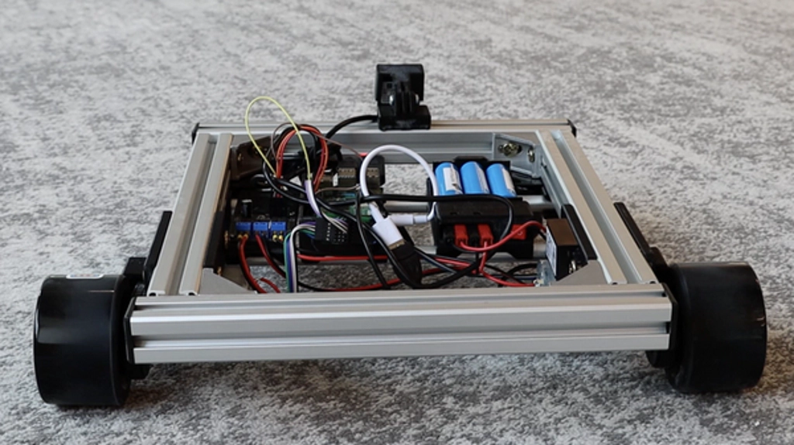

### Prerequisites
- Sign up for a free Viam account, and then [sign in](https://app.viam.com/robots/) to the Viam app
- Hardware and supplies requirements
  - 1 - [Raspberry Pi 4 Model B](https://www.amazon.com/seeed-studio-Raspberry-Computer-Workstation/dp/B07WBZM4K9)
  - 1 - microSD card to use with your Pi, at least 32GB
  - 20 - jumper wires to connect the motor driver and encoders to the Pi
  - 1 - [Assembled SCUTTLE v3.0 Robot](https://www.scuttlerobot.org/product/scuttle-v3/), includes
    - robot framing kit
    - cables for power, motor, and encoders
    - USB wide-angle camera
    - wireless gamepad controller
    - power pack w/ 3S Lithium-ion batteries
    - power converter for 12V to 5V USB-C
    - 12V motors and high-resolution encoders
    

For assembly instructions, follow the [SCUTTLE Assembly Guide](https://www.scuttlerobot.org/resource/guide/assembly-parts-guide/).

### What You’ll Learn 
- How to wire up a SCUTTLE to a Raspberry Pi
- How to configure components to control SCUTTLE hardware with Viam
- How to drive a SCUTTLE base from the Viam web application

### What You’ll Need 
- A computer with MacOS, Windows, or Linux

### What You’ll Build 
- A remote-controllable mobile robot that can be extended with computer vision and additional sensors

### Watch the Video

Follow along with the step-by-step video.

<!-- ------------------------ -->
## Set up your Raspberry Pi
Duration: 6

The Raspberry Pi boots from a microSD card. You need to install Raspberry Pi OS on the microSD card that you will use with your Pi. For more details about alternative methods of setting up your Raspberry Pi, refer to the [Viam docs](https://docs.viam.com/installation/prepare/rpi-setup/#install-raspberry-pi-os).

### Install Raspberry Pi OS
1. Connect the microSD card to your computer.
1. Download the [Raspberry Pi Imager](https://www.raspberrypi.com/software/) and launch it.
1. Click **CHOOSE DEVICE**. Select your Pi model, which is Raspberry Pi 4.
1. Click **CHOOSE OS**. Select **Raspberry Pi OS LITE (64-bit)** from the menu.
1. Click **CHOOSE STORAGE**. From the list of devices, select the USB flash drive you intend to use in your Raspberry Pi.
  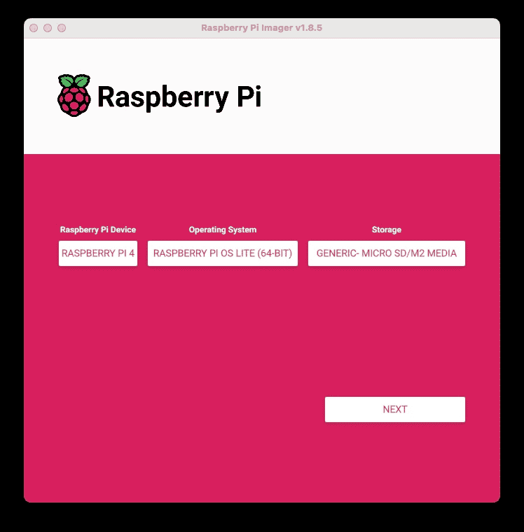
1. Configure your Raspberry Pi for remote access. Click **Next**. When prompted to apply OS customization settings, select **EDIT SETTINGS**.
1. Check **Set hostname** and enter the name you would like to access the Pi by in that field, for example, `scuttle`.
1. Select the checkbox for **Set username and password** and set a username (for example, your first name) that you will use to log into the Pi. If you skip this step, the default username will be `pi` (not recommended for security reasons). And specify a password.
1. Connect your Pi to Wi-Fi so that you can run `viam-server` wirelessly. Check **Configure wireless LAN** and enter your wireless network credentials. SSID (short for Service Set Identifier) is your Wi-Fi network name, and password is the network password. Change the section `Wireless LAN country` to where your router is currently being operated.
  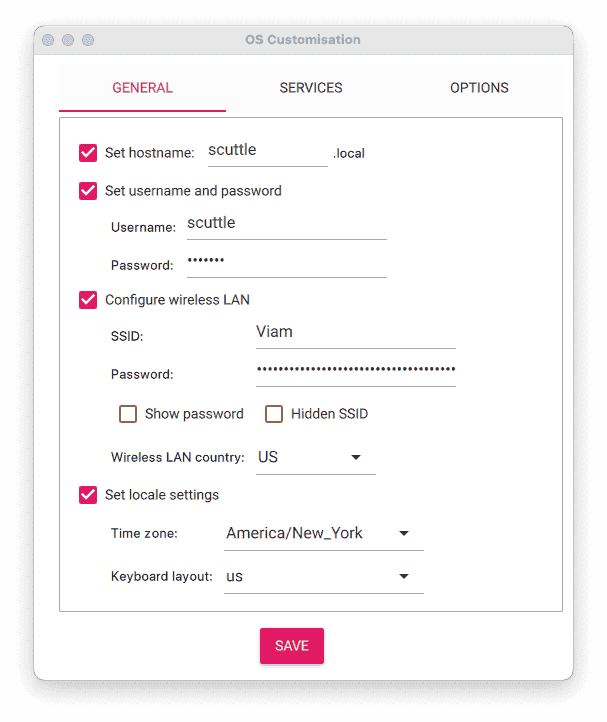
1. Select the **SERVICES** tab, check **Enable SSH**, and select **Use password authentication**.
    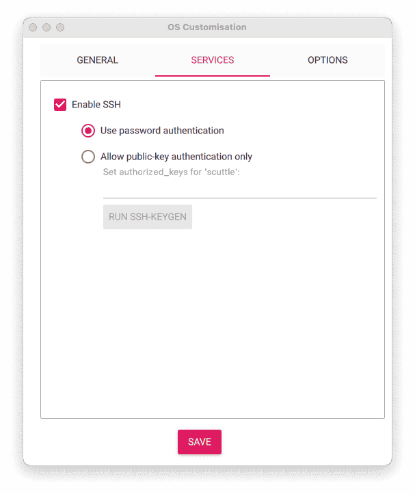
    > aside negative
    > Be sure that you remember the `hostname` and `username` you set, as you will need this when you SSH into your Pi.
1. **Save** your updates, and confirm `YES` to apply OS customization settings. Confirm `YES` to erase data on the microSD card. You may also be prompted by your operating system to enter an administrator password. After granting permissions to the Imager, it will begin writing and then verifying the Linux installation to the microSD card.
1. Remove the microSD card from your computer when the installation is complete.

### Connect with SSH

1. Place the microSD card into your Raspberry Pi and boot the Pi by plugging it into an outlet. A red LED will turn on to indicate that the Pi is connected to power.
1. Once the Pi is started, connect to it with SSH. From a command line terminal window, enter the following command. The text in <> should be replaced (including the < and > symbols themselves) with the user and hostname you configured when you set up your Pi.
    ```bash
    ssh <USERNAME>@<HOSTNAME>.local
    ```
1. If you are prompted “Are you sure you want to continue connecting?”, type “yes” and hit enter. Then, enter the password for your username. You should be greeted by a login message and a command prompt.
1. Update your Raspberry Pi to ensure all the latest packages are installed
    ```bash
    sudo apt update
    sudo apt upgrade
    ```

### Enable communication protocols

1. Launch the Pi configuration tool by running the following command
    ```bash
    sudo raspi-config
    ```
1. Use your keyboard to select “Interface Options”, and press return.
    
1. [Enable the relevant protocols](https://docs.viam.com/installation/prepare/rpi-setup/#enable-communication-protocols) to support our hardware. Since you are using encoders that communicate over I<sup>2</sup>C, enable **I2C**.
  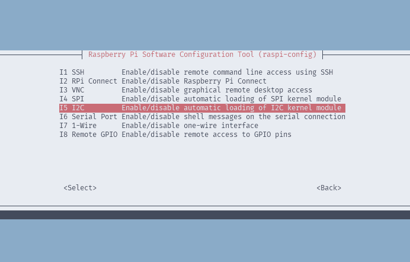
1. Confirm the options to enable the I<sup>2</sup>C interface. And shut down the Pi when you're finished.
    ```bash
    sudo shutdown -h now
    ```

<!-- ------------------------ -->
## Connect Raspberry Pi to SCUTTLE components
Duration: 5

The Raspberry Pi mounts to the SCUTTLE base on a custom bracket along the DIN rail between the motor driver and batteries.


Once it has been mounted using the screws included with the SCUTTLE kit, you can wire the Raspberry Pi to the motor driver board and I<sup>2</sup>C breakout board that connects the AMS5048B encoders over a single [bus](https://en.wikipedia.org/wiki/I%C2%B2C).

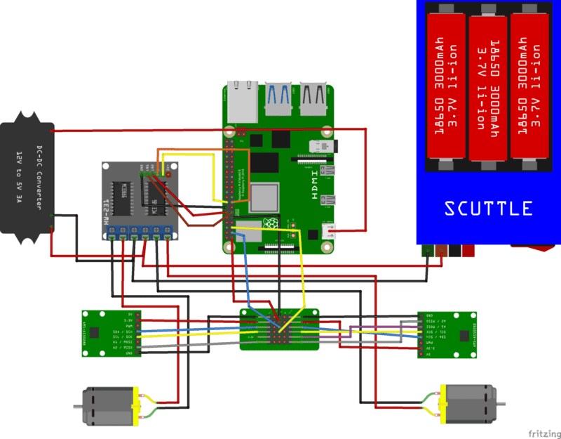

> aside positive
> The website [pinout.xyz](https://pinout.xyz/) is a helpful resource with the exact layout and role of each pin for Raspberry Pi.

1. Connect Raspberry Pi to I<sup>2</sup>C breakout (the SCUTTLE kit may include a braid of jumpers for connecting these components):

- Pin 1 (3.3v Power) to Cmps 3.3v
- Pin 3 (I2C1 SDA) to Cmps SDA
- Pin 5 (I2C1 SCL) to Cmps SCL
- Pin 9 (Ground) to Cmps GND

2. Raspberry Pi to HW-231 Motor Driver (the SCUTTLE kit may include a braid of jumpers for connecting these components):

- Pin 11 (GPIO 11) to LN1
- Pin 12 (GPIO 18) to LN2
- Pin 14 (Ground) to GND
- Pin 15 (GPIO 22) to LN3
- Pin 16 (GPIO 23) to LN4

3. Connect the webcam USB-A cable to any of the USB-A ports on the Raspberry Pi.

4. Connect the 12v to 5v power converter USB-C cable to the USB-C power port on the Raspberry Pi.

<form>
  <name>How does the Raspberry Pi communicate with the encoders?</name>
  <input type="radio" value="WiFi">
  <input type="radio" value="I2C">
  <input type="radio" value="Serial">
  <input type="radio" value="MQTT">
</form>

<!-- ------------------------ -->
## Create your machine in Viam
Duration: 3

### Create your machine in Viam

1. In [the Viam app](https://app.viam.com/fleet/machines), create a machine by typing in a name and clicking **Add machine**. 
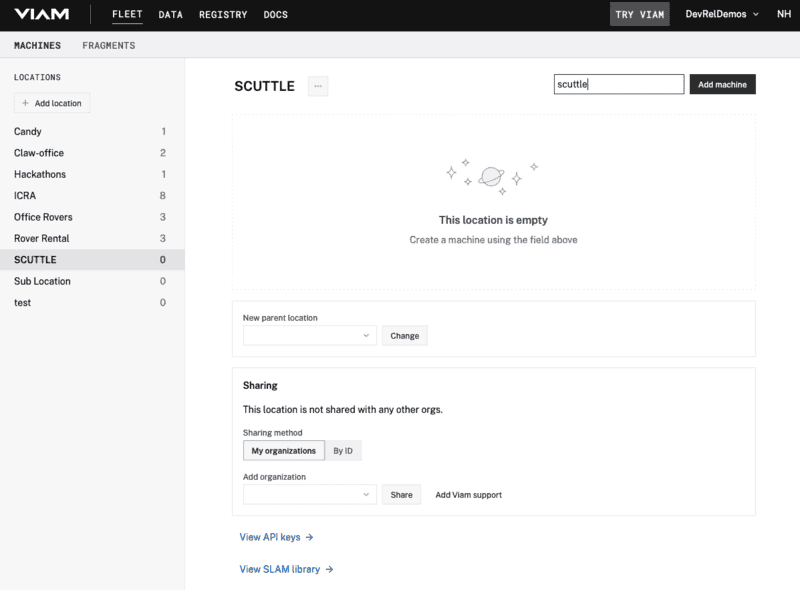
1. Click **View setup instructions**.
1. Select the `Linux / Aarch64` platform for the Raspberry Pi to control the SCUTTLE, and leave your installation method as [`viam-agent`](https://docs.viam.com/how-tos/provision-setup/#install-viam-agent).
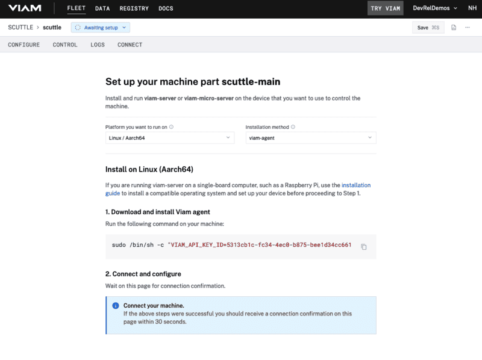
1. Use the `viam-agent` to download and install `viam-server` on your Raspberry Pi. Follow the instructions to run the command provided in the setup instructions from the SSH prompt of your Raspberry Pi.

Once this process has completed, the page will indicate that the machine is connected to Viam app and **Live**.

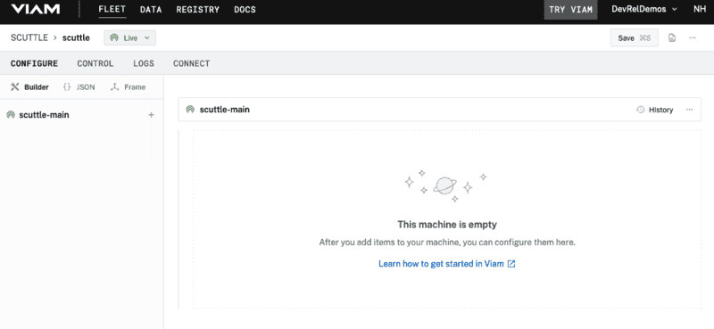

<!-- ------------------------ -->
## Configure your components
Duration: 5

### Configure the board component

The [`board` component](https://docs.viam.com/components/board/) provides access to the [GPIO](https://learn.sparkfun.com/tutorials/raspberry-gpio/all) pins on the Raspberry Pi.

1. From the **Configure** tab in the Viam app, click on the **+** icon in the left-hand menu, select **Component**, and search for "pi":
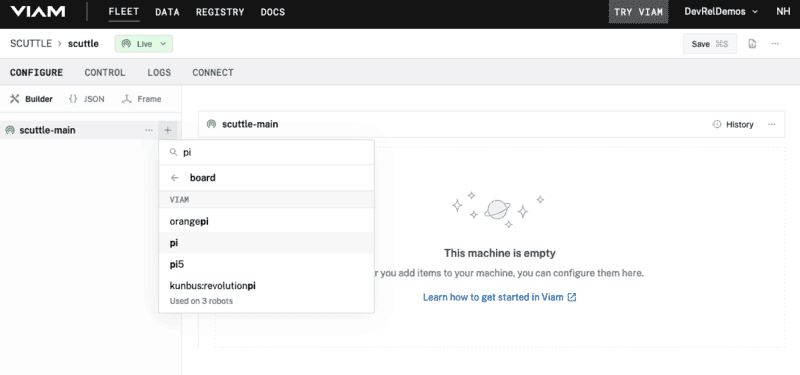
1. Select the `pi` module and provide a memorable name, like "pi". Click **Create**.
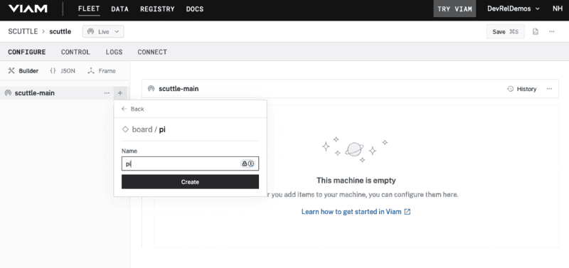
1. A component card will appear on the right-hand side. It does not require any additional configuration in the card.


### Configure the encoder components

The [`encoder` component](https://docs.viam.com/components/encoder/) enables reading the encoder data through the I<sup>2</sup>C bus on the Raspberry Pi.

1. Click the **+** icon, select **Component**, and search for "encoder".

1. Select the `AMS-AS5048` module and provide a memorable name, like "right-encoder". Click **Create**.
1. A component card will appear on the right-hand side with the name you entered. In the **Attributes** field for `connection_type`, enter "i2c". Then click **Show more** to reveal the `i2c_attributes` fields; enter "65" for the `i2c_addr` and "1" for the `i2c_bus`.

1. Hover your mouse over the name of the right encoder component on the left sidebar and click on the **...** to reveal an action menu. Select **Duplicate** to create a copy of the component for the left encoder in the configuration.
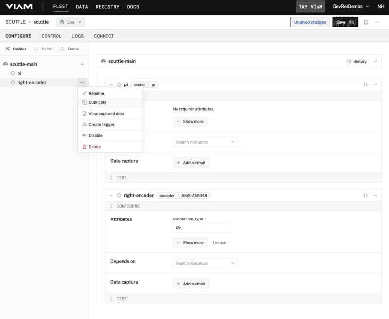
1. A new component card will appear with the name of the right encoder component plus "-copy". Click on the name and rename it to something memorable, like "left-encoder".
1. Click on **Show more** in the left encoder **Attributes** and update the `i2c_addr` field to "64".


### Configure the motor components

The [`motor` component](https://docs.viam.com/components/motor/) enables controlling the 12v motors through the [GPIO](https://learn.sparkfun.com/tutorials/raspberry-gpio/all) pins on the Raspberry Pi. Each motor will be configured to work with an encoder to keep track of speed and direction when moving around.

1. Click the **+** icon, select **Component**, and search for "gpio".
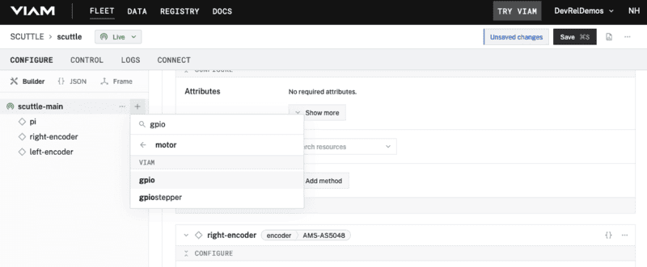
1. Select the `gpio` motor module and provide a memorable name, like "right-motor". Click **Create**.
1. A component card will appear on the right-hand side with the name you entered. In the **Attributes** field for `board`, select the name of your board component (i.e. "pi"). Click on **Show more** to reveal the additional fields; select "right-encoder" for the `encoder` dropdown and enter "2" for the `ticks_per_rotation`. Under the **Component pin assignment** section, select "Ln1/Ln2" for `Type`; enter "16" for `a` and "15" for `b`. 
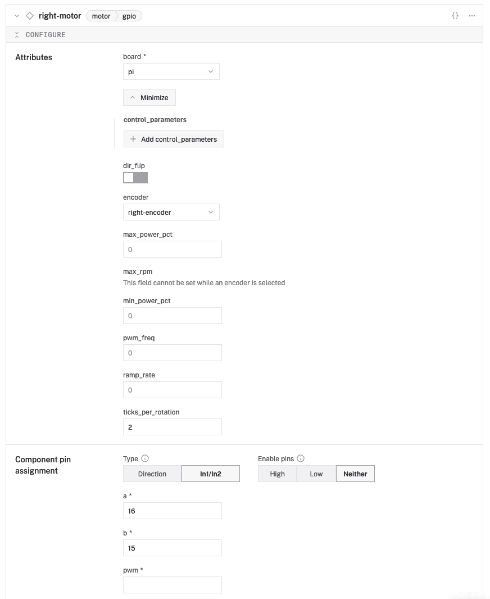
1. Hover your mouse over the name of the right motor component on the left sidebar and click on the **...** to reveal an action menu. Select **Duplicate** to create a copy of the component for the left motor in the configuration.
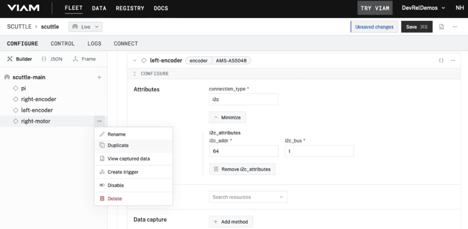
1. A new component card will appear with the name of the right motor component plus "-copy". Click on the name and rename it to something memorable, like "left-motor".
1. Click on **Show more** in the left motor **Attributes** and update the `encoder` field to "left-encoder". Under **Component pin assignment**, set `a` to "12" and `b` to "11".
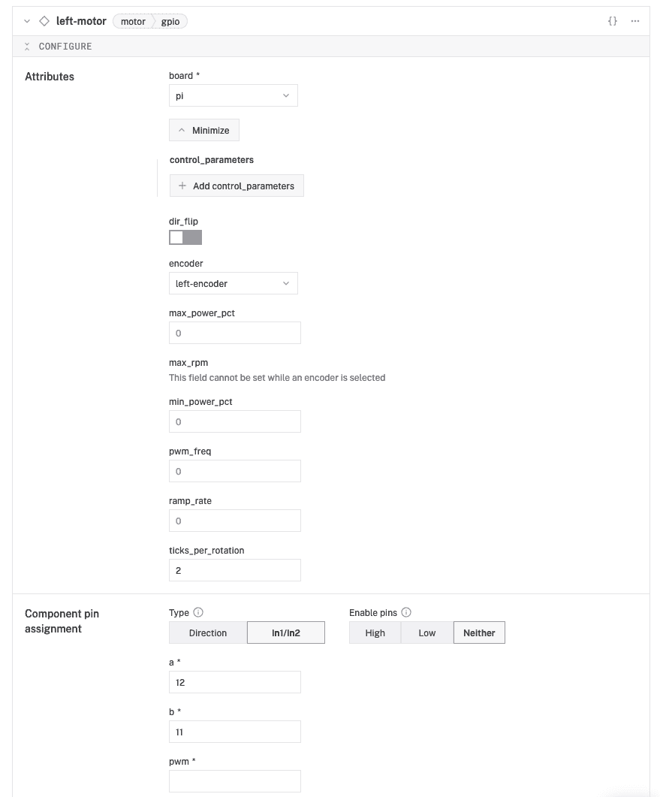


### Configure the base component

The [`base` component](https://docs.viam.com/components/base/) combines the motor components into a single entity that has built-in logic for controlling 2+ wheeled robots, for example turning a certain direction or speed.

1. From the **Configure** tab in the Viam app, click on the **+** icon in the left-hand menu, select **Component**, and search for "wheeled":
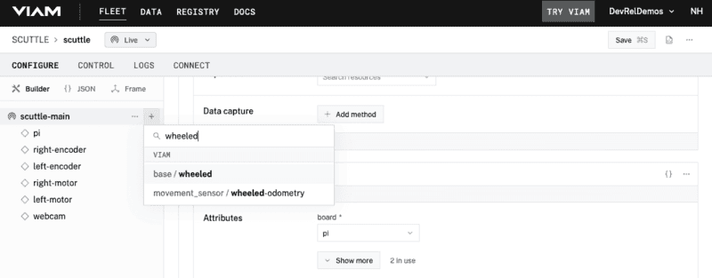
1. Select the base / `wheeled` module and provide a memorable name, like "base". Click **Create**.
1. A component card will appear on the right-hand side. In the **Attributes** field for `left` and `right`, select the appropriate motor component; in the `wheel_circumference_mm` field, enter "250" and, in the `width_mm` field, enter "400". The width is measured between the middle of each wheel in millimeters.
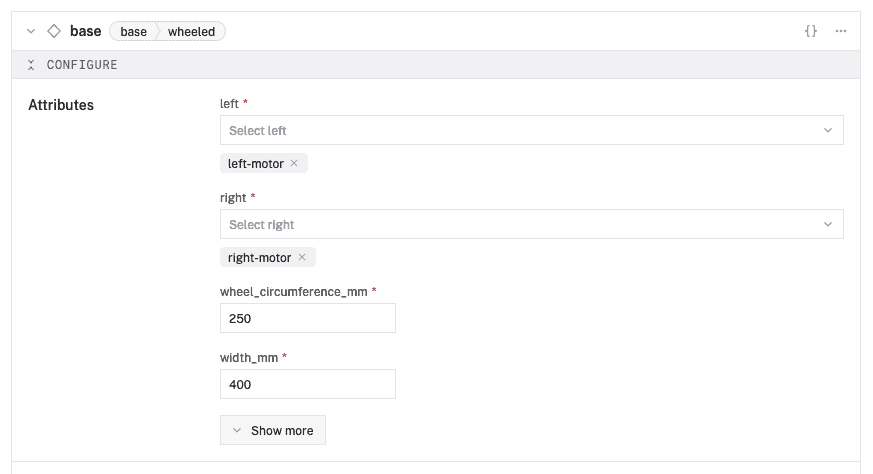

### configure the camera component

Finally, the [`camera` component](https://docs.viam.com/components/base/) provides access to the USB camera connected to the Raspberry Pi.

1. From the **Configure** tab in the Viam app, click on the **+** icon in the left-hand menu, select **Component**, and search for "webcam":
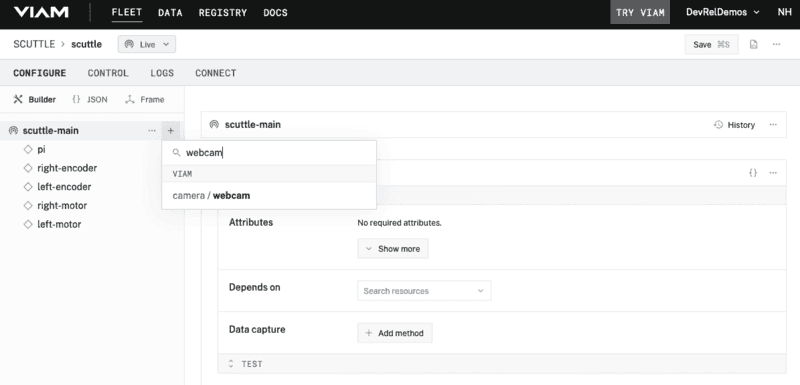
1. Select the camera / `webcam` module and provide a memorable name, like "webcam". Click **Create**.
1. A component card will appear on the right-hand side. In the **Attributes** field for `video_path`, enter "/dev/video0".


Remember to click on the **Save** button at the top once you've completed the configuration. Now it's time to take control of your robot!

<!-- ------------------------ -->
## Control your SCUTTLE
Duration: 2

### Test the base

Click on the **Control** tab to view the remote control cards for each of the configured components. The `base` controls provide several actions, including **Quick move** for going forwards or backwards, turning left or right by clicking on the available buttons. Toggling **Keyboard control** will let you use your computer keyboard's arrow keys or W,A,S,D keys to drive the SCUTTLE!

> aside negative
> Make sure the SCUTTLE has enough room to move around without hitting anyone or anything.

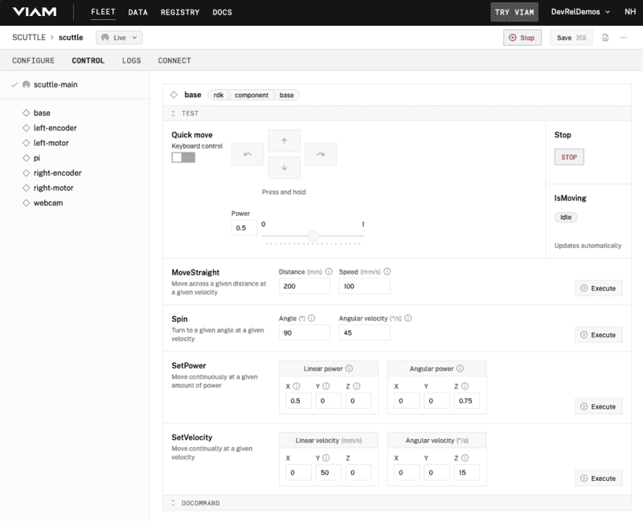

Try out some of the other actions like moving straight for a set distance and speed, or spinning around.

### Test the camera

From the **Control** tab, click on the name of your camera component in the left sidebar to scroll to the associated control card. Activate the View toggle to see a live feed of what your SCUTTLE sees!

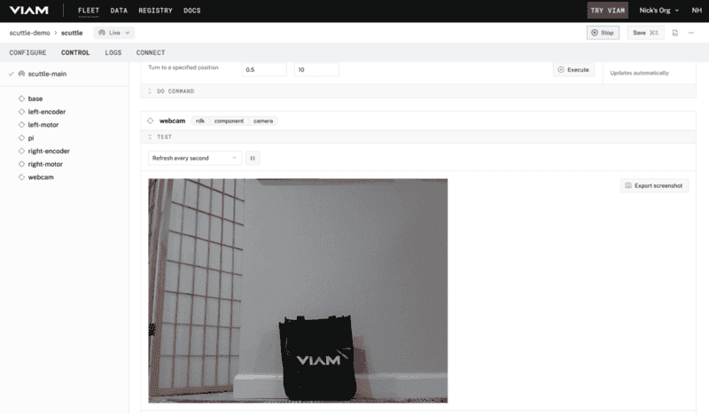

Hovering over the camera stream or to the right-hand side of it, click on the picture-in-picture button to keep the camera stream in view while driving the base from its control card.

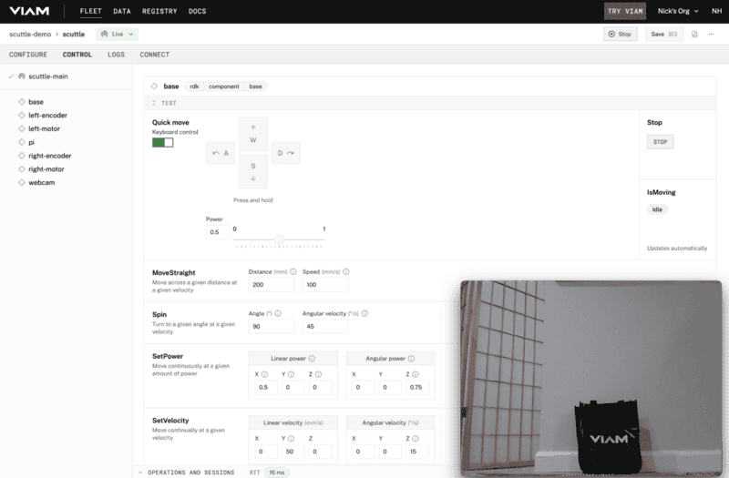

<!-- ------------------------ -->
## Next Steps
Duration: 1

Congrats, you have the foundation for a tele-operated or autonomous mobile smart machine using Viam and SCUTTLE! 🎉

### Make your SCUTTLE smarter
With this foundation in place, you can add more components and services to build the robot of your dreams.

- **Modify the design**: Check out the [additional models from SCUTTLE]( https://www.scuttlerobot.org/resources/models/) for adding sensors or changing the shape of your robot with a body cover, a lidar mount, or different sized wheels.
- **Update the controls**: The SCUTTLE kit includes a wireless gamepad. Try adding that as an [input controller](https://docs.viam.com/components/input-controller/) to drive the base away from your computer.
- **Make it autonomous**: Add a pre-trained computer vision model to enable following a specific color or recognize objects while navigating around in a pattern.

Check out our [documentation](https://docs.viam.com/) for more inspiration.

### What You Learned
- How to wire up a SCUTTLE to a Raspberry Pi
- How to configure components to control SCUTTLE hardware with Viam
- How to drive a SCUTTLE base from the Viam web application

### Related Resources
- VIDEO
- [Tipsy: Create an autonomous drink-carrying robot](https://www.viam.com/post/autonomous-drink-carrying-robot) tutorial
