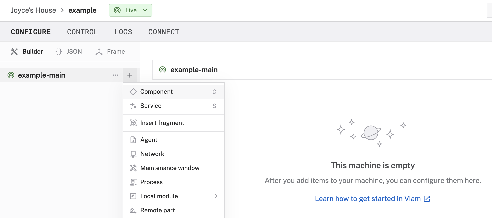

author: Joyce
id: securibot
summary: Detect and identify faces to unlock doors with computer vision
categories: Getting-Started, Developer
environments: web
status: Published
feedback link: https://github.com/viam-devrel/viamcodelabs/issues
tags: Getting Started, Developer

# Face identification for access control with Raspberry Pi and Camera

<!-- ------------------------ -->

## Overview

Duration: 2

Create a facial recognition system to unlock a door using a Raspberry Pi, webcam, and computer vision.

Whether you're securing a home, office, or secret lair, this project shows you how to build a smart access control system powered by facial recognition and Viam.

### What You’ll Build

- A facial identification system that unlocks a door when it recognizes an authorized person


### Prerequisites

- A computer with MacOS, Windows, or Linux to flash your Raspberry Pi and configure the device's components using the Viam app
- Hardware and supplies requirements
  - 1 - [Raspberry Pi 4](https://a.co/d/fc3JUMm)
  - 1 - microSD card to use with your Pi
  - 1 - power supply for your Pi
  - 1 - [USB webcam](https://a.co/d/2QnH2wA)
  - 1 - [Digital Servo](https://a.co/d/3jNHRco) - to move an arm that triggers an existing PIR sensor
  - 1 - [Heated pad](https://a.co/d/3mbpQCF) - to trigger an existing PIR sensor that also requires both motion and heat to activate the sensor
  - 1 - [Assortment of jumper wires](https://www.amazon.com/dp/B077X99KX1)

### What You’ll Learn

- How to configure and test a device's components using Viam
- How to use a vision service for image classification
- How to connect vision events to physical actions (like unlocking a door)
- How to integrate a Raspberry Pi, camera, and actuator for access control

### What You’ll Need

- All the hardware components listed in prerequisites.
- Sign up for a free Viam account, and then [sign in](https://app.viam.com/fleet/dashboard) to the Viam app

### Watch the Video -->

See a demonstration of the "Securibot", the door access system, in action:

<video id="N3E46j5xulE"></video>

<!-- ------------------------ -->

## Set up your Raspberry Pi

Duration: 5

The Raspberry Pi boots from a USB flash drive (or microSD card). You need to install Raspberry Pi OS on a storage device that you will use with your Pi. For more details about alternative methods of setting up your Raspberry Pi, refer to the [Viam docs](https://docs.viam.com/installation/prepare/rpi-setup/#install-raspberry-pi-os).

### Install Raspberry Pi OS

1. Connect the USB flash drive (or microSD card) to your computer.
1. Download the [Raspberry Pi Imager](https://www.raspberrypi.com/software/) and launch it.
   
1. Click **CHOOSE DEVICE**. Select your model of Pi, which is Raspberry Pi 4.
1. Click **CHOOSE OS**. Select **Raspberry Pi OS (64-bit)** from the menu.
1. Click **CHOOSE STORAGE**. From the list of devices, select the storage device you intend to use in your Raspberry Pi.
   
1. Configure your Raspberry Pi for remote access. Click **Next**. When prompted to apply OS customization settings, select **EDIT SETTINGS**.
1. Check **Set hostname** and enter the name you would like to access the Pi by in that field, for example, `test`.
1. Select the checkbox for **Set username and password** and set a username (for example, your first name) that you will use to log into the Pi. If you skip this step, the default username will be `pi` (not recommended for security reasons). And specify a password.
1. Connect your Pi to Wi-Fi so that you can run `viam-server` wirelessly. Check **Configure wireless LAN** and enter your wireless network credentials. SSID (short for Service Set Identifier) is your Wi-Fi network name, and password is the network password. Change the section `Wireless LAN country` to where your router is currently being operated.
   
1. Select the **SERVICES** tab, check **Enable SSH**, and select **Use password authentication**.
   
   > aside negative
   > Be sure that you remember the `hostname` and `username` you set, as you will need this when you SSH into your Pi.
1. **Save** your updates, and confirm `YES` to apply OS customization settings. Confirm `YES` to erase data on your storage device. You may also be prompted by your operating system to enter an administrator password. After granting permissions to the Imager, it will begin writing and then verifying the Linux installation to your storage device.
1. Remove the storage device from your computer when the installation is complete.

### Connect with SSH

1. Place the storage device into your Raspberry Pi and boot the Pi by plugging it in to an outlet. A red LED will turn on to indicate that the Pi is connected to power.
   > aside negative
   > Make sure you are using a 5V 3A USB-C power supply to power your Raspberry Pi 4. Using a power supply with inadequate amperage can lead to instability, throttling, or unexpected behavior. Additionally, while USB boot is enabled by default on newer Raspberry Pi 4 models, older versions may require a firmware update to enable it. Refer to the [Raspberry Pi documentation](https://www.raspberrypi.com/documentation/computers/raspberry-pi.html) for detailed setup instructions and compatibility.
1. Once the Pi is started, connect to it with SSH. From a command line terminal window, enter the following command. The text in <> should be replaced (including the < and > symbols themselves) with the user and hostname you configured when you set up your Pi.
   ```bash
   ssh <USERNAME>@<HOSTNAME>.local
   ```
1. If you are prompted “Are you sure you want to continue connecting?”, type “yes” and hit enter. Then, enter the password for your username. You should be greeted by a login message and a command prompt.
   
1. Update your Raspberry Pi to ensure all the latest packages are installed
   ```bash
   sudo apt update
   sudo apt upgrade
   ```

<!-- ------------------------ -->

## Set up the hardware

Duration: 5

The Viam office currently uses a fob system to unlock a security door. By adding computer vision and facial recognition, we can verify that specific individuals are authorized to enter and automatically unlock the door. In this setup, a webcam can be mounted above the door to detect faces. When an authorized face is recognized, a servo waves a heated pad in front of a PIR motion sensor (originally intended for people leaving the office) to trigger the door to unlock.

Your door setup may differ, so this section may need to be adjusted based on your specific configuration.

### Add your servo

1. **Wire the servo to the Raspberry Pi**: The servo can be controlled via a GPIO pin on the Raspberry Pi. Refer to the following wiring diagram to connect the Raspberry Pi to the servo and heated pad.

   

   | **Raspberry Pi** | **Servo and Heated pad** |
   | ---------------- | ------------------------ |
   | Pin 2 (5V)       | Power for heated pad     |
   | Pin 4 (5V)       | Power for servo          |
   | Pin 6 (Ground)   | GND for servo            |
   | Pin 9 (Ground)   | GND for heated pad       |
   | Pin 16 (GPIO 23) | GPIO for servo           |

   > aside positive
   > The website [pinout.xyz](https://pinout.xyz/) is a helpful resource with the exact layout and role of each pin for Raspberry Pi. When working with Viam, make sure to reference the physical pin numbers, and not the GPIO numbers listed on `pinout.xyz`.

   

Now that you have physically connected the hardware components, let's configure the software in the next section.

<!-- ------------------------ -->

## Configure your machine and peripherals

Duration: 5

### Configure your machine

1. In [the Viam app](https://app.viam.com/fleet/dashboard) under the **LOCATIONS** tab, create a machine by typing in a name and clicking **Add machine**.
   
1. Click **View setup instructions**.
   
1. To install `viam-server` on the Raspberry Pi device that you want to use to communicate with and control your webcam, select the `Linux / Aarch64` platform for the Raspberry Pi, and leave your installation method as [`viam-agent`](https://docs.viam.com/how-tos/provision-setup/#install-viam-agent).
   
1. Use the `viam-agent` to download and install `viam-server` on your Raspberry Pi. Follow the instructions to run the command provided in the setup instructions from the SSH prompt of your Raspberry Pi.
   
1. The setup page will indicate when the machine is successfully connected.
   

### Configure your Raspberry Pi board

To access the GPIO pins, let's add our Raspberry Pi board to our machine in the Viam app.

1. In [the Viam app](https://app.viam.com/fleet/locations), find the **CONFIGURE** tab.
1. Click the **+** icon in the left-hand menu and select **Component**.
   
1. Select `board`, and find the `raspberry-pi:rpi4` module. This adds the module for working with the Raspberry Pi 4's GPIO pins. Leave the default name `board-1` for now.
1. Notice adding this module adds the board hardware component called `board-1`. The collapsible card on the right corresponds to the part listed in the left sidebar.
   
1. Click **Save** in the top right to save and apply your configuration changes.

### Configure your servo

1. In [the Viam app](https://app.viam.com/fleet/locations), find the **CONFIGURE** tab.
1. Click the **+** icon in the left-hand menu and select **Component**.
1. Select `servo`, and find the `gpio` module. This adds the module for working with the servo using the Raspberry Pi 4's GPIO pins. Leave the default name `servo-1` for now.
1. Notice adding this module adds the board hardware component called `servo-1`. The collapsible card on the right corresponds to the part listed in the left sidebar.
1. Under the **Attributes** section, select `board-1` as the Raspberry Pi board, and input `16` as the physical pin number on the Raspberry Pi where we will be controlling the servo motor.
1. Click **Save** in the top right to save and apply your configuration changes.
1. Expand the **TEST** section to make sure you can control the servo using the current configuration.

   > aside negative
   > If any problems occur, check under the **LOGS** tab to see what might be going wrong. [Refer to the troubleshooting guide if needed.](https://docs.viam.com/components/camera/webcam/#troubleshooting).

### Add and configure your USB webcam

1. Connect the USB webcam to the Raspberry Pi.
1. In [the Viam app](https://app.viam.com/fleet/locations), find the **CONFIGURE** tab.
1. Click the **+** icon in the left-hand menu and select **Component**.
1. Select `camera`, and find the `webcam` module. This adds the module for working with a USB webcam. Leave the default name `camera-1` for now.
1. Notice adding this component adds the webcam hardware component called `camera-1`. The collapsible panel on the right corresponds to the part listed in the left sidebar.
1. Under **Attributes**, leave the `video_path` blank and the camera will use the default video path for your machine. If this doesn’t work when you test your camera later, you can try a different video path by following the prompt in the Viam app to add a webcam discovery service and identify path options.
1. Click **Save** in the top right to save and apply your configuration changes.
1. At the bottom of the `camera-1` panel, expand the **TEST** section to ensure you have configured the camera properly.
   
   > aside negative
   > You may also need to follow the prompt in the Viam app to add a [webcam discovery service](https://app.viam.com/module/rand/find-webcams) to identify path options if the default path is not working.

<!-- ------------------------ -->

## Add a vision service

Duration: 3

Now that your hardware is working the way you want it, it's time to add a vision service to detect and identify a face.

### Prepare your machine to run the control code

1. **SSH into your board**: From the terminal window, run the following command to [SSH (Secure Shell) into your board](https://docs.viam.com/installation/prepare/rpi-setup/#connect-with-ssh), where the text in `<>` should be replaced (including the `<` and `>` symbols themselves) with the `user` and `hostname` you configured when you set up your machine.
   ```bash
   ssh <USERNAME>@<REMOTE-HOSTNAME>.local
   ```
   > aside negative
   > On some networks, if the `hostname.local` alias fails to resolve, you can use the static IP address found in the Viam app status dropdown. For example, instead of `username@hostname.local`, you could use `username@192.168.2.197`.
   > 
1. On the Raspberry Pi, create a directory called `known_faces` to store photos of people who are allowed access to the office.

   ```bash
   mkdir known_faces
   ```

1. **Verify the directory location**: the directory is located within the home directory of the user `joncha` in this example. Running the following command results in `/home/joncha/` so we know the full path to the directory is `/home/joncha/known_faces`. We will need this path in an upcoming step.
   ```bash
   pwd
   ```

### Configure a vision service

1. In the Viam app, click the **+** icon in the left-hand menu and select **Service**, and then `vision`.
1. Search for a module called `face-identification`. Then click **Add module**, and **Create** a new vision service, renaming the service as `face-identification`.
   
1. Notice this creates two new items in the left sidebar. The first is your new vision service called `face-identification` based on a module also called `face-identification`.
   
1. In the `face-identification` panel for the vision service under the **CONFIGURE** section, add the following attributes. This configures the vision service to depend on data coming in from the named webcam, refer to a directory of `known_faces` to be stored on the Raspberry Pi, and establish a sensitivity threshold for the vision service.

   ```json
   {
     "picture_directory": "/home/joncha/known_faces",
     "identification_threshold": 0.5,
     "camera_name": "camera-1"
   }
   ```

   

1. **Save** your changes in the top right and wait a few moments for the configuration changes to take effect.
1. At the bottom of the `face-identification` vision service panel, expand the **TEST** section to ensure you have configured the vision service properly. Point the webcam towards a face to see if the camera detects it.
1. If the camera detects a face, a bounding box will highlight the item in the video feed, and display it on the right under **Labels**.
   <!--  -->

### Configure an automation service

Next, let’s set up a service to ensure the camera is always running the facial detection program. When a recognized face is detected, the servo will activate to unlock the door. If the face is not recognized, no action will be taken.

1. In the Viam app, click the **+** icon in the left-hand menu and select **Service**, and then `generic`. Then search for a module called `securibot:doorbot`.
   
1. Click **Add module**, and **Create** a new vision service, renaming the service as `automation`.
1. Notice this creates two new items in the left sidebar. The first is your new generic service called `automation` based on a module called `doorbot`.
1. In the `automation` panel for the generic service under the **CONFIGURE** section, add the following attributes. This configures the service to depend on data coming in from the named webcam (`camera-1`), trigger the named servo (`servo-1`), and named vision service (`face-identification`).
   ```json
   {
     "camera_name": "camera-1",
     "servo_name": "servo-1",
     "vision_name": "face-identification"
   }
   ```
1. **Save** your changes in the top right and wait a few moments for the configuration changes to take effect.

<!-- ------------------------ -->

## Finishing touches

Duration: 5

Now that your servo is working as intended, it’s time to tidy up the project and make it practical for real-world use.

1. **Mount the webcam**: Find a place outside the door to mount your webcam with a preferably unobstructed view of people's faces, for example, above a door frame.
   
1. **Mount the unlocking mechanism**: For this scenario, we are mounting an arm connected to a heated pad to trigger an existing PIR sensor. This sensor was originally intended to enable access for people leaving the Viam office, but we are repurposing it to allow people to enter the office after verifying they are authorized access.
   
1. **Assemble an enclosure for the Pi**: 3D print (or buy) an enclosure for your Raspberry Pi. I found [an existing design that I liked](https://makerworld.com/en/models/62316#profileId-226178) to fit a Raspberry Pi 4 Model B that provides access to the GPIO pins.
1. **Tidy the wires**: Neatly bundle the remaining wires using zip ties, twist ties, or cable clips to keep everything organized and out of the way.

## Next Steps

Duration: 1

### What you learned

- How to configure and test a device's components using Viam
- How to use a vision service for image classification
- How to connect vision events to physical actions (like unlocking a door)
- How to integrate a Raspberry Pi, camera, and actuator for access control

### Advanced scenarios for your facial recognition door system

- **Access Logging and Alerts**: Combine facial recognition with data logging to track who enters and when. You can even set up alerts for unknown faces or access attempts outside allowed hours, for example by using the [Twilio SMS API](https://app.viam.com/module/mcvella/twilio-sms).
- **Multi-Factor Triggers**: In addition to requiring face recognition and motion detection, include a time-based condition to unlock the door for extra security.
- **Fallback Access Methods**: Configure a secondary unlock method (like a fob or code) in case facial recognition fails.

In addition to the project ideas mentioned above, consider other ways to continue your journey with Viam.

- Explore other relevant modules in [the Viam registry](https://app.viam.com/registry), such as object detection or speech input.
- Learn [how to create your own module](https://docs.viam.com/how-tos/hello-world-module/) if you want to extend functionality, like integrating face model training directly on the device or adding support for new hardware.

  

### Real-World Applications of Face-Based Access Systems

Facial recognition access control isn’t just a fun Raspberry Pi project. It’s used in serious applications, including:

- **Smart Home Security**: Replace keys and codes with face-based entry, logging who comes and goes.
- **Office Access Control**: Manage entry for employees and guests without the need for keycards or badges.
- **Delivery Drop Zones**: Authorize specific delivery personnel to open secure drop boxes.
- **Event or Venue Access**: Grant entry to VIPs or staff at concerts, conferences, or private events using facial recognition.

### Related Viam resources

- [Viam documentation](https://docs.viam.com/)
- [Viam how-to guides](https://docs.viam.com/how-tos/)
- [Viam Discord community](http://discord.gg/viam)
