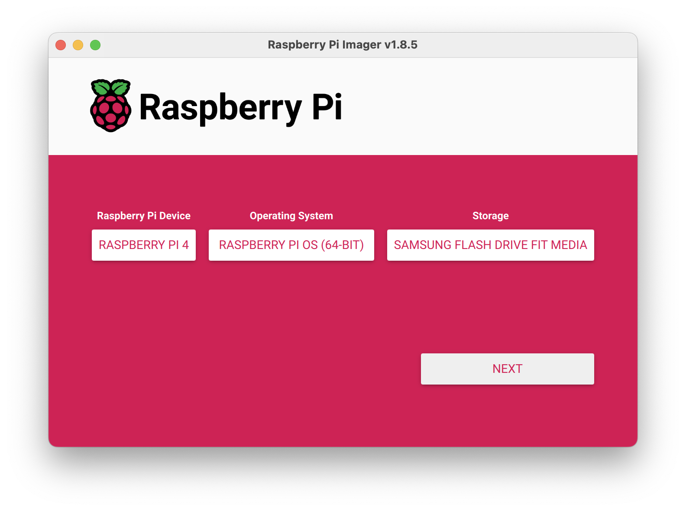
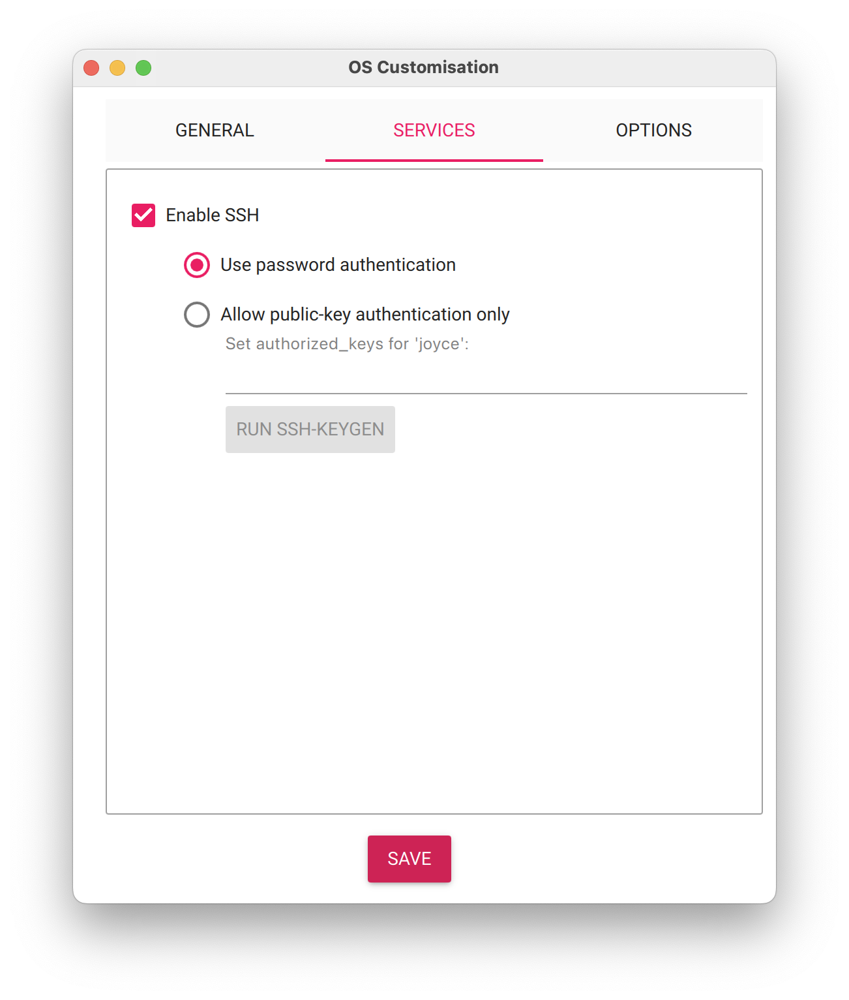
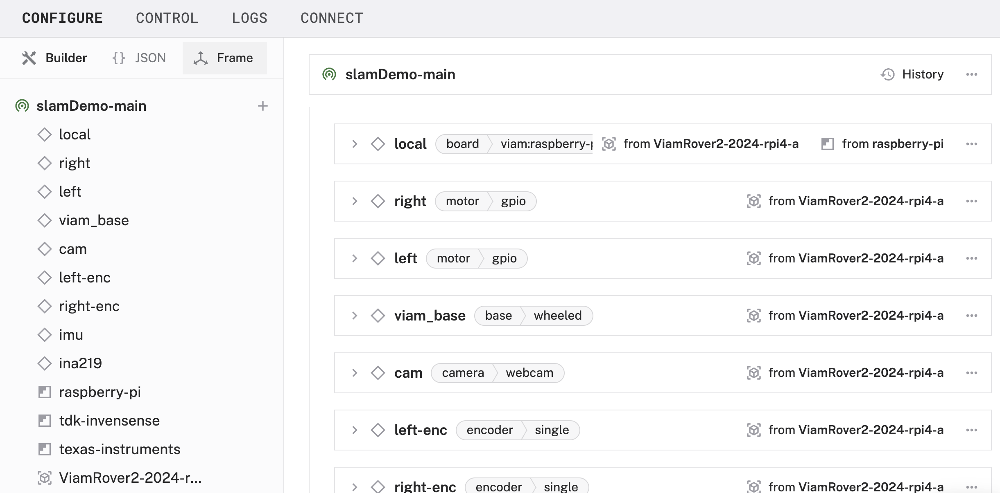

author: Joyce
id: slam
summary: Create and use a SLAM map with RPLidar A1
categories: Getting-Started, Developer
environments: web
status: Published
feedback link: https://github.com/viam-labs/viamcodelabs/issues
tags: Build a map with Lidar and SLAM

# Build a map with LiDAR and SLAM

<!-- ------------------------ -->

## Overview

Duration: 1

[Simultaneous Localization And Mapping (SLAM)](https://en.wikipedia.org/wiki/Simultaneous_localization_and_mapping) allows your machine to create a map of its surroundings and find its location within that map. SLAM is an important area of ongoing research in robotics, particularly for mobile applications such as drones, boats, and rovers.

The [Viam SLAM service](https://docs.viam.com/operate/reference/services/slam/) supports the integration of SLAM as a service on your machine. In this codelab, you will use RPlidar to create a map and use the map.


### What You’ll Build

- A detailed map of a physical space, enabling navigation within that space.

### Prerequisites

- A computer with MacOS, Windows, or Linux to flash your Raspberry Pi and configure the device's components using the Viam app
- Hardware and supplies requirements
  - 1 - [Raspberry Pi 4](https://a.co/d/fc3JUMm)
  - 1 - microSD card to use with your Pi
  - 1 - power supply for your Pi
  - 1 - [RPLidar](https://www.adafruit.com/product/4010) - A1, A2, or A3 will work
  - 1 - (**_optional_**) an assembled rover, such as the [Viam rover](https://docs.viam.com/dev/reference/try-viam/rover-resources/rover-tutorial/)
  - 1 - (**_optional_**) mount plate for your RPLidar, such as these [3D prints](https://docs.viam.com/operate/reference/services/slam/cartographer/#rplidar)

### What You’ll Need

- All the hardware components listed in prerequisites.
- Sign up for a free Viam account, and then [sign in](https://app.viam.com/fleet/dashboard) to the Viam app

### What You’ll Learn

- How to use a RPlidar to scan and collect environmental data
- How to plot a point cloud for testing
- How to create a map using SLAM
- How to use a SLAM-generated map for navigation

<!-- ### Watch the Video

See a demonstration and overview of creating and using a SLAM map in this video.

<video id="7lknmKzZcn4"></video> -->

<!-- ------------------------ -->

## Set up your Raspberry Pi

Duration: 6

The Raspberry Pi boots from a USB flash drive (or microSD card). You need to install Raspberry Pi OS on a USB flash drive that you will use with your Pi. For more details about alternative methods of setting up your Raspberry Pi, refer to the [Viam docs](https://docs.viam.com/installation/prepare/rpi-setup/#install-raspberry-pi-os).

### Install Raspberry Pi OS

1. Connect the USB flash drive (or microSD card) to your computer.
1. Download the [Raspberry Pi Imager](https://www.raspberrypi.com/software/) and launch it.
   
1. Click **CHOOSE DEVICE**. Select your model of Pi, which is Raspberry Pi 4.
1. Click **CHOOSE OS**. Select **Raspberry Pi OS (64-bit)** from the menu.
1. Click **CHOOSE STORAGE**. From the list of devices, select the USB flash drive you intend to use in your Raspberry Pi.
   
1. Configure your Raspberry Pi for remote access. Click **Next**. When prompted to apply OS customization settings, select **EDIT SETTINGS**.
1. Check **Set hostname** and enter the name you would like to access the Pi by in that field, for example, `test`.
1. Select the checkbox for **Set username and password** and set a username (for example, your first name) that you will use to log into the Pi. If you skip this step, the default username will be `pi` (not recommended for security reasons). And specify a password.
1. Connect your Pi to Wi-Fi so that you can run `viam-server` wirelessly. Check **Configure wireless LAN** and enter your wireless network credentials. SSID (short for Service Set Identifier) is your Wi-Fi network name, and password is the network password. Change the section `Wireless LAN country` to where your router is currently being operated.
   
1. Select the **SERVICES** tab, check **Enable SSH**, and select **Use password authentication**.
   
   > aside negative
   > Be sure that you remember the `hostname` and `username` you set, as you will need this when you SSH into your Pi.
1. **Save** your updates, and confirm `YES` to apply OS customization settings. Confirm `YES` to erase data on the USB flash drive. You may also be prompted by your operating system to enter an administrator password. After granting permissions to the Imager, it will begin writing and then verifying the Linux installation to the USB flash drive.
1. Remove the USB flash drive from your computer when the installation is complete.

### Connect with SSH

1. Place the USB flash drive into your Raspberry Pi and boot the Pi by plugging it in to an outlet. A red LED will turn on to indicate that the Pi is connected to power.
   > aside negative
   > Make sure you are using a 5V 3A USB-C power supply to power your Raspberry Pi 4. Using a power supply with inadequate amperage can lead to instability, throttling, or unexpected behavior. Additionally, while USB boot is enabled by default on newer Raspberry Pi 4 models, older versions may require a firmware update to enable it. Refer to the [Raspberry Pi documentation](https://www.raspberrypi.com/documentation/computers/raspberry-pi.html) for detailed setup instructions and compatibility.
1. Once the Pi is started, connect to it with SSH. From a command line terminal window, enter the following command. The text in <> should be replaced (including the < and > symbols themselves) with the user and hostname you configured when you set up your Pi.
   ```bash
   ssh <USERNAME>@<HOSTNAME>.local
   ```
1. If you are prompted “Are you sure you want to continue connecting?”, type “yes” and hit enter. Then, enter the password for your username. You should be greeted by a login message and a command prompt.
   
1. Update your Raspberry Pi to ensure all the latest packages are installed
   ```bash
   sudo apt update
   sudo apt upgrade
   ```

### Enable communication protocols

1. Launch the Pi configuration tool by running the following command
   ```bash
   sudo raspi-config
   ```
1. Use your keyboard to select “Interface Options”, and press return.
   
1. [Enable the relevant protocols](https://docs.viam.com/installation/prepare/rpi-setup/#enable-communication-protocols) to support our hardware. Enable the I2C protocol on your Pi to get readings from the power sensor anc accelerometer when controlling your rover. Select **I2C** enabled.
   
1. Confirm the options to enable the serial login shell and serial interface. And reboot the Pi when you're finished.
   ```bash
   sudo reboot
   ```

<!-- ------------------------ -->

## Configure your machine and peripherals

Duration: 3

### Configure your machine

1. In [the Viam app](https://app.viam.com/fleet/dashboard) under the **LOCATIONS** tab, create a machine by typing in a name and clicking **Add machine**.
   
1. Click **View setup instructions**.
   
1. To install `viam-server` on the Raspberry Pi device that you want to use to communicate with and control your webcam, select the `Linux / Aarch64` platform for the Raspberry Pi, and leave your installation method as [`viam-agent`](https://docs.viam.com/how-tos/provision-setup/#install-viam-agent).
   
1. Use the `viam-agent` to download and install `viam-server` on your Raspberry Pi. Follow the instructions to run the command provided in the setup instructions from the SSH prompt of your Raspberry Pi.
   
1. The setup page will indicate when the machine is successfully connected.
   

### Configure your specific rover base

> aside negative
> Depending on your rover, this section will look different. In the example shown below, we are configuring a [Viam rover 2](https://docs.viam.com/dev/reference/try-viam/rover-resources/rover-tutorial/) using a pre-existing fragment.

1. In [the Viam app](https://app.viam.com/fleet/locations), find the **CONFIGURE** tab.
1. Click the **+** icon in the left-hand menu and select **Insert Fragment** to browse the available [configuration fragments](https://docs.viam.com/fleet/fragments/).
   
1. Select [`ViamRover2-2024-rpi4-a`](https://app.viam.com/fragment/7c413f24-691d-4ae6-a759-df3654cfe4c8/json).
1. Click **Insert fragment** again to add the fragment to your machine.
   
1. Notice adding this fragment adds several hardware components to your machine’s JSON configuration. Each component is listed in the left sidebar, along with a corresponding panel on the right with more details.
   
1. Click **Save** in the top right to save and apply your configuration changes.

### Connect the RPLidar

1. Connect the RPLidar to the Raspberry Pi using the USB cable included with the device.
   
1. Be sure to position the RPlidar on the rover so that it faces forward in the direction of travel. For example, if you are using a Viam Rover and the RPlidar A1 model, mount it to the Rover so that the pointed end of the RPlidar mount housing is facing in the same direction as the webcam. Also ensure that the center of the RPlidar is mounted at the center of your machine’s base. In the case of the Viam Rover the center is in the middle between the wheels.

   

   > aside negative
   > Use the [3D printable mount plates provided](https://docs.viam.com/operate/reference/services/slam/cartographer/#rplidar) for the A1 or A3 on the Viam rover, or design your own custom mount.

### Configure the RPLidar

1. In [the Viam app](https://app.viam.com/fleet/locations), find the **CONFIGURE** tab.
1. Click the **+** icon in the left-hand menu and select **Component**.
   
1. Select `camera`, and find the `rplidar` module. This adds the module for working with the RPLidar, models A1, A2, or A3. Update the default name to `rplidar`.
   
1. Notice adding this component adds the camera hardware component called `rplidar`. The collapsible panel on the right corresponds to the part listed in the left sidebar.
1. Click **Save** in the top right to save and apply your configuration changes.
1. Expand the **TEST** section, and toggle **GetPointCloud** to the ON position to ensure the RPLidar has been set up properly and data is being captured.
   
   > aside negative
   > If any problems occur, check under the **LOGS** tab to see what might be going wrong. [Refer to the troubleshooting guide if needed.](https://docs.viam.com/components/camera/webcam/#troubleshooting)

<!-- ------------------------ -->

## Create a SLAM map

Duration: 3

### Create a map with the `cartographer` module

> aside negative
> For devices that are resource constrained, you can alternatively use [CloudSLAM](https://docs.viam.com/operate/reference/services/slam/cloudslam/).

1. In [the Viam app](https://app.viam.com/fleet/locations), find the **CONFIGURE** tab.
1. Click the **+** icon in the left-hand menu and select **Service**.
   
1. Select `SLAM`, and find the `cartographer` module. This adds the module for performing dense SLAM using LIDAR data. Leave the default name `slam-1` for now.
   
1. In the resulting `slam-1` panel, choose `Create new map` as the **Mapping mode**.
   
1. Select `rplidar` as the **camera** name.
1. Set a frequency of `5` for **Data polling rate (Hz)**.
1. Select an optional IMU or odometry component to improve the map results. If you're using the Viam rover 2, you can select `imu` and set a frequency of `20` for **Data polling rate (Hz)** for the movement sensor.
1. Set a minimum and maximum range for your `rplidar`. Refer to the documentation for [the recommended parameters](https://docs.viam.com/operate/reference/services/slam/cartographer/#config_params).
1. Set the mode to `2D`, and **Save** your changes. It may take a moment to apply the configuration details.
   
1. Under the **CONTROL** tab, find the `slam-1` service and observe the captured data.
   
   > aside negative
   > If any problems occur, check under the **LOGS** tab to see what might be going wrong. [Refer to the troubleshooting guide if needed.](https://docs.viam.com/components/camera/webcam/#troubleshooting)
1. At this point, your rover is an explorer capturing and recording new data as it roves within the physical space. You can control your rover manually using the controls within the Viam app to see how this impacts the data represented in the `slam-1` panel. If you're using the Viam rover 2, find the `viam_base` and use keyboard controls to drive it around.
   

### Save a local map

> aside positive
> If you want to save your locally built map, you can use the **GetInternalState** API as we will do next or use the local map uploading feature of the [CloudSLAM](https://docs.viam.com/operate/reference/services/slam/cloudslam/).

1.

> aside positive
> To create a higher fidelity map, it is recommended to move the RPLidar around in a smooth and slow fashion. Check out [these tips for making good maps](https://docs.viam.com/operate/reference/services/slam/#slam-mapping-best-practices).

In the next section, we will use the SLAM-generated map to navigate.
