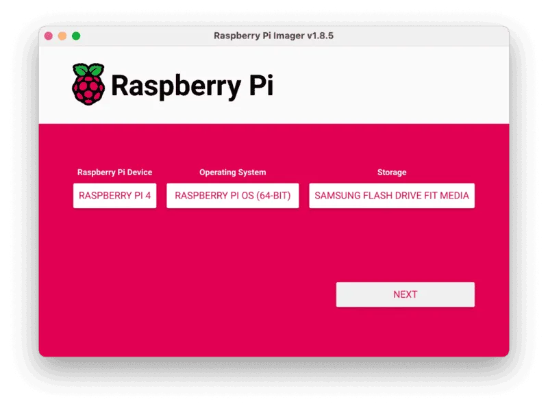
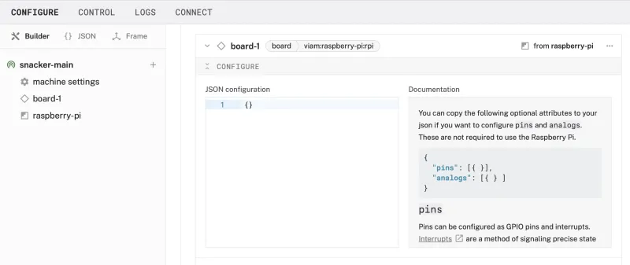
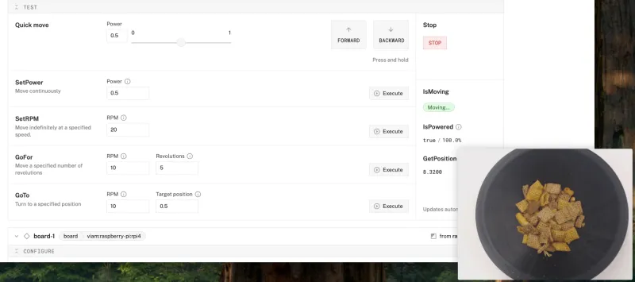

author: HipsterBrown
id: smart-snack-dispenser
summary: Turn an existing pet feeder into automatically refilling snack bowl using computer vision
categories: Getting-Started, Developer
environments: web
status: Published 
feedback link: https://github.com/viam-devrel/viamcodelabs/issues
tags: Getting Started, Developer

# Build a Smart Snack Dispenser with CV
<!-- ------------------------ -->
## Overview 
Duration: 1

In this tutorial, we'll transform a basic dry food dispenser into an automated treat hub using a Raspberry Pi, a webcam, and some computer vision; no coding necessary!
Whether you're working from home and want to track your snacking habits or just love the idea of building your own smart appliances, this project is a perfect entry point into the world of hardware hacking.

### What You’ll Build

- An automatically refilling snack bowl using a custom machine learning (ML) model


### Prerequisites

- A computer with MacOS, Windows, or Linux to flash your Raspberry Pi and configure the device's components using the Viam app
- Hardware and supplies requirements
  - 1 - [Raspberry Pi 4](https://a.co/d/fc3JUMm)
  - 1 - microSD card to use with your Pi
  - 1 - power supply for your Pi
  - 1 - [automatic dry food dispenser](https://a.co/d/fBvQ0mI)
  - 1 - [USB webcam](https://a.co/d/2QnH2wA)
  - 1 - [MAX14870 DC Motor Driver](https://www.digikey.com/en/products/detail/pololu/2961/10450453)
  - 1 - [Assortment of WAGO lever nuts](https://a.co/d/2uE9KNc)
  - 1 - [Assortment of jumper wires](https://www.amazon.com/dp/B077X99KX1)
  - 1 - Phillips screwdriver
  - 1 - Pair of wire strippers
  - 1 - Power drill with large drill bit
  - 1 - Safety glasses
- Favorite snacks to dispense!

### What You’ll Learn 
- How to configure and test a device's components using Viam
- How to use modules from the Viam registry
- How to train a custom ML model for computer vision
- How to use a vision service for image classification

### What You’ll Need

- All the hardware components listed in prerequisites.
- Sign up for a free Viam account, and then [sign in](https://app.viam.com/fleet/dashboard) to the Viam app

<!-- ### Watch the Video -->

<!-- See a demonstration of the smart snack dispenser in action: -->

<!-- <video id="fpK4J9NzD2Q"></video> -->

<!-- ------------------------ -->
## Set up your Raspberry Pi
Duration: 5

Before embedding the Raspberry Pi in the food dispenser, you will prepare it with an operating system.

The Raspberry Pi boots from a USB flash drive (or microSD card). You need to install Raspberry Pi OS on a storage device that you will use with your Pi. For more details about alternative methods of setting up your Raspberry Pi, refer to the [Viam docs](https://docs.viam.com/installation/prepare/rpi-setup/#install-raspberry-pi-os).

### Install Raspberry Pi OS

1. Connect the USB flash drive (or microSD card) to your computer.
1. Download the [Raspberry Pi Imager](https://www.raspberrypi.com/software/) and launch it.
   
1. Click **CHOOSE DEVICE**. Select your model of Pi, which is Raspberry Pi 4.
1. Click **CHOOSE OS**. Select **Raspberry Pi OS (64-bit)** from the menu.
1. Click **CHOOSE STORAGE**. From the list of devices, select the storage device you intend to use in your Raspberry Pi.
   
1. Configure your Raspberry Pi for remote access. Click **Next**. When prompted to apply OS customization settings, select **EDIT SETTINGS**.
1. Check **Set hostname** and enter the name you would like to access the Pi by in that field, for example, `test`.
1. Select the checkbox for **Set username and password** and set a username (for example, your first name) that you will use to log into the Pi. If you skip this step, the default username will be `pi` (not recommended for security reasons). And specify a password.
1. Connect your Pi to Wi-Fi so that you can run `viam-server` wirelessly. Check **Configure wireless LAN** and enter your wireless network credentials. SSID (short for Service Set Identifier) is your Wi-Fi network name, and password is the network password. Change the section `Wireless LAN country` to where your router is currently being operated.
   
1. Select the **SERVICES** tab, check **Enable SSH**, and select **Use password authentication**.
   
   > aside negative
   > Be sure that you remember the `hostname` and `username` you set, as you will need this when you SSH into your Pi.
1. **Save** your updates, and confirm `YES` to apply OS customization settings. Confirm `YES` to erase data on your storage device. You may also be prompted by your operating system to enter an administrator password. After granting permissions to the Imager, it will begin writing and then verifying the Linux installation to your storage device.
1. Remove the storage device from your computer when the installation is complete.

### Connect with SSH

1. Place the storage device into your Raspberry Pi and boot the Pi by plugging it in to an outlet. A red LED will turn on to indicate that the Pi is connected to power.
   > aside negative
   > Make sure you are using a 5V 3A USB-C power supply to power your Raspberry Pi 4. Using a power supply with inadequate amperage can lead to instability, throttling, or unexpected behavior. Additionally, while USB boot is enabled by default on newer Raspberry Pi 4 models, older versions may require a firmware update to enable it. Refer to the [Raspberry Pi documentation](https://www.raspberrypi.com/documentation/computers/raspberry-pi.html) for detailed setup instructions and compatibility.
1. Once the Pi is started, connect to it with SSH. From a command line terminal window, enter the following command. The text in <> should be replaced (including the < and > symbols themselves) with the user and hostname you configured when you set up your Pi.
   ```bash
   ssh <USERNAME>@<HOSTNAME>.local
   ```
1. If you are prompted “Are you sure you want to continue connecting?”, type “yes” and hit enter. Then, enter the password for your username. You should be greeted by a login message and a command prompt.
   
1. Update your Raspberry Pi to ensure all the latest packages are installed
   ```bash
   sudo apt update
   sudo apt upgrade
   ```

Now that you've confirmed the Raspberry Pi is set up with an operating system, you can shut it down with the following command in the SSH session on the Pi:
```bash
sudo shutdown -h now
```

The SSH session will close as the Raspberry Pi begins to turn off.
Once the green activity light stops blinking, you can unplug the Raspberry Pi from power to prepare assembling the hardware in the next step.

<!-- ------------------------ -->
## Set up the hardware
Duration: 20

It's time to get your hands dirty by taking apart the food dispenser and upgrading the internals with the Raspberry Pi and other peripherals!

### Disassemble the snack dispenser

1. Remove the food bowl from the base of the dispenser and set it aside. 
   
1. Turn the dispenser upside down to access the screws on the bottom of the device.
   
1. Use the screwdriver to remove the screws in each corner. Set them aside in a safe place for later when reassembling.
   
1. **Carefully**, flip the device over again with the food container (hopper) facing up. Slowly, lift the container to separate it from the base of the device and expose the internal wiring.
   

### Prepare hardware components

1. Using the wire strippers, cut the wires connected to the motor and limit switch on the bottom of the food container.
   **Make sure to keep around 6 inches of wire connected to each component.** This will make it easier to connect them to the other hardware peripherals later.
   
1. Using the wire strippers, cut the power (typically red) and ground (typically black) wires connected to power port at the bottom of the base.
   **Make sure to keep around 6 inches of wire.** This will make it easier to connect them to the other hardware peripherals later.
   
1. For each of the cut wires, use the wire strippers to expose about half a fingernail's length of metal from the plastic covering. Take your time and pull slowly to remove only the plastic.
   
1. Set the food container part aside now that it is disconnected from the base. Place the base on its front so the back of the device is facing up.
   Put on safety glasses and use the drill to slowly bore a hole in the base a couple inches from the bottom. Make sure you have a secure grip to prevent it from spinning while drilling. It should enter the base just above the power port.
   
1. This hole will be used by the webcam's USB cable to connect to the Raspberry Pi once it is embedded in the food dispenser. Test it by pushing the USB end through several inches.
   If there are any issues, use the drill to widen the entry point with a bigger drill bit or by slowly rotating the existing bit around the inside of the hole while the drill is running, applying light pressure to strip away material.
   
1. Clean out any plastic material from the drilling process from the inside of the base and place the base with the bottom down to prepare for wiring.

### Connect hardware components


1. Use the above wiring diagram to connect the hardware peripherals and power together. The stripped wires from the snack dispenser can be connected to the jumper wires using the WAGO lever nuts.

   <video id="0RIr4VqZPBU"></video>

   

   #### Board to Power:

   | **Raspberry Pi** | **Power Port** |
   | ---------------- | -------------- |
   | Pin 2 (5V)       | Positive (red) |
   | Pin 9 (Ground)   | Ground (black) |

   #### Board to Motor Driver:

   | **Raspberry Pi** | **MAX14870 Motor Driver** |
   | ---------------- | ------------------------- |
   | Pin 4 (5V)       | VIN                       |
   | Pin 6 (Ground)   | GND (below VIN)           |
   | Pin 14 (Ground)  | GND (below EN)            |
   | Pin 16 (GPIO 23) | DIR                       |
   | Pin 18 (GPIO 24) | PWM                       |


   #### Board to Switch:

   | **Raspberry Pi** | **Limit Switch**   |
   | ---------------- | ------------------ |
   | Pin 2 (5V)       | Positive (red)     |
   | Pin 9 (Ground)   | Ground (black)     |


   #### Motor to Motor Driver:

   | **DC Motor** | **MAX14870 Motor Driver** |
   | ------------ | ------------------------- |
   | One wire     | M1                        |
   | Other wire   | M2                        |

   _The ordering of the motor wires are not important, which is why the naming used in the above table is vague._

   > aside positive
   > The website [pinout.xyz](https://pinout.xyz/) is a helpful resource with the exact layout and role of each pin for Raspberry Pi. When working with Viam, make sure to reference the physical pin numbers, and not the GPIO numbers listed on `pinout.xyz`.
1. Feed the webcam USB cable through the entry hole you drilled earlier and connect it to any of the Raspberry Pi's USB-A ports.
   
1. Carefully tuck the Raspberry Pi into the side of the dispenser base, keeping the wires clear of the stand-off pillars for the top container.
   
1. Place the top container (hopper) on the base, making sure the logo is facing the front of the device so it dispenses correctly.
1. Sit the webcam on the top of the hopper, facing down towards the bowl (after adding the bowl back to the base).
   

Nice work! 👏 

Now you can connect power to the food dispenser to turn on the Raspberry Pi. Lift the top container from the base to peek at the Raspberry Pi, looking for the red power light and blinking green activity light.

In the next section, you'll configure your device in the Viam app and start controlling your hardware!

<!-- ------------------------ -->
## Configure your machine and peripherals
Duration: 5

### Configure your machine

1. In [the Viam app](https://app.viam.com/fleet/dashboard) under the **LOCATIONS** tab, create a machine by typing in a name and clicking **Add machine**.
   
1. Click **View setup instructions**.
1. To install `viam-server` on the Raspberry Pi device that you want to use, select the `Linux / Aarch64` platform for the Raspberry Pi, and leave your installation method as [`viam-agent`](https://docs.viam.com/how-tos/provision-setup/#install-viam-agent).
   
1. Use the `viam-agent` to download and install `viam-server` on your Raspberry Pi. Follow the instructions to run the command provided in the setup instructions from the SSH prompt of your Raspberry Pi.
   
1. The setup page will indicate when the machine is successfully connected.
   

### Configure your Raspberry Pi board

To access the GPIO pins, let's add our Raspberry Pi board to our machine in the Viam app.

1. In [the Viam app](https://app.viam.com/fleet/locations), find the **CONFIGURE** tab.
1. Click the **+** icon in the left-hand menu and select **Component**.
   
1. Select `board`, and find the `raspberry-pi:rpi4` module. This adds the module for working with the Raspberry Pi 4's GPIO pins. Leave the default name `board-1` for now.
1. Notice adding this module adds the board hardware component called `board-1`. The collapsible card on the right corresponds to the part listed in the left sidebar.
   
1. Click **Save** in the top right to save and apply your configuration changes.

### Configure your encoder

1. In [the Viam app](https://app.viam.com/fleet/locations), find the **CONFIGURE** tab.
1. Click the **+** icon in the left-hand menu and select **Component**.
1. Select encoder, and find the `single` module. This adds the module for reading the limit switch as an encoder with a board's GPIO pins. Leave the default name `encoder-1` for now.
1. Notice adding this module adds the encoder hardware component called `encoder-1`. The collapsible card on the right corresponds to the part listed in the left sidebar.
1. In the new `encoder-1` panel, configure your component by updating the following attributes in the **CONFIGURE** field. This tells your encoder component to use a specific pin on a specific board (called `board-1` in the Viam app).
   - Select `board-1` from the dropdown under the "board" field.
   - Click the "Add pins" button to reveal the field for setting the encoder's interrupt pin
   - Set the "i" field to "22"
   
1. Click **Save** in the top right to save and apply your configuration changes.
1. At the bottom of the `encoder-1` panel, expand the **TEST** section to ensure you have configured the encoder correctly. You should see the ticks count under "GetPosition" increase when pressing down and releasing the limit switch.
   

### Configure your motor

1. In [the Viam app](https://app.viam.com/fleet/locations), find the **CONFIGURE** tab.
1. Click the **+** icon in the left-hand menu and select **Component**.
1. Select `motor`, and find the `gpio` module. This adds the module for controlling a motor with a board's GPIO pins. Leave the default name `motor-1` for now.
1. Notice adding this module adds the motor hardware component called `motor-1`. The collapsible card on the right corresponds to the part listed in the left sidebar.
1. In the new `motor-1` panel, configure your component by updating the following attributes in the **CONFIGURE** field. This tells your motor component to use specific pins and settings on a specific board (called `board-1` in the Viam app).
   - Select `board-1` from the dropdown under the "board" field.
   - Click the "Show more" button to reveal additional configuration detail.
   - Select `encoder-1` from the "encoder" field.
   - Set the "ticks_per_rotation" field to 100 to indicate how many ticks from the paired encoder will be counted for each full rotation of the motor.
   - Under the "Component pin assignment" section, set the "Type" field to "Direction"
   - Set the "dir" field to 16
   - Set the "pwm" field to 18
   
   
1. Click **Save** in the top right to save and apply your configuration changes.
1. At the bottom of the `motor-1` panel, expand the **TEST** section to ensure you have configured the motor correctly and can move it using the "FORWARD" or "BACKWARD" buttons.
   

### Configure your webcam

1. In [the Viam app](https://app.viam.com/fleet/locations) under the **CONFIGURE** tab, click the **+** icon in the left-hand menu and select **Component**.
1. Select `camera`, and find the `webcam` module. This adds the module for working with a USB webcam. Leave the default name `camera-1` for now.
1. Notice adding this component adds the webcam hardware component called `camera-1`. From the **Attributes** section of the panel, select a `video_path`.
   
1. Click **Save** in the top right. This may take a moment to apply your configuration changes.
1. At the bottom of the `camera-1` panel, expand the **TEST** section to ensure you have configured the camera properly and see a video feed.
   

> aside negative
> **TROUBLESHOOTING**: Double check the wiring on your components. Also check under the **LOGS** tab to see what might be going wrong.

With your hardware components confirmed working, grab your snacks to start gathering data to train a custom computer vision model in the next step.

<!-- ------------------------ -->
## Collect data and train the model
Duration: 30

To get started with capturing training data for the machine learning model used to automate the smart snack dispenser, fill the top container (hopper) of the dispenser with your snack of choice that you want to model to be able to identify.

### Add the data manager

1. In the Viam app, click the **+** icon in the left-hand menu and select **Service**, and then `data management`.
1. **Create** a new [Data Management service](https://docs.viam.com/services/data/) called `data_manager-1`.
   
1. Notice adding this service adds the data manager service called `data_manager-1`. It will default to the "Capturing" and "Syncing" toggles as enabled.
   
1. Click **Save** in the top right. This may take a moment to apply your configuration changes.

### Capture images from the webcam

1. In the `camera-1` panel, click the "+ Add method" button under the **Data capture** section.
1. For the "Method" dropdown, select "ReadImage", enter "0.25" in the "Frequency (hz)" field to capture an image every 4 seconds.
1. Make sure the data capture toggle is "On".
   
1. Click **Save** in the top right. This may take a moment to apply your configuration changes.
1. At the bottom of the `camera-1` panel, expand the **TEST** section to view the images as they're being captured.
   
1. Click the "Toggle picture-in-picture" button to create a separate window of the camera view.
1. Go to the `motor-1` panel and expand the **TEST** section at the bottom. Use the controls to turn the motor and dispense the snacks into the bowl.
   
1. Once the bowl is full, empty the bowl back into the container and dispense more snacks. Go through this cycle a few times to ensure you have enough image data to train an accurate model.
1. When you feel you have enough images (with a minimum of 20), you can close the picture-in-picture window of the camera and turn off data capture in the `camera-1` panel.
1. Click **Save** in the top right to save and apply your configuration changes.

### Create a dataset of labeled images

1. In the `camera-1` panel, click the **...** button in the top-right to reveal an action menu. Select "View captured data" to see all the captured images from the machine in the **Data** tab of the Viam app.
   
1. From this filtered view of image data, click the first image to reveal a right sidebar of actions. Click the expanding arrows button in the top-left of the sidebar to display the full-screen annotation view.
   
   
1. In the right sidebar of **Actions**, click the "+" button under the **TAGS** section to add a tag that classifies the image as either "full" or "empty". 
   The first time you add one of these labels you will need to select the "+ <tag name>" option (where `<tag name>` is either "empty" or "full" depending on which you're adding at that time) in the tag dropdown to create it before adding it to the image.
   
1. In the right side of the **Actions**, click the "+" button under the **DATASETS** section to add the image to a dataset of images called "snacks" used for training a machine learning model.
   The first time you add an image to a dataset, you will need to select the "+ snacks" option in the datasets dropdown to create it before adding the image.
   
1. Use the arrow buttons next to the image, or your computer keyboard arrow keys, to view the next captured image to tag and add to the "snacks" dataset.
   You can use the "Recent" list of options under the **TAGS** and **DATASETS** sections to quickly tag and add each image.
   
1. Continue tagging and adding images until you have at least 10 of each tag in the "snacks" dataset. The more images in the training data, the more accurate your model will be.
1. Once you've completed this process, click the "snacks" dataset button in the **DATASETS** section of one of the images to view the full dataset.

### Train a classification model

1. From the "snacks" dataset view, you can see details about the collection of training data, including total number of images (should be at least 20) and the number of images for each tag (should be at least 10 per tag).
   Click the "Train model" button to start configuring a training job for your custom model.
   
1. Keep the default options to train a new model using the built-in training scripts for computer vision models. Click the "Next steps" button to continue.
   
1. Enter "snack-refill" in the Name text field. Keep the rest of the default options to train a single label classification model with the "full" and "empty" labels (based on the tags on the images in the associated "snacks" dataset).
   Click the "Train model" button to start the training job.
   
1. From the "TRAINING" tab in the Viam app, click on the ID of the training job for your "snack-refill" model based on the "snacks" dataset.
   
1. From the training job view, you can see details about the active job being run in the Viam cloud infrastructure. Depending on the amount of images in the dataset, this process can take between 10 and 20 minutes.
   Enjoy some of your snacks as a reward for making it this far while you wait!
   
1. When the job completes, you will see a stream of logs and the "Completed" badge on the details page. You will also receive an email notification in case you moved on to something else in the meantime.
   
1. Click on the "snack-refill" model button under the "Model" section of the job details to view the model details in the Viam Registry. By default, it will be private to your organization.
   

> aside negative
> **TROUBLESHOOTING**: Double check your dataset. Also check logs in the training job details page for more information.

With your model trained, it's time to deploy it to your Raspberry Pi and use it for classifying images from the webcam.

<!-- ------------------------ -->
## Configure your services
Duration: 5

### Add an ML model service

1. In the Viam app, click the **+** icon in the left-hand menu and select **Service**, and then `ML model`.
1. Search for a module called `TFLite CPU`. Then click **Add module**, and **Create** a new [ML Model service](https://docs.viam.com/services/ml/) called `mlmodel-1`. This provides the ability to run Tensorflow Lite, a.k.a [LiteRT](https://ai.google.dev/edge/litert), models on the machine.
   
1. Notice this creates two new items in the left sidebar. The first is your new ML Model service called `mlmodel-1`, and the second is the `tflite_cpu` module from the Registry.
1. In the `mlmodel-1` panel, click "Select model" in the **Model** section, search for "snacks-refill" under the **My organization** tab, and select your trained model from the list.
   
1. Click **Save** in the top right to save and apply your configuration changes.

### Add a vision service

1. In the Viam app, click the **+** icon in the left-hand menu and select **Service**, and then `vision`.
1. Search for a module called `mlmodel`. Then click **Add module**, and **Create** a new [Vision service](https://docs.viam.com/services/vision/) called `vision-1`.
   
1. Notice adding this service adds the vision service called `vision-1`. From the **ML Model** section of the panel, select `mlmodel-1`.
   
1. **Save** your changes in the top right and wait a few moments for the configuration changes to take effect.
1. At the bottom of the `vision-1` panel, expand the **TEST** section to ensure you have configured the service properly and can see the classifications table and its label predictions.
   

### Add a refill-controller service

1. In the Viam app, click the **+** icon in the left-hand menu and select **Service**, and then `generic`.
1. Search for a module called `refill-controller:refiller`. Then click **Add module**, and **Create** a new [refill-controller service](https://github.com/viam-devrel/refill-controller) called `refiller`.
   
1. Notice adding this service adds the generic service called `refiller`.
1. In the new `refiller` panel, configure the service by adding the following attributes in the **CONFIGURE** field. This tells the refill-controller service to use specific motor and camera components as well as a vision service.
   ```json
   {
     "camera_name": "camera-1",
     "motor_name": "motor-1",
     "vision_name": "vision-1"
   }
   ```
   
1. **Save** your changes in the top right and wait a few moments for the configuration changes to take effect.
1. Test out the service by emptying the snack bowl and watch the machine automatically dispense more snacks until the bowl is full.

<!--  -->

> aside negative
> **TROUBLESHOOTING**: Double check your service configuration. Look at the **LOGS** tab to see what might be going wrong.

<!-- ------------------------ -->
## Conclusion And Resources
Duration: 1

Congratulations! You've just transformed a simple food dispenser into a smart device that makes snacking both fun and mindful.
While this project serves up treats, it's also given you a taste of key hardware hacking concepts - from motor control to computer vision to hardware automation.

### What You Learned
- How to configure and test a device's components using Viam
- How to use modules from the Viam registry
- How to train a custom ML model for computer vision
- How to use a vision service for image classification

### Building advanced scenarios with Viam and the smart snack dispenser

At this point, you have configured and tested your machine to recognize a snack food and automatically refill the bowl. Consider adding features like:

- training the model on multiple snack types to make it a more flexible feeder
- add voice control using a [speech module](https://app.viam.com/module/viam-labs/speech)
- build a custom web or mobile application to monitor and control using the [Viam SDKs](https://docs.viam.com/dev/reference/sdks/)
- add refill alerts when the motor runs and no food is dispensed, indicating an empty container

### Real-world applications and projects for smart snack dispensers

This project is fun to run at home, and it has practical uses in other places as well:

- Automated inventory management for office pantries and tracking food costs over time
- Dispensing pills and other medicine in precise dosages at the correct time
- Feeding parts in an assembly line for automated packaging warehouses

### Related Viam Resources

- [Viam documentation](https://docs.viam.com/)
- [Viam how-to guides](https://docs.viam.com/how-tos/)
- [Viam Discord community](http://discord.gg/viam)
