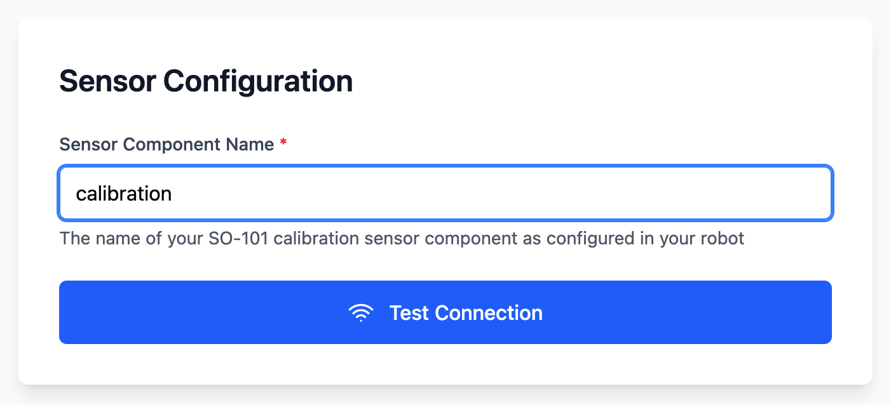
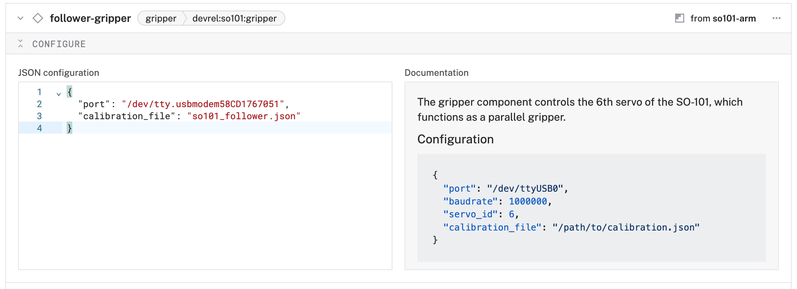

author: HipsterBrown
id: so101
summary: Set up and control a SO-ARM101 robotic arm with Viam using the so-101 module
categories: Getting-Started, Developer
environments: web
status: Published 
feedback link: https://github.com/viam-devrel/viamcodelabs/issues
tags: Getting Started, Developer

# Control a SO-ARM101 Robotic Arm

<!-- ------------------------ -->
## Overview 
Duration: 2

Ready to bring robotic manipulation to life? The SO-ARM101 is a 5-degree-of-freedom robotic arm with a built-in gripper that serves as a solid entrypoint in an accessible package. Whether you're exploring automation, learning about inverse kinematics, or building your next robotics project, this tutorial will get you up and running with full control through Viam's intuitive platform.

In this comprehensive guide, you'll transform your SO-ARM101 from an assembled kit into a fully functional robotic system. You'll learn to assign motor IDs, calibrate joints for precise movement, and configure the arm and gripper components.


### Prerequisites
- Sign up for a free Viam account, and then [sign in](https://app.viam.com/fleet/locations/) to Viam
- Basic familiarity with SSH and command line operations
- Hardware and supplies requirements
    - Assembled [SO-ARM101](https://github.com/TheRobotStudio/SO-ARM100?tab=readme-ov-file#kits) robotic arm ([assembly instructions](https://huggingface.co/docs/lerobot/so101#step-by-step-assembly-instructions))
    - Computer capable of running [viam-server](), such as a Mac, [Raspberry Pi](https://docs.viam.com/operate/reference/prepare/rpi-setup/), or [NVIDIA Jetson](https://docs.viam.com/operate/reference/prepare/jetson-nano-setup/)
    - MicroSD card and power supply for your single-board computer, if needed
    - USB data cable for connecting computer to arm control board
    - Power supply for arm

### What You'll Learn
- How to install and configure the SO-101 module from the Viam registry
- How to assign unique motor IDs to each servo in your robotic arm
- How to calibrate joint positions for accurate movement control
- How to configure arm and gripper components in Viam
- How to control your robotic arm through the Viam Control Tab

### What You'll Build
- A fully configured SO-ARM101 robotic arm system integrated with Viam

### Watch the Video

Coming soon!

<!-- <video id="DUpP9n5H3to"></video> -->

<!-- ------------------------ -->

## Configure your machine
Duration: 5

1. In [the Viam app](https://app.viam.com/fleet/dashboard) under the **LOCATIONS** tab, create a machine by typing in a name and clicking **Add machine**.
   
1. Once your machine is created, you are brought to your machine overview page. Click **View setup instructions**.
   
1. To install `viam-server` on your device, select the appropriate platform, i.e. `Linux/Aarch64` for a Raspberry Pi or NVIDIA Jetson. Leave the default installation method of `viam-agent`:
   
   
   
1. Follow the instructions that are shown for your platform. If you are following along with a Pi or Jetson, you'll copy the command shown and run it in a SSH session on your device. 
1. The setup page will indicate when the machine is successfully connected.
    

With a machine configured, we now need to configure the arm calibration next!

<!-- ------------------------ -->
## Connect the SO-ARM101 to your machine
Duration: 8

The SO-ARM101 communicates with your computer via USB connection. This section will guide you through the proper setup and verification.

### Make the USB Connection

1. **Connect the USB cable**:
   - Use the provided USB cable to connect the SO-ARM101 control board to your computer
   - You should see indicator LEDs on the control board
   
1. **Verify USB detection**:
   - Check that the USB device is detected:
     ```bash
     ls /dev/tty*
     ```
   - Look for a device that appears when you connect the arm
   
1. **Check USB serial device**:
   - You should see a device like `/dev/ttyUSB0` or `/dev/ttyACM0` on Linux, or `/dev/tty.usbmodem58CD1767051` (the part after "usbmodem" is a unique ID for that control board) on MacOS

Note the path to that device on your computer, a.k.a "port". It will be used to configure your machine in the following steps.

<!-- ------------------------ -->
## Configure calibration sensor
Duration: 5

Now you'll configure the calibration component that the SO-101 module provides.
This is used in tandem with a [Viam App](https://docs.viam.com/operate/control/viam-applications/) to provide convenient workflows for setting up your arm.

### Add the calibration sensor

1. Click the **+** icon in the left-hand menu and select **Component or service**.
   
1. Select `sensor`, and find the `so101:calibration` model. This adds the `so101-arm` module for working with the SO-ARM101. Rename the default name to `calibration`.
   
   
1. Notice adding this module adds the sensor hardware component called `calibration`. Add the following JSON object under the **CONFIGURE** section of the new corresponding panel.
    Set the `calibration_file` to something descriptive for your arm, then set the `port` to the USB path connecting your arm to your computer.
   ```json
   {
     "calibration_file": "so101_follower.json",
     "port": "/dev/tty.usbmodem58CD1767051"
   }
   ```
   
1. Click **Save** in the top right to save and apply your configuration changes.

### Connect to the setup app

1. Open [https://so101-setup_devrel.viamapplications.com/](https://so101-setup_devrel.viamapplications.com/) in a new browser tab.
1. Authenticate using your Viam login details.
   
1. Select your organization, location, and machine from the relevant dropdown. This will allow the setup app to connect to viam-server running on your machine.
   
1. Enter the name of your calibration sensor in the "Sensor Component Name" field: `calibration`
   
1. You should see a list of available setup workflows for your arm.
   

> aside negative
> Troubleshooting: If you get a 404 message after selecting your machine, please add a trailing slash `/` to the end of the URL, i.e. `https://so101-setup_devrel.viamapplications.com/machine/so101-main.kw8sl6xdac.viam.cloud` would become `https://so101-setup_devrel.viamapplications.com/machine/so101-main.kw8sl6xdac.viam.cloud/`.

Next up, you'll use this app to set up the motors and calibrate the joints of the arm.

<!-- ------------------------ -->
## Assign IDs to motors
Duration: 10

Now you'll assign the expected ID to each motor of the robot arm.
If you've already completed this task when assembling the arm, skip ahead to the next step of calibration.

### Walk through motor assignment

1. Select "Motor Setup Only" from the list of workflows.
1. Review the workspace requirements and safety requirements, then select "Begin Setup Process ->".
   
1. Review the step by step instructions on the page, connect the gripper motor to the control board and select "Discover Motor" to find the current ID of the motor (may differ from the screenshot).
   
1. Select "Configure Motor" to set the target ID of the motor.
   
1. Repeat for rest of the motors (x5)
1. Select "Next ->" to move on to the verification step
1. Select "Verify All Motors" to confirm the motors were set up correctly. 
   
1. If verification is successfully, select "Start Calibration ->" to continue to the next workflow. Otherwise, select "<- Previous" to go through the motor setup again.
   

<!-- ------------------------ -->
## Calibrate the joints of the arm
Duration: 10

Now you'll set the home position of the arm and calibrate the range of each joint to ensure accurate movement within Viam.
If you've already completed this task when assembling the arm, you can configure the arm component to use the generated file in the next step.

### Walk through joint calibration

1. Select "Calibration Only" from the list of workflows (if you've skipped the motor setup).
1. Review the workspace requirements and safety requirements, then select "Begin Setup Process ->".
   
1. Review the additional safety instructions and select "Start Calibration" when ready.
   
1. Review the positioning guidelines and arrange the arm into the home position. While holding the arm in place with one hand, select "Set Homeing Position" to record the position.
   
   
1. Review the recording process instructions, then select "Start Recording" to stepping through the range of motion for each joint of the arm. Select "Stop Recording" once you've completed this process.
   
   
1. Select "Save Calibration Data" to create the required calibration file on the robot and write the relevant data to each servo motor.
   
   
1. Select "Complete Setup" to review what you've accomplished.
   

You can now close the application and return to your machine configuration to set up the arm and gripper components in Viam.

<!-- ------------------------ -->
## Configure your so101 arm
Duration: 10

### Configure the arm component
1. Click the **+** icon in the left-hand menu and select **Component or service**.
   
1. Search for the `so101:arm` module and select it. 
    
1. Change the name to something descriptive, like `follower-arm`, then click **Create**. This adds the component for working with the first five joints of the robot.
  
1. Notice adding this module adds the arm hardware component called `follower-arm`. You'll see a collapsible card on the right, where you can configure the arm component, see any errors originating from the component, and test the component directly, and the corresponding `follower-arm` part listed in the left sidebar. 
   Copy the configuration from the calibration sensor and paste it into the configuration area for the arm component.
   ```json
   {
     "calibration_file": "so101_follower.json",
     "port": "/dev/tty.usbmodem58CD1767051"
   }
   ```
   
1. Delete the calibration sensor component to prevent conflicts with using the arm component at the same port.
   
1. To give the arm a reference to its position and orientation within the machine's spatial environment, we'll need to add a frame. Within the Configure panel within the arm component, click **Add Frame**.
   
1. Click **Save** in the top right to save and apply your configuration changes.

We now have a connection to the arm (and its joints). Last thing to add is the gripper.

### Configure the gripper component
1. Click the **+** icon in the left-hand menu and select **Component or service**.
1. Search for the `so101:gripper` module and select it. 
  
1. Change the name to something descriptive, like `follower-gripper`, then click **Create**. This adds the module for working with the last joint of the arm, which controls the gripper.
  <br>
  
1. Notice adding this module adds the gripper hardware component called `follower-gripper`. You'll see a collapsible card on the right, where you can configure the gripper component, see any errors originating from the component, and test the component directly, and the corresponding `follower-gripper` part listed in the left sidebar. 
   Copy the configuration from the arm component and paste it into the configuration area for the gripper.
   ```json
   {
     "calibration_file": "so101_follower.json",
     "port": "/dev/tty.usbmodem58CD1767051"
   }
   ```
  
1. To give the gripper a reference to its position and orientation within the machine's spatial environment, we'll need to add a frame. In the Configure panel (within the gripper component), click **Add Frame**.
   For the `parent` key, change the value to the name of your arm, so `follower-arm`:
  
1. Click **Save** in the top right to save and apply your configuration changes.

Now that all of your arm's components are configured in Viam, it's time to test them out.

<!-- ------------------------ -->
## Test your arm
Duration: 5

1. Click the **CONTROL** tab. If properly configured, you'll find testing panels for your arm and gripper. You should see a set of Joint Position Movement panels for the arm, and an Open/Close testing panel for the gripper.

### Test the arm component
1. Expand the arm's TEST panel. Here, you can test the movement of your arm's joints in different ways.
   
1. To test the movement of specific joints,  you can use the `MoveToJointPositions` panel. For example, to move joint 0 (the lowest on the arm), change the angle for joint 0's input, the press **Execute**. To test the top-most joint (in our case, where the gripper is mounted), change the angle for joint 4, then press **Execute**:
   
1. Try also testing the movement to specific positions using the `MoveToPosition` panel. For example, to move the arm forward and backward (relative to its orientation in the world and known coordinate system), change the `Y` input value, then press **Execute**. To move the arm up, change the `Z` input value to a higher number. To move it back down, change the `Z` input value to a lower number. To test the rotation of the wrist, try changing the `θ`'s input value:
   

### Test the gripper component
1. Expand the gripper's TEST panel. Here, you can test opening and closing the gripper.
   
3. Assuming the gripper is in the default open state, test the Grab action by selecting the **Grab** button. To test the open action, select the **Open** button:
   

Congratulations! You now have a working SO-ARM101 connected to Viam. 

<!-- ------------------------ -->
## Conclusion and Wrap-up
Duration: 2

🎉 **Congratulations!** You've successfully transformed your SO-ARM101 from a collection of servo motors into a sophisticated, controllable robotic arm. You've mastered the essential skills of robotic arm configuration, calibration, and control through Viam's powerful platform.

### What You've Accomplished

✅ **Motor ID Assignment**: Each servo now has a unique identifier for precise control  
✅ **Joint Calibration**: Your arm knows its exact position and movement limits  
✅ **Component Configuration**: Both arm and gripper are ready for coordinated operation  
✅ **Web-Based Control**: Full manual control through Viam's intuitive interface  
✅ **Foundation for Automation**: Your arm is SDK-ready for programmatic control  

### Your Robotic Journey Continues

This tutorial marks the beginning of your exploration into advanced robotics. Your SO-ARM101 is now equipped with the intelligence and connectivity to tackle real-world automation challenges. Whether you're interested in industrial applications, research projects, or creative installations, you have the foundation to build something remarkable.

### Take Action Today

Don't let your momentum stop here! Here's what to do next:

1. **Experiment**: Try different movement patterns and gripper operations
1. **Build**: Start your first automation project using any of [Viam's SDKs](https://docs.viam.com/dev/reference/sdks/)
1. **Connect**: Join the [Viam Discord](https://discord.gg/viam) and share your setup
1. **Learn**: Explore the [claw game tutorial](https://codelabs.viam.com/guide/claw-game) for inspiration
1. **Contribute**: Check out the [SO-101 module repository](https://github.com/viam-devrel/so-101) and consider contributing improvements

### Project Ideas

Take your SO-ARM101 to the next level with these project ideas:

1. **Pick and Place Automation**: Create automated sorting systems
1. **Vision Integration**: Add a camera for object detection and tracking
1. **IoT Integration**: Control your arm remotely through a custom web or mobile app
1. **Multi-Arm Coordination**: Control multiple arms in coordinated operations

### Share Your Success

We'd love to see what you build! Share your projects:
- Tag [@viamrobotics](https://twitter.com/viamrobotics) on social media
- Post in the [Viam Community Forum](https://community.viam.com/)
- Submit project showcases to the community

### Get Help When You Need It

Remember, you're not alone in this journey:
- **Documentation**: [docs.viam.com](https://docs.viam.com) for comprehensive guides
- **Community Support**: [Discord](https://discord.gg/viam) for real-time help
- **Issue Tracking**: [GitHub Issues](https://github.com/viam-devrel/so-101/issues) for module-specific problems

Your SO-ARM101 is now ready to help you explore the fascinating world of robotics automation. The only limit is your imagination! 🤖✨

### Related Resources
- [SO-101 Module Repository](https://github.com/viam-devrel/so-101) - Source code and documentation
- [Viam Arm Documentation](https://docs.viam.com/components/arm/) - Complete arm component reference
- [Viam Gripper Documentation](https://docs.viam.com/components/gripper/) - Complete gripper component reference
- [Move an arm with motion planning](https://docs.viam.com/operate/mobility/move-arm/arm-motion/)
