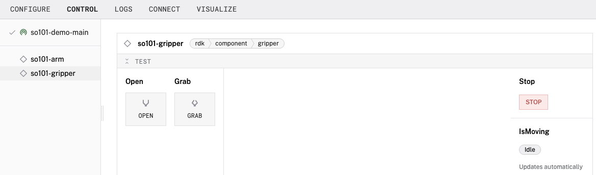
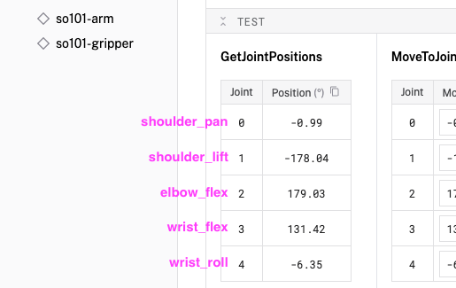
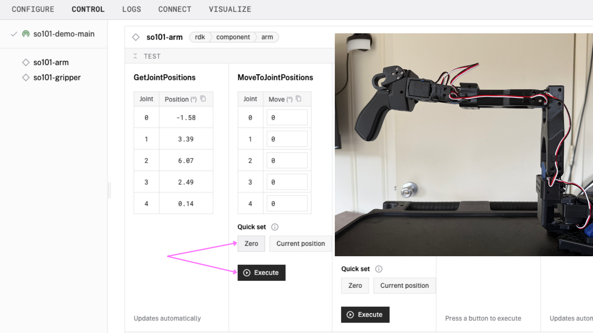
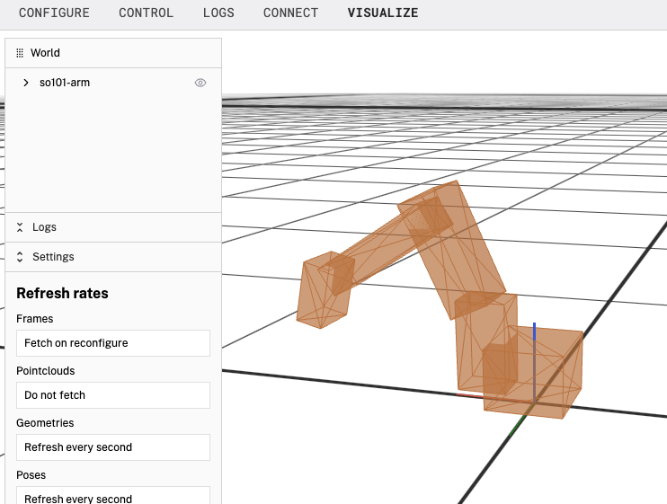

author: Joyce
id: so101
summary: Getting started guide to teleoperate the SO-101 robotic arm
categories: Getting-Started, Developer
environments: web
status: Published
feedback link: https://github.com/viam-devrel/viamcodelabs/issues
tags: Getting Started, Developer

# Teleoperate the SO-101 robotic arm

<!-- ------------------------ -->

## Overview

Duration: 1

### What You'll Build

A Viam-powered SO-101 robotic arm that you can control remotely. Get started quickly with this codelab!


### Prerequisites

- A fully assembled, configured, and calibrated SO-101 robotic arm.
  - You’ll need a calibration file generated [in the final step of this guide](https://huggingface.co/docs/lerobot/en/so101). Instructions for locating the file are provided in this codelab.
- A computer with these requirements
  - Python installed for LeRobot calibration
  - Internet access for remote control using Viam
- Basic understanding of robotic arm operations

### What You'll Need

- Sign up for a free Viam account, and then [sign in](https://app.viam.com).

### What You'll Learn

- How to set up an SO-101 robotic arm in Viam
- How to teleoperate the SO-101 robotic arm through Viam
- How to set up remote control capabilities

<!-- ### Watch the video

Coming soon! -->

<!-- ------------------------ -->

## Set up your SO-101 robotic arm

Duration: 5

This section will guide you through the process of setting up the SO-101 arm in Viam, after you have already configured the motors and calibrated the arm.

### Power up your SO-101 arm

1. Ensure your SO-101 robotic arm is properly assembled and all connections are secure.
1. Ensure your arm is anchored securely to a stable surface.
1. Move the arm into a safe position.
   
1. Connect the USB cable to your computer to enable communication with your control system.
   
1. Connect the power supply to your SO-101 arm to turn it on.
   

### Identify serial port

Next, find your serial `port` that you'll need in order to set up the SO-101 to communicate with Viam. If you already have this information from calibrating the arm, you can skip this section.

1. From your terminal, run the following command to list the serial ports on your computer.
   

   **On macOS/Linux:**

   ```bash
   ls /dev/tty*
   ```

   **On Windows:**

   ```cmd
   mode
   ```

1. To identify the serial port used by your SO-101 arm, look for a device that disappears when you disconnect your SO-101 arm via USB cable, and reappears when you reconnect it. Common names include:

   - macOS: `/dev/tty.usbserial-*` or `/dev/tty.usbmodem*`
   - Linux: `/dev/ttyUSB*` or `/dev/ttyACM*`
   - Windows: `COM*` (e.g., `COM3`, `COM4`)

1. Note down the exact port name. You'll need this for the arm configuration.

### Identify location of the configuration file

Next, find your `calibration_file` that you'll need in order to set up the SO-101 to work smoothly with Viam. The calibration file is typically generated during the final step of the SO-101 setup process using LeRobot.

1. Find the locaion of the calibration JSON file by running the following command.

   **On macOS/Linux:**

   ```bash
   find ~/.cache/huggingface/lerobot/calibration -name '*.json'
   ```

   **On Windows:**

   ```cmd
   Get-ChildItem -Path "$env:USERPROFILE\.cache\huggingface\lerobot\calibration" -Recurse -Filter *.json
   ```

1. In the following example, you can see that there are actually 2 calibrated arms. Make a note of the one that you will be setting up in Viam. You'll need it for the arm configuration in Viam.
   

   > aside negative
   > The calibration file contains joint limits and motor configurations for your robotic arm. You can use `cat` with the path of your calibration file to further inspect the values.
   > 

<!-- ------------------------ -->

## Set up your SO-101 control system

Duration: 2

The SO-101 arm is controlled via a USB serial connection, so most Mac, Windows, or Linux machines can be used to follow along with this codelab. The screenshots shown below are using a Macbook.

### Add a new Viam machine

1. In [the Viam app](https://app.viam.com/fleet/locations) under the **LOCATIONS** tab, create a machine by typing in a name and clicking **Add machine**.
   
1. Once your machine is created, you are brought to your machine overview page. Click **View setup instructions**.
   
1. Install `viam-server` on the device that you want to use to communicate with and control your robot arm. For example, select the `Mac` platform if you want to use your Mac computer to control the arm. If you're using a different computer, select the platform appropriate for your setup.
   
1. Follow the instructions that are shown for your platform. Copy the command shown and run it in your terminal.
   
1. The setup page will indicate when the machine is successfully connected.
   

With a machine configured, we now need to configure the SO-101 arm's components next!

<!-- ------------------------ -->

## Configure your arm and gripper

Duration: 5

Next, let's configure the SO-101 arm components (arm and gripper) that you'll need in order to teleoperate the arm.

### Configure your SO-101 arm

1. Click the **+** icon in the left-hand menu and select **Component or service**.
   
1. Search for the `so101 :arm` module and select it.
   
1. Add the module, and change the name to something descriptive, like `so101-arm`, then click **Create**. This adds the module for working with the SO-101 arm, particularly its joints.
1. A helpful card about the module is shown. Information such as what the module does, its usage, and supported platforms are all available.
   
1. Notice adding this module also adds the arm hardware component you named `so101-arm`. You'll see another card on the right, where you can configure the arm component, see any errors originating from the component, and test the component directly, and the corresponding `so101-arm` part listed in the left sidebar.
1. Next, you'll configure the arm with the data you collected earlier. Under the **CONFIGURE** section of the arm component, configure the serial communication by setting the `port` to the correct serial port (e.g., `/dev/ttyUSB0`). Then customize the calibration values by setting the `calibration_file` to the full path of the calibration file.
   
   > aside negative
   > If the path to the `calibration_file` is not provided, the module will use default calibration values. But it's generally recommended to provide this information, for the arm to run much more smoothly.
1. To give the arm a reference to its position and orientation within the machine's spatial environment, we'll need to add a frame. Still within the **CONFIGURE** section of the arm component, click **Add Frame**.
   
1. Notice that this adds a default frame with some default values. Once we apply our configuration updates, these frame values will correspond to the arm representation under the **VISUALIZE** tab.
   
1. Click **Save** in the top right to save and apply your configuration changes.
1. When prompted, allow the application to accept incoming network connections. This enables your computer to communicate with the SO-101 arm over a serial connection.
   
1. Under the **VISUALIZE** tab, you can see a representation of the arm.
   

   > aside negative
   > If any problems occur, check under the **LOGS** tab to see what might be going wrong.

We now have a connection to the arm (and its joints). Last thing to add is the gripper.

### Configure your SO-101 gripper

1. Click the **+** icon in the left-hand menu and select **Component or service**.
1. Search for the `so101 :gripper` module and select it.
   
1. Change the name to something descriptive, like `so101-gripper`, then click **Create**. This adds the module for working with the SO-101 gripper, particularly its joints.
1. Notice adding this module adds the gripper hardware component you named `so101-gripper`. You'll see a collapsible card on the right, where you can configure the gripper component, see any errors originating from the component, and test the component directly, and the corresponding `so101-gripper` part listed in the left sidebar.
1. Next, you'll configure the gripper component. You can use the same `port` and `calibration_file` used with the arm component.
   
1. Next, to give the gripper a reference to its position and orientation within the machine's spatial environment, we'll need to once again add a frame. In the **CONFIGURE** panel (within the gripper component), click **Add Frame** to add a default frame with some default values. For the `parent` key, change the value to the name of your arm, so `so101-arm`:
   
1. Click **Save** in the top right to save and apply your configuration changes.

   > aside negative
   > **Troubleshooting**: If you receive connection errors, verify that your USB serial ports are correctly identified. You can use `ls /dev/tty.usb*` on macOS/Linux or `Get-WmiObject Win32_SerialPort | Where-Object {$_.DeviceID -like "COM*"}` on Windows to list available USB serial devices on your system. Also ensure that your SO-101 arm is powered on and properly connected via USB before attempting to configure it in Viam.

Now that all of your SO-101 arm's components are configured in Viam, it's time to test them out.

<!-- ------------------------ -->

## Test your arm

Duration: 5

1. Make sure the robotic arm is still positioned in a safe, resting position and securely attached to a stable surface.
1. Click the **CONTROL** tab. If properly configured, you'll find components listed for your SO-101 arm and gripper.
1. Expand your SO-101 gripper's **TEST** panel. Here, you can test opening and closing the gripper. Try the **Grab** and **Open** actions.
   
1. Expand your SO-101 arm's **TEST** panel where you can test the movement of your arm's joints in different ways.
   
1. The first panel `GetJointPositions` shows the position in degrees for each joint. Each joint name corresponds to a joint number.
   
1. Under the `MoveToJointPositions` panel, select **Zero** to quick set the values to a home position, and then **Execute**.
   
1. Now that the arm is in a neutral position, you can test the movement of specific joints. For example, try moving joint 0 (`shoulder_pan` joint) by updating the values to a positive value, and then a negative value, to see what happens.
1. Under the `MoveToPosition` panel, you can test the end effector movement by adjusting pose values. Start by refreshing the values by clicking **Current position**. Then, to move the arm up, increase the `Z` value and press **Execute**. To move it down, decrease the `Z` value. To rotate the wrist, modify the `theta` value in the orientation field.
   
   > aside negative
   > **Limited movement with SO-101**: You can think of this like your own arm. To move your hand somewhere, you need to coordinate multiple joints. This 5-join arm has fewer "joints" than needed for complete 3D freedom (which requires 6 movements), so changing one position value may limit movement in other directions. The Z-axis (up/down) works most reliably because the arm's base naturally aligns with vertical movement.
1. The Quick move interface can move each joint in 5 degree increments.
1. To confirm the directions of the x, y, and z axes of your arm, move the arm in each direction and note which way the arm moves in the real world. It can be useful to label the axes on your workspace, for example with tape or markers. Or 3D print a coordinate frame model, [like this one](https://www.printables.com/model/327160-coordinate-system-axis-frame).
1. You can also use the **VISUALIZE** tab to see a real-time representation of your arm’s geometry and reference frames.
   

   > aside negative
   > Troubleshooting: If you receive connection errors, verify that your USB serial ports are correctly identified. You can use `ls /dev/tty.usb*` on macOS/Linux or `Get-WmiObject Win32_SerialPort | Where-Object {$_.DeviceID -like "COM*"}` on Windows to list available USB serial devices on your system. Also ensure that your SO-101 arm is powered on and properly connected via USB before attempting to configure it in Viam.

Congratulations! You now have a working SO-101 robotic arm connected to Viam that you can control using the Viam UI in a web browser.

<!-- ------------------------ -->

## Teleoperate your SO-101 arm

Duration: 10

Now that your SO-101 arm is configured and tested, let's set up remote control capabilities to teleoperate it from anywhere.

### Set up remote access

1. Ensure your machine is connected to the internet and accessible from external networks.
2. In the Viam app, verify that your machine shows as "Online" in the machine overview.
   
3. Test remote access by accessing your machine's control panel from a different device or network.

### Configure teleoperation controls

1. In the **CONTROL** tab, you can use the existing testing panels for basic teleoperation.
2. For more advanced control, consider setting up custom control interfaces or using Viam's SDKs to create custom control applications.
   
3. You can also configure keyboard shortcuts or gamepad controls for more intuitive operation.

### Test remote operation

1. From a remote location, access your Viam machine through the web interface.
2. Test basic arm movements using the control panels.
3. Verify that camera feed is accessible and responsive.
4. Test gripper operations remotely.
   

<!-- ------------------------ -->

## Conclusion And Resources

Duration: 1

Congratulations! You've just connected your SO-101 robotic arm to Viam and can now teleoperate it remotely using Viam. This foundational step allows you to remotely access and manage the arm, extend its functionality with some of [Viam's SDKs](https://docs.viam.com/dev/reference/sdks/), or extend its functionality with modules from the [Viam Registry](https://app.viam.com/registry).

### What You Learned

- How to set up an SO-101 robotic arm in Viam
- How to teleoperate the SO-101 robotic arm through Viam
- How to set up remote control capabilities

### Extend your Viam-powered SO-101 arm

Right now, you have an SO-101 robotic arm that can take advantage of Viam's capabilities and can be controlled remotely. Why not:

- Create a custom [CV model](https://codelabs.viam.com/guide/cv-checkout/index.html) to detect objects and a [custom module](https://codelabs.viam.com/guide/control-module/index.html) to sort them.
- Build your own [automated assembly line](https://codelabs.viam.com/guide/control-module/index.html)!
- Add [AI tracking support](https://codelabs.viam.com/guide/ai-camera-tracking/index.html) to your arm's webcam and the arm itself.
- Implement [advanced motion planning](https://docs.viam.com/operate/reference/components/arm/) for complex tasks.

### Related Resources

- [Viam documentation](https://docs.viam.com/)
- Other [Viam codelabs](https://codelabs.viam.com/)
- [Viam Discord community](http://discord.gg/viam)
- [SO-101 arm documentation](https://docs.viam.com/components/arm/so101/)
