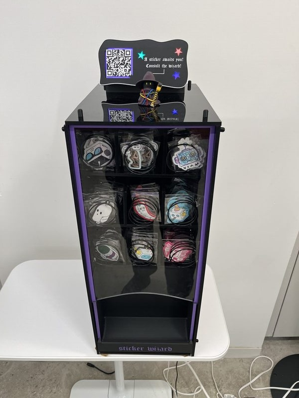
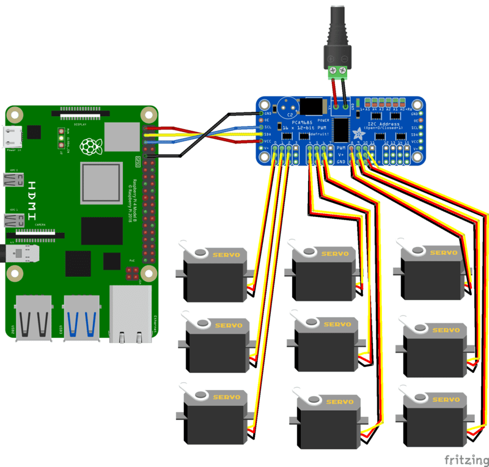
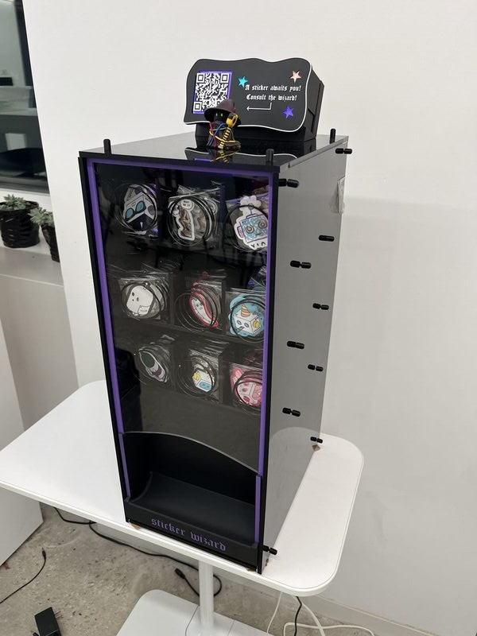
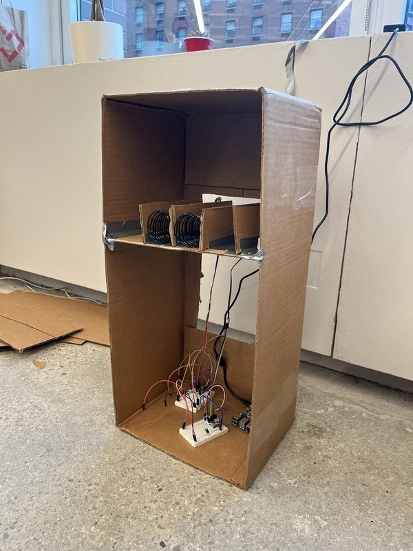
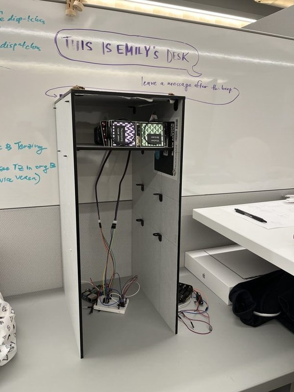
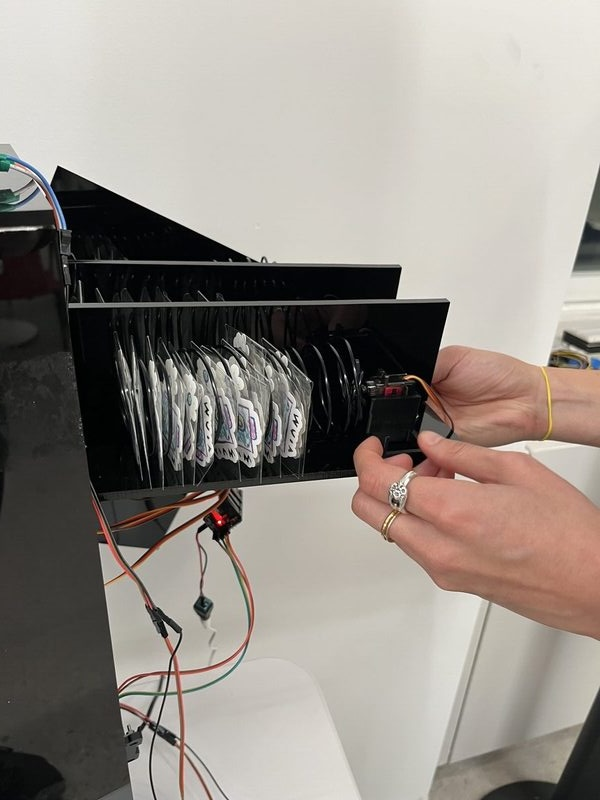
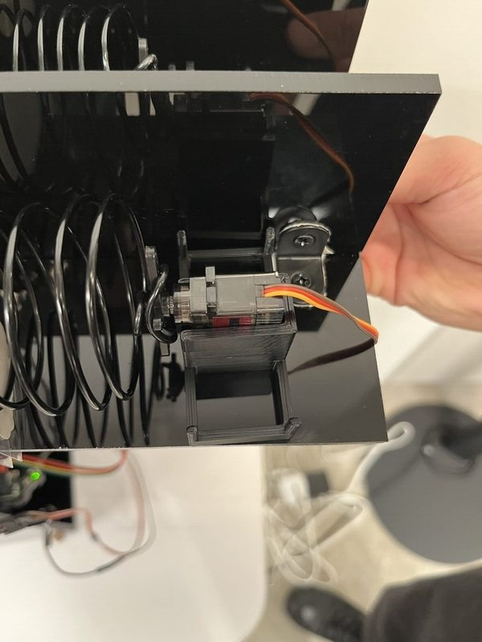
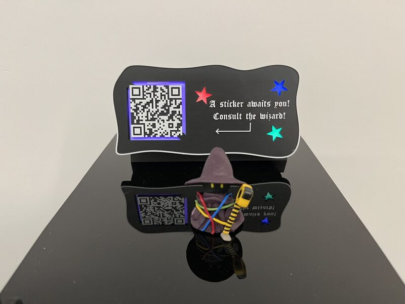
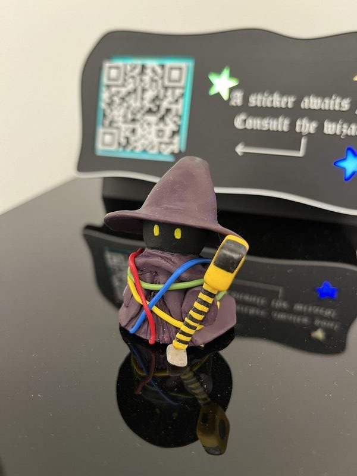
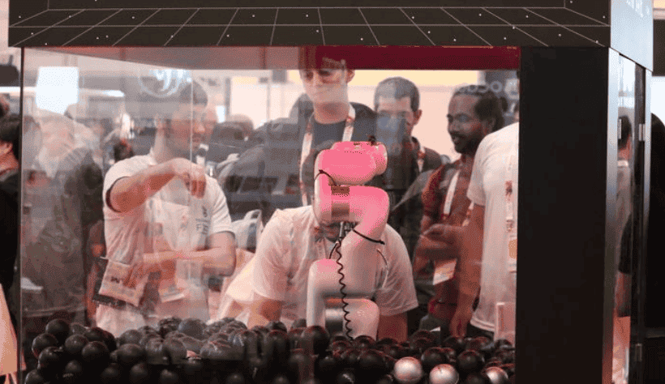

author: Emily
id: sticker-wizard
summary: Sticker vending machine
categories: Getting-Started, Developer
environments: web
status: Unpublished
feedback link: https://github.com/viam-labs/viamcodelabs/issues
tags: Getting Started, Developer

# Make your own sticker vending machine

<!-- ------------------------ -->

## Overview

Duration: 1

Sticker wizard is a sticker vending machine with a twist: you don't get to choose which sticker you get. Instead, you'll scan the QR code, take the "which robot are you?" personality quiz, and then receive the sticker you deserve (along with a free personality analysis).

This tutorial will walk you through making your own vending machine from scratch, along with a web application that allows you to operate your machine from any device.

  

<video id="TB40-bLkjDg"></video>

### Prerequisites

- Sign up for a free Viam account, and then [sign in](https://app.viam.com).
- Hardware and supplies requirements

  - Raspberry Pi

    - Follow the [Raspberry Pi setup guide](https://docs.viam.com/installation/prepare/rpi-setup/) to make sure your Pi is flashed with a Viam-compatible operating system, and that you are able to SSH into it.

  - x3 packs of [craft wire](https://www.amazon.com/TecUnite-Aluminum-Bendable-Skeleton-Thickness/dp/B08GCPWVSZ/)
  - x9 [360° micro servo motors (we used MG90S)](https://www.amazon.com/Compatible-Raspberry-Project-Helicopter-Airplane/dp/B0925TDT2D?th=1)
  - x1 [16 channel 12-Bit PWM servo motor driver (PCA9685)](https://www.amazon.com/HiLetgo-PCA9685-Channel-12-Bit-Arduino/dp/B07BRS249H)
  - x2 5V power supply
  - Something to build the vending machine with (we used black acrylic sheets, screws, and mounting brackets)

- Software
  - Install the Typescript SDK on your computer.

### What You’ll Learn

- How to build a custom web interface to control a machine (hint: use the Viam Typescript SDK!)
- How to use servo motors and a motor driver with Viam
- Your robot personality type 😈

### What You’ll Need

- A computer running Mac, Windows, or Linux
- Your preferred code editor
- A smartphone, for testing!
- Tools
  - A computer
  - Screwdriver
  - Wire cutter
  - Tools to construct the vending machine frame (we used a laser cutter and 3D printer)

### What You’ll Build

- A vending machine controlled by a custom web application

<!-- ------------------------ -->

## Set up the electronics

Duration: 30

### Set up your Raspberry Pi

Follow the Viam [documentation](https://docs.viam.com/installation/prepare/rpi-setup/) to complete the following steps to set up your Raspberry Pi.

1. Install Raspberry Pi OS.
1. Connect to your Pi with SSH.
1. Enable communication protocols with `sudo raspi-config`. You will need to **enable I2C** for the motor driver.
   
1. Restart your Pi to apply the changes with `sudo reboot`.

### Set up the dispensing mechanisms

1. Wind up your craft wire into 9 coils of equal size
   - Our coils are about 20 loops long and have a diameter just under 2". We recommend using a PVC pipe or otherwise cylindrical object as a guide!

  

2. Attach the coils to the motors
   - We simply wrapped the wire around the double servo arms that come with the motors.
3. Wire up the motors to the motor board
4. Wire up the motor board to a 5V power supply
5. Wire up the motor board to your Raspberry Pi
   - Follow these [instructions](https://learn.adafruit.com/adafruit-16-channel-servo-driver-with-raspberry-pi/hooking-it-up) and refer to the wiring diagram above.

  

## Configure your machine with Viam

Duration: 10

### Configure a new machine

1. In [the Viam app](https://app.viam.com/fleet/dashboard) under the **LOCATIONS** tab, create a machine by typing in a name and clicking **Add machine**.
   
1. Click **View setup instructions**.
   
1. To install `viam-server` on the Raspberry Pi device that you want to use to communicate with and control your webcam, select the `Linux / Aarch64` platform for the Raspberry Pi, and leave your installation method as [`viam-agent`](https://docs.viam.com/how-tos/provision-setup/#install-viam-agent).
   
1. Use the `viam-agent` to download and install `viam-server` on your Raspberry Pi. Follow the instructions to run the command provided in the setup instructions from the SSH prompt of your Raspberry Pi.
   
1. The setup page will indicate when the machine is successfully connected.
   

### Add your board and peripherals

1. In [the Viam app](https://app.viam.com/fleet/locations), find the **CONFIGURE** tab. It's time to configure your hardware.
1. Click the **+** icon in the left-hand menu and select **Component**.
1. Select `board`, and find the `pca:pca9685` module. Give this component a name `motor-board`. This adds the module for working with a PCA9685 board that displays in the left sidebar. Notice adding this component also adds a corresponding panel on the right.
1. From the **Attributes** section of the panel, configure the `i2c_bus` to `1`.
1. Configure the `i2c_address` as `64` (`0x40`), the default base address for [PCA9685](https://learn.adafruit.com/16-channel-pwm-servo-driver/chaining-drivers#addressing-the-boards-848847).

### Test the machine

From here, you should be able to use Viam to control your motors! To test:

1. Open the **TEST** section of the board component
2. Set the pin to be the pin on the board that you connected your motor to
3. Set the PWM frequency to whatever your motor specifies
   - The MG90S motors use a PWM frequency of 50 hz
4. (Experimentally) Set the PWM duty cycle
   - Different duty cycles determine the speed and direction of your motor. Due to inconsistencies between motors, it may take some experimentation to find the desired duty cycle
   - Our duty cycles ended up being either 0.075 or 0.09, or 7.5% and 9% (opposite directions)

If you cannot find the board, run `i2cdetect -y 1` on your Raspberry Pi to check if your board is connected correctly.

<!-- ------------------------ -->

## Build the structure

Duration: 60

The basic structure of the vending machine is a box with 3 "drawers" of 3 motors each. We prototyped using cardboard, and then made the final structure with acrylic cut to size and screws. We made each layer of motors a drawer for convenient refilling and maintenance. To fit the motors in the drawers, we created dividers between each motor and coil, and 3D printed a motor mount that sits on the drawer.

But your structure can be anything! You could build this out of cardboard and tape! As long as it can contain the motors and dispenses the stickers...you're golden!

#### Cardboard prototype

#### In progress...

#### Motor "drawer"

  
  

#### 3D-printed motor mount

  

<!-- ------------------------ -->

## Build the web app interface

Duration: 60

This part is entirely up to your imagination, you can build any interface you want, using any technology you want! The only requirement is to use [Viam's Typescript SDK](https://docs.viam.com/sdks/#frontend-sdks) to interface between your web application and your machine.

  
  

We built our web application with [SvelteKit](https://svelte.dev/docs/kit/introduction) and [Threlte](https://threlte.xyz/). We used [Aseprite](https://www.aseprite.org/)-created pixel art assets with the [<AnimatedSpriteMaterial>](https://threlte.xyz/docs/reference/extras/animated-sprite-material) Threlte component to create the animations. Our web app has the following basic components:

- Intro sequence
- Quiz (Display questions, accept responses)
- Results view (with dispense sticker button)

  

To authenticate your website with your machine, use Viam API keys. We recommend setting up an operator API key so users don't have write access to your machine (and use a `.env` file to avoid committing your API keys to your Github repo!)

Here's our [source code](https://github.com/ehhong/sticker-wizard).

## Use Viam to run a local web server

Duration: 10

Through Viam, we can host our web server directly on the Raspberry Pi using a [process](https://docs.viam.com/configure/processes/). A process runs every time your machine starts up.

1. Download your web app's source code to your Raspberry Pi
   - We recommend uploading your source code to GitHub and then downloading `git` on your Raspberry Pi to pull changes from your website
2. Follow instructions from your selected web framework to run your production bundle locally from your Pi. Make sure you can access it from your local network!
   - In SvelteKit, you can run your [production bundle locally](https://svelte.dev/docs/kit/building-your-app#Preview-your-app) with `vite preview`
   - Expose it on your [local network](https://www.ryanfiller.com/blog/tips/sveltekit-local-network) with the `--host` flag
3. Create a bash script to run your production bundle locally. Call it `run-web-server.sh`.
4. Add a [process](https://docs.viam.com/configure/processes/) to your machine config
   - Configure the executable to be the absolute path to `run-web-server.sh`. You can determine the absolute path with the `pwd` command.
   - Set the working directory to be the absolute path to the folder containing your bash script.

5. Test!
   - **Save** your config
   - Go to the **LOGS** tab, and check for logs verifying that your web server is up and running
   - Verify that you can access your website on a separate device that is also on your local network

To make your local web server available to those not on your local network, use a service like [ngrok](https://ngrok.com/). You can set up ngrok with Viam with a process in the same way so it is always available when your machine is running.

## Finishing touches

Duration: 10

That's it! We added a few finishing touches to enhance the experience, but these are completely optional.

### LEDs

The LEDs really enliven this project, and let people know that sticker wizard is alive and ready to gift you a sticker! These instructions are for WS2811 LEDs, the LEDs we used here, but any individually-addressible LEDs should do the trick.

- Connect some WS2811 LEDs to [a SPI pin of the Raspberry Pi](https://pinout.xyz/pinout/spi)
- If using a Raspberry Pi 5, write a script using [neopixel_spi](https://docs.circuitpython.org/projects/neopixel_spi/en/latest/) to control the colors of your LEDs. Otherwise, use [rpi_ws281x](https://github.com/jgarff/rpi_ws281x)
- Encase your LEDs in a pretty display!

### QR code

Use any QR code generator to create a QR code that encodes your web app's URL, and display it somewhere on your machine! We used [qr-code-generator.com](https://www.qr-code-generator.com/), but any generator should work.

### Clay figurine

Personify your machine! This dude was hand-sculpted with polymer clay.

  

## Next Steps

[Explore the Viam platform](https://www.viam.com/product/platform-overview) and browse components and services to build your next project.

### Related projects

- [Automatic pet feeder](https://www.viam.com/post/smart-pet-feeder)
- [Tipsy: Create an autonomous drink carrying robot](https://www.viam.com/post/autonomous-drink-carrying-robot)
- [Robotic claw game](https://www.viam.com/post/how-we-built-our-robotic-claw-game-at-icra) using a motion service, which could be extended in the following ways:
  - ‍Using [object or color detection](https://docs.viam.com/how-tos/detect-people/) to keep track of how many people grab different kinds of prizes‍
  - Using an [ML model](https://docs.viam.com/services/ml/) to determine grab success rate and create a score counter

### Related Viam resources

- [Viam documentation for additional resources](https://docs.viam.com/)
- [Other hands-on Viam codelabs](https://codelabs.viam.com/)
- [Viam Discord community for support and inspiration](http://discord.gg/viam)
