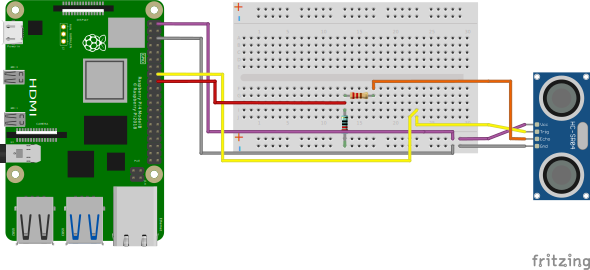
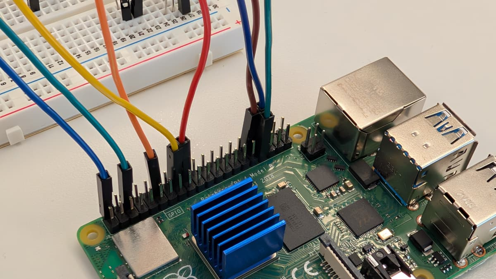

author: Adrienne Braganza Tacke
id: visual-proximity-alert
summary: Build a visual proximity alert with an ultrasonic sensor, RGB LED, and Raspberry Pi
categories: Getting-Started, Developer
environments: web
status: Published 
feedback link: https://github.com/viam-devrel/viamcodelabs/issues
tags: Getting Started, Developer

# Build a visual proximity alert with an ultrasonic sensor, RGB LED, and Raspberry Pi
<!-- ------------------------ -->
## Overview 
Duration: 5

Proximity alerts can be very useful, whether you're backing into a parking spot (and don't have a rearview camera), want to warn others that you're in a blind corner, or want to avoid getting _too_ close to things. In this codelab, you'll build your own visual proximity alert that uses an RGB LED to indicate safe and dangerous distances and an ultrasonic sensor to determine those distances.

### What You’ll Build 
- A visual proximity alert. A light will turn red (when an object is within the "danger" distance threshold) or green (when an object is within the "safe" distance threshold) based on the ultrasonic sensor.


### Prerequisites
- A computer with MacOS, Windows, or Linux to flash your Raspberry Pi and configure the device's components using the Viam app.
- Hardware and supplies requirements

  - 1 - [Raspberry Pi 4](https://a.co/d/fc3JUMm) (recommend at least 4 GB RAM)
  - 1 - microSD card to use with your Pi
  - 1 - power supply for your Pi
  - 1 - [ultrasonic sensor](https://www.sparkfun.com/ultrasonic-distance-sensor-hc-sr04.html) (I used this model)
  - 1 - [common cathode RGB LED](https://a.co/d/inuxrYr)
  - 1 - [solderless breadboard](https://a.co/d/4IF96Pp)
  - 1 - [Resistor pack](https://a.co/d/4LIz7Uu)
    - You'll use 2 resistors for the ultrasonic sensor (1 - 1000 Ohm, 1 - 2000 Ohm) and 3 resistors for the RGB LED (2 - 10 Ohm, 1 - 100 Ohm)
  - 12 - [Female to Male Jumper Wires](https://a.co/d/bkMJLpW)
- Software
  - [Raspberry Pi Imager](https://www.raspberrypi.com/software/) (to flash your Pi)

### What You’ll Need
- Sign up for a free Viam account, and then [sign in](https://app.viam.com).
- All of the hardware components listed in the prerequisites.

### What You’ll Learn 
- How to configure and test multiple hardware components using Viam
- How to use modules from the Viam registry
- How to control an RGB LED based on an ultrasonic sensor's input

<!-- ------------------------ -->
## Set up your Raspberry Pi

Duration: 15

The Raspberry Pi boots from a microSD card. You need to install Raspberry Pi OS on a microSD card that you will use with your Pi. For more details about alternative methods of setting up your Raspberry Pi, refer to the [Viam docs](https://docs.viam.com/installation/prepare/rpi-setup/#install-raspberry-pi-os).

### Install Raspberry Pi OS

1. Connect the microSD card to your computer.
1. Launch the [Raspberry Pi Imager](https://www.raspberrypi.com/software/).
   
1. Click **CHOOSE DEVICE**. Select your model of Pi, which is Raspberry Pi 4.
1. Click **CHOOSE OS**. Select **Raspberry Pi OS (64-bit)** from the menu.
1. Click **CHOOSE STORAGE**. From the list of devices, select the microSD card you intend to use in your Raspberry Pi.
   
1. Configure your Raspberry Pi for remote access. Click **Next**. When prompted to apply OS customization settings, select **EDIT SETTINGS**.
   
1. Check **Set hostname** and enter the name you would like to access the Pi by in that field, for example, `test`.
1. Select the checkbox for **Set username and password** and set a username (for example, your first name) that you will use to log into the Pi. If you skip this step, the default username will be `pi` (not recommended for security reasons). And specify a password.
1. Check **Configure wireless LAN** and enter your wireless network credentials. SSID (short for Service Set Identifier) is your Wi-Fi network name, and password is the network password. Also change the section **Wireless LAN country** to where your router is currently being operated. This will allow your Pi to connect to your Wi-Fi so that you can run `viam-server` wirelessly. 
1. Check **Set locale settings** and set your time zone and keyboard layout.
   
   > aside negative
   > Be sure that you remember the `hostname`, `username`, and `password` you set, as you will need this when you SSH into your Pi.
1. Select the **SERVICES** tab, check **Enable SSH**, and select **Use password authentication**.
   
1. **Save** your updates, and confirm `YES` to apply OS customization settings. Confirm `YES` to erase data on the microSD card. You may also be prompted by your operating system to enter an administrator password. 
  
After granting permissions to the Imager, it will begin writing and then verifying the Linux installation to the microSD card.
1. Remove the microSD card from your computer when the installation is complete.

### Connect with SSH

1. Place the microSD card into your Raspberry Pi and boot the Pi by plugging it in to an outlet. A red LED will turn on to indicate that the Pi is connected to power.
   > aside negative
   > Make sure you are using a 5V 3A USB-C power supply to power your Raspberry Pi 4. Using a power supply with inadequate amperage can lead to instability, throttling, or unexpected behavior. Additionally, while USB boot is enabled by default on newer Raspberry Pi 4 models, older versions may require a firmware update to enable it. Refer to the [Raspberry Pi documentation](https://www.raspberrypi.com/documentation/computers/raspberry-pi.html) for detailed setup instructions and compatibility.
1. Once the Pi is started, connect to it with SSH. From a command line terminal window, enter the following command. The text in <> should be replaced (including the < and > symbols themselves) with the username and hostname you configured when you set up your Pi.
   ```bash
   ssh <USERNAME>@<HOSTNAME>.local

   # for example, my command would look like this:
   ssh atacke@echo.local
   ```
1. If you are prompted “Are you sure you want to continue connecting?”, type “yes” and hit enter. Then, enter the password for your username. You should be greeted by a login message and a command prompt.
   
1. Update your Raspberry Pi to ensure all the latest packages are installed
   ```bash
   sudo apt update
   sudo apt upgrade
   ```

<!-- ------------------------ -->
## Full wiring preview
Duration: 1

It's now time to wire our hardware components together! Here's what you'll be wiring together:


The following sections will focus on a single component at a time and show the localized wiring diagram. However, feel free to reference this full diagram when needed.

Alright, first up, the ultrasonic sensor!

<!-- ------------------------ -->
## Wire up the ultrasonic sensor
Duration: 10

First, we'll set up the ultrasonic sensor. You'll need your 
- Raspberry Pi
- Ultrasonic sensor
- Breadboard
- 8 - jumper wires
- 1 - 1000 Ohm resistor
- 1 - 2000 Ohm resistor

### Wiring reference

1. **Review the wiring diagram**: Refer to the following wiring diagram to see how to connect the ultrasonic sensor to the Raspberry Pi, using the breadboard and resistors to control the flow of electricity:


    

    The ultrasonic sensor will use 4 GPIO pins on the Raspberry Pi
      
    | **Ultrasonic sensor** | <-> | **Raspberry Pi** |
    | -------- | ------- | ------- |
    | VCC  | to | GPIO 5V (Physical Pin 2) |
    | GND | to | GPIO GND (Physical Pin 6) |
    | TRIG | to | GPIO 23 (Physical Pin 16) |
    | ECHO | to | GPIO 24 (Physical Pin 18) |

> aside positive
> **New to wiring?** If needed, the following instructions take you step-by-step on how to wire your ultrasonic sensor correctly. Feel free to skip to the next section (Set up the RGB LED) if you are comfortable with wiring diagrams and are able to wire your hardware without additional guidance!

### Step-by-step wiring instructions

2. Plug four of your jumper wires into the pins of the HC-SR04.
    

3. **Plug your VCC wire into the positive rail of your breadboard and your GND wire into the negative rail**. From this point on, we'll use the breadboard to simplify the wiring process and provide a secure platform to connect components without soldering.
    

4. Plug a jumper wire into GPIO 5V (Physical Pin 2) on your Pi and connect that wire to the positive rail of your breadboard, which connects it to VCC.
    

5. Plug a jumper wire into GPIO GND (Physical Pin 6) on your Pi and connect that wire to the negative rail of your breadboard, which connects it to GND.
    

6. Plug the TRIG wire from your ultrasonic sensor into a blank rail on your breadboard, then use another jumper wire to connect that rail to your Pi's GPIO 23 (Physical Pin 16) pin. (Technically, you can skip the connection on the breadboard and connect the TRIG wire directly to the Pi; it's a matter of preference!)
    
    

7. Plug the ECHO wire from your ultrasonic sensor into another blank rail, then link it to another blank rail using a 1000 Ohm resistor (R1).
    

8. Link your R1 rail to your GND rail using a 2000 Ohm (R2) resistor. Be sure to leave a space between the two resistors.
    

9. Plug a jumper wire right where you left a space in between the resistors and connect that wire into your Pi's GPIO 24 (Physical Pin 18) pin.
    

Sweet! You've set up the ultrasonic sensor.


This will enable you to capture distance readings. Let's add the RGB LED next!

<!-- ------------------------ -->
## Wire up the RGB LED
Duration: 10

Next, we'll set up the RGB LED. You'll need your 
- RGB LED
- 4 - jumper wires
- 2 - 10 Ohm resistors
- 1 - 100 Ohm resistor

### Wiring the hardware

1. **Review the wiring diagram**: Refer to the following wiring diagram (ultrasonic wiring omitted for clarity) to see how to connect the RGB LED to the Raspberry Pi, using the breadboard and resistors to control the flow of electricity:

    
    <br>

    The RGB LED will use 4 GPIO pins on the Raspberry Pi
    | **RGB LED** | <-> | **Raspberry Pi** |
    | -------- | ------- | ------- |
    | Common Cathode (GND)  | to | GND (Physical Pin 34) |
    | Red | to | GPIO 13 (Physical Pin 33) |
    | Green | to | GPIO 12 (Physical Pin 32) |
    | Blue | to | GPIO 18 (Physical Pin 12) |

> aside positive
> **New to wiring?** If needed, the following instructions take you step-by-step on how to wire your RGB LED correctly. The website [pinout.xyz](https://pinout.xyz/) is also a helpful resource where you can interact with the exact layout and role of each pin for Raspberry Pi. When working with Viam, make sure to reference the physical pin numbers, and not the GPIO numbers listed on `pinout.xyz`. 
> 
> Feel free to skip to the next section (Configure your machine) if you are comfortable with wiring diagrams and are able to wire your hardware without additional guidance!

### Step-by-step wiring instructions

1. **Review the LED's orientation**: A common cathode RGB LED has four legs:
  - **Common Cathode (GND)**: The longest leg, which should be connected to ground.
  - **Red (R)**: Typically the leg next to the common cathode (to the left as shown below).
  - **Green (G)**: The leg on the other side of the cathode (to the right as shown below).
  - **Blue (B)**: The farthest leg from the cathode.


1. **Plug your RGB LED into a blank rail on your breadboard**. From here, you'll use jumper wires and resistors to connect it to your Pi.
    

1. Plug a jumper wire next to the longest leg of the LED, then connect that wire to the Pi's GND pin (Physical Pin 34). This will be your ground.
    

1. Link a 100 Ohm resistor to the red leg of the LED.
    

1. Link a 10 Ohm resistor to the green leg and another 10 Ohm resistor to the blue leg of the LED.
    

1. **Connect the resistors to the Pi**.
    - Connect a jumper wire from the red leg (100 Ohm resistor) to the Pi's GPIO 13 pin (Physical Pin 33)
    - Connect a jumper wire from the green leg (10 Ohm resistor) to the Pi's GPIO 12 pin (Physical Pin 32)
    - Connect a jumper wire from the blue leg (10 Ohm resistor) to the Pi's GPIO 18 pin (Physical Pin 12)
    
    

1. Double-check connections to ensure correct polaity and avoid miswiring. 


   > aside positive
   > Your LED may come with resistors of the recommended resistance. If the Ohm level is too high, then no power will get to the LED. You can figure out which ones you're using with [this handy tool](https://www.digikey.com/en/resources/conversion-calculators/conversion-calculator-resistor-color-code).

With the hardware all wired up, it's time to configure them within the Viam app, which we'll do in the next section.


<!-- ------------------------ -->

## Configure your machine
Duration: 10

1. In [the Viam app](https://app.viam.com/fleet/dashboard) under the **LOCATIONS** tab, create a machine by typing in a name and clicking **Add machine**.
   
1. Click **View setup instructions**.
   
1. To install `viam-server` on your Raspberry Pi (so you can communicate with and control your sensor and the RGB LED), select the `Linux / Aarch64` platform for the Raspberry Pi, and leave your installation method as [`viam-agent`](https://docs.viam.com/how-tos/provision-setup/#install-viam-agent).
   
1. Use the `viam-agent` to download and install `viam-server` on your Raspberry Pi. Follow the instructions to run the command provided in the setup instructions from the SSH prompt of your Raspberry Pi.
    
1. The setup page will indicate when the machine is successfully connected.
    

With a machine configured and connected, it's time to add the peripherals. First, the board (AKA your Raspberry Pi).

<!-- ------------------------ -->

## Configure your Raspberry Pi board
Duration: 5

To access the GPIO pins of your Raspberry Pi, add the board to your machine in the Viam app.

1. In [the Viam app](https://app.viam.com/fleet/locations), find the **CONFIGURE** tab.
1. Click the **+** icon in the left-hand menu and select **Component**.
   
1. Select `board`, and find the `raspberry-pi:rpi4` module. Click **Add Module**. Leave the default name `board-1` for now, then click **Create**. This adds the module for working with the Raspberry Pi 4's GPIO pins.
   
1. Notice adding this module adds the board hardware component called `board-1`. You'll see a collapsible card on the right, where you can configure the board component, and the corresponding `board-1` part listed in the left sidebar.
   
1. Click **Save** in the top right to save and apply your configuration changes.
1. Expand the **TEST** section of the panel to experiment with writing to physical pins. For example, since our RGB LED's red leg is connected to physical pin 33, type `33` into the `Pin` field and set it's signal to `High`. This should turn the RGB LED on and emit a red light.
   
   
1. Set the signal to `Low` (for each pin previously set to `High`) to turn off the LED.

> aside negative
> **TROUBLESHOOTING**: Double check the wiring on your LED component. Also check under the **LOGS** tab to see what might be going wrong.

Now that your board is configured, you can configure your ultrasonic sensor next.

<!-- ------------------------ -->

## Configure your ultrasonic sensor
Duration: 5

To access the ultrasonic sensor's measurements, add the sensor to your machine.
1. In [the Viam app](https://app.viam.com/fleet/locations), find the **CONFIGURE** tab.
1. Click the **+** icon in the left-hand menu and select **Component**.
   
1. Select `sensor`, and find the `ultrasonic:sensor` module. Click **Add Module**. Leave the default name `sensor-1` for now, then click **Create**. This adds the module that gives you access to the ultrasonic sensor's readings.
    <br>
    
1. Notice adding this module adds the sensor hardware component called `sensor-1`. You'll see a collapsible card on the right, where you can configure the sensor component, and the corresponding `sensor-1` part listed in the left sidebar.
   
1. In the **JSON configuration** field (within the **CONFIGURE** panel), add the following attributes. This tells your sensor which pins to use for its Echo Pulse Output (`ECHO`) and Trigger Pulse Input (`TRIG`) and which board it is wired to. In your case, that's `board-1`, which is the Raspberry Pi you added earlier. You can read more about each attribute in the **Documentation** panel that's next to your JSON configuration
    ```JSON
    {
      "echo_interrupt_pin": "18",
      "trigger_pin": "16",
      "board": "board-1",
      "timeout_ms": 1000 // Optional; 
    }
    ```
    
1. Click **Save** in the top right to save and apply your configuration changes.
1. Expand the **TEST** section of the panel to experiment with the sensor. You should see a `Get Readings` label and a continuously updating measurement. Try placing your hand in front of the sensor and moving it farther away. The readings should reflect these changes, returning a smaller value as you place an object closer to the sensor and a larger value as you move the object farther away from the sensor.

    

    > aside negative
    > **Why so jumpy?** The readings might seem "jumpy", meaning they will return an unusually high or low number before normalizing and staying within a smaller range of readings. Since the sound that is emitted by the ultrasonic sensor can bounce off any nearby solid objects, the receiver may reflect and detect noise from other objects in your room, which can contribute to the unusual readings. Be sure to orient your sensor to directly face the object whose distance you are trying to measure.

    > aside negative
    > **TROUBLESHOOTING** Double check that your wires are connected properly and that your sensor configuration is correct. The `board` attribute must match your board component name in the Viam app (so `board-1` if you've been following along) and have the `echo_interrupt_pin` and `trigger_pin` attributes set.

Great! You now have a working sensor and access to your board. Let's add some logic to turn the RGB LED red or green depending on the measured readings.

<!-- ------------------------ -->

## Add the proximity alert module
Duration: 5

We can indicate when something is too close or within a safe distance (relative to the sensor) by changing the color of the RGB LED. To do this, you can write some code that processes the ultrasonic sensor's readings and sets the RGB LED to turn red or green (unsafe and safe distances, respectively). Or you can use a prebuilt module from the Viam registry that already does this for you! This step will go over how to use the `proximity-alert` module. 

1. In [the Viam app](https://app.viam.com/fleet/locations), find the **CONFIGURE** tab.
1. Click the **+** icon in the left-hand menu and select **Service**.
   
1. Select `generic`, and find the `proximity-alert:hc-sr04_rgb-led` module. Click **Add Module**. Be sure to change the default name to something more descriptive, like `proximity-alert-service`, then click **Create**. This adds a service that automatically turns the RGB LED red or green depending on the ultrasonic sensor's readings and a distance threshold you'll specify soon. 
    
1. Notice adding this module adds the generic service of your chosen name. You'll see a collapsible card on the right, where you can configure the proximity alert module, and the corresponding part listed in the left sidebar.
   
1. In the **CONFIGURE** panel, add the following attributes (minus the comments). This tells the service which board and sensor to use (which should be the ones you've just configured), which GPIO pins to use to control the RGB LED, and a safe distance threshold to determine when to turn red or green.
    ```JSON
    // "board" and "sensor" values need to match your board and sensor component names in the Viam app
    // "red_pin", "green_pin", and "blue_pin" values match GPIO pins you configured for your RGB LED
    {
      "board": "board-1", 
      "sensor": "sensor-1",
      "red_pin": "33", 
      "green_pin": "32", 
      "blue_pin": "12", 
      "safe_distance": "0.3"
    }
    ```
    
1. Click **Save** to apply your configuration changes. This may take a moment. 
1. After a few moments, your RGB LED should flicker on and emit a light. Test it out! Place your hand immediately in front of the ultrasonic sensor. It should quickly emit a red light and stay red as long as you keep your hand there. When you remove your hand (and assuming there are no other objects in front of the sensor's path that is within the unsafe distance), the LED should emit a green light. To continue testing the service and ensure a bit more accuracy, position the ultrasonic sensor so that it faces some open space and that you are able to move an object within its path at variable ranges.

    > aside negative
    > **TROUBLESHOOTING** It might take a moment for the service to start and for the you to see the LED changing. If the LED still doesn't come on, double check your service configuration and that there are no errors surfacing in the proximity alert module's Error Logs panel or in the top-level **LOGS**. If no errors are found (yay!), try restarting the proximity alert service: On the left sidebar, find the `proximity-alert` component (which is different to the component that you named) and click on the "..." that appear next to it. Then, click **Restart** and wait for a few moments for your service to restart.

<!-- ------------------------ -->
## Conclusion And Resources
Duration: 1

Congratulations! You've just built an automated proximity alert with a visual indicator! 🥳 Using some pretty common hardware components and a handy module from Viam, you created a useful device. Do [let me know](https://bsky.app/profile/abt.bsky.social) if you've built this!

### What You Learned
- How to configure and test a device's components using Viam
- How to use modules from the Viam registry
- How to combine multiple components with a Raspberry Pi
- How to work with an ultrasonic sensor and RGB LED

### Real-world applications for proximity alerts with visual indicators
This project is a great way to learn about combining different components to produce something useful; it has practical applications as well:
- Provide safety cues to those with hearing impairments or in areas where auditory alerts might be missed (due to excessive noise).  
- Prevent crashes between heavy machinery and with workers on foot, with color-coded displays to indicate levels of proximity.
- Maintain safe distances from moving parts or machinery, whether on the assembly line or warehouse.
- Avoid collisons in blind spots or corners in high-traffic environments like restaurant kitchens or sports arenas.

### Extend your proximity alert with Viam
Right now, you can give visual indicators based on proximity with the RGB LED. But there are other things you can do to extend your proximity alert!  As an example, you could:

- [Add a piezo buzzer](https://codelabs.viam.com/guide/piezo/index.html) to play a tone when something is too close.
- [Send a text notification](https://github.com/mcvella/viam-twilio-sms) when your proximity alert detects something (or someone) gets too close to something precious (like your snacks)!

### Related Resources
- [Proximity alert module](https://app.viam.com/module/atacke/proximity-alert)
- [Proximity alert GitHub repo](https://github.com/viam-devrel/proximity-controller)
- [Viam documentation](https://docs.viam.com/) 
- [Viam how-to guides](https://docs.viam.com/how-tos/)
- [Viam Discord community](http://discord.gg/viam)
