author: Joyce
id: workshop-air-monitoring
summary: Resources for instructors to deliver an air quality monitoring workshop
categories: Workshop, Developer
environments: web
status: Published
feedback link: https://github.com/viam-devrel/viamcodelabs/issues
tags: Workshop, Developer

# Air quality monitoring [Workshop]

<!-- ------------------------ -->

## Overview

Duration: 2

> aside negative
> If you want to complete this project, but you are not a workshop instructor, follow this codelab instead:
>
> - [**Automate air filtration with air quality sensors**](https://codelabs.viam.com/guide/air-quality/index.html?index=..%2F..index#0)

This codelab is part of the [Viam for educators](https://education.viam.com/) program, and provides a suggested delivery plan and resources for instructors interested in delivering a hands-on workshop. Take these resources, and make it your own!

### Workshop Overview

- **Goal**: Introduce sensors and actuators as concepts and build a simple air quality monitoring system
- **Audience**: Beginner developers with basic programming and hardware skills
- **Duration**: ~2-3 hours

### What You’ll Teach

- How to build an air quality monitor that triggers an air filtration system when detected values of particulate (PM2.5) exceeds a certain threshold

### Watch the Video

See a demonstration of the air quality monitoring system in this video.
<video id="TZJSAncrU4o"></video>

<!-- ------------------------ -->

## What participants will need

Duration: 5

Review the list of required components (hardware, software), and determine which materials are provided or required for participants to bring on their own. Provide instructions to participants, giving them ample time to prepare and complete prerequisites.

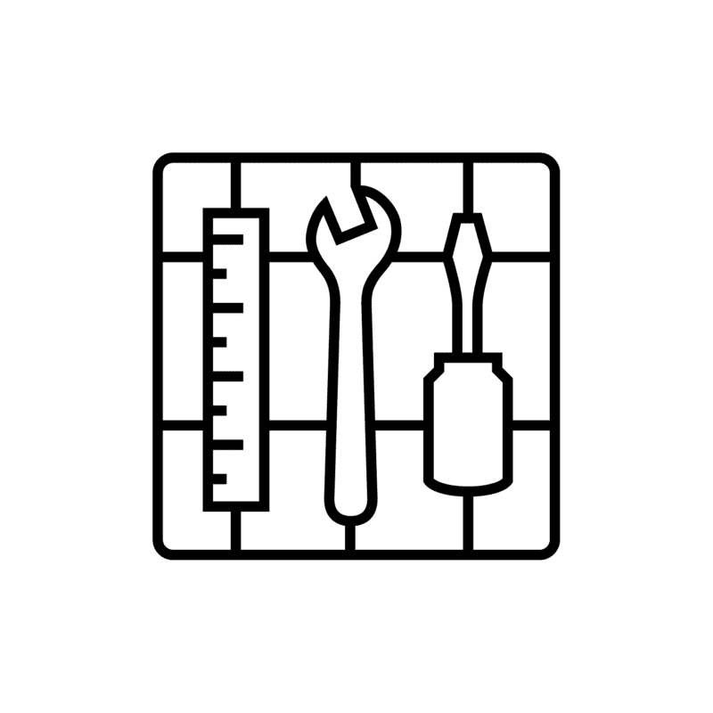

### Hardware and supplies requirements

- 1 - [Raspberry Pi 5](https://www.amazon.com/Raspberry-Pi-Quad-core-Cortex-A76-Processor/dp/B0CTQ3BQLS/)
- 1 - [USB flash drive](https://www.amazon.com/Samsung-MUF-128AB-AM-Plus-128GB/dp/B07D7PDLXC/) or microSD card to use with your Pi
- 1 - USB cable to power your Pi
  - Make sure you are using a 5V 5A (25W) power supply. USB boot is disabled by default [when connected to a 3A power supply](https://www.raspberrypi.com/documentation/computers/raspberry-pi.html#differences-on-raspberry-pi-5), so adequate amperage is required for the optimal performance of your Raspberry Pi 5.
- 1 - Store-bought or 3D-printed Raspberry Pi case ([like this one here](https://www.printables.com/model/742926-raspberry-pi-5-case)) that provides access to GPIO pins
- 1 - [PM2.5 air quality sensor (with G7 transfer board)](https://www.amazon.com/Precision-Quality-Monitoring-Particle-Concentration/dp/B0B1J8FQ7M)
- 4 - jumper wires to connect the air sensor to the Pi
- 1 - [Kasa smart plug](https://www.amazon.com/Kasa-Smart-Supported-Scheduling-KP125/dp/B0CRRY18Z4/) (supported Kasa models: EP10, EP25, HS100, HS103, HS105, HS110, KP100, KP105, KP115, KP125, KP125M, KP401)
- 1 – [20” Box Fan](https://www.amazon.com/Genesis-Settings-Cooling-Technology-Handle/dp/B0854FY793/)
- 1 - [20” x 20” x 1" MERV 13 electrostatic air filter](https://www.amazon.com/BNX-20x20x1-MERV-Filter-Pack/dp/B09XC3RQ3J/) (most effective 11-13)
- 4 - [3D-printed clips](https://www.thingiverse.com/thing:968923) (or duct tape to attach the air filter to the box fan)

### Software and other device requirements

- Laptop running MacOs, Linux, or Windows with required software
  - Preferred IDE, such as [VS Code](https://code.visualstudio.com/download)
  - [Python3](https://www.python.org/downloads/)
  - [Raspberry Pi Imager](https://www.raspberrypi.com/software/)
- Sign up for a free Viam account, and then [sign in](https://app.viam.com/fleet/locations/) to the Viam app
- A smartphone to download and use the Kasa mobile app

<!-- ------------------------ -->

## Pre-workshop setup for instructors

Duration: 5

### Learning Objectives

Review the suggested learning objectives, and adjust it according to your goals and audience.

- How to use modules from [the Viam registry](https://docs.viam.com/registry/)
- How to set up a continuously running [process](https://docs.viam.com/configure/processes/) on a Viam machine
- How to use environment variables with your Viam machine
- How to move control code to your machine

### Agenda

Review the suggested agenda, and adjust it according to your goals and audience.

- **Introduction** (10 mins)
- **Hardware Assembly** (30 mins)
- **Software Setup** (30 mins)
- **Hands-On Experiment** (40 mins)
- **Q&A/Wrap-Up** (10 mins)

### Pre-workshop checklist ✅

Review these setup steps as you're planning the workshop to help prepare for it.

1. **Planning and Logistics**
   - **Verify equipment inventory:** Decide which materials are provided or required for participants to bring on their own. Order any materials and supplies that are provided to participants.
   - **Confirm workstation setup**: Verify the workshop room layout supports hardware work, such as tables. Ensure participants have power outlets and internet access. Have spare supplies, such as Raspberry Pis, sensors, and cables, in case of failures. For virtual workshops, confirm logistics for breakout sessions, providing support, and checkpoints.
   - **Communicate prerequisites**: Share a participant guide prior to the workshop with learning objectives and instructions for installing software and preparing laptops. Provide a checklist for participants to confirm readiness.
   - **Establish support channels**: Determine how participants can get support for real-time troubleshooting (e.g. Slack or Discord channel for virtual workshops, additional helpers in the room for on-site workshops)
   - **Request Viam stickers**: Don't forget [to request Viam stickers](https://forms.gle/TFXBm7L9n8U4hLRj9) for the workshop.
1. **Content Preparation**
   - **Prepare workshop teaching materials**: Review the Delivery Plan, sample slide deck, and provided resources. Tailor these materials to suit your participants' needs. Decide whether to present them to the group or provide them for independent reference, such as through a web browser or printed handouts.
   - **Prepare code and documentation**: Review the provided code and add comments as necessary.
   - **Review discussion topics**: Review the suggested group discussion topics and adjust for your participants.
   - **Review quiz questions**: Review the suggested quiz questions and adjust for your participants. Determine if knowledge assessment will be completed throughout the workshop or afterwards.
1. **Dry Run and Testing**
   - **Test the workshop project**: Run through the build following the prepared documentation to ensure it works as expected. Simulate common issues and prepare troubleshooting tips for these scenarios. If physical space is limited, consider sharing a few box fans or use a different corded appliance such as a table lamp to demonstrate the effect.

<!-- ------------------------ -->

## Delivery Plan - overview

Duration: 2

Feel free to make a copy of [this sample slide deck](https://docs.google.com/presentation/d/13gRV6WFBaN-RZaYp3N7HynGTrFAbewfLf4nMtRBguos/edit#slide=id.p1), customize it, and make it your own.

<a href="https://docs.google.com/presentation/d/13gRV6WFBaN-RZaYp3N7HynGTrFAbewfLf4nMtRBguos/edit#slide=id.p1">
    
</a>

During the workshop, instructors can present this customizable slide deck (see above) tailored to your specific workshop needs. Alternatively, learners can follow step-by-step instructions and checkpoints independently by referencing the pages linked below in a web browser.

1. <a href="./index.html#4" target="_self">**Hardware Assembly**</a>
   - Set up your air monitoring device
   - Set up your air filter
   - Set up your smart plug
   - Set up your Raspberry Pi
2. <a href="./index.html#5" target="_self">**Software Setup**</a>
   - Configure your machine
   - Add your Raspberry Pi
   - Add your air sensor
   - Add your smart plug
3. <a href="./index.html#6" target="_self">**Hands-On Experiment**</a>
   - Test the air sensor
   - Test the smart plug
   - Program your air monitoring device
   - Configure a Viam process

<!-- ------------------------ -->

## Delivery Plan - Hardware Assembly

Duration: 30

### Set up your air monitoring device

The PMS7003 particulate sensor measures the air quality and transmits data in a [serial stream](https://en.wikipedia.org/wiki/Serial_communication) from the transmitter pin (TX) to the receiver pin (RX pin) on the Raspberry Pi.


> aside positive
> The website [pinout.xyz](https://pinout.xyz/) is a helpful resource with the exact layout and role of each pin for Raspberry Pi.

Refer to the following wiring diagram to connect the Raspberry Pi to the PMS7003 air monitoring device.

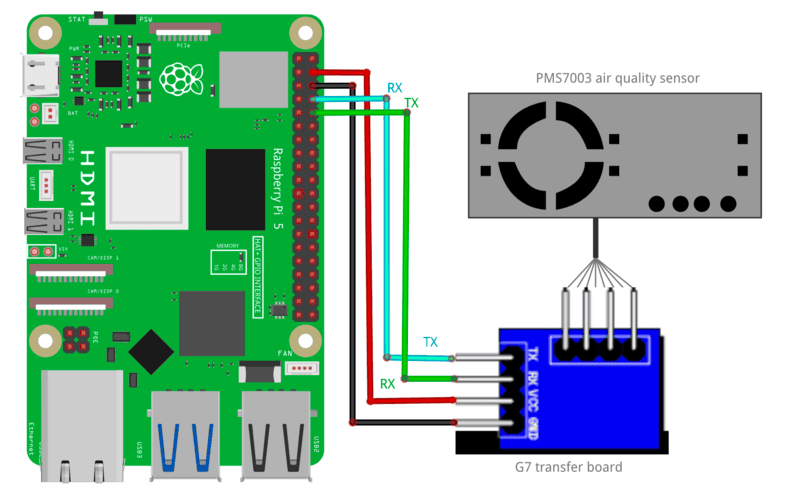

- Pin 4 (3V) to VCC (Power)
- Pin 6 (GND) to GND (Ground)
- Pin 8 (TX) to RX (receiver)
- Pin 10 (RX) to TX (transmitter)

To power the Raspberry Pi, you can use the USB cord from earlier to continue providing power from your computer, or use a separate USB power supply.

> aside negative
> Make sure you are using a 5V 5A (25W) power supply. USB boot is disabled by default [when connected to a 3A power supply](https://www.raspberrypi.com/documentation/computers/raspberry-pi.html#differences-on-raspberry-pi-5), so adequate amperage is required for the optimal performance of your Raspberry Pi 5.

<form>
  <name>How does the air sensor transmit data to your Raspberry Pi?</name>
  <input type="radio" value="WiFi">
  <input type="radio" value="I2C">
  <input type="radio" value="Serial">
  <input type="radio" value="MQTT">
</form>

<form>
  <name>Why are TX and RX pins crossed between the Raspberry Pi and the PMS7003 device in the wiring diagram?</name>
  <input type="radio" value="To prevent power surges">
  <input type="radio" value="To enable proper communication between the Raspberry Pi and the device">
  <input type="radio" value="To match the voltage levels of both devices">
  <input type="radio" value="To provide a common ground">
</form>

### Set up your air filter

Make your own air purifier by combining a box fan and air filter to effectively clean the air in a small to medium sized, closed room.

1. Attach the filter to the back of the fan, ensuring the airflow arrow points toward the fan. The fan should **pull air through the filter** when operating. If the filter will block access to the fan's power knob, now is a good time to switch it to an `on` position.
1. Secure the filter using [3D-printed clips](https://www.thingiverse.com/thing:968923) or duct tape. Write the date when the filter is first used directly on the filter.
   

### Set up your smart plug

1. Plug your Kasa smart plug into a power outlet.
1. Set up your smart plug and connect it to your local Wifi [using the Kasa mobile app](https://www.tp-link.com/us/support/faq/946/) from the App Store or Google Play.
1. From the command line of your terminal app, install the [`python-kasa`](https://python-kasa.readthedocs.io/en/stable/index.html) library, and enter the command `kasa discover` to locate the IP address of the connected device. Make a note of the IP address since we'll need it again soon.
   > aside negative
   > If you have access to your router's admin page, you can also find your smart plug's IP address from a web browser. From a web browser, enter your router's IP address (commonly `192.168.1.1` or `192.168.0.1`) and log in using your admin username and password. Look for a section like "Connected Devices," "Device List," or "DHCP Clients." Locate your Kasa smart plug by its name, MAC address (shown in the Kasa mobile app), or manufacturer name (usually TP-Link).
1. Plug the box fan into the Kasa smart plug. Toggle the box fan power with the Kasa app to make sure it's working as expected.
   

### Set up your Raspberry Pi

The Raspberry Pi boots from a USB flash drive (or microSD card). You need to install Raspberry Pi OS on a USB flash drive that you will use with your Pi. For more details about alternative methods of setting up your Raspberry Pi, refer to the [Viam docs](https://docs.viam.com/installation/prepare/rpi-setup/#install-raspberry-pi-os).

### Install Raspberry Pi OS

1. Connect the USB flash drive (or microSD card) to your computer.
1. Download the [Raspberry Pi Imager](https://www.raspberrypi.com/software/) and launch it.
   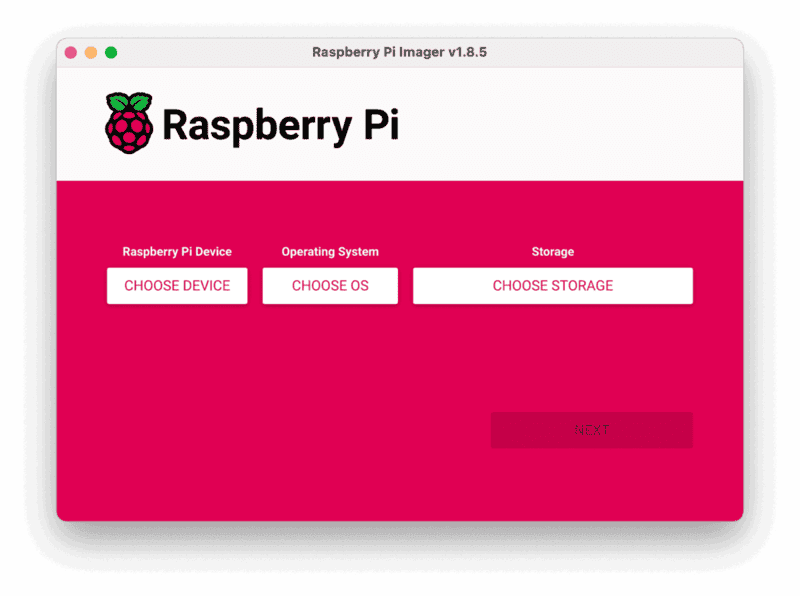
1. Click **CHOOSE DEVICE**. Select your model of Pi, which is Raspberry Pi 5.
1. Click **CHOOSE OS**. Select **Raspberry Pi OS (64-bit)** from the menu.
1. Click **CHOOSE STORAGE**. From the list of devices, select the USB flash drive you intend to use in your Raspberry Pi.
   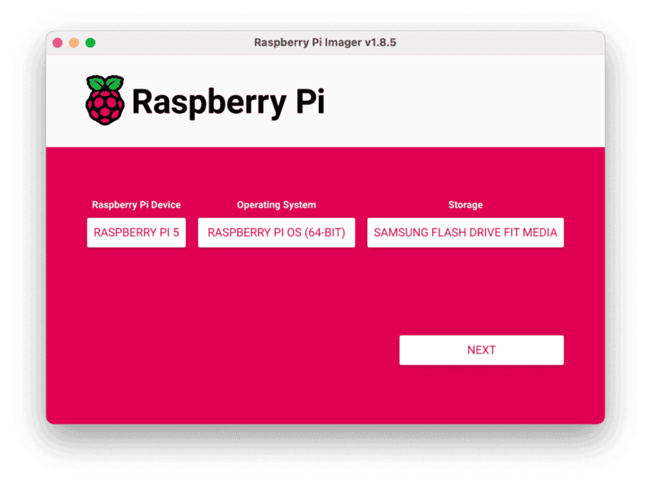
1. Configure your Raspberry Pi for remote access. Click **Next**. When prompted to apply OS customization settings, select **EDIT SETTINGS**.
1. Check **Set hostname** and enter the name you would like to access the Pi by in that field, for example, `air`.
1. Select the checkbox for **Set username and password** and set a username (for example, your first name) that you will use to log into the Pi. If you skip this step, the default username will be `pi` (not recommended for security reasons). And specify a password.
1. Connect your Pi to Wi-Fi so that you can run `viam-server` wirelessly. Check **Configure wireless LAN** and enter your wireless network credentials. SSID (short for Service Set Identifier) is your Wi-Fi network name, and password is the network password. Change the section `Wireless LAN country` to where your router is currently being operated.
   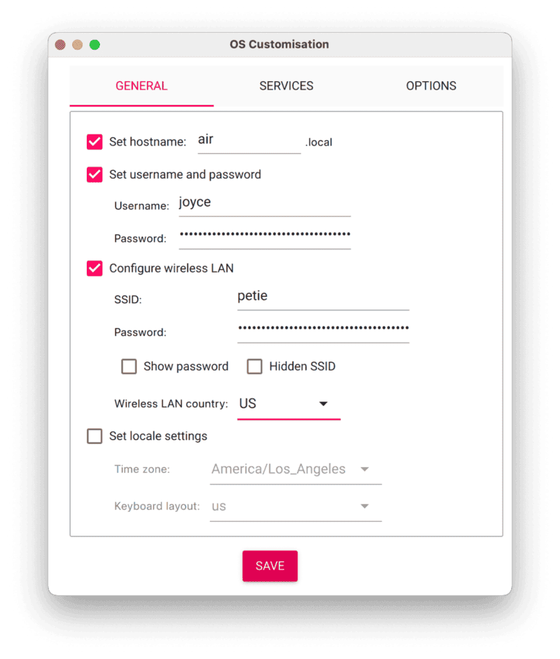
1. Select the **SERVICES** tab, check **Enable SSH**, and select **Use password authentication**.
   
   > aside negative
   > Be sure that you remember the `hostname` and `username` you set, as you will need this when you SSH into your Pi.
1. **Save** your updates, and confirm `YES` to apply OS customization settings. Confirm `YES` to erase data on the USB flash drive. You may also be prompted by your operating system to enter an administrator password. After granting permissions to the Imager, it will begin writing and then verifying the Linux installation to the USB flash drive.
1. Remove the USB flash drive from your computer when the installation is complete.

### Connect with SSH

1. Place the USB flash drive into your Raspberry Pi and boot the Pi by plugging it in to an outlet. A red LED will turn on to indicate that the Pi is connected to power.
   > aside negative
   > Make sure you are using a 5V 5A (25W) power supply. USB boot is disabled by default [when connected to a 3A power supply](https://www.raspberrypi.com/documentation/computers/raspberry-pi.html#differences-on-raspberry-pi-5), so adequate amperage is required for the optimal performance of your Raspberry Pi 5.
1. Once the Pi is started, connect to it with SSH. From a command line terminal window, enter the following command. The text in <> should be replaced (including the < and > symbols themselves) with the user and hostname you configured when you set up your Pi.
   ```bash
   ssh <USERNAME>@<HOSTNAME>.local
   ```
1. If you are prompted “Are you sure you want to continue connecting?”, type “yes” and hit enter. Then, enter the password for your username. You should be greeted by a login message and a command prompt.
   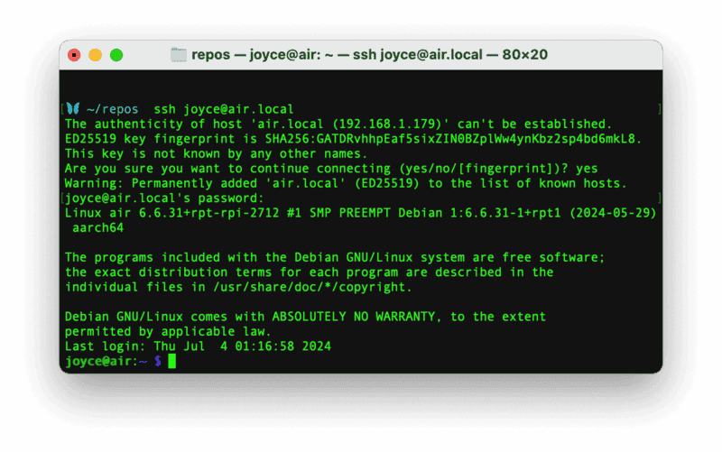
1. Update your Raspberry Pi to ensure all the latest packages are installed
   ```bash
   sudo apt update
   sudo apt upgrade
   ```

### Enable communication protocols

1. Launch the Pi configuration tool by running the following command
   ```bash
   sudo raspi-config
   ```
1. Use your keyboard to select “Interface Options”, and press return.
   
1. [Enable the relevant protocols](https://docs.viam.com/installation/prepare/rpi-setup/#enable-communication-protocols) to support our hardware. Since you are using a sensor that communicates over the serial port, enable **Serial Port**.
   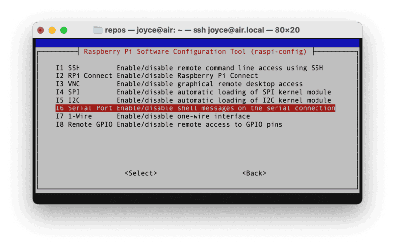
1. Confirm the options to enable the serial login shell and serial interface. And reboot the Pi when you're finished.

<!-- ------------------------ -->

## Delivery Plan - Software Setup

Duration: 30

### Configure your machine

1. In [the Viam app](https://app.viam.com/fleet/locations) under the **LOCATIONS** tab, create a machine by typing in a name and clicking **Add machine**.
   
1. Click **View setup instructions**.
   
1. Install `viam-server` on the Raspberry Pi device that you want to use to communicate with and control your air sensor. Select the `Linux / Aarch64` platform for the Raspberry Pi to control the air sensor, and leave your installation method as [`viam-agent`](https://docs.viam.com/how-tos/provision-setup/#install-viam-agent).
   
1. Use the `viam-agent` to download and install `viam-server` on your Raspberry Pi. Follow the instructions to run the command provided in the setup instructions from the SSH prompt of your Raspberry Pi.
   
   The setup page will indicate when the machine is successfully connected.

<form>
  <name>Why is it important to connect your machine to the Viam app during setup?</name>
  <input type="radio" value="To remotely monitor, configure, and control hardware components through the cloud.">
  <input type="radio" value="To store sensor data directly on the air sensor.">
  <input type="radio" value="To eliminate the need for a physical Raspberry Pi.">
  <input type="radio" value="To ensure the machine only works offline.">
</form>

<form>
  <name>What is the primary role of `viam-server` in the system architecture of your air quality monitoring setup?</name>
  <input type="radio" value="It acts as the operating system for the Raspberry Pi.">
  <input type="radio" value="It provides a layer for managing hardware components and enables remote communication via the Viam app.">
  <input type="radio" value="It processes air quality data locally without connecting to the cloud.">
  <input type="radio" value="It directly powers the air sensor.">
</form>

### Add your Raspberry Pi

1. In [the Viam app](https://app.viam.com/fleet/locations), find the **CONFIGURE** tab. It's time to configure your hardware.
1. Click the **+** icon in the left-hand menu and select **Component**.
   
1. Select `board`, and find the `pi5` module. This adds the module for working with the Raspberry Pi 5's GPIO pins. Leave the default name `board-1` for now.
1. Notice adding this module adds the board hardware component called `board-1`. The collapsible card on the right corresponds to the part listed in the left sidebar.
   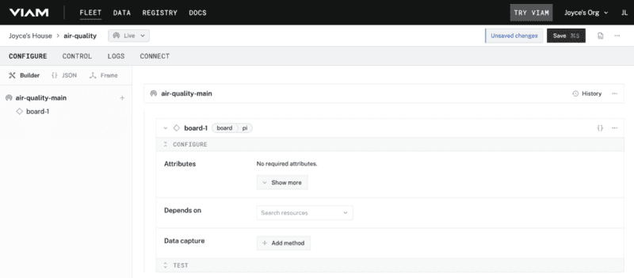
1. Click **Save** in the top right to save and apply your configuration changes.
   > aside negative
   > If any problems occur, check under the **LOGS** tab to see what might be going wrong.

### Add your air sensor

1. In [the Viam app](https://app.viam.com/fleet/locations), click the **+** icon and select **Component**. Select `sensor`, find the `air:pms7003` module, and click **Add module**. This module provides the sensor model that supports the specific hardware we are using for this tutorial. Leave the default name `sensor-1` for now.
   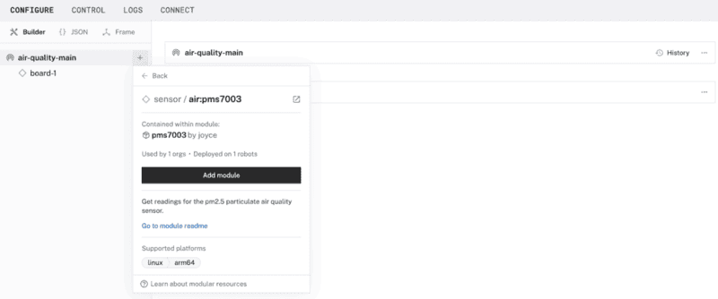
1. Notice adding this module adds the sensor hardware component called `sensor-1` as well as a module called `pms7003` which contains the logic for how our Raspberry Pi and air sensor work with each other.
   
1. **Save** your updates.

<form>
  <name>How does adding modules like `board-1` or `pms7003` contribute to the overall architecture of your machine?</name>
  <input type="radio" value="They abstract hardware-specific details, allowing software to interact with components through a consistent API.">
  <input type="radio" value="They provide direct power and connectivity to the components.">
  <input type="radio" value="They eliminate the need for the Raspberry Pi in the system.">
  <input type="radio" value="They store the configuration locally on the air sensor.">
</form>

### Add your smart plug

1. In [the Viam app](https://app.viam.com/fleet/locations), let's configure the rest of our hardware so that your machine can communicate with the smart plug over wifi. Click the **+** icon in the left-hand menu and select **Component**. Select `generic`, and find the `kasa:switch` module. This is a generic module that's been configured to use the `python-kasa` library. In other words, it's a layer of abstraction that lets us use the Kasa manufacturer's APIs with Viam.
   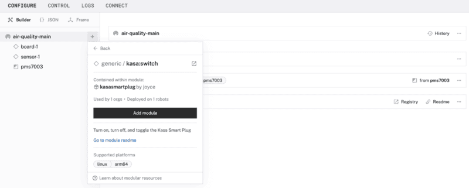
1. Notice adding this module adds the generic hardware component called `generic-1` as well as a module called `kasasmartplug` which contains the logic for how our Raspberry Pi and smart plug work with each other.
1. Under the CONFIGURE section of the `generic-1` card, add your own smart plug's IP address that you found in a previous step, formatted like the following.
   ```json
   {
     "plug_ip": "192.168.1.169"
   }
   ```
   
1. **Save** your updates.

<form>
  <name>What is the advantage of using a generic module like `kasa:switch` to control a smart plug in this system?</name>
  <input type="radio" value="It eliminates the need for custom configuration of the Raspberry Pi.">
  <input type="radio" value="It allows Viam to integrate with a variety of smart plug models using a single standardized interface.">
  <input type="radio" value="It provides direct power to the smart plug.">
  <input type="radio" value="It removes the need for an IP address for the smart plug.">
</form>

<!-- ------------------------ -->

## Delivery Plan - Hands-on Experiment

Duration: 40

### Test the air sensor

1. In [the Viam app](https://app.viam.com/fleet/locations) under the **CONTROL** tab, you can see two hardware components called `generic-1` and `sensor-1`. They are your smart plug and air sensor that you configured on the **CONFIGURE** tab.
   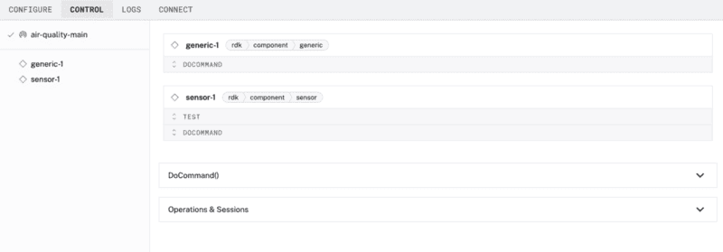
1. Find the `sensor-1` card, and expand the TEST accordion. The module we added has a `GetReadings` function to get the readings from our air sensor. Select `Manual refresh`, and then click the refresh icon to manually get the readings.
   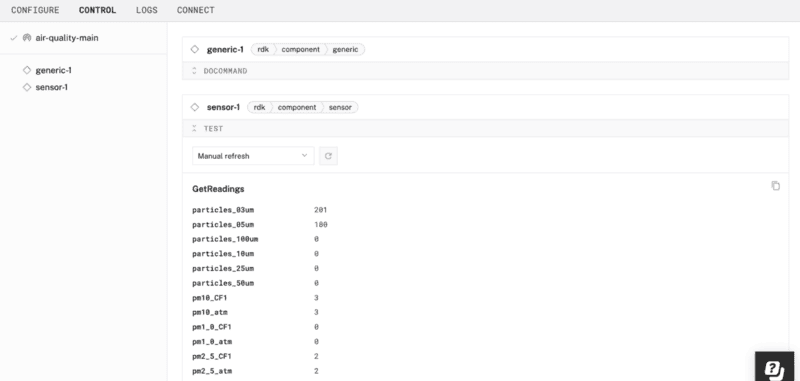

   > aside negative
   > If any problems occur, check under the **LOGS** tab to see what might be going wrong.

   > aside positive
   > If you're curious about what these values mean, refer to the U.S. Environmental Protection Agency's [basics on particulate matter (PM)](https://www.epa.gov/pm-pollution/particulate-matter-pm-basics). For measuring the [indoor air quality](https://www.epa.gov/indoor-air-quality-iaq/indoor-pollutants-and-sources) in your home, we'll be looking at PM2.5, a very small particle size.

<form>
  <name>When you manually refresh the `GetReadings` function for the air sensor, what type of information is typically returned?</name>
  <input type="radio" value="Electrical resistance of the sensor circuit.">
  <input type="radio" value="Current and voltage levels of the Raspberry Pi.">
  <input type="radio" value="Air quality readings such as particulate matter (PM2.5) concentrations.">
  <input type="radio" value="The IP address of the air sensor module.">
</form>

### Test the smart plug

1. Next, test that your smart plug is working properly. Make sure the fan is still plugged in to the powered smart plug. Also make sure the fan knob is set to on.
1. In [the Viam app](https://app.viam.com/fleet/locations) under the **CONTROL** tab, find the `generic-1` card, and expand the DOCOMMAND accordion. The module we added has a few functions to control the smart plug. Under the **Input** section, add the following JSON object (if your fan is still running), and then click **Execute** to toggle off the smart plug.
   ```json
   {
     "toggle_off": []
   }
   ```
   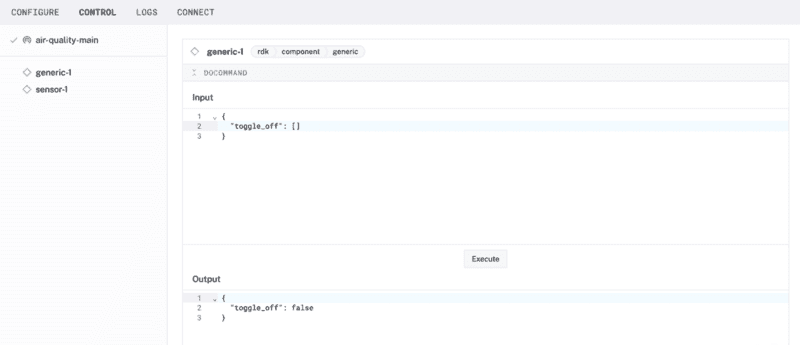
1. Now update `"toggle_off"` to `"toggle_on"` in the JSON object, and **Execute** once again.
1. From [the module listing in the registry](https://app.viam.com/module/joyce/kasasmartplug), you may be able to refer to additional documentation in [the module's README](https://github.com/loopDelicious/viam-kasa-switch) to learn about other functions you can use to test your hardware.

<form>
  <name>What is the advantage of testing the smart plug’s `DoCommand` function during the setup process?</name>
  <input type="radio" value="To confirm the Raspberry Pi can toggle power to the plug in response to sensor readings.">
  <input type="radio" value="To validate that the smart plug’s firmware is updated.">
  <input type="radio" value="To establish a direct network connection between the air sensor and the plug.">
  <input type="radio" value="To monitor how the smart plug processes particulate matter readings.">
</form>

<form>
  <name>How does the Viam app simplify the process of testing and controlling hardware components like the air sensor and smart plug?</name>
  <input type="radio" value="By storing all sensor data locally on the Raspberry Pi.">
  <input type="radio" value="By providing a unified interface to send commands and get feedback from hardware components in real-time.">
  <input type="radio" value="By running all processes directly on the air sensor.">
  <input type="radio" value="By automatically updating hardware firmware during testing.">
</form>

### Program your air monitoring device

At this point, you have configured and tested your machine and peripherals, but nothing is happening automatically. In the next section, program your air monitoring device to be a little smarter. Make your machine periodically get readings, turn on the air filter if the values are high, and turn off again when the values are low.

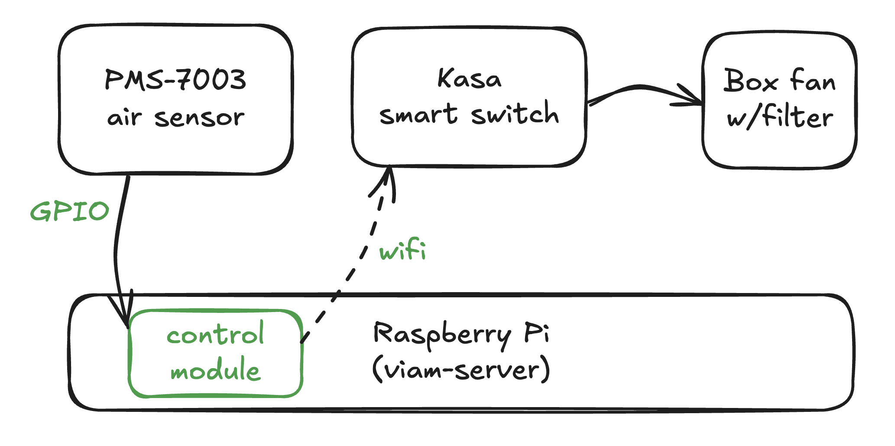

### Create an automation script

1. To configure the machine to automatically run a command to execute a script, use a [Viam process](https://docs.viam.com/configure/processes/). Create a new file on your computer called `process.py`.

   On MacOS, Linux, or Windows WSL:

   ```bash
   touch process.py
   ```

   On Windows:

   ```cmd
   type nul > process.py
   ```

1. Copy and paste [this sample code](https://github.com/loopDelicious/viam-pm25-process/blob/main/process.py) into the new file `process.py`. This code will allow your Raspberry Pi to connect to both our sensor and plug and execute our logic.
1. Now it's time to move your control code to your Raspberry Pi device. From the terminal window, run the following command to [SSH (Secure Shell) into your board](https://docs.viam.com/operate/reference/prepare/rpi-setup/#connect-with-ssh), where the text in `<>` should be replaced (including the `<` and `>` symbols themselves) with the `user` and `hostname` you configured when you set up your machine.
   ```bash
   ssh <USERNAME>@<REMOTE-HOSTNAME>.local
   ```
   > aside negative
   > On some networks, if the `hostname.local` alias fails to resolve, you can use the static IP address found in the Viam app status dropdown. For example, instead of `username@hostname.local`, you could use `username@192.168.2.197`.
1. From the SSH prompt on your Raspberry Pi, install the Python package manager.

   ```bash
   $ sudo apt install -y python3-pip
   ```

1. Install the Viam Python SDK into a new directory called `process`.
   ```bash
   $ pip3 install --target=process viam-sdk
   ```
1. Display the full path of the current directory you are working in on your Raspberry Pi with the `pwd` command. Make a note of this output for the next steps.
   ```bash
   $ pwd
   ```
1. Find the executable path of Python3 to run `process.py` on your Raspberry Pi with `which python3`. Again, make a note of this output for the next steps.
   ```bash
   $ which python3
   ```
1. Run the following command from your computer (not the SSH prompt to your Raspberry Pi) to copy the code from your computer to your Raspberry Pi. In the command, you will copy `process.py` over to your Raspberry Pi, with the section following the colon `:` indicating where your file should be copied to on the Raspberry Pi (the path of the directory you are working in on your Raspberry Pi, along with the filename).
   ```bash
   $ scp process.py user@host.local:/home/myboard/process/process.py
   ```

<form>
  <name>What is the primary role of the `process.py` script in the air monitoring system?</name>
  <input type="radio" value="To display air quality readings directly on the Raspberry Pi.">
  <input type="radio" value="To define the logic for periodically checking sensor readings and toggling the smart plug based on thresholds.">
  <input type="radio" value="To update the firmware of the air sensor and smart plug.">
  <input type="radio" value="To configure the network settings for the Raspberry Pi.">
</form>

### Configure a Viam process

1.  Now let's allow `viam-server` to run the process as the root user on your Raspberry Pi by configuring a [Viam process](https://docs.viam.com/configure/processes/). In [the Viam app](https://app.viam.com/fleet/locations) under the **CONFIGURE** tab, click the **+** icon in the left-hand menu and select **Process**.
1.  Find the corresponding card to `process-1`. Enter the executable path of Python3 running on your Raspberry Pi that you output from a previous step. Add an argument of the `process.py` file to run on your Raspberry Pi. Enter the working directory where you want the process to execute.
    
1.  Still within the `process-1` card, select the advanced settings icon near the top right corner to review the configuration JSON. Create a new `env` property, and add your environment variables within the new property, formatted like the following with your own credentials.
    ```json
      "env": {
        "SENSOR_NAME": "sensor-1",
        "PLUG_NAME": "generic-1",
        "ROBOT_API_KEY": "your-api-key",
        "ROBOT_API_KEY_ID": "your-api-key-id",
        "ROBOT_ADDRESS": "your-robot-address"
      },
    ```
    
    > aside negative
    > The `SENSOR_NAME` and `PLUG_NAME` are the default names for our air sensor and smart plug when added to our Viam machine. Other machine credentials can be found under the **CONNECT** tab, selecting an SDK, and toggling **Include API key** to reveal your credentials within the code sample.
        
1.  **Save** your updates.
1.  You can test the code by updating the `process.py` file on your Raspberry Pi to update the `do_command` when thresholds are low from `toggle_off` to `toggle_on`. **Save** your code changes, and **Restart** the machine to see if the fan turns on when the air quality is healthy.
    
    > aside negative
    > You can either edit the file on your computer and copy the updated file over to your Raspberry Pi using `scp` like we did previously. Or you can use the default command-line text editor on Raspberry Pi OS `nano` by entering `nano process.py` from the SSH prompt.
    > 
    > Alternatively, you can blow on the air sensor until the values rise above the threshold.

<form>
  <name>Why is the `process-1` configuration in the Viam app important for running the continuous process?</name>
  <input type="radio" value="It specifies the environment variables and paths required for the Raspberry Pi to execute the process automatically.">
  <input type="radio" value="It ensures the air sensor is calibrated before each reading.">
  <input type="radio" value="It logs all air quality data directly to the Raspberry Pi’s storage.">
  <input type="radio" value="It enables real-time monitoring of air quality on a connected device.">
</form>

<form>
  <name>Why is it necessary to configure a continuous process for the air monitoring system?</name>
  <input type="radio" value="To ensure the system can automatically respond to changing air quality conditions without manual intervention.">
  <input type="radio" value="To allow the Raspberry Pi to store sensor data locally for future analysis.">
  <input type="radio" value="To reduce the power consumption of the air monitoring device.">
  <input type="radio" value="To manually refresh the sensor readings at regular intervals.">
</form>

### Finishing touches

Now that your system is working the way you want it, it's time to tidy up our project so it's not a loose jumble of wires and parts.

1. 3D print (or buy) an enclosure for your Raspberry Pi and sensor. I found [an existing design that I liked](https://www.printables.com/model/742926-raspberry-pi-5-case) to fit a standard Raspberry Pi 5. Using a piece of heavy-duty velcro, I mounted the sensor on top to ensure the sensor could accurately measure the surrounding air.
   
1. You might prefer to have the Raspberry Pi and air sensor within the same case. If you're planning to design your own enclosure, make sure the air sensor receives adequate ventilation and isn't placed too close to the Raspberry Pi chip, as it can get a bit hot.

<!-- ------------------------ -->

## Additional resources and troubleshooting

Duration: 5

### Additional resources

- The website [pinout.xyz](https://pinout.xyz/) is a helpful resource with the exact layout and role of each pin for Raspberry Pi. When working with Viam, make sure to reference the physical pin numbers, and not the GPIO numbers listed on `pinout.xyz`.
- The U.S. Environmental Protection Agency provides [basics on particulate matter (PM)](https://www.epa.gov/pm-pollution/particulate-matter-pm-basics). For measuring the [indoor air quality](https://www.epa.gov/indoor-air-quality-iaq/indoor-pollutants-and-sources) in your home, we'll be looking at PM2.5, a very small particle size.
- The [demo video](https://youtu.be/TZJSAncrU4o?feature=shared) provides a brief overview of the project.


### Common pitfalls and troubleshooting guidance

1. **Security**
   - Do not share your API credentials publicly. Sharing this information could compromise your system security by allowing unauthorized access to your machine, or to the computer running your machine.
1. **Flashing firmware**
   - Make sure you are using a 5V 5A (25W) power supply. USB boot is disabled by default [when connected to a 3A power supply](https://www.raspberrypi.com/documentation/computers/raspberry-pi.html#differences-on-raspberry-pi-5), so adequate amperage is required for the optimal performance of your Raspberry Pi 5.
   - Participants must remember the `hostname` and `username` they set while flashing their Raspberry Pi, as they will need this when they SSH into the Pi.
   - To save time, instructors can flash all the Pis ahead of time with pre-determined credentials and share the credentials with participants during the workshop. Each Pi should have a unique `hostname` to avoid conflicts on the shared local network, such as `&lt;student-name&gt;-air` or `&lt;group-name&gt;-air` if they are working in groups.
     - If you're using SD cards, verify that you have a way to write data onto them before providing them to participants.
1. **Locating IP address of smart plug**
   - In a group setting, configure one smart plug at a time in order to avoid confusion and conflicts in identifying the proper IP addresses on the local area network.
   - If you have access to your router's admin page, you can also find your smart plug's IP address from a web browser. From a web browser, enter your router's IP address (commonly 192.168.1.1 or 192.168.0.1) and log in using your admin username and password. Look for a section like "Connected Devices," "Device List," or "DHCP Clients." Locate your Kasa smart plug by its name, MAC address (shown in the Kasa mobile app), or manufacturer name (usually TP-Link).
1. **Configuring machine and peripherals**
   - If any problems occur while setting up the machine and peripherals in [the Viam app](https://app.viam.com), check under the **LOGS** tab to see what might be going wrong.
   - Also refer to the overall [Viam troubleshooting guide](https://docs.viam.com/appendix/troubleshooting/).


### Logistics for continued learning

Participants have several options for continuing their projects beyond the workshop environment:

- **Take-home projects**: For participants allowed to take their projects home after the workshop, the `viam-agent` on the Raspberry Pi can simplify the setup process:

  - **Provisioning mode**: Upon rebooting the Raspberry Pi in a new environment like at home, the `viam-agent` automatically creates a Wi-Fi hotspot if it cannot connect to a known network.
  - **Connect to the hotspot**: Look for a network named `viam-setup-HOSTNAME` in your list of available Wi-Fi networks, where `HOSTNAME` is the custom hostname you set during the workshop, and `viamsetup` is the default password. Connect your laptop to this network.
  - **Provide network information for the machine**: Go to the provisioning portal at `http://viam.setup/` in a browser to follow [the on-screen instructions](https://docs.viam.com/fleet/provision/#end-user-experience) to configure the Raspberry Pi for your home Wi-Fi.

- **Remote control**: If participants are not allowed to take their projects home after the workshop, but want to continue working on their projects from home, they can access the Raspberry Pi remotely from anywhere in the world and continue accessing sensor data. If participants do not have SSH access into the Raspberry Pi, participants can write and run code on their laptops from home.

<!-- ------------------------ -->

## Post-Workshop Resources

Duration: 5

### Group discussion topics 🗣️

Review suggested topics for discussion at key points during the workshop.

- What were the biggest challenges participants faced during the workshop (e.g., wiring, coding, debugging)?
- Share troubleshooting experiences and how participants resolved issues.
- How can air quality monitoring be used in homes, schools, or offices?
- What additional features could improve the system (e.g., alerts, cloud integration, mobile app)?
- Discuss how to add multiple sensors for tracking air quality in different rooms or outdoor spaces.
- Discuss the feasibility of deploying a network of sensors for larger-scale monitoring (e.g., a citywide project).

### Quiz questions ❓

Review the suggested quiz questions below to evaluate participants' understanding of key concepts. These questions can be used to assess knowledge either during (see multiple choice answers in the delivery plan) or after the workshop.

1. **Hardware Assembly**
   - How does the air sensor transmit data to your Raspberry Pi?
   - Why is it necessary to cross TX and RX pins between the Raspberry Pi and the PMS7003 air sensor?
1. **Software Setup**
   - Why is it important to connect your machine to the Viam app during setup?
   - What is the primary role of `viam-server` in the system architecture of your air quality monitoring setup?
   - How does adding modules like `board-1` or `pms7003` contribute to the overall architecture of your machine?
   - What is the advantage of using a generic module like `kasa:switch` to control a smart plug in this system?
   - How does the Viam app simplify the process of testing and controlling hardware components like the air sensor and smart plug?
1. **Hands-on Experiment**
   - When you manually refresh the `GetReadings` function for the air sensor, what type of information is typically returned?
   - What is the advantage of testing the smart plug’s `DoCommand` function during the setup process?
   - What is the primary role of the `process.py` script in the air monitoring system?
   - Why is the `process-1` configuration in the Viam app important for running the continuous process?
   - Why is it necessary to configure a continuous process for the air monitoring system?

### Next-level projects

Here are some ideas for expanding and enhancing the current project.

- [Visualize sensor data with Grafana Cloud](https://codelabs.viam.com/guide/grafana/index.html?index=..%2F..index#0) codelab
- [Monitor Air Quality with a Fleet of Sensors](https://docs.viam.com/tutorials/control/air-quality-fleet/) tutorial


### Post-workshop resources for participants

- [Viam documentation](https://docs.viam.com/) for reference
- [Viam Discord community](http://discord.gg/viam) for inspiration and support
- Viam [how-to guides](https://docs.viam.com/how-tos/) for task-based learning, [codelabs](https://codelabs.viam.com/) for hands-on learning, and [tutorials](https://docs.viam.com/tutorials/) for project-based learning.


### Contribute your own workshop

This workshop and other educational codelabs are part of [this Viam open-source project](https://github.com/viam-devrel/viamcodelabs). You are invited to document your own workshop(s) to share with the Viam community. Be sure to follow these [contributing guidelines](https://github.com/viam-devrel/viamcodelabs?tab=readme-ov-file#write-your-first-codelab), and let us know about it in the [Viam Discord community](http://discord.gg/viam)!


