author: Joyce
id: workshop-people
summary: Resources for instructors to deliver a people detection alert workshop
categories: Workshop, Developer
environments: web
status: Published
feedback link: https://github.com/viam-devrel/viamcodelabs/issues
tags: Workshop, Developer

# People detection alert with computer vision [Workshop]

<!-- ------------------------ -->

## Overview

Duration: 2

This codelab is part of the [Viam for educators](https://education.viam.com/) program, and provides a suggested delivery plan and resources for instructors interested in delivering a hands-on workshop. Take these resources, and make it your own!

### Workshop Overview

- **Goal**: Introduce sensors and actuators as concepts and build a people detection alert
- **Audience**: Beginner developers with basic programming and hardware skills
- **Duration**: ~2-3 hours

  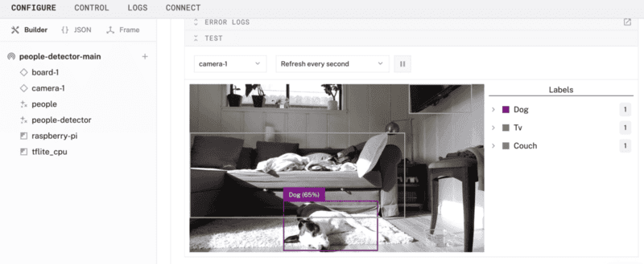

### What You’ll Teach

- How to build an alert system with Computer Vision that triggers a buzzer when a person is detected

<!-- ### Watch the Video

See a demonstration of the people detection alert in this video. -->

<!-- <video id="TZJSAncrU4o"></video> -->

<!-- ------------------------ -->

## What participants will need

Duration: 5

Review the list of required components (hardware, software), and determine which materials are provided or required for participants to bring on their own. Provide instructions to participants, giving them ample time to prepare and complete prerequisites.


### Hardware and supplies requirements

- 1 - [Raspberry Pi 4](https://a.co/d/fc3JUMm)
- 1 - [USB flash drive](https://a.co/d/b0L2QL2) or [microSD card](https://a.co/d/42xzIiT) to use with the Pi, along with an adapter or reader
- 1 - power supply for your Pi
- 1 - USB web camera and a cable to connect it to your Pi
- 1 - [passive piezo buzzer](https://a.co/d/34QRLLo)
- 2 - jumper wires to connect the buzzer to the Pi
- 1 - [optional] store-bought or 3D-printed Raspberry Pi case ([like this one here](https://makerworld.com/en/models/62316#profileId-226178)) that provides access to GPIO pins
- 1 - [optional] a breadboard can be used for your piezo buzzer, especially if you plan to wire additional components

### Software and other device requirements

- A computer with MacOS, Windows, or Linux to flash your Raspberry Pi and configure the device's components, along with required software:
  - Preferred IDE, such as [VS Code](https://code.visualstudio.com/download)
  - [Python3](https://www.python.org/downloads/)
  - [Raspberry Pi Imager](https://www.raspberrypi.com/software/)
- Sign up for a free Viam account, and then [sign in](https://app.viam.com/fleet/locations/) to the Viam app

<!-- ------------------------ -->

## Pre-workshop setup for instructors

Duration: 5

### Learning Objectives

Review the suggested learning objectives, and adjust it according to your goals and audience.

- How to use modules from [the Viam registry](https://docs.viam.com/registry/)
- How to set up a control logic module on a Viam machine
- How to use environment variables with your Viam machine
- How to move control code to your machine

### Agenda

Review the suggested agenda, and adjust it according to your goals and audience.

- **Introduction** (10 mins)
- **Hardware Assembly** (30 mins)
- **Software Setup** (30 mins)
- **Hands-On Experiment** (40 mins)
- **Q&A/Wrap-Up** (10 mins)

### Pre-workshop checklist ✅

Review these setup steps as you're planning the workshop to help prepare for it.

1. **Planning and Logistics**
   - **Verify equipment inventory:** Decide which materials are provided or required for participants to bring on their own. Order any materials and supplies that are provided to participants.
   - **Confirm workstation setup**: Verify the workshop room layout supports hardware work, such as tables for wiring the components. Ensure participants have power outlets and internet access. Have spare supplies, such as Raspberry Pis, adapters/readers, and cables, in case of failures. For virtual workshops, confirm logistics for breakout sessions, providing support, and checkpoints.
   - **Communicate prerequisites**: Share a participant guide prior to the workshop with learning objectives and instructions for installing software and preparing laptops. Provide a checklist for participants to confirm readiness.
   - **Establish support channels**: Determine how participants can get support for real-time troubleshooting (e.g. Slack or Discord channel for virtual workshops, additional helpers in the room for on-site workshops).
   - **Request Viam stickers**: Don't forget [to request Viam stickers](https://forms.gle/TFXBm7L9n8U4hLRj9) for the workshop.
1. **Content Preparation**
   - **Prepare workshop teaching materials**: Review the Delivery Plan, sample slide deck, and provided resources. Tailor these materials to suit your participants' needs. Decide whether to present them to the group or provide them for independent reference, such as through a web browser or printed handouts.
   - **Determine extensibility**: During the Hands-on Experiment portion of the delivery plan, there are many options to guide the workshop on a different learning path. Determine if this section will be self-guided exploration, a group exercise, or self-paced learning for participants to explore on their own after the workshop.
   - **Prepare code and documentation**: Review the provided code and add comments as necessary.
   - **Review discussion topics**: Review the suggested group discussion topics and adjust for your participants.
   - **Review quiz questions**: Review the suggested quiz questions and adjust for your participants. Determine if knowledge assessment will be completed throughout the workshop or afterwards.
1. **Dry Run and Testing**
   - **Test the workshop project**: Run through the build following the prepared documentation to ensure it works as expected. Simulate common issues and prepare troubleshooting tips for these scenarios. If physical space is limited, consider sharing a Raspberry Pi.
   - **Bring backups**: Final check to bring the backup supplies mentioned earlier during planning.

<!-- ------------------------ -->

## Delivery Plan - overview

Duration: 2

Feel free to make a copy of [this sample slide deck](https://docs.google.com/presentation/d/1ESOuSTW7XsjLQ2-n33JzsUHvDatJiWdTehb6pLKP7D0/edit?usp=sharing), customize it, and make it your own.

<a href="https://docs.google.com/presentation/d/1ESOuSTW7XsjLQ2-n33JzsUHvDatJiWdTehb6pLKP7D0/edit?usp=sharing">
    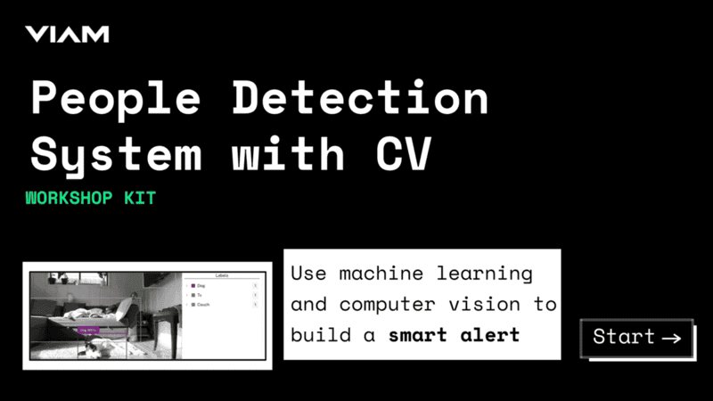
</a>

During the workshop, instructors can present this customizable slide deck (see above) tailored to your specific workshop needs. Alternatively, learners can follow step-by-step instructions and checkpoints independently by referencing the pages linked below in a web browser.

1. <a href="./index.html#4" target="_self">**Hardware Assembly**</a>
   - Set up your Raspberry Pi
   - Connect with SSH
   - Set up your machine peripherals
2. <a href="./index.html#5" target="_self">**Software Setup**</a>
   - Configure your machine
   - Configure your Raspberry Pi board
   - Configure your your webcam
   - Configure your ML model service
   - Configure your vision service
   - Configure your piezo buzzer
3. <a href="./index.html#6" target="_self">**Hands-On Experiment**</a>
   - Program your people detection alert
   - Configure and run a Viam control module
   - Finishing touches

<!-- ------------------------ -->

## Delivery Plan - Hardware Assembly

Duration: 30

### Set up your Raspberry Pi

The Raspberry Pi boots from a USB flash drive (or microSD card). You need to install Raspberry Pi OS on a USB flash drive that you will use with your Pi. For more details about alternative methods of setting up your Raspberry Pi, refer to the [Viam docs](https://docs.viam.com/installation/prepare/rpi-setup/#install-raspberry-pi-os).

### Install Raspberry Pi OS

1. Connect the USB flash drive (or microSD card) to your computer.
1. Download the [Raspberry Pi Imager](https://www.raspberrypi.com/software/) and launch it.
   
1. Click **CHOOSE DEVICE**. Select your model of Pi, which is Raspberry Pi 4.
1. Click **CHOOSE OS**. Select **Raspberry Pi OS (64-bit)** from the menu.
1. Click **CHOOSE STORAGE**. From the list of devices, select the USB flash drive you intend to use in your Raspberry Pi.
   
1. Configure your Raspberry Pi for remote access. Click **Next**. When prompted to apply OS customization settings, select **EDIT SETTINGS**.
1. Check **Set hostname** and enter the name you would like to access the Pi by in that field, for example `test` shown here. Each Pi should have a unique `hostname` to avoid conflicts on the shared local network, such as `&lt;student-name&gt;-detection` or `&lt;group-name&gt;-detection` if working in groups.
1. Select the checkbox for **Set username and password** and set a username (for example, your first name) that you will use to log into the Pi. If you skip this step, the default username will be `pi` (not recommended for security reasons). And specify a password.
1. Connect your Pi to Wi-Fi so that you can run `viam-server` wirelessly. Check **Configure wireless LAN** and enter your wireless network credentials. SSID (short for Service Set Identifier) is your Wi-Fi network name, and password is the network password. Change the section `Wireless LAN country` to where your router is currently being operated.
   
1. Select the **SERVICES** tab, check **Enable SSH**, and select **Use password authentication**.
   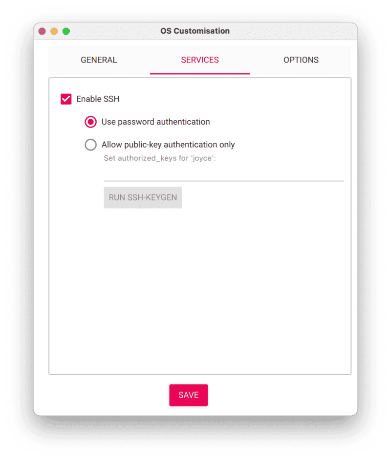
   > aside negative
   > Be sure that you remember the `hostname` and `username` you set, as you will need this when you SSH into your Pi.
1. **Save** your updates, and confirm `YES` to apply OS customization settings. Confirm `YES` to erase data on the USB flash drive. You may also be prompted by your operating system to enter an administrator password. After granting permissions to the Imager, it will begin writing and then verifying the Linux installation to the USB flash drive.
1. Remove the USB flash drive from your computer when the installation is complete.

<form>
  <name>What is the purpose of setting a custom `hostname` during the Raspberry Pi OS configuration?</name>
  <input type="radio" value="To improve the speed of the Raspberry Pi.">
  <input type="radio" value="To identify and access the Pi on the network.">
  <input type="radio" value="To secure the Pi by changing the default password.">
  <input type="radio" value="To enable remote access to the Pi.">
</form>

### Connect with SSH

1. Place the USB flash drive into a USB port on your Raspberry Pi and boot the Pi by plugging it in to an outlet. A red LED will turn on to indicate that the Pi is connected to power.
1. Once the Pi is started, connect to it with SSH. From a command line terminal window, enter the following command. The text in <> should be replaced (including the < and > symbols themselves) with the user and hostname you configured when you set up your Pi.
   ```bash
   ssh <USERNAME>@<HOSTNAME>.local
   ```
1. If you are prompted “Are you sure you want to continue connecting?”, type “yes” and hit enter. Then, enter the password for your username. You should be greeted by a login message and a command prompt.
   
1. Update your Raspberry Pi to ensure all the latest packages are installed
   ```bash
   sudo apt update
   sudo apt upgrade
   ```

### Set up your machine peripherals

1. **Connect the webcam**: Connect the webcam's USB lead to any USB port on your Pi. The webcam transmits video data to the Raspberry Pi through the USB interface.
1. **Connect the piezo buzzer**: The passive piezo buzzer can be controlled via a GPIO pin on the Raspberry Pi. Refer to the following wiring diagram to connect the Raspberry Pi to the piezo buzzer.

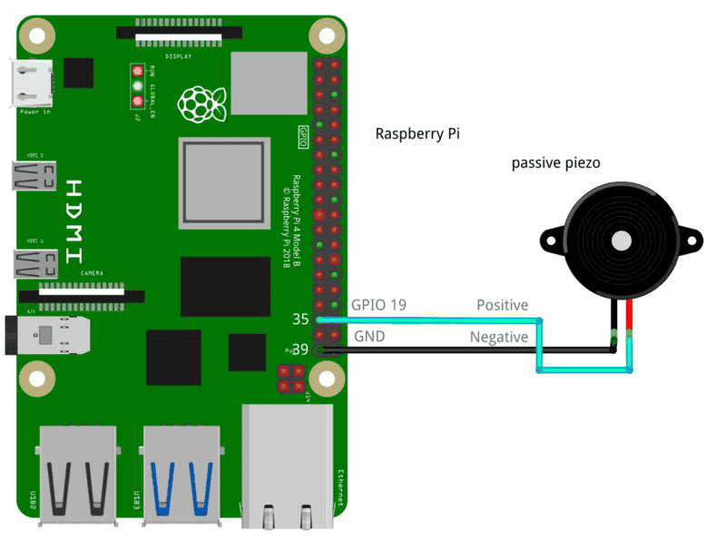

- Pin 35 (GPIO 19) to Positive
- Pin 39 (GND) to Negative

> aside positive
> The website [pinout.xyz](https://pinout.xyz/) is a helpful resource with the exact layout and role of each pin for Raspberry Pi. When working with Viam, make sure to reference the physical pin numbers, and not the GPIO numbers listed on `pinout.xyz`.


Now that we have physically connected our hardware components, let's configure the software in the next section.

<!-- ------------------------ -->

## Delivery Plan - Software Setup

Duration: 40

### Configure your machine

1. In [the Viam app](https://app.viam.com/fleet/locations) under the **LOCATIONS** tab, create a machine by typing in a name and clicking **Add machine**.
   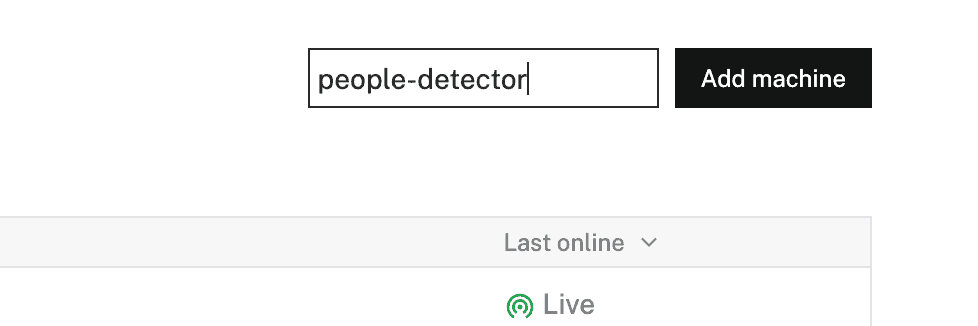
1. Click **View setup instructions**.
   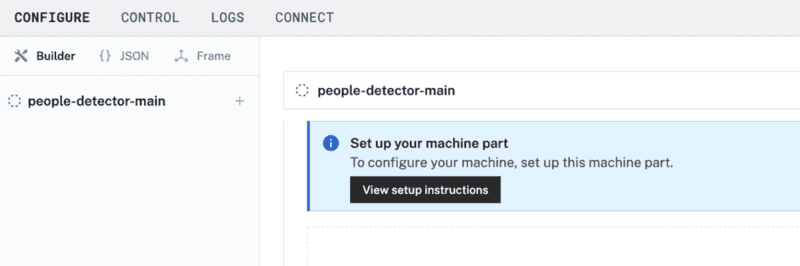
1. Install `viam-server` on the Raspberry Pi device that you want to use to communicate with and control your camera and piezo buzzer. Select the `Linux / Aarch64` platform for the Raspberry Pi, and leave your installation method as [`viam-agent`](https://docs.viam.com/how-tos/provision-setup/#install-viam-agent).
   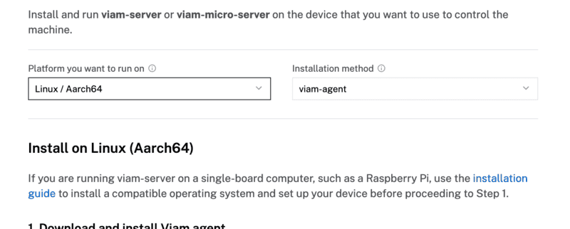
1. Use the `viam-agent` to download and install `viam-server` on your Raspberry Pi. Follow the instructions to run the command provided in the setup instructions from the SSH prompt of your Raspberry Pi.
   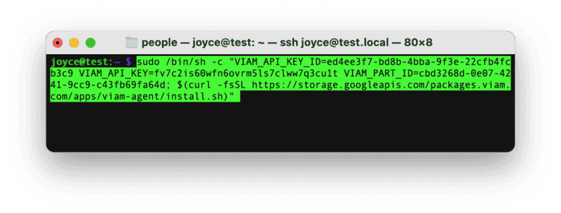
1. The setup page will indicate when the machine is successfully connected.
   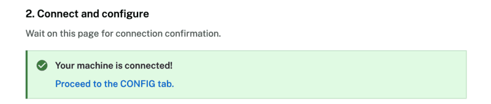

<form>
  <name>Why is it important to connect your machine to the Viam app during setup?</name>
  <input type="radio" value="To remotely monitor, configure, and control hardware components through the cloud.">
  <input type="radio" value="To store sensor data directly on the camera.">
  <input type="radio" value="To eliminate the need for a physical Raspberry Pi.">
  <input type="radio" value="To ensure the machine only works offline.">
</form>

<form>
  <name>What is the primary role of `viam-server` in the system architecture of your people detector setup?</name>
  <input type="radio" value="It acts as the operating system for the Raspberry Pi.">
  <input type="radio" value="It provides a layer for managing hardware components and enables remote communication via the Viam app.">
  <input type="radio" value="It processes camera data locally without connecting to the cloud.">
  <input type="radio" value="It directly powers the camera.">
</form>

### Configure your Raspberry Pi board

To access the GPIO pins, let's add our Raspberry Pi board to our machine in the Viam app.

1. In [the Viam app](https://app.viam.com/fleet/locations), find the **CONFIGURE** tab.
1. Click the **+** icon in the left-hand menu and select **Component**.
   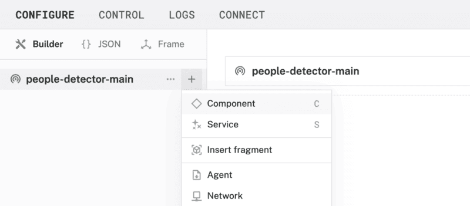
1. Select `board`, and find the `raspberry-pi:rpi4` module. This adds the module for working with the Raspberry Pi 4's GPIO pins. Leave the default name `board-1` for now.
1. Notice adding this module adds the board hardware component called `board-1`. The collapsible card on the right corresponds to the part listed in the left sidebar.
   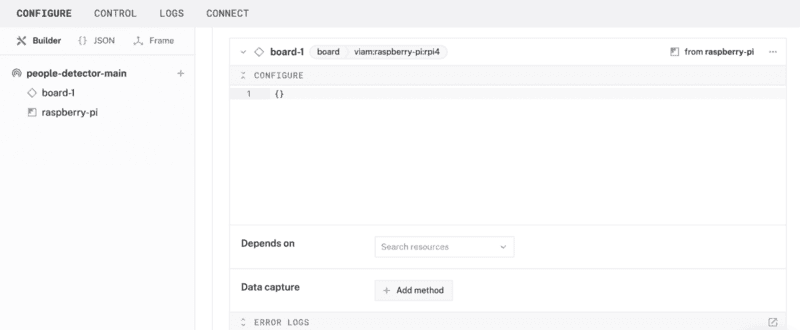
1. Click **Save** in the top right to save and apply your configuration changes.
   > aside negative
   > If any problems occur, check under the **LOGS** tab to see what might be going wrong.

### Configure your USB webcam

Make sure your webcam is already connected to the Pi.

1. In [the Viam app](https://app.viam.com/fleet/locations) under the **CONFIGURE** tab, click the **+** icon in the left-hand menu and select **Component**.
1. Select `camera`, and find the `webcam` module. This adds the module for working with a USB webcam. Leave the default name `camera-1` for now.
1. Notice adding this component adds the webcam hardware component called `camera-1`. From the **Attributes** section of the panel, select a `video_path`.
   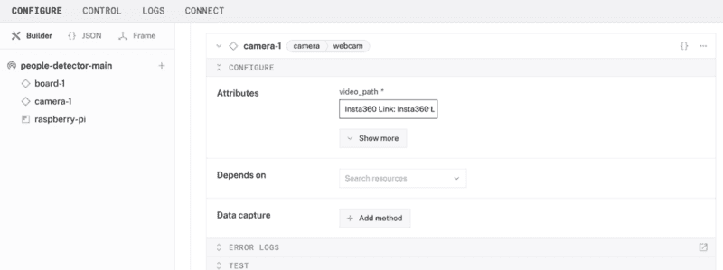
1. Click **Save** in the top right. This may take a moment to apply your configuration changes.
1. At the bottom of the `camera-1` panel, expand the **TEST** section to ensure you have configured the camera properly and see a video feed.
   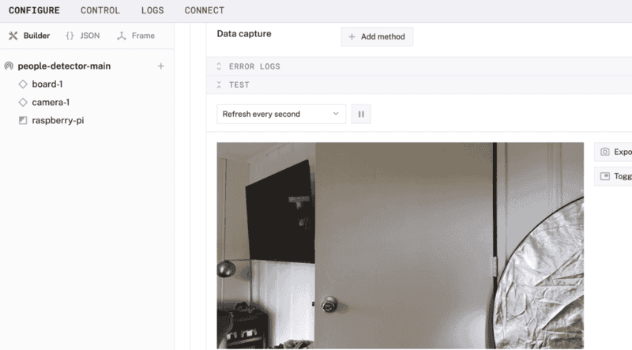

<form>
  <name>How does adding modules like `board-1` or `camera-1` contribute to the overall architecture of your machine?</name>
  <input type="radio" value="They abstract hardware-specific details, allowing software to interact with components through a consistent API.">
  <input type="radio" value="They provide direct power and connectivity to the components.">
  <input type="radio" value="They eliminate the need for the Raspberry Pi in the system.">
  <input type="radio" value="They store the configuration locally on the camera.">
</form>

### Configure your ML model service

1. In [the Viam app](https://app.viam.com/fleet/locations) under the **CONFIGURE** tab, click the **+** icon in the left-hand menu and select **Service**.
   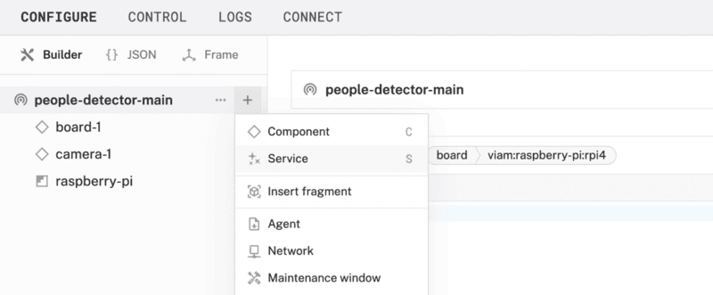
1. Select `ML model`, and find the `TFLite CPU` module. This adds support for running TensorFlow Lite models on resource-contrained devices. Name the service `people`.
   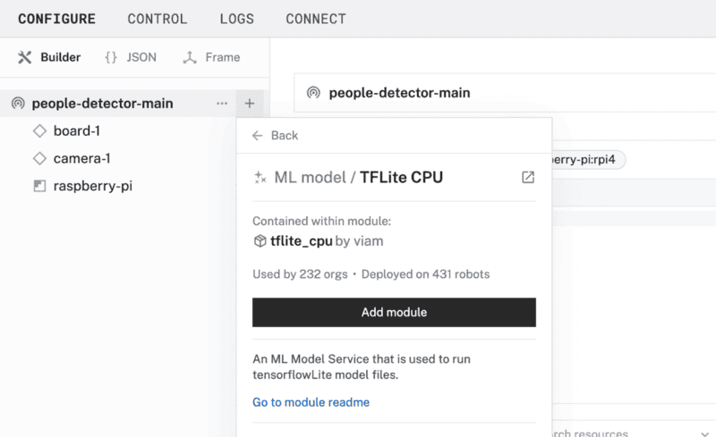
1. In the new ML Model service panel, configure the service by by setting the **Deployment** field to `Deploy model on machine`.
1. In the **Model** field, select the `EfficientDet-COCO by viam-labs` model under the **Registry** tab. This model is specifically optimized for resource-constrained devices like the Raspberry Pi.
   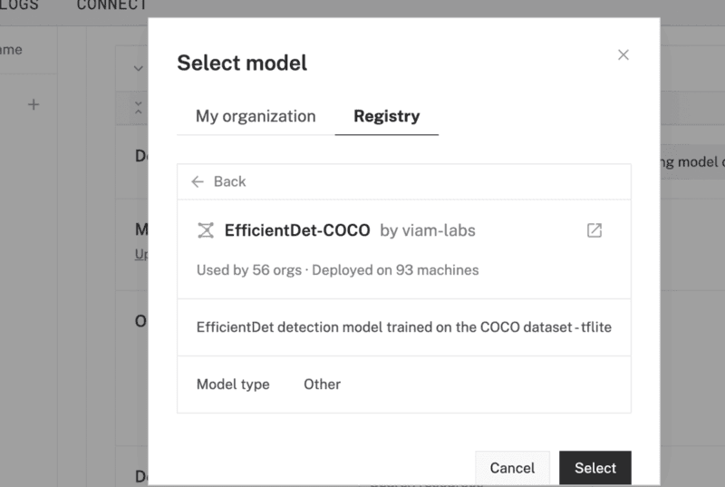
1. Your ML model configuration should now look like this:
   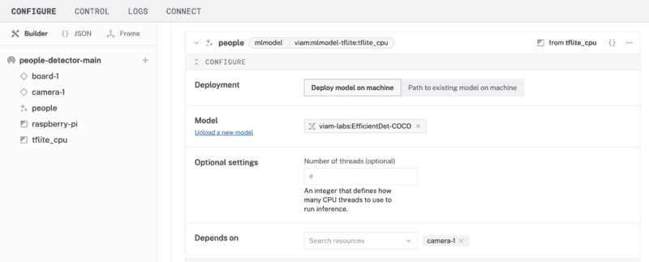
1. Click **Save** to apply your configuration changes.

### Configure your vision service

1. In [the Viam app](https://app.viam.com/fleet/locations), navigate to the **CONFIGURE** tab. Click the **+** icon in the left-hand menu and select **Service**.
1. Select `vision`, then find and choose the `ML model` module. This adds a new vision service to your machine. Name the service `peopleDetector`.
   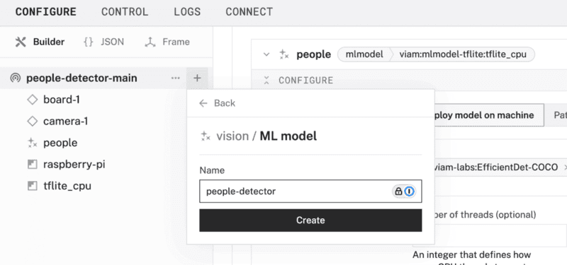
1. In the new vision service panel, configure the service by selecting `people` in the **ML model** field. This links your vision service to the ML model service you set up in the previous step.
   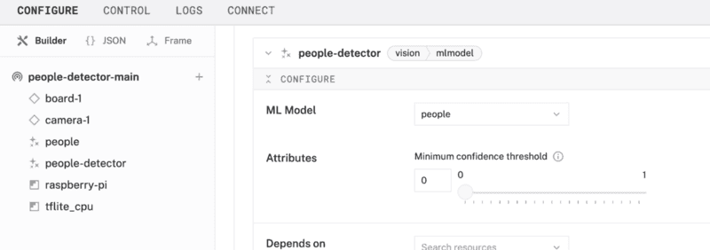
1. Click **Save** to apply your configuration changes. Note that this may take a moment to complete.
1. At the bottom of the `peopleDetector` panel, expand the **TEST** section to verify your configuration. You should see bounding boxes and labels around detected objects.
1. To control the sensitivity of object detection, adjust the `Minimum confidence threshold` under the **Attributes** field.
   

<form>
  <name>What is the primary relationship between the ML Model Service and the Vision Service in this configuration?</name>
  <input type="radio" value="The ML Model Service uses the Vision Service to perform object detection and image analysis.">
  <input type="radio" value="The Vision Service uses the ML Model Service to analyze visual data, leveraging pre-trained machine learning models.">
  <input type="radio" value="Both services operate independently and do not interact in the configuration process.">
  <input type="radio" value="The Vision Service is a prerequisite for configuring the ML Model Service.">
</form>

### Configure your piezo buzzer

You can manually and programmatically use the GPIO pins of the [`board`](https://docs.viam.com/components/board/) component to send PWM signals to control your buzzer. However, to streamline this next step, let's use a prebuilt module.

1. In [the Viam app](https://app.viam.com/fleet/locations) under the **CONFIGURE** tab, click the **+** icon in the left-hand menu and select **Component**.
1. Select `generic`, and find the `buzzer:piezo` module. This adds the module for controlling your buzzer. Name the component `piezo`.
   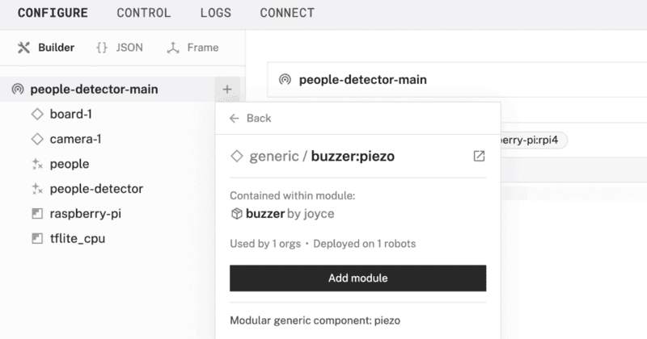
1. In the new `piezo` panel, configure your component by adding the following attributes in the **CONFIGURE** field. This tells your piezo component to use a specific pin (physical pin 35) on a specific board (called `board-1` in the Viam app) that you wired in a previous step.
   ```json
   {
     "piezo_pin": "35",
     "board": "board-1"
   }
   ```
1. Select your board `board-1` from the **Depends on** field.
   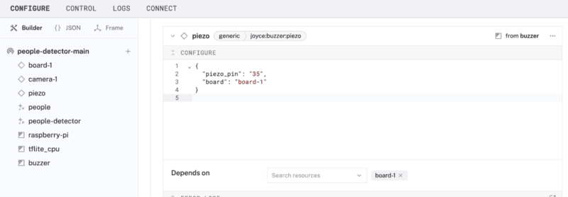
1. Click **Save** to apply your configuration changes. This may take a moment.
1. Since we are using a generic component, let's test it out under the **CONTROL** tab. Find your `piezo` component on this page. Expand the **DO COMMAND** field, input the following code, and hit **Execute**.
   ```json
   {
     "sound_buzzer": {
       "frequency": 1200,
       "duration": 1.5,
       "duty_cycle": 0.7
     }
   }
   ```
   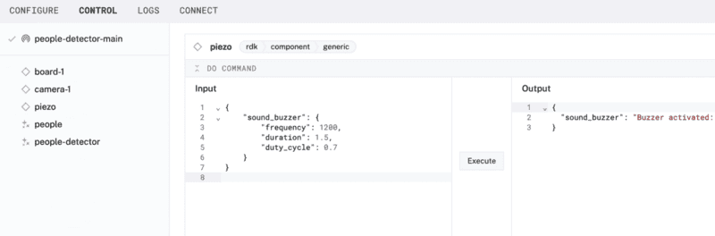
   You are executing a [`DoCommand`](https://docs.viam.com/components/generic/#api) on a generic component that has been predefined to accept parameters such as `frequency`, `duration`, and `duty_cycle`.
   > aside negative
   > Since we are using a passive buzzer, you must provide a [PWM (Pulse Width Modulation)](https://en.wikipedia.org/wiki/Pulse-width_modulation) signal to generate different tones. A constant high signal will not produce a sound as they would for an active buzzer, since passive buzzers require varying frequencies to produce audible tones.
1. Experiment with different values in those fields to see what happens when you execute the command again. If you have extra time, try sending the following Do command.
   ```json
   {
     "play_harry_potter": {}
   }
   ```

> aside negative
> **TROUBLESHOOTING**: Double check the wiring on your piezo component. Also check under the **LOGS** tab to see what might be going wrong.

<form>
  <name>What is the primary purpose for using PWM (Pulse Width Modulation) to control a passive piezo buzzer?</name>
  <input type="radio" value="To provide a constant high voltage to the buzzer.">
  <input type="radio" value="To generate varying tones by controlling the frequency of the signal.">
  <input type="radio" value="To make sure the buzzer operates at a fixed tone without additional wiring.">
  <input type="radio" value="To power the buzzer directly from a USB port.">
</form>

<!-- ------------------------ -->

## Delivery Plan - Hands-on Experiment

Duration: 20

### Program your people detector

At this point, the Vision Service relies on the ML Model Service to analyze visual data. It uses pre-trained machine learning models, such as `EfficientDet-COCO`, to perform tasks like object detection. Currently, many objects are being detected in the camera feed.

In this section, we'll add code to alert us when a `person` is detected. And if a person is detected, the piezo buzzer will sound.

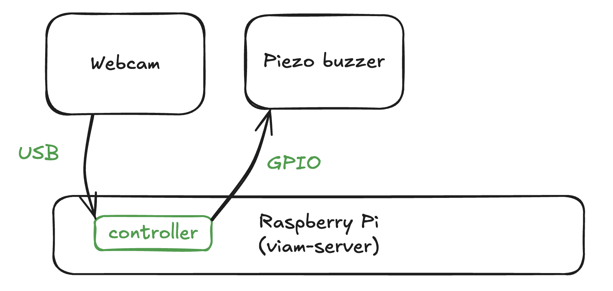

### Add a control logic module

Now let's add a control logic module to our Viam machine.

1.  In [the Viam app](https://app.viam.com/fleet/locations), go to the **CONFIGURE** tab. Click the **+** icon in the left-hand menu and select **Component or service**.
1.  Find, and add the module called `people-piezo`, and update the name of the module to `controller`.
    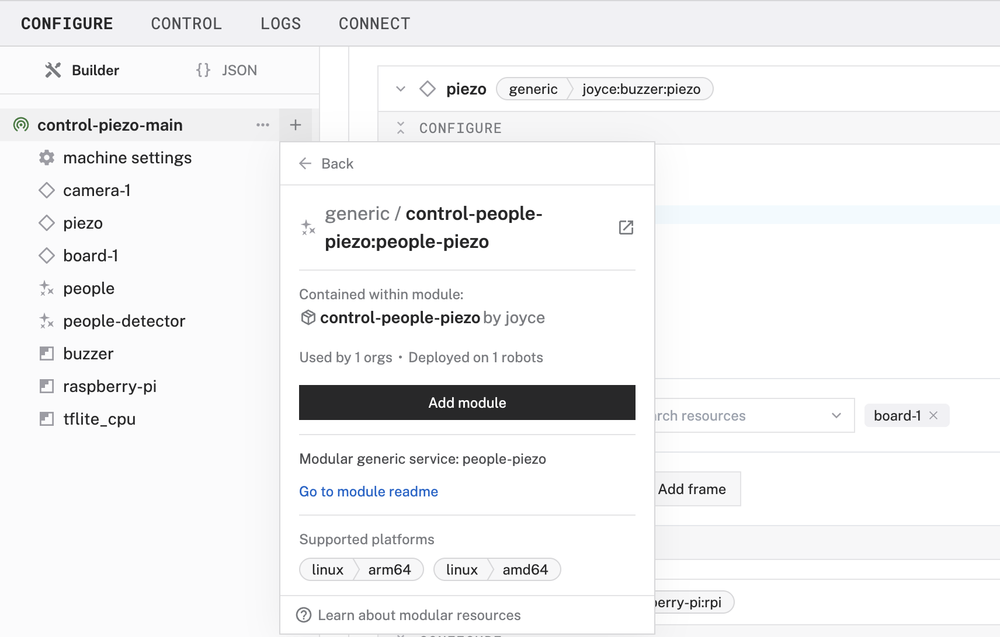
1.  In the new `controller` service, find the corresponding panel on the right, and add the required JSON configuration. The name of the camera, generic component, and vision service can be found in the Viam app interface.
    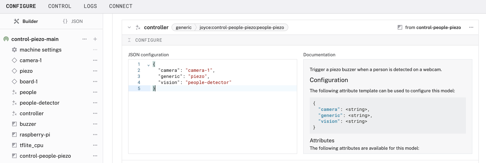

    ```json
    {
      "camera": "camera-1",
      "generic": "piezo",
      "vision": "people-detector"
    }
    ```

1.  **Save** and apply your changes.
1.  Test the new control module by navigating to the **CONTROL** tab. Find the `people-detector` service and observe what happens when a person is detected.
    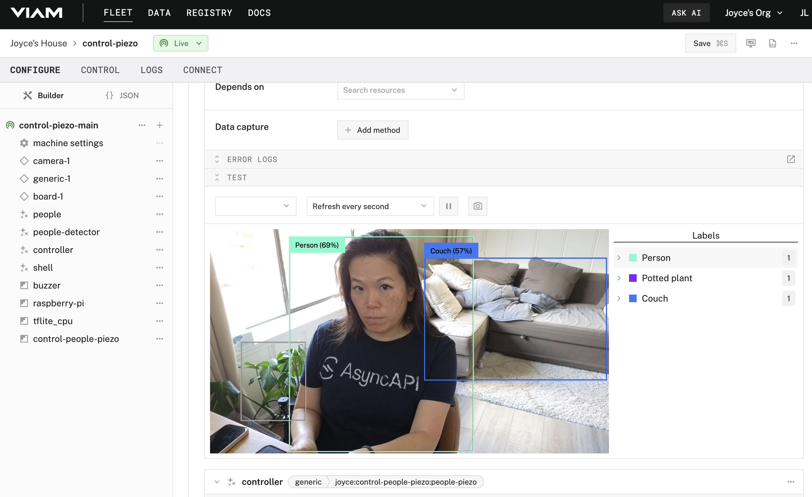

<form>
  <name>What is the primary role of the control logic module in the people detection system?</name>
  <input type="radio" value="To collect camera data from the Raspberry Pi.">
  <input type="radio" value="To define the logic for periodically checking the camera data and turning on the piezo based on detections.">
  <input type="radio" value="To update the firmware of the camera and piezo.">
  <input type="radio" value="To configure the network settings for the Raspberry Pi.">
</form>

### Finishing touches

Now that your system is working the way you want it, it's time to tidy up our project so it's not a loose jumble of wires and parts.

1. **Assemble the enclosure**: 3D print (or buy) an enclosure for your Raspberry Pi. I found [an existing design that I liked](https://makerworld.com/en/models/62316#profileId-226178) to fit a Raspberry Pi 4 Model B that provides access to the GPIO pins. You can modify an existing design to include notches for your piezo buzzer and webcam.
1. **Detector placement**: Set this up near a place you want to monitor. For example, if you want to sound the buzzer when someone is near your desk, point the camera in a direction that will capture your approach.
1. **Train a custom ML model**: Instead of actuating the piezo when any person is detected, train your own ML model to detect when a specific person or pet is detected. You could extend this logic to trigger actuation if a person is detected but not one that is known.
1. **Update the actuation**: Instead of actuating the piezo when an object is detected, integrate a service to send a notification, [generate an insult](https://luckytoilet.wordpress.com/2016/04/27/roboroast-upload-your-photo-to-get-an-algorithmically-generated-insult/), or [turn on a smart light](https://app.viam.com/module/joyce/kasasmartplug).
1. **Custom control module**: Instead of using the `people-piezo` control module, [deploy your own custom control logic to a machine](https://docs.viam.com/manage/software/control-logic/).

<!-- ------------------------ -->

## Additional resources and troubleshooting

Duration: 5

### Additional resources

- The website [pinout.xyz](https://pinout.xyz/) is a helpful resource with the exact layout and role of each pin for Raspberry Pi. When working with Viam, make sure to reference the physical pin numbers, and not the GPIO numbers listed on `pinout.xyz`.
- [ML model service](https://docs.viam.com/services/ml/) | Viam docs
- [Vision service](https://docs.viam.com/services/vision/) | Viam docs
<!-- - The [demo video](https://youtu.be/TZJSAncrU4o?feature=shared) provides a brief overview of the project. -->


### Common pitfalls and troubleshooting guidance

1. **Security**
   - Do not share your API credentials publicly. Sharing this information could compromise your system security by allowing unauthorized access to your machine, or to the computer running your machine.
1. **Flashing firmware**
   - Make sure you are using a 5V 5A (25W) power supply for the Raspberry Pi.
   - Participants must remember the `hostname` and `username` they set while flashing their Raspberry Pi, as they will need this when they SSH into the Pi.
   - To save time, instructors can flash all the Pis ahead of time with pre-determined credentials and share the credentials with participants during the workshop. Each Pi should have a unique `hostname` to avoid conflicts on the shared local network, such as `&lt;student-name&gt;-detection` or `&lt;group-name&gt;-detection` if they are working in groups.
     - If you're using SD cards, verify that you have a way to write data onto them before providing them to participants.
1. **Working with actuators**
   - **Disabling a resource**: In a group setting, working with piezos can be fun, but also potentially disruptive. Learners can disable the resource by toggling off `controller`, for example.
     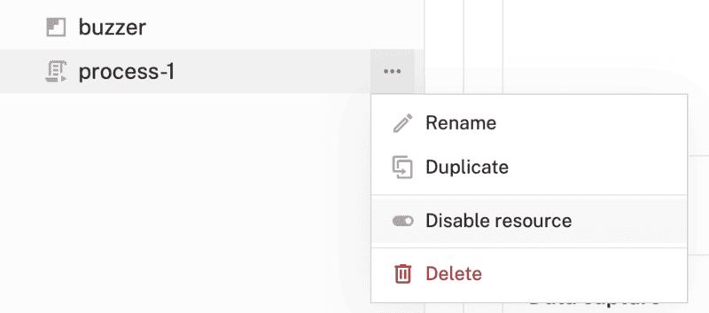
   - **Alternative actuators**: A buzzer is just one type of actuator, but the possibilities are endless.
     - Use an RGB LED, which functions similarly as a PWM-actuated component
     - Use a smart plug to control a lamp as shown in [this module](https://app.viam.com/module/joyce/kasasmartplug) or [this tutorial](https://www.viam.com/post/object-detection-turn-your-lights-on).
     - Use a [servo motor](https://docs.viam.com/components/servo/) to wave a flag or hit a gong.
1. **Configuring machine and peripherals**
   - If any problems occur while setting up the machine and peripherals in [the Viam app](https://app.viam.com), check under the **LOGS** tab to see what might be going wrong.
   - Also refer to the overall [Viam troubleshooting guide](https://docs.viam.com/appendix/troubleshooting/).


### Logistics for continued learning

Participants have several options for continuing their projects beyond the workshop environment:

- **Take-home projects**: For participants allowed to take their projects home after the workshop, the `viam-agent` on the Raspberry Pi can simplify the setup process:

  - **Provisioning mode**: Upon rebooting the Raspberry Pi in a new environment like at home, the `viam-agent` automatically creates a Wi-Fi hotspot if it cannot connect to a known network.
  - **Connect to the hotspot**: Look for a network named `viam-setup-HOSTNAME` in your list of available Wi-Fi networks, where `HOSTNAME` is the custom hostname you set during the workshop, and `viamsetup` is the default password. Connect your laptop to this network.
  - **Provide network information for the machine**: Go to the provisioning portal at `http://viam.setup/` in a browser to follow [the on-screen instructions](https://docs.viam.com/fleet/provision/#end-user-experience) to configure the Raspberry Pi for your home Wi-Fi.

- **Remote control**: If participants are not allowed to take their projects home after the workshop, but want to continue working on their projects from home, they can access the Raspberry Pi remotely from anywhere in the world and continue accessing camera data. If participants do not have SSH access into the Raspberry Pi, participants can write and run code on their laptops from home.

<!-- ------------------------ -->

## Post-Workshop Resources

Duration: 5

### Group discussion topics 🗣️

Review suggested topics for discussion at key points during the workshop.

- What were the biggest challenges participants faced during the workshop (e.g., wiring, coding, debugging)?
- Share troubleshooting experiences and how participants resolved issues.
- How can object detection be used in homes, schools, or offices?
- What additional features could improve the system (e.g., alerts, cloud integration, mobile app)?
- Discuss how to add multiple cameras can work together while detecting objects in different rooms or in outdoor spaces.
- Discuss the feasibility of deploying a network of cameras for larger-scale surveillance (e.g., a citywide project).

### Quiz questions ❓

Review the suggested quiz questions below to evaluate participants' understanding of key concepts. These questions can be used to assess knowledge either during (see multiple choice answers in the delivery plan) or after the workshop.

1. **Hardware Assembly**
   - What is the purpose of setting a custom `hostname` during the Raspberry Pi OS configuration?
   - What is the primary purpose for using PWM (Pulse Width Modulation) to control a passive piezo buzzer?
1. **Software Setup**
   - Why is it important to connect your machine to the Viam app during setup?
   - What is the primary role of `viam-server` in the system architecture of your people detector setup?
   - How does adding modules like `board-1` or `camera-1` contribute to the overall architecture of your machine?
   - What is the primary relationship between the ML Model Service and the Vision Service in our configuration?
   - What is the advantage of using a generic module like `buzzer:piezo` to control the piezo buzzer in this system?
   - How does the Viam app simplify the process of testing and controlling hardware components like the webcam and piezo buzzer?
1. **Hands-on Experiment**
   - What is the advantage of testing the piezo buzzer’s `DoCommand` function during the setup process?
   - What is the primary role of the control logic module in the people detection system?

### Next-level projects

Here are some ideas for expanding and enhancing the current project.

- Explore other [object detection sensors to use on your next build](https://www.viam.com/post/object-detection-sensors-to-use-on-your-next-build-2024) | Viam blog
- Explore other ML models like [a YOLO model](https://www.viam.com/post/guide-yolo-model-real-time-object-detection-with-examples) | Viam blog
- [Deploy a model from Hugging Face](https://www.viam.com/post/smarter-vision-systems-hugging-face-viam) onto your Viam machine | blog
- Replace or add actuators as described in the previous section:

  - Use an RGB LED, which functions similarly as a PWM-actuated component
  - Use a smart plug to control a lamp as shown in [this module](https://app.viam.com/module/joyce/kasasmartplug) or [this tutorial](https://www.viam.com/post/object-detection-turn-your-lights-on).
  - Use a [servo motor](https://docs.viam.com/components/servo/) to wave a flag or hit a gong.


### Post-workshop resources for participants

- [Viam documentation](https://docs.viam.com/) for reference
- [Viam Discord community](http://discord.gg/viam) for inspiration and support
- Viam [how-to guides](https://docs.viam.com/how-tos/) for task-based learning, [codelabs](https://codelabs.viam.com/) for hands-on learning, and [tutorials](https://docs.viam.com/tutorials/) for project-based learning.


### Contribute your own workshop

This workshop and other educational codelabs are part of [this Viam open-source project](https://github.com/viam-devrel/viamcodelabs). You are invited to document your own workshop(s) to share with the Viam community. Be sure to follow these [contributing guidelines](https://github.com/viam-devrel/viamcodelabs?tab=readme-ov-file#write-your-first-codelab), and let us know about it in the [Viam Discord community](http://discord.gg/viam)!


