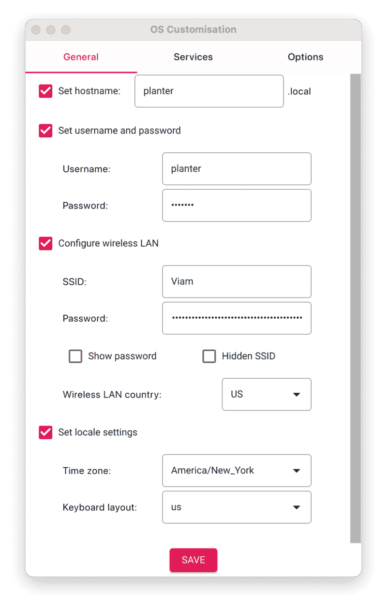
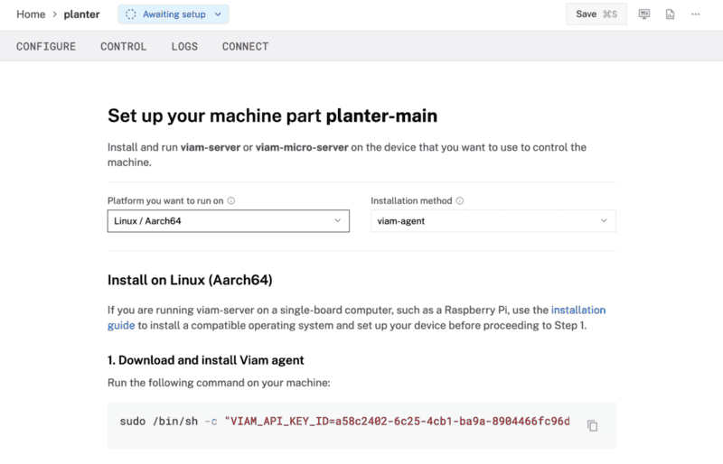
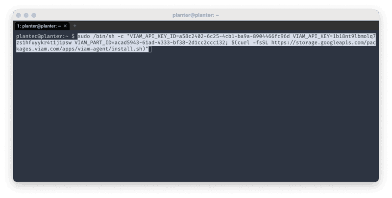
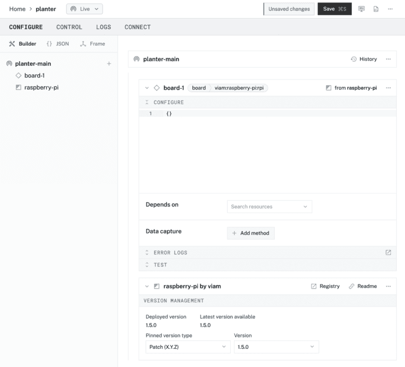

id: workshop-plant-watering
summary: Resources for instructors to deliver an automatic plant watering device workshop
categories: Workshop, Developer
environments: web
status: Published
feedback link: https://github.com/viam-labs/viamcodelabs/issues
tags: Workshop, Developer

# Automatic plant watering [Workshop]

<!-- ------------------------ -->

## Overview

Duration: 2

> aside negative
> If you want to complete a similar project, but you are not a workshop instructor, follow this codelab instead:
>
> - [**Build an automatic plant watering device**](https://codelabs.viam.com/guide/plant-watering-device-workshop/index.html?index=..%2F..index#0)

This codelab provides a suggested delivery plan and resources for instructors interested in delivering a hands-on workshop. Take these resources, and make it your own!

### Workshop Overview

- **Goal**: Introduce components as a concept and automate watering a plant with the Python SDK
- **Audience**: Beginner developers with basic programming and hardware skills
- **Duration**: ~2-3 hours

### What You’ll Teach

- How to build a smart system that triggers a water pump to irrigate the plant when the soil moisture falls below a certain threshold.

### Watch the Video

See a demonstration of the plant watering automation in this video.
<video id="Q6UuUKJpDn0"></video>

<!-- ------------------------ -->

## What participants will need

Duration: 5

Review the list of required components (hardware, software), and determine which materials are provided or required for participants to bring on their own. Provide instructions to participants, giving them ample time to prepare and complete prerequisites.

### Hardware and supplies requirements

- 1 - [Raspberry Pi 4](https://a.co/d/fc3JUMm)
- 1 - [USB flash drive](https://a.co/d/b0L2QL2) or [microSD card](https://a.co/d/42xzIiT) to use with the Pi on the rover, along with an adapter or reader
- 1 - [5V 3A power supply](https://www.amazon.com/CanaKit-Raspberry-Power-Supply-USB-C/dp/B07TYQRXTK)
- 1 - [5V water pump with tubing](https://www.amazon.com/dp/B097F4576N)
- 1 - [relay module](https://www.amazon.com/HiLetgo-Channel-optocoupler-Support-Trigger/dp/B00LW15A4W)
- 1 - [moisture sensor with included analog-to-digital converter board (ADC)](https://www.amazon.com/dp/B01DKISKLO)
- 10 - [jumper wires](https://www.amazon.com/dp/B077X99KX1)
- 1 - [wire connectors](https://www.amazon.com/Splicing-Connector-Lever-Nut-Assortment-Pocket/dp/B07NKSHVF6)
- 1 - small screwdriver to turn the screw terminals on the relay and ADC
- 2 - sturdy cups to hold plant soil/coffee grounds and water
- coffee grounds or plant soil

### Software and other device requirements

- A Linux, macOS or Windows computer that can run SDK code
- Preferred IDE, such as [VS Code](https://code.visualstudio.com/download)
- [Python development environment](https://www.python.org) and [the Viam Python SDK](https://python.viam.dev)
- Sign up for a free Viam account, and then [sign in](https://app.viam.com/fleet/locations/) to the Viam app

<!-- ------------------------ -->

## Pre-workshop setup for instructors

Duration: 5

### Learning Objectives

Review the suggested learning objectives, and adjust it according to your goals and audience.

- How to physically assemble a functional plant watering device by connecting and wiring the components.
- How to configure the device’s components using the Viam app.
- How to write Python code using [the Viam Python SDK](https://python.viam.dev) to control the plant watering device by using custom sensor and motor methods.
- How to test and adjust the system for optimal performance.

### Agenda

Review the suggested agenda, and adjust it according to your goals and audience.

- **Introduction** (10 mins)
- **Hardware Assembly** (30 mins)
- **Software Setup** (30 mins)
- **Hands-On Experiment** (40 mins)
- **Q&A/Wrap-Up** (10 mins)

### Pre-workshop checklist ✅

Review these setup steps as you're planning the workshop to help prepare for it.

1. **Planning and Logistics**
   - **Verify equipment inventory:** Decide which materials are provided or required for participants to bring on their own. Order any materials and supplies that are provided to participants.
   - **Confirm workstation setup**: Verify the workshop room layout supports hardware work, such as tables. Ensure participants have power outlets and internet access, as well as water and paper towels in case of a spill. Have spare supplies, such as Raspberry Pis, adapters/readers, and cables, in case of failures. For virtual workshops, confirm logistics for breakout sessions, providing support, and checkpoints.
   - **Communicate prerequisites**: Share a participant guide prior to the workshop with learning objectives and instructions for installing software and preparing laptops. Provide a checklist for participants to confirm readiness.
   - **Establish support channels**: Determine how participants can get support for real-time troubleshooting (e.g. Slack or Discord channel for virtual workshops, additional helpers in the room for on-site workshops)
   - **Request Viam stickers**: Don't forget [to request Viam stickers](https://forms.gle/TFXBm7L9n8U4hLRj9) for the workshop.
1. **Content Preparation**
   - **Prepare workshop teaching materials**: Review the Delivery Plan, sample slide deck, and provided resources. Tailor these materials to suit your participants' needs. Decide whether to present them to the group or provide them for independent reference, such as through a web browser or printed handouts.
   - **Determine extensibility**: During the Hands-on Experiment portion of the delivery plan, there are many options to guide the workshop on a different learning path. Determine if this section will be self-guided exploration, a group exercise, or self-paced learning for participants to explore on their own after the workshop.
   - **Prepare code and documentation**: Review the provided code and add comments as necessary.
   - **Review discussion topics**: Review the suggested group discussion topics and adjust for your participants.
   - **Review quiz questions**: Review the suggested quiz questions and adjust for your participants. Determine if knowledge assessment will be completed throughout the workshop or afterwards.
1. **Dry Run and Testing**
   - **Test the workshop project**: Run through the build following the prepared documentation to ensure it works as expected. Simulate common issues and prepare troubleshooting tips for these scenarios. If physical space is limited, consider sharing supplies.
   - **Bring backups**: In addition to the backup supplies mentioned earlier during planning.

<!-- ------------------------ -->

## Delivery Plan - overview

Duration: 2

Feel free to make a copy of [this sample slide deck](https://docs.google.com/presentation/d/1BUkv3h-49KYPi-HqHn36P38V67ThM9-UVU-muOQZ0GU/edit#slide=id.g314410d34af_0_25), customize it, and make it your own.

<a href="https://docs.google.com/presentation/d/1_mI__LEwgJApM_3Z2yKwaWOjCPyVPndVNHyrybrDt2g/edit?usp=sharing">
    
</a>

During the workshop, instructors can present this customizable slide deck (see above) tailored to your specific workshop needs. Alternatively, learners can follow step-by-step instructions and checkpoints independently by referencing the pages linked below in a web browser.

1. <a href="./index.html#4" target="_self">**Hardware Assembly**</a>
   - Set up your plant watering components
   - Set up your Raspberry Pi
2. <a href="./index.html#5" target="_self">**Software Setup**</a>
   - Configure your machine
   - Add your Raspberry Pi
3. <a href="./index.html#6" target="_self">**Hands-On Experiment**</a>
   - Test the moisture sensor
   - Test the pump
   - Program your plant watering device
   - Configure a Viam process

<!-- ------------------------ -->

## Delivery Plan - Hardware Assembly

Duration: 30

### Set up your plant watering device

Before programming the Pi to make the plant watering robot functional, you need to physically set up the plant watering robot by wiring the different components together. You will set up the robot to receive signals from the resistive soil moisture sensor and signal to the pump when it is time to pump water from the water’s container to the plant’s container.

Refer back to this full wiring diagram as you complete the steps to wire your hardware.


> aside positive
> The website [pinout.xyz](https://pinout.xyz/) is a helpful resource with the exact layout and role of each pin for Raspberry Pi.

Connect your Raspberry Pi to the moisture sensor module:

- Pin 4 (3V) to VCC (Power)
- Pin 6 (GND) to GND (Ground)
- Pin 40 (GPIO 21) to DO (Digital Output)

For connecting the soil moisture sensor to the sensor module, + goes to +, and - to -.

Connect your Raspberry Pi to the relay module:

- PIN 1 (3.3V) to COM
- PIN 2 (5V) to 5V
- PIN 14 (GND) to GND
- PIN 8 (GPIO 14) to IN


Last step in the wiring section is connecting the relay and Raspberry Pi to the pump. The wire connectors may be required to connect the jumper wires to the bare wires coming from the pump motor:

- NO (Normally Open) on the relay module to either of the pump motor wires
- GPIO 39 (GND) on the Raspberry Pi to the remaining pump motor wire

> aside negative
> You will need to use a small screwdriver to open and close the relay terminals. Make sure the terminals close tight around the jumper wires but don't break them.

Submerge the pump in the cup of water, making sure the wire connectors hang outside the the cup and don't touch the water. The legs of the moisture sensor can be placed in the other cup of soil or coffee grounds.

<form>
  <name>Where is the sensor module getting its power from?</name>
  <input type="radio" value="The Raspberry Pi">
  <input type="radio" value="Battery pack">
  <input type="radio" value="Electrical socket">
</form>

### Set up your Raspberry Pi

The Raspberry Pi boots from a microSD card. You need to install Raspberry Pi OS on a microSD card that you will use with your Pi. For more details about alternative methods of setting up your Raspberry Pi, refer to the [Viam docs](https://docs.viam.com/installation/prepare/rpi-setup/#install-raspberry-pi-os).

### Install Raspberry Pi OS

1. Connect the microSD card to your computer.
1. Download the [Raspberry Pi Imager](https://www.raspberrypi.com/software/) and launch it.
   
1. Click **CHOOSE DEVICE**. Select your model of Pi, which is Raspberry Pi 4.
1. Click **CHOOSE OS**. Select **Raspberry Pi OS (64-bit)** from the menu.
1. Click **CHOOSE STORAGE**. From the list of devices, select the USB flash drive you intend to use in your Raspberry Pi.
   
1. Configure your Raspberry Pi for remote access. Click **Next**. When prompted to apply OS customization settings, select **EDIT SETTINGS**.
1. Check **Set hostname** and enter the name you would like to access the Pi by in that field, for example, `planter`.
1. Select the checkbox for **Set username and password** and set a username (for example, your first name) that you will use to log into the Pi. If you skip this step, the default username will be `pi` (not recommended for security reasons). And specify a password.
1. Connect your Pi to Wi-Fi so that you can run `viam-server` wirelessly. Check **Configure wireless LAN** and enter your wireless network credentials. SSID (short for Service Set Identifier) is your Wi-Fi network name, and password is the network password. Change the section `Wireless LAN country` to where your router is currently being operated.
   
1. Select the **SERVICES** tab, check **Enable SSH**, and select **Use password authentication**.
   
   > aside negative
   > Be sure that you remember the `hostname` and `username` you set, as you will need this when you SSH into your Pi.
1. **Save** your updates, and confirm `YES` to apply OS customization settings. Confirm `YES` to erase data on the microSD card. You may also be prompted by your operating system to enter an administrator password. After granting permissions to the Imager, it will begin writing and then verifying the Linux installation to the microSD card.
1. Remove the microSD card from your computer when the installation is complete.

<form>
  <name>WWhat is the purpose of setting a custom `hostname` during the Raspberry Pi OS configuration?</name>
  <input type="radio" value="To improve the speed of the Raspberry Pi.">
  <input type="radio" value="To identify and access the Pi on the network.">
  <input type="radio" value="To secure the Pi by changing the default password.">
  <input type="radio" value="To enable remote access to the Pi.">
</form>

### Connect with SSH

1. Place the microSD card into your Raspberry Pi and boot the Pi by plugging it in to an outlet. A red LED will turn on to indicate that the Pi is connected to power.
1. Once the Pi is started, connect to it with SSH. From a command line terminal window, enter the following command. The text in <> should be replaced (including the < and > symbols themselves) with the user and hostname you configured when you set up your Pi.
   ```bash
   ssh <USERNAME>@<HOSTNAME>.local
   ```
1. If you are prompted “Are you sure you want to continue connecting?”, type “yes” and hit enter. Then, enter the password for your username. You should be greeted by a login message and a command prompt.
   
1. Update your Raspberry Pi to ensure all the latest packages are installed
   ```bash
   sudo apt update
   sudo apt upgrade
   ```

<!-- ------------------------ -->

## Delivery Plan - Software Setup

Duration: 30

### Configure your machine

1. In [the Viam app](https://app.viam.com/fleet/locations) under the **LOCATIONS** tab, create a machine by typing in a name and clicking **Add machine**.
   
1. Click **View setup instructions**.
   
1. Install `viam-server` on the Raspberry Pi device that you want to use to communicate with and automate your plant watering. Select the `Linux / Aarch64` platform for the Raspberry Pi to control the rover, and leave your installation method as [`viam-agent`](https://docs.viam.com/how-tos/provision-setup/#install-viam-agent).
   
1. Use the `viam-agent` to download and install `viam-server` on your Raspberry Pi. Follow the instructions to run the command provided in the setup instructions from the SSH prompt of your Raspberry Pi.
   
   The setup page will indicate when the machine is successfully connected.

<form>
  <name>Why is it important to connect your machine to the Viam app during setup?</name>
  <input type="radio" value="To remotely monitor, configure, and control hardware components through the cloud.">
  <input type="radio" value="To store video data directly on the webcam.">
  <input type="radio" value="To eliminate the need for a physical Raspberry Pi.">
  <input type="radio" value="To ensure the machine only works offline.">
</form>


### Add your Raspberry Pi

1. In [the Viam app](https://app.viam.com/fleet/locations), find the **CONFIGURE** tab. It's time to configure your hardware.
1. Click the **+** icon in the left-hand menu and select **Component**.
   
1. Select `board`, and find the `raspberry-pi:rpi` module. This adds the module for working with the Raspberry Pi 4's GPIO pins. Leave the default name `board-1` for now.
   
1. Notice adding this module adds the board hardware component called `board-1`. The collapsible card on the right corresponds to the part listed in the left sidebar.
   
1. Click **Save** in the top right to save and apply your configuration changes.
   > aside negative
   > If any problems occur, check under the **LOGS** tab to see what might be going wrong.

<form>
  <name>How does adding modules like `board-1` contribute to the overall architecture of your machine?</name>
  <input type="radio" value="They abstract hardware-specific details, allowing software to interact with components through a consistent API.">
  <input type="radio" value="They provide direct power and connectivity to the components.">
  <input type="radio" value="They eliminate the need for the Raspberry Pi in the system.">
  <input type="radio" value="They store the configuration locally on the air sensor.">
</form>

<!-- ------------------------ -->

## Delivery Plan - Hands-on Experiment

Duration: 40

### Test the moisture sensor

1. In [the Viam app](https://app.viam.com/fleet/locations) under the **CONTROL** tab, you can see the hardware component called `board-1``. That's your Raspberry Pi that you configured on the **CONFIGURE** tab.
   
1. The module we added has a `GetGPIO` function to get the digital output of a pin. Enter `40` in the "Pin" field, select the "Read" mode, and click "Get" for the "State" section under "READ PIN". "Low" means there is enough moisture, "High" means the moisture level has fallen below the threshold:
   

   > aside negative
   > The moisture threshold is adjusted by turning the screw on the top of the sensor module. As you get into the Control interface of the Viam app, you can refine the threshold based on the needs of your plant.

   > aside negative
   > If any problems occur, check under the **LOGS** tab to see what might be going wrong.

### Test the pump

1. In [the Viam app](https://app.viam.com/fleet/locations) under the **CONTROL** tab, you can see the hardware component called `board-1``. That's your Raspberry Pi that you configured on the **CONFIGURE** tab.
   
1. The module we added has a `SetGPIO` function to set the digital output of a pin. Enter `8` in the "Pin" field, select the "Write" mode, then select "High" and click "Set" for the "State" section under "WRITE PIN". "High" will turn on the pump motor, "Low" will turn it off.
   

   > aside negative
   > If any problems occur, check under the **LOGS** tab to see what might be going wrong.

### Program your plant watering device

At this point, you have configured and tested your machine and peripherals, but nothing is happening automatically. In the next section, program your plant watering device to be a little smarter. Make your machine periodically get sensor data, turn on the pump motor if the value is low, and turn off again when the value is high.


### Create an automation script

1. To configure the machine to automatically run a command to execute a script, use a [Viam process](https://docs.viam.com/configure/processes/). Create a new file on your computer called `process.py`.

   On MacOS, Linux, or Windows WSL:

   ```bash
   touch process.py
   ```

   On Windows:

   ```cmd
   type nul > process.py
   ```

1. Copy and paste [this sample code](https://github.com/viam-labs/plant-watering-workshop/blob/main/plantwatering.py) into the new file `process.py`. This code will allow your Raspberry Pi to connect to both the sensor and pump and execute our logic.
1. Now it's time to move your control code to your Raspberry Pi device. [SSH into your Raspberry Pi](https://docs.viam.com/installation/prepare/rpi-setup/#connect-with-ssh) if you're not already SSH'd.
1. From the SSH prompt on your Raspberry Pi, install the Python package manager.

   ```bash
   $ sudo apt install -y python3-pip
   ```

1. Install the Viam Python SDK into a new directory called `process`.
   ```bash
   $ pip3 install --target=process viam-sdk
   ```
1. Display the full path of the current directory you are working in on your Raspberry Pi with the `pwd` command. Make a note of this output for the next steps.
   ```bash
   $ pwd
   ```
1. Find the executable path of Python3 to run `process.py` on your Raspberry Pi with `which python3`. Again, make a note of this output for the next steps.
   ```bash
   $ which python3
   ```
1. Run the following command from your computer (not the SSH prompt to your Raspberry Pi) to copy the code from your computer to your Raspberry Pi. In the command, you will copy `process.py` over to your Raspberry Pi, with the section following the colon `:` indicating where your file should be copied to on the Raspberry Pi (the path of the directory you are working in on your Raspberry Pi, along with the filename).
   ```bash
   $ scp process.py user@host.local:/home/myboard/process/process.py
   ```

<form>
  <name>What is the primary role of the `process.py` script in the plant watering system?</name>
  <input type="radio" value="To display moisture sensor readings directly on the Raspberry Pi.">
  <input type="radio" value="To define the logic for periodically checking sensor readings and toggling the pump.">
  <input type="radio" value="To update the firmware of the moisture sensor and motor pump.">
  <input type="radio" value="To configure the network settings for the Raspberry Pi.">
</form>

### Configure a Viam process

1.  Now let's allow `viam-server` to run the process as the root user on your Raspberry Pi by configuring a [Viam process](https://docs.viam.com/configure/processes/). In [the Viam app](https://app.viam.com/fleet/locations) under the **CONFIGURE** tab, click the **+** icon in the left-hand menu and select **Process**.
1.  Find the corresponding card to `process-1`. Enter the executable path of Python3 running on your Raspberry Pi that you output from a previous step. Add an argument of the `process.py` file to run on your Raspberry Pi. Enter the working directory where you want the process to execute.
    
1.  Still within the `process-1` card, select the advanced settings icon near the top right corner to review the configuration JSON. Create a new `env` property, and add your environment variables within the new property, formatted like the following with your own credentials.
    ```json
      "env": {
        "BOARD_NAME": "board-1",
        "ROBOT_API_KEY": "your-api-key",
        "ROBOT_API_KEY_ID": "your-api-key-id",
        "ROBOT_ADDRESS": "your-robot-address"
      },
    ```
    
    > aside negative
    > The `BOARD_NAME` is the default names for the Raspberry Pi when added to our Viam machine. Other machine credentials can be found under the **CONNECT** tab, selecting an SDK, and toggling **Include API key** to reveal your credentials within the code sample.
        
1.  **Save** your updates.
1.  You can test the code by updating the `process.py` file on your Raspberry Pi to swap the logic for the `detect_moisture` value from the pin connected to the moisture sensor. **Save** your code changes, and **Restart** the machine to see if the pump motor turns on when the plant has enough water.
    
    > aside negative
    > You can either edit the file on your computer and copy the updated file over to your Raspberry Pi using `scp` like we did previously. Or you can use the default command-line text editor on Raspberry Pi OS `nano` by entering `nano process.py` from the SSH prompt.
    > 
    > Alternatively, you can try removing water from the soil with a paper towel or lifting the sensor from the soil.

<form>
  <name>Why is the `process-1` configuration in the Viam app important for running the continuous process?</name>
  <input type="radio" value="It specifies the environment variables and paths required for the Raspberry Pi to execute the process automatically.">
  <input type="radio" value="It ensures the moisture sensor is calibrated before each reading.">
  <input type="radio" value="It logs all moisture data directly to the Raspberry Pi’s storage.">
  <input type="radio" value="It enables real-time monitoring of the moisture on a connected device.">
</form>

<!-- ------------------------ -->

## Additional resources and troubleshooting

Duration: 5

### Additional resources

- The website [pinout.xyz](https://pinout.xyz/) is a helpful resource with the exact layout and role of each pin for Raspberry Pi. When working with Viam, make sure to reference the physical pin numbers, and not the GPIO numbers listed on `pinout.xyz`.
- The [demo video](https://youtu.be/Q6UuUKJpDn0?feature=shared) provides a brief overview of the project.
- Viam APIs provide consistent methods of working with components, such as a [`board`](https://docs.viam.com/components/board/#api), [`camera`](https://docs.viam.com/components/camera/#api), and services, such as [`computer vision`](https://docs.viam.com/services/vision/#api). Refer to the [Viam documentation](https://docs.viam.com/platform/) for API reference for all components and services.
- Besides Python, Viam provides [SDKs in various programming languages](https://docs.viam.com/sdks/) to write control code for the backend, frontend, and mobile applications.


### Common pitfalls and troubleshooting guidance

1. **Safety**
   - Be careful when working with water around powered electrical components. Mixing them could result in them breaking.
1. **Security**
   - Do not share your API credentials publicly. Sharing this information could compromise your system security by allowing unauthorized access to your machine, or to the computer running your machine.
1. **Flashing firmware**
   - Make sure you are using a 5V 3A (25W) power supply.
   - Participants must remember the `hostname` and `username` they set while flashing their Raspberry Pi, as they will need this when they SSH into the Pi.
   - To save time, instructors can flash all the Pis ahead of time with pre-determined credentials and share the credentials with participants during the workshop. Each Pi should have a unique `hostname` to avoid conflicts on the shared local network, such as `&lt;student-name&gt;-planter` or `&lt;group-name&gt;-planter` if they are working in groups.
     - If you're using SD cards, verify that you have a way to write data onto them before providing them to participants.
1. **Configuring machine and peripherals**
   - If any problems occur while setting up the machine and peripherals in [the Viam app](https://app.viam.com), check under the **LOGS** tab to see what might be going wrong.
   - Check that all wires are securely attached to the correct pins.
   - Click on the **TEST** panel on the **CONFIGURE** or **CONTROL** tab and test if you can use the board there.
   - Also refer to the overall [Viam troubleshooting guide](https://docs.viam.com/appendix/troubleshooting/).


### Logistics for continued learning

Participants have several options for continuing their projects beyond the workshop environment:

- **Take-home projects**: For participants allowed to take their project home after the workshop, the `viam-agent` on the Raspberry Pi can simplify the setup process:

  - **Provisioning mode**: Upon rebooting the Raspberry Pi in a new environment like at home, the `viam-agent` automatically creates a Wi-Fi hotspot if it cannot connect to a known network.
  - **Connect to the hotspot**: Look for a network named `viam-setup-HOSTNAME` in your list of available Wi-Fi networks, where `HOSTNAME` is the custom hostname you set during the workshop, and `viamsetup` is the default password. Connect your laptop to this network.
  - **Provide network information for the machine**: Go to the provisioning portal at `http://viam.setup/` in a browser to follow [the on-screen instructions](https://docs.viam.com/fleet/provision/#end-user-experience) to configure the Raspberry Pi for your home Wi-Fi.

- **Remote control**: If participants cannot take their device home but want to continue their projects, they can access it remotely:

  - **Access the workshop device**: Participants can control the workshop device remotely from anywhere in the world. A webcam can be set up for participants to view the device activation in real time.
  - **Code from home**: Without SSH access to the Raspberry Pi, participants can still write and test code on their laptops and integrate changes during their next in-person session or via workshop-provided tools.

<!-- ------------------------ -->

## Post-Workshop Resources

Duration: 5

### Group discussion topics 🗣️

Review suggested topics for discussion at key points during the workshop.

- What were the biggest challenges participants faced during the workshop (e.g., assembly, coding, debugging)?
- Share troubleshooting experiences and how participants resolved issues.
- What additional features could improve the system (e.g. sensors, cloud services, mobile app)?
- How can automated plant watering be used in homes, schools, or offices?
- Discuss different ways a plant watering device can interact with the environment in industrial settings and outdoor spaces.
- Discuss the feasibility of deploying a network of automated plant watering devices for a citywide project.
- How can the design of the device be improved for better accessibility, performance, or durability?

### Quiz questions ❓

Review the suggested quiz questions below to evaluate participants' understanding of key concepts. These questions can be used to assess knowledge either during (see multiple choice answers in the delivery plan) or after the workshop.

1. **Hardware Assembly**
   - What is the purpose of setting a custom `hostname` during the Raspberry Pi OS configuration?
   - What hardware signals are used to indicate with the soil moisture is too low?
1. **Software Setup**
   - Why is it important to connect your machine to the Viam app during setup?
   - What does it mean that `viam-server` enables remote access to the Raspberry Pi?
   - How does the Viam app simplify the process of testing and controlling hardware components like the board?
1. **Hands-on Experiment**
   - What is the primary role of `viam-server` in the system architecture of your plant watering setup?
   - What is the purpose of the `env` field in your process configuration?

### Next-level projects

Here are some ideas for expanding and enhancing the current project to create autonomous behaviors.

- [Train a custom ML model](https://docs.viam.com/how-tos/train-deploy-ml/) guide: to enable classification to recognize when your plant is healthy or not.
- [Use the Viam mobile SDK to build an iOS or Android application](https://docs.viam.com/sdks/#mobile-sdk) to control the machine's components


### Post-workshop resources for participants

- [Viam documentation](https://docs.viam.com/) for reference
- [Viam Discord community](http://discord.gg/viam) for inspiration and support
- Viam [how-to guides](https://docs.viam.com/how-tos/) for task-based learning, [codelabs](https://codelabs.viam.com/) for hands-on learning, and [tutorials](https://docs.viam.com/tutorials/) for project-based learning.


### Contribute your own workshop

This workshop and other educational codelabs are part of [this Viam open-source project](https://github.com/viam-devrel/viamcodelabs). You are invited to document your own workshop(s) to share with the Viam community. Be sure to follow these [contributing guidelines](https://github.com/viam-devrel/viamcodelabs?tab=readme-ov-file#write-your-first-codelab), and let us know about it in the [Viam Discord community](http://discord.gg/viam)!


