id: workshop-rover
summary: Resources for instructors to deliver a rover workshop
categories: Workshop, Developer
environments: web
status: Published
feedback link: https://github.com/viam-labs/viamcodelabs/issues
tags: Workshop, Developer

# Control a rover [Workshop]

<!-- ------------------------ -->

## Overview

Duration: 2

> aside negative
> If you want to complete a similar project, but you are not a workshop instructor, follow this codelab instead:
>
> - [**Drive a rover using TypeScript**](https://codelabs.viam.com/guide/drive-rover-ts/index.html?index=..%2F..index#0)

This codelab provides a suggested delivery plan and resources for instructors interested in delivering a hands-on workshop. Take these resources, and make it your own!

### Workshop Overview

- **Goal**: Introduce components and services as concepts and operate a rover base using an SDK
- **Audience**: Beginner developers with basic programming and hardware skills
- **Duration**: ~2-3 hours

### What You’ll Teach

- How to build a TypeScript application to control a machine in Viam.

### Watch the Video

See a demonstration of the air quality monitoring system in this video.
<video id="daU5iNsSO0w"></video>

<!-- ------------------------ -->

## What participants will need

Duration: 5

Review the list of required components (hardware, software), and determine which materials are provided or required for participants to bring on their own. Provide instructions to participants, giving them ample time to prepare and complete prerequisites.

### Hardware and supplies requirements

- 1 - [Viam rover](https://docs.viam.com/appendix/try-viam/rover-resources/)
  > aside negative
  > You can also use [another wheeled robot like Yahboom or SCUTTLE](https://docs.viam.com/tutorials/configure/configure-rover/), or go to [Try Viam](https://app.viam.com/try) in your web browser to remotely control a rover pre-configured with components in the NYC Viam robotics lab.
- 1 - [Raspberry Pi 4](https://a.co/d/fc3JUMm)
- 1 - [USB flash drive](https://a.co/d/b0L2QL2) or [microSD card](https://a.co/d/42xzIiT) to use with the Pi on the rover, along with an adapter or reader
- 4 - [18650 batteries](https://a.co/d/iwtKhRP) (with charger) or an RC type battery with dimensions no greater than 142mm x 47mm x 60mm (LxWxH) (with charger)

### Software and other device requirements

- A Linux, macOS or Windows computer that can run SDK code
- Preferred IDE, such as [VS Code](https://code.visualstudio.com/download)
- [Node.js](https://www.python.org/downloads/) installed
- Sign up for a free Viam account, and then [sign in](https://app.viam.com/fleet/locations/) to the Viam app

<!-- ------------------------ -->

## Pre-workshop setup for instructors

Duration: 5

### Learning Objectives

Review the suggested learning objectives, and adjust it according to your goals and audience.

- How to use [environment variables](https://docs.viam.com/sdks/#authentication) with your Viam machine
- How to implement reusable [configuration fragments](https://docs.viam.com/fleet/fragments/)
- How to use the [Viam TypeScript SDK](https://docs.viam.com/sdks/) to control your machine

### Agenda

Review the suggested agenda, and adjust it according to your goals and audience.

- **Introduction** (10 mins)
- **Hardware Assembly** (30 mins)
- **Software Setup** (30 mins)
- **Hands-On Experiment** (40 mins)
- **Q&A/Wrap-Up** (10 mins)

### Pre-workshop checklist ✅

Review these setup steps as you're planning the workshop to help prepare for it.

1. **Planning and Logistics**
   - **Verify equipment inventory:** Decide which materials are provided or required for participants to bring on their own. Order any materials and supplies that are provided to participants.
   - **Determine rover allocation for individuals, groups, or virtual access**: Determine whether rovers are provided for each participant, group of participant, or accessed virtually through [Viam's Try Viam](https://www.viam.com/resources/try-viam) experience or at another external location.
   - **Confirm workstation setup**: Verify the workshop room layout supports hardware work, such as tables, and space to drive the rovers. Ensure participants have power outlets and internet access. Have spare supplies, such as Raspberry Pis, adapters/readers, and cables, in case of failures. For virtual workshops, confirm logistics for breakout sessions, providing support, and checkpoints.
   - **Communicate prerequisites**: Share a participant guide prior to the workshop with learning objectives and instructions for installing software and preparing laptops. Provide a checklist for participants to confirm readiness.
   - **Establish support channels**: Determine how participants can get support for real-time troubleshooting (e.g. Slack or Discord channel for virtual workshops, additional helpers in the room for on-site workshops)
   - **Request Viam stickers**: Don't forget [to request Viam stickers](https://forms.gle/TFXBm7L9n8U4hLRj9) for the workshop.
1. **Content Preparation**
   - **Prepare workshop teaching materials**: Review the Delivery Plan, sample slide deck, and provided resources. Tailor these materials to suit your participants' needs. Decide whether to present them to the group or provide them for independent reference, such as through a web browser or printed handouts.
   - **Determine extensibility**: During the Hands-on Experiment portion of the delivery plan, there are many options to guide the workshop on a different learning path. Determine if this section will be self-guided exploration, a group exercise, or self-paced learning for participants to explore on their own after the workshop.
   - **Prepare code and documentation**: Review the provided code and add comments as necessary.
   - **Review discussion topics**: Review the suggested group discussion topics and adjust for your participants.
   - **Review quiz questions**: Review the suggested quiz questions and adjust for your participants. Determine if knowledge assessment will be completed throughout the workshop or afterwards.
1. **Dry Run and Testing**
   - **Test the workshop project**: Run through the build following the prepared documentation to ensure it works as expected. Simulate common issues and prepare troubleshooting tips for these scenarios. If physical space is limited, consider sharing a rover or setting up the rover in a remote location to be viewed through a webcam.
   - **Bring backups**: In addition to the backup supplies mentioned earlier during planning, make sure batteries are charged.

<!-- ------------------------ -->

## Delivery Plan - overview

Duration: 2

Feel free to make a copy of [this sample slide deck](https://docs.google.com/presentation/d/1BUkv3h-49KYPi-HqHn36P38V67ThM9-UVU-muOQZ0GU/edit#slide=id.g314410d34af_0_25), customize it, and make it your own.

<a href="https://docs.google.com/presentation/d/1BUkv3h-49KYPi-HqHn36P38V67ThM9-UVU-muOQZ0GU/edit#slide=id.g314410d34af_0_25">
    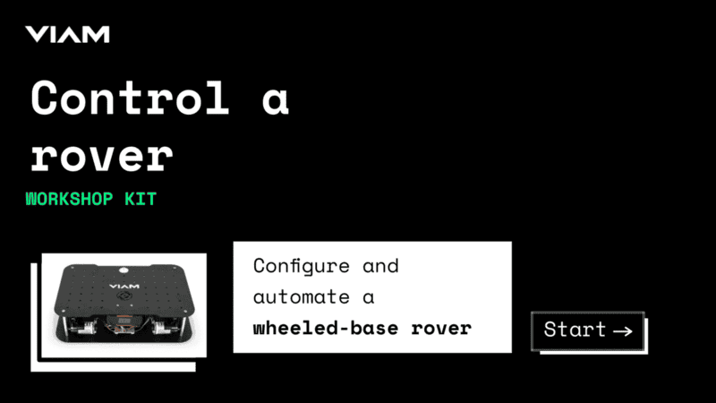
</a>

During the workshop, instructors can present this customizable slide deck (see above) tailored to your specific workshop needs. Alternatively, learners can follow step-by-step instructions and checkpoints independently by referencing the pages linked below in a web browser.

1. <a href="./index.html#4" target="_self">**Hardware Assembly**</a>
   - Set up your Raspberry Pi
   - Set up your Viam rover
2. <a href="./index.html#5" target="_self">**Software Setup**</a>
   - Configure your machine
   - Configure your Viam rover with a fragment
   - Test drive your rover
3. <a href="./index.html#6" target="_self">**Hands-On Experiment**</a>
   - Control your rover with TypeScript
   - Customize your TypeScript web application

<!-- ------------------------ -->

## Delivery Plan - Hardware Assembly

Duration: 30

### Set up your Raspberry Pi

The Raspberry Pi boots from a USB flash drive (or microSD card). You need to install Raspberry Pi OS on a USB flash drive that you will use with your Pi. For more details about alternative methods of setting up your Raspberry Pi, refer to the [Viam docs](https://docs.viam.com/installation/prepare/rpi-setup/#install-raspberry-pi-os).

### Install Raspberry Pi OS

1. Connect the USB flash drive (or microSD card) to your computer.
1. Download the [Raspberry Pi Imager](https://www.raspberrypi.com/software/) and launch it.
   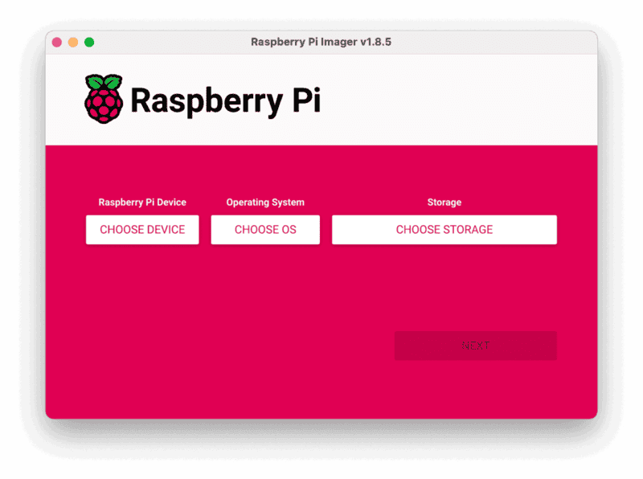
1. Click **CHOOSE DEVICE**. Select your model of Pi, which is Raspberry Pi 5.
1. Click **CHOOSE OS**. Select **Raspberry Pi OS (64-bit)** from the menu.
1. Click **CHOOSE STORAGE**. From the list of devices, select the USB flash drive you intend to use in your Raspberry Pi.
   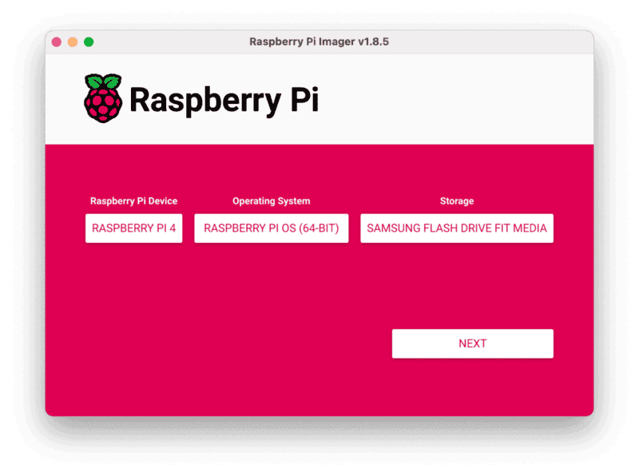
1. Configure your Raspberry Pi for remote access. Click **Next**. When prompted to apply OS customization settings, select **EDIT SETTINGS**.
1. Check **Set hostname** and enter the name you would like to access the Pi by in that field, for example, `rover`.
1. Select the checkbox for **Set username and password** and set a username (for example, your first name) that you will use to log into the Pi. If you skip this step, the default username will be `pi` (not recommended for security reasons). And specify a password.
1. Connect your Pi to Wi-Fi so that you can run `viam-server` wirelessly. Check **Configure wireless LAN** and enter your wireless network credentials. SSID (short for Service Set Identifier) is your Wi-Fi network name, and password is the network password. Change the section `Wireless LAN country` to where your router is currently being operated.
   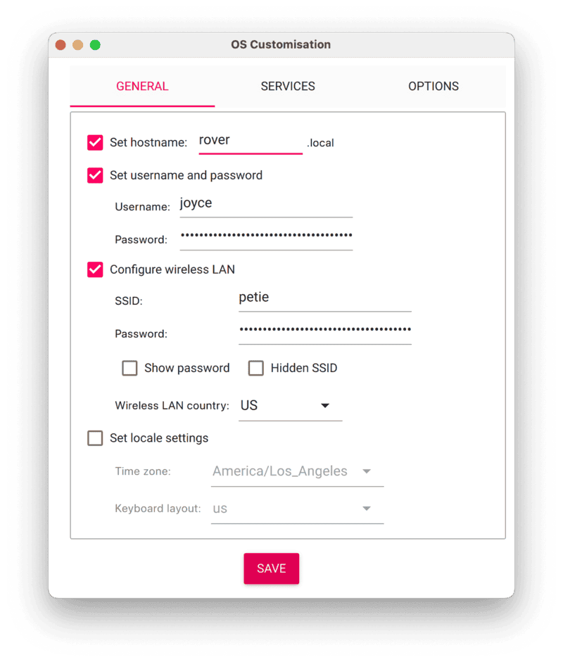
1. Select the **SERVICES** tab, check **Enable SSH**, and select **Use password authentication**.
   
   > aside negative
   > Be sure that you remember the `hostname` and `username` you set, as you will need this when you SSH into your Pi.
1. **Save** your updates, and confirm `YES` to apply OS customization settings. Confirm `YES` to erase data on the USB flash drive. You may also be prompted by your operating system to enter an administrator password. After granting permissions to the Imager, it will begin writing and then verifying the Linux installation to the USB flash drive.
1. Remove the USB flash drive from your computer when the installation is complete.

<form>
  <name>WWhat is the purpose of setting a custom `hostname` during the Raspberry Pi OS configuration?</name>
  <input type="radio" value="To improve the speed of the Raspberry Pi.">
  <input type="radio" value="To identify and access the Pi on the network.">
  <input type="radio" value="To secure the Pi by changing the default password.">
  <input type="radio" value="To enable remote access to the Pi.">
</form>

### Connect with SSH

1. Place the USB flash drive into your Raspberry Pi and boot the Pi by plugging it in to an outlet. A red LED will turn on to indicate that the Pi is connected to power.
1. Once the Pi is started, connect to it with SSH. From a command line terminal window, enter the following command. The text in <> should be replaced (including the < and > symbols themselves) with the user and hostname you configured when you set up your Pi.
   ```bash
   ssh <USERNAME>@<HOSTNAME>.local
   ```
1. If you are prompted “Are you sure you want to continue connecting?”, type “yes” and hit enter. Then, enter the password for your username. You should be greeted by a login message and a command prompt.
   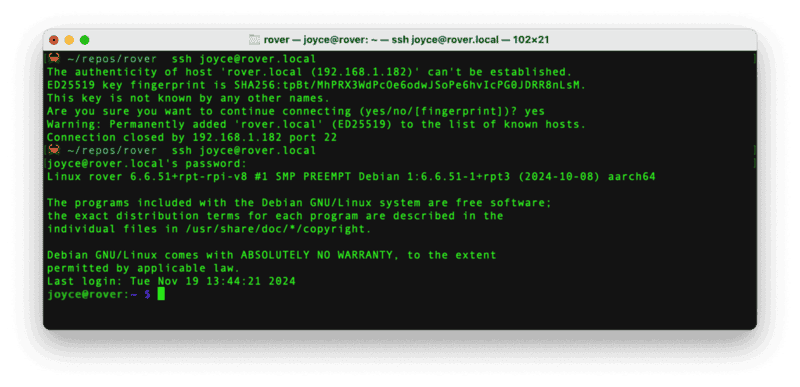
1. Update your Raspberry Pi to ensure all the latest packages are installed
   ```bash
   sudo apt update
   sudo apt upgrade
   ```

### Enable communication protocols

1. Launch the Pi configuration tool by running the following command
   ```bash
   sudo raspi-config
   ```
1. Use your keyboard to select “Interface Options”, and press return.
   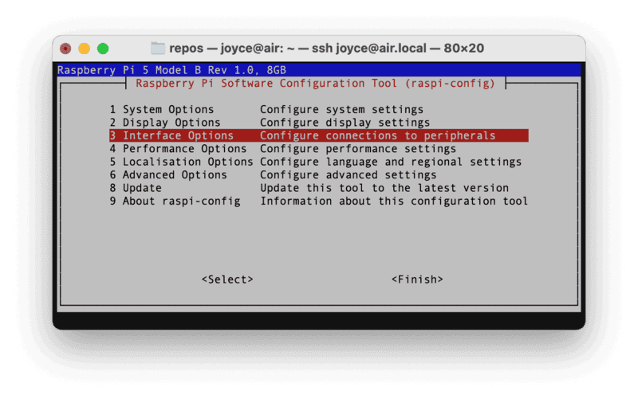
1. [Enable the relevant protocols](https://docs.viam.com/installation/prepare/rpi-setup/#enable-communication-protocols) to support our hardware. Enable the I2C protocol on your Pi to get readings from the power sensor anc accelerometer when controlling your rover. Select **I2C** enabled.
   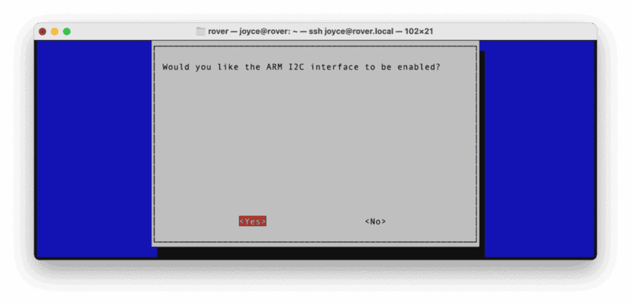
1. Confirm the options to enable the serial login shell and serial interface. And reboot the Pi when you're finished.
   ```bash
   sudo reboot
   ```

### Set up your Viam rover

Follow these steps [to assemble your Viam rover](https://docs.viam.com/appendix/try-viam/rover-resources/rover-tutorial/).

1. **Add the power supply**: Turn the rover over so that you can see the battery housing. Place four 18650 batteries (taking care to ensure correct polarity orientation) inside the battery pack to provide power to the rover, which can be turned on and off through the power switch.
   
1. To be able to attach the Raspberry Pi, unscrew the top of the rover with the biggest Allen key.
1. Use the smallest Allen key and the provided M2.5 screws to attach the Raspberry Pi to your rover through the standoffs on the motherboard. The Raspberry Pi 4 should be mounted such that the USB ports are to the right, as viewed from above.
   
1. Use the ribbon cable to connect the Raspberry Pi 4 to the motherboard.
   
1. Connect the webcam’s USB lead to any USB port on your Pi.
1. Screw the top plate back on with the biggest Allen key.
1. Use the power switch to turn the rover on. Wait a second the rover motherboard to power on. If the Pi has power, the lights on the Raspberry Pi will light up.

<form>
  <name>Which protocol must be enabled on the Raspberry Pi to allow it to communicate with the power sensor and accelerometer?</name>
  <input type="radio" value="SSH">
  <input type="radio" value="I2C">
  <input type="radio" value="Wi-Fi">
  <input type="radio" value="Bluetooth">
</form>

<!-- ------------------------ -->

## Delivery Plan - Software Setup

Duration: 30

### Configure your machine

1. In [the Viam app](https://app.viam.com/fleet/locations) under the **LOCATIONS** tab, create a machine by typing in a name and clicking **Add machine**.
   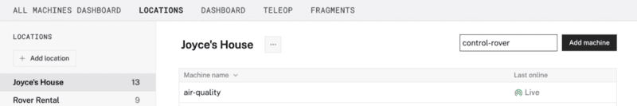
1. Click **View setup instructions**.
   
1. Install `viam-server` on the Raspberry Pi device that you want to use to communicate with and control your air sensor. Select the `Linux / Aarch64` platform for the Raspberry Pi to control the air sensor, and leave your installation method as [`viam-agent`](https://docs.viam.com/how-tos/provision-setup/#install-viam-agent).
   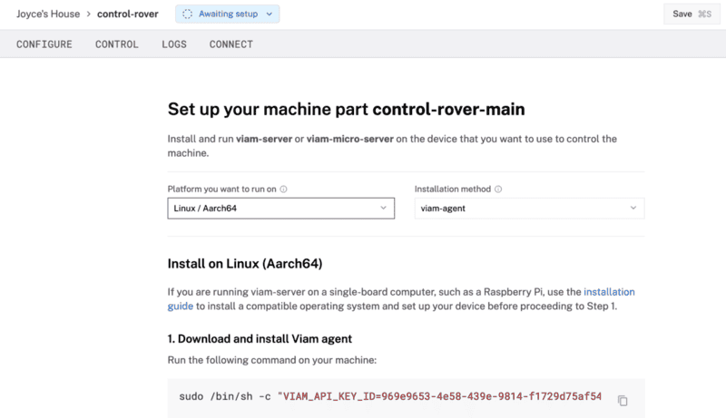
1. Use the `viam-agent` to download and install `viam-server` on your Raspberry Pi. Follow the instructions to run the command provided in the setup instructions from the SSH prompt of your Raspberry Pi.
   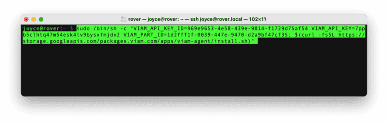
   The setup page will indicate when the machine is successfully connected.

<form>
  <name>Why is it important to connect your machine to the Viam app during setup?</name>
  <input type="radio" value="To remotely monitor, configure, and control hardware components through the cloud.">
  <input type="radio" value="To store video data directly on the webcam.">
  <input type="radio" value="To eliminate the need for a physical Raspberry Pi.">
  <input type="radio" value="To ensure the machine only works offline.">
</form>

### Configure your Viam rover with a fragment

1. In [the Viam app](https://app.viam.com/fleet/locations), find the **CONFIGURE** tab. It's time to configure your hardware.
1. Click the **+** icon in the left-hand menu and select **Insert Fragment** to browse the available [configuration fragments](https://docs.viam.com/fleet/fragments/).
   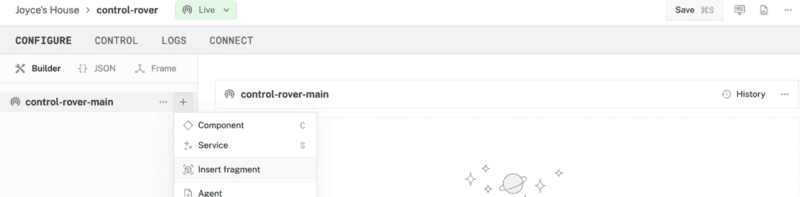
1. Select [`ViamRover2-2024-rpi4-a`](https://app.viam.com/fragment/7c413f24-691d-4ae6-a759-df3654cfe4c8/json).
   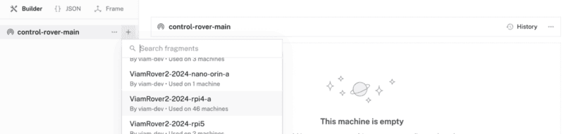
1. Click I**nsert fragment** again to add the fragment to your machine.
   
1. Notice adding this fragment adds several hardware components to your machine’s JSON configuration. Each component is listed in the left sidebar, along with a corresponding panel on the right with more details.
   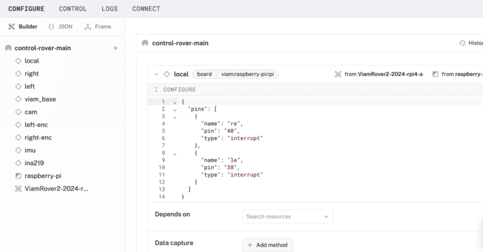
1. Click **Save** in the top right to save and apply your configuration changes.

<form>
  <name>What is a benefit to using a Viam configuration fragment?</name>
  <input type="radio" value="A. You can share and machine configurations across multiple machines.">
  <input type="radio" value="B. You can edit a fragment to update the configuration on each deployed machine that uses that fragment.">
  <input type="radio" value="C. A, but not B.">
  <input type="radio" value="D. Both A and B.">
</form>

### Test drive your rover

1. Under the **CONFIGURE** tab of [the Viam app](https://app.viam.com/fleet/locations), some resources have a **TEST** section on the bottom half of their configuration pane which you can expand and interact with to test out controlling the component. When you configure a component on the **CONFIGURE** tab, it will also appear on the **CONTROL** tab which gives you an interface to interact with it.
1. Find the **CONTROL** tab. This is where you can control your Viam rover. Find the `viam_base` in the left sidebar, and click on it. Notice the components in the left sidebar correspond to a more detailed view on the right side of the page.
   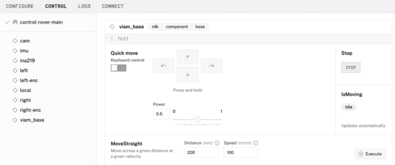
1. Within the `viam_base` card, toggle on the **Keyboard control** so that you can control the rover using keyboard keys **WASD**.
1. Continue exploring the different components of your rover.

<form>
  <name>What does it mean that `viam-server` enables remote access to the rover?</name>
  <input type="radio" value="You can drive the rover from a web browser">
  <input type="radio" value="You can drive the rover from anywhere within the same local network">
  <input type="radio" value="You can drive the rover from anywhere in the world">
  <input type="radio" value="All of the above">
</form>

<!-- ------------------------ -->

## Delivery Plan - Hands-on Experiment

Duration: 40

### Control your rover with TypeScript

Now that you know how to manually control the rover using the Viam app, let's control the rover programmatically with code using one of [Viam's SDKs](https://docs.viam.com/sdks/). You can run control code from anywhere; it does not necessarily have to be run on the same machine that runs `viam-server`.

1. From the command line within your terminal window of your laptop (not SSH'd into your Pi), let's use a command line utility to quickly set up a new TypeScript project. Input the following command:
   ```bash
   $ npm create robot-app
   ```
1. At the command-line prompt, input your project name. Or hit **Enter** to accept the default project name, `my-viam-project`.
   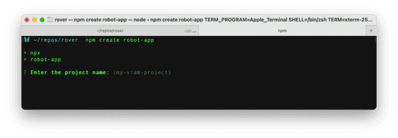
1. Select the project template `controlRover`, and hit **Enter**.
1. Once the project setup is completed, follow the command-line instructions. Navigate into your new project directory. In the example shown below, we are using the default project name `my-viam-project`.
   ```bash
   $ cd my-viam-project
   ```
1. In the Viam app, find the **CONNECT** page, select the **TypeScript** SDK, and turn on **Include API key** to reveal your machine credentials within the code sample. Use these machine credentials to update the `.env` file in your new project directory, and save your changes.
   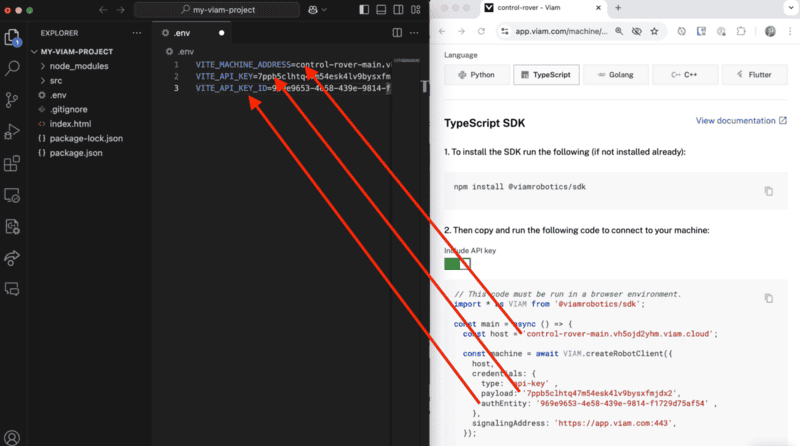
1. Start the application server. Your web app should be running at `http://localhost:5173/`
   ```bash
   $ npm start
   ```
1. Open your browser's devtools, for example, by right-clicking and selecting **Inspect**, to see the browser's console logs. Make sure there is adequate space surrounding your rover. And then press the **Click me** button in the web application to see what happens to your rover.
   

<form>
  <name>What is the purpose of the `.env` file in your TypeScript project?</name>
  <input type="radio" value="To store the TypeScript code for controlling the rover.">
  <input type="radio" value="To define the credentials needed to connect to your rover.">
  <input type="radio" value="To specify the name of the TypeScript project.">
  <input type="radio" value="To configure the application server's URL.">
</form>

### Customize your TypeScript web application

> aside negative
> **Note for the workshop instructor**: This part of the workshop can be a group exericse, self-guided breakout session, or self-paced learning after the workshop. Ideas for exploration are listed below. And additional ideas for next-level projects are listed on the <a href="./index.html#8" target="_self">**Post-Workshop Resources page**</a>.

Now it's time to customize the TypeScript web application and make it your own. In your preferred IDE, consider the following suggestions for adding more functionality to your web application:

- **Program the business logic**: Edit `src/main.ts` to change the logic being run.
  - Consider moving the rover along a different route using the [Viam `base` API](https://docs.viam.com/components/base/#api), for example, `spin` the rover.
  - Use the [Viam `SLAM` service](https://docs.viam.com/services/slam/) for mapping or the [Viam Navigation service](https://docs.viam.com/services/navigation/) for GPS
  - Integrate with third-party cloud services and APIs to enhance the functionality of your robot, such as voice control, data logging, or GPS tracking.
- **Program the frontend**: Edit `index.html` to change the layout of the web application.
  - Add descriptive text to display each action directly on the webpage, instead of logging it to the console.
  - Display a camera feed within your web application using the [Viam `camera` API](https://docs.viam.com/components/camera/#api)

<form>
  <name>What is the primary role of `viam-server` in the system architecture of your rover setup?</name>
  <input type="radio" value="It acts as the operating system for the Raspberry Pi.">
  <input type="radio" value="It provides a layer for managing hardware components and enables remote communication via the Viam app or TypeScript app.">
  <input type="radio" value="It processes video and motion data locally without connecting to the cloud.">
  <input type="radio" value="It directly powers the Raspberry Pi.">
</form>

<!-- ------------------------ -->

## Additional resources and troubleshooting

Duration: 5

### Additional resources

- The website [pinout.xyz](https://pinout.xyz/) is a helpful resource with the exact layout and role of each pin for Raspberry Pi. When working with Viam, make sure to reference the physical pin numbers, and not the GPIO numbers listed on `pinout.xyz`.
- The [demo video](https://youtu.be/daU5iNsSO0w?feature=shared) provides a brief overview of the project.
- Viam APIs provide consistent methods of working with components, such as a [`base`](https://docs.viam.com/components/base/#api), [`camera`](https://docs.viam.com/components/camera/#api), and services, such as [`computer vision`](https://docs.viam.com/services/vision/#api). Refer to the [Viam documentation](https://docs.viam.com/platform/) for API reference for all components and services.
- Besides TypeScript, Viam provides [SDKs in various programming languages](https://docs.viam.com/sdks/) to write control code for the backend, frontend, and mobile applications.


### Common pitfalls and troubleshooting guidance

1. **Safety**
   - Lithium-ion batteries may pose a flammable hazard. This product requires four 18650 lithium-ion batteries OR an RC-type battery. DO NOT connect multiple power sources simultaneously. Refer to the battery manufacturer’s operating instructions to ensure safe operation of the Viam Rover. Dispose of lithium-ion batteries per manufacturer instructions.
1. **Security**
   - Do not share your API credentials publicly. Sharing this information could compromise your system security by allowing unauthorized access to your machine, or to the computer running your machine.
1. **Flashing firmware**
   - Make sure you are using a 5V 5A (25W) power supply.
   - Participants must remember the `hostname` and `username` they set while flashing their Raspberry Pi, as they will need this when they SSH into the Pi.
   - To save time, instructors can flash all the Pis ahead of time with pre-determined credentials and share the credentials with participants during the workshop. Each Pi should have a unique `hostname` to avoid conflicts on the shared local network, such as `&lt;student-name&gt;-air` or `&lt;group-name&gt;-air` if they are working in groups.
     - If you're using SD cards, verify that you have a way to write data onto them before providing them to participants.
1. **Alternative setups**
   - If you're not using a Raspberry Pi 4, you can use [different boards](https://docs.viam.com/appendix/try-viam/rover-resources/rover-tutorial/#motherboard) with your Viam Rover 2 with some [alternative board configurations](https://docs.viam.com/appendix/try-viam/rover-resources/rover-tutorial/#alternative-board-configurations) while attaching the boards.
   - If you're not using a [Viam rover](https://docs.viam.com/appendix/try-viam/rover-resources/), you can use other wheeled-base robots, like [SCUTTLE and Yahboom](https://docs.viam.com/tutorials/configure/configure-rover/)
1. **Configuring machine and peripherals**
   - If any problems occur while setting up the machine and peripherals in [the Viam app](https://app.viam.com), check under the **LOGS** tab to see what might be going wrong.
   - Check that all wires are securely attached to the correct pins.
   - If you are using a battery to power the base, check that it is adequately charged. If the motors are drawing more power than the battery can supply, the single-board computer may be power cycling. Consider using a wall power supply for testing purposes to rule out this issue.
   - If you are using a battery to power the base, ensure that the batteries are making contact with the terminals inside the battery pack. Some shorter batteries might need to be pushed along to ensure that contact is being made.
   - Click on the **TEST** panel on the **CONFIGURE** or **CONTROL** tab and test if you can use the base there.
   - Also refer to the overall [Viam troubleshooting guide](https://docs.viam.com/appendix/troubleshooting/).

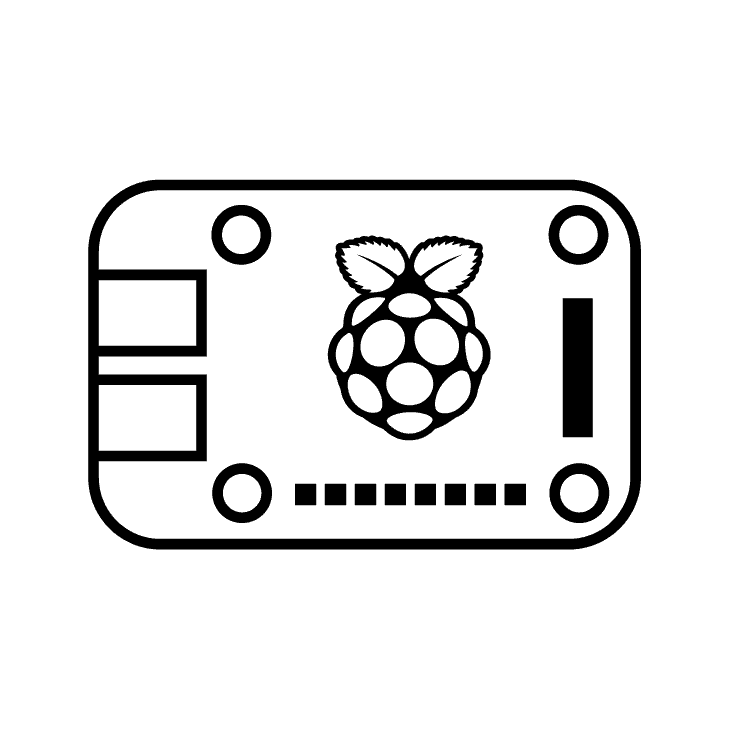

### Logistics for continued learning

Participants have several options for continuing their projects beyond the workshop environment:

- **Take-home projects**: For participants allowed to take their rover home after the workshop, the `viam-agent` on the Raspberry Pi can simplify the setup process:

  - **Provisioning mode**: Upon rebooting the Raspberry Pi in a new environment like at home, the `viam-agent` automatically creates a Wi-Fi hotspot if it cannot connect to a known network.
  - **Connect to the hotspot**: Look for a network named `viam-setup-HOSTNAME` in your list of available Wi-Fi networks, where `HOSTNAME` is the custom hostname you set during the workshop, and `viamsetup` is the default password. Connect your laptop to this network.
  - **Provide network information for the machine**: Go to the provisioning portal at `http://viam.setup/` in a browser to follow [the on-screen instructions](https://docs.viam.com/fleet/provision/#end-user-experience) to configure the Raspberry Pi for your home Wi-Fi.

- **Remote control**: If participants cannot take their rover home but want to continue their projects, they can access their rover remotely:

  - **Access the workshop rover**: Participants can control the workshop rover remotely from anywhere in the world. A webcam can be set up for participants to view the rover’s movements in real time.
  - **Code from home**: Without SSH access to the Raspberry Pi, participants can still write and test code on their laptops and integrate changes during their next in-person session or via workshop-provided tools.

- **Try Viam virtual experience**: For participants without access to a physical rover, Viam provides an online learning experience called [Try Viam](https://app.viam.com/try) in the web browser to remotely control a rover pre-configured with components in the NYC Viam robotics lab.

<!-- ------------------------ -->

## Post-Workshop Resources

Duration: 5

### Group discussion topics 🗣️

Review suggested topics for discussion at key points during the workshop.

- What were the biggest challenges participants faced during the workshop (e.g., assembly, coding, debugging)?
- Share troubleshooting experiences and how participants resolved issues.
- What components are included in the configuration fragment, and how could we use them?
- What additional features could improve the system (e.g. sensors, cloud services, mobile app)?
- How can rovers be used in homes, schools, or offices?
- Discuss different ways rovers can interact with the environment in industrial settings and outdoor spaces.
- Discuss the feasibility of deploying a network of rovers for a citywide project.
- How can the design of the rover be improved for better accessibility, performance, or durability?
- What are some ethical considerations when deploying rovers in shared or public spaces?

### Quiz questions ❓

Review the suggested quiz questions below to evaluate participants' understanding of key concepts. These questions can be used to assess knowledge either during (see multiple choice answers in the delivery plan) or after the workshop.

1. **Hardware Assembly**
   - What is the purpose of setting a custom `hostname` during the Raspberry Pi OS configuration?
   - Which protocol must be enabled on the Raspberry Pi to allow it to communicate with the power sensor and accelerometer?
1. **Software Setup**
   - Why is it important to connect your machine to the Viam app during setup?
   - What is a benefit to using a Viam configuration fragment?
   - What does it mean that `viam-server` enables remote access to the rover?
   - How does the Viam app simplify the process of testing and controlling hardware components like the base and camera?
1. **Hands-on Experiment**
   - What is the primary role of `viam-server` in the system architecture of your rover setup?
   - What is the purpose of the `.env` file in your TypeScript project?

### Next-level projects

Here are some ideas for expanding and enhancing the current project to create autonomous behaviors.

- [Detect color with a webcam](https://docs.viam.com/how-tos/detect-color/) guide: to add this capability to your rover to respond to the environment
- [Navigate with a rover base](https://docs.viam.com/tutorials/services/navigate-with-rover-base/) tutorial: to set up user-defined waypoints for your rover to move to in the order that you specify or dynamically adapt using inputs like GPS or vision
- [Train a custom ML model](https://docs.viam.com/how-tos/train-deploy-ml/) guide: to enable object detection or classification and program the rover to act accordingly, such as moving toward or avoiding detected objects
- [Add sensors and other components](https://docs.viam.com/appendix/try-viam/rover-resources/rover-tutorial/#extensibility) to extend the functionality of your rover
- [Use the Viam mobile SDK to build an iOS or Android application](https://docs.viam.com/sdks/#mobile-sdk) to control the machine's components

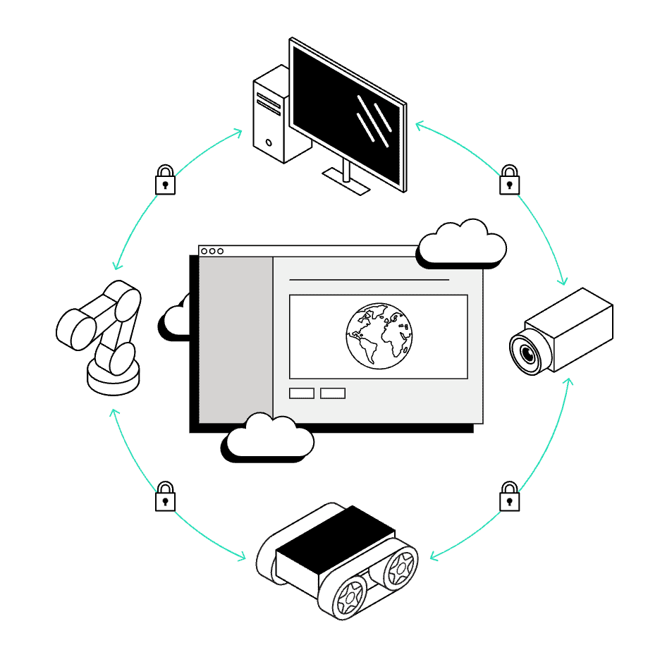

### Post-workshop resources for participants

- [Viam documentation](https://docs.viam.com/) for reference
- [Viam Discord community](http://discord.gg/viam) for inspiration and support
- Viam [how-to guides](https://docs.viam.com/how-tos/) for task-based learning, [codelabs](https://codelabs.viam.com/) for hands-on learning, and [tutorials](https://docs.viam.com/tutorials/) for project-based learning.


### Contribute your own workshop

This workshop and other educational codelabs are part of [this Viam open-source project](https://github.com/viam-devrel/viamcodelabs). You are invited to document your own workshop(s) to share with the Viam community. Be sure to follow these [contributing guidelines](https://github.com/viam-devrel/viamcodelabs?tab=readme-ov-file#write-your-first-codelab), and let us know about it in the [Viam Discord community](http://discord.gg/viam)!


