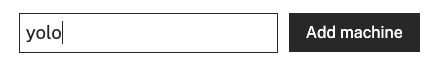
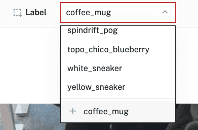

author: HipsterBrown
id: yolo-training
summary: Train and deploy a custom YOLO object detection model
categories: Getting-Started, Developer
environments: web
status: Published 
feedback link: https://github.com/viam-devrel/viamcodelabs/issues
tags: Getting Started, Developer

# Train & run a custom YOLO model
<!-- ------------------------ -->
## Overview 
Duration: 1

In the world of computer vision, [YOLO](https://docs.ultralytics.com/#yolo-a-brief-history) (You Only Look Once) has revolutionized object detection with its speed and accuracy. Unlike traditional methods that scan images multiple times at different scales, YOLO divides images into a grid and predicts bounding boxes and class probabilities in a single pass – hence the name "You Only Look Once."
This approach makes YOLO exceptionally fast while maintaining high accuracy, perfect for real-time applications.
Why use YOLO for your projects? It offers several key advantages:

- Speed: YOLO processes images in real-time (up to 45-155 FPS depending on the model variant)
- Accuracy: It achieves competitive performance on standard detection benchmarks
- Versatility: Works well with objects of various sizes and in complex scenes
- Resource efficiency: Lighter variants can run on resource-constrained devices
- Active community: Continuous improvements and extensive documentation

Custom training scripts for YOLO, like the one we'll use in this codelab, exist because while pre-trained models are powerful, they only recognize common objects they were trained on. Custom training allows you to:

- Detect specific objects unique to your application
- Optimize for your particular use case and environmental conditions
- Fine-tune performance for your specific hardware constraints
- Control the training process and experiment with different parameters

In this codelab, we'll use the Ultralytics [YOLOv8](https://docs.ultralytics.com/models/yolov8/) implementation, which provides a good balance of accurancy and efficiency in object detection, and we'll export to ONNX format for optimal deployment on various hardware platforms.

### What You'll Build 
A custom object detection system using the [YOLO](https://docs.ultralytics.com/#yolo-a-brief-history) (You Only Look Once) model architecture.
   
<!--  -->

### Prerequisites
- A computer with a built-in webcam or a USB webcam
- Objects you want to detect (at least 2-5 different objects recommended)

### What You'll Need
- Sign up for a free Viam account, and then [sign in](https://app.viam.com)

### What You'll Learn 
- How to configure a camera in the Viam platform
- How to capture images and create a training dataset
- How to annotate images with bounding boxes
- How to train a custom YOLO model using a custom training script
- How to deploy your trained model to your machine
- How to run real-time object detection with your model

<!-- ### Watch the Video -->

<!-- See a demonstration of the YOLO model in action: -->

<!-- <video id="fpK4J9NzD2Q"></video> -->
<!-- ------------------------ -->
## Configure your machine
Duration: 5

1. In [the Viam app](https://app.viam.com/fleet/dashboard) under the **LOCATIONS** tab, create a machine by clicking **+ Add machine**, typing in a name, and clicking **Add machine**.
   <!--  -->
1. Click **View setup instructions**.
   <!--  -->
1. To install `viam-server` on your device, select the operating system you are running. For example, I'll be using a MacBook Air as my device, so I'll select `Mac`:
1. Follow the instructions that are shown for your platform.
1. The setup page will indicate when the machine is successfully connected.
   <!--  -->

With a machine configured, we now need a way to capture images. Let's add a webcam next!

<!-- ------------------------ -->
## Configure your camera
Duration: 5

1. In [the Viam app](https://app.viam.com/fleet/locations), find the **CONFIGURE** tab.
1. Click the **+** icon in the left-hand menu and select **Component**.
1. Select `camera`, and find the `webcam` module. Leave the default name `camera-1` for now, then click **Create**.
   <!--  -->
1. Notice adding this module adds the camera hardware component called `camera-1`. You'll see a collapsible card on the right, where you can configure the camera component.
1. To configure the camera component, the `video_path` of the intended device needs to be set. You can quickly find which devices are connected to your machine by adding a discovery service. Click **Add webcam discovery service** that appears in the prompt.
1. Notice that this adds the `discovery-1` service and `find-webcams` module to your machine in the left sidebar.
1. Click **Save** in the top right to save and apply your configuration changes.
1. Expand the **TEST** panel of the `discovery-1` card. Here, you'll find attributes of all discoverable cameras connected to your machine. Find the `video_path` of the device you'd like to use as your webcam, then copy the value.
   <!--  -->
1. Paste the copied `video_path` value into your camera component's `video_path` input, which is in the **Attributes** section.
1. Click **Save** in the top right once more to save and apply your configuration changes.
1. Expand your camera component's **TEST** panel. If things are properly configured, you should see the video streaming from your camera.
    <!--  -->
1. With your camera added and working, you can now delete the `discovery-1` service and `find-webcams` module as you'll no longer need them. Click the *...* next to each item, then select **Delete**. 
1. You will be prompted to confirm the deletion, select **Delete**
1. Finally, **Save** your configuration changes.

Great! Your machine now has a camera component configured and ready to use for capturing images to use for training your model.

<!-- ------------------------ -->
## Create a dataset and capture training images
Duration: 15

To train a custom YOLO model, you'll need a dataset of images with objects you want to detect. Let's create a dataset and capture some training images using your configured camera.

1. In [the Viam app's Data view](https://app.viam.com/data/), find the **DATASETS** tab.
1. Click the **+ Create dataset** button and give your dataset a name, like `yolo-objects`. Click the **Create dataset** button again to save.
   <!--  -->
1. Switch back to your machine in [the Viam app's Fleet view](https://app.viam.com/fleet/locations). You can navigate back by going to Fleet > All Machines Dashboard, then clicking on the name of your machine.
1. Expand your camera component's **TEST** panel. Here, you'll see the live feed of your camera as well the "Add image to dataset" icon, which looks like a camera.
   <!--  -->
1. Position your object in the camera frame. Make sure the object is clearly visible and well-lit.
1. When you are happy with the image, click the **Add image to dataset** button.
1. In the list of datasets that appear, select the dataset you created previously, i.e. `yolo-objects`.
   <!--  -->
1. Confirm the dataset you've selected, then click **Add**.
   <!--  -->
1. A success message will appear at the top-right once your image is added to your selected dataset.
1. Repeat steps 5-8 to capture multiple images of each object you want to detect.
   > aside positive
   > **Tips for good training data**: 
   > - Use good lighting to ensure clear, well-lit images
   > - Capture the object from different angles
   > - Include different backgrounds
   > - Vary the distance from the camera
   > - Add variations in object orientation
   > - Aim for at least 10-20 images per object
   > - Include some images with multiple objects if needed

   <!--  -->
   <!--  -->
   <!--  -->
   <!--  -->

Way to go! Now that you have your training images, you'll identify where the each object is located in the image in the next step.

<!-- ------------------------ -->
## Annotate your dataset with bounding boxes
Duration: 20

In this step, you'll annotate your images by drawing bounding boxes around the objects you want to detect and assigning labels to them.
This helps the model learn how to recognize the different objects.

1. In [the Viam app](https://app.viam.com/data/datasets), find the **DATASETS** tab.
1. Click on the name of your dataset (`yolo-objects`).
1. Here, you'll see all of the images you've captured. Select one image from the dataset. A side panel will appear on the right-hand side. You can see details about this image, such as any objects annotated, associated tags, which datasets the image belongs to, among other details.
1. Click on the **Annotate** button in the side panel.
   <!--  -->
1. The selected image opens to a larger screen.  To detect an object within an image, a label must be given. Create a label for your object, for example `coffee_mug`:
   <!--  -->
1. With the label chosen, hold the _Command_ or _Windows_ key down while you use your mouse to draw a bounding box around your object. Make sure the box tightly surrounds the object.
   <!--  -->
1. In the **OBJECTS** panel on the right, you'll see your object listed with an object count of `1`. If you hover over this item, you'll see the `coffee_mug` label appear in the image and the bounding box fill with color.
   <!--  -->
1. Repeat this process for all images in your dataset. Creating a label for each distinct object you want to detect. You can quickly navigate between images by pressing the `>` (right arrow) or `<` (left arrow) keys on your keyboard.
1. When you are finished annotating all images, exit the annotation editor by clicking on the "X" in the top-left corner. A breakdown of your bounding box labels will be displayed:
   <!--  -->
1. Make sure all your images are labeled and there are no `Unlabeled` images left. Confirm that there are at least 10 images of each object you are planning to detect.

Good job! That's the most tedious part of this process. Your dataset is now ready for training.

<!-- ------------------------ -->
## Train your YOLO model
Duration: 5

1. In your dataset overview, click **Train model** located within the left-hand panel.
   <!--  -->
1. Select your model training options. For now, leave the default selections of **New model**. Select **Train on a custom training script**. Click **Next steps**.
   <!--  -->
1. Give your model a name, for example `my-yolo-detector`
   <!--  -->
1. Select **yolo-onnx-training** for the training script. Then select **Latest** for the version of the script.
   <!--  -->
1. Click **Train model**. This will kick off the training job for your custom model.

1. The training script will:
   - Parse your dataset
   - Create training and validation splits
   - Set up the YOLO directory structure
   - Train the model for the specified number of iterations (a.k.a epochs)
   - Export the model to ONNX format
   - Copy the model and labels to your output directory
   <!--  -->
1. If you click on the **ID** of your training job, you can view more details on the job's overview. You can view any relevant logs while the job runs. 
   <!--  -->
1. Wait until your training job is complete. It may take up to 15 minutes, so feel free to grab a snack and watch one of [Viam's videos on YouTube](https://www.youtube.com/@viamrobotics)! Once it is finished, you'll see the status of your job change to **Completed** and receive an email notification.
   <!--  -->
1. You can click on the model name in the **DETAILS** sidebar of the "Training job" overview to see the uploaded model in the Registry.
   <!--  -->


Well done, you've just created your own custom YOLO model tailored to your specific objects! Now you can deploy it to your machine.

<!-- ------------------------ -->
## Configure the YOLO-ONNX ML Model
Duration: 5

Now that you have a trained model, let's add it to your Viam machine using the `yolo-onnx` ML model service.

1. In [the Viam app](https://app.viam.com/fleet/locations), find the **CONFIGURE** tab.
1. Click the **+** icon in the left-hand menu and select **Service**.
1. Select `ML Model`, then search for and select the `hipsterbrown:mlmodel:yolo-onnx` module from the registry. Leave the default name `mlmodel-1` for now, then click **Create**.
   <!--  -->
1. Notice adding this module adds the ML Model service called `mlmodel-1` and the `yolo-onnx` module from the Viam registry. You'll see configurable cards on the right and the corresponding parts listed in the left sidebar.
1. Click on the JSON tab in the left sidebar above your machine name to display the full configuration JSON for your machine.
1. At the bottom of the configuration, add a `"packages"` field with the details of your YOLO model from the registry:
   ```json
    "packages": [{
      "name": "my-yolo-detector",
      "package": "<organization-id>/my-yolo-detector",
      "type": "ml_model",
      "version": "<version>"
    }]
   ```
   <!--  -->
   The name should match what you see displayed on the model page in the Registry.
   Replace the "\<organization-id>" with your Organization ID, which can be found in **Settings and invites** page. If you change your model to be public in the Registry, you can use your public namespace instead.
   Replace the "\<version>" with the latest version displayed in the Registry, i.e. `2025-04-16T17-29-48`.

1. Switch back to the Builder tab to update the JSON configuration of the `mlmodel-1` service. You need to provide the paths to your model and labels files. You can get those by referencing your trained model package from the Registry.
   ```json
   {
     "package_reference": "<organization-id>/my-yolo-detector",
     "model_path": "${packages.ml_model.my-yolo-detector}/best.onnx",
     "label_path": "${packages.ml_model.my-yolo-detector}/labels.txt"
   }
   ```
   <!--  -->
   The `"package_reference"` should match the `"package"` field you set in the previous step.
1. Click **Save** in the top right to save and apply your configuration changes.

Your YOLO-ONNX ML model service is now configured with your custom model. Next, let's set up a vision service to use this model for object detection.

<!-- ------------------------ -->
## Configure the Vision Service
Duration: 5

1. In [the Viam app](https://app.viam.com/fleet/locations), find the **CONFIGURE** tab.
1. Click the **+** icon in the left-hand menu and select **Service**.
1. Select `vision`, and find the `ML Model` module. Give your vision service a descriptive name, such as `yolo-vision`. Click **Create**.
   <!--  -->
1. In the **Configure** panel of your vision service, set the **ML Model** to your ML Model service (`mlmodel-1`).
   <!--  -->
1. Move the **Minimum confidence threshold** slider to `0.4`. This sets the minimum confidence level for object detections to be considered valid.
1. Find and select your camera component in the **Depends on** section (`camera-1`).
   <!--  -->
1. Click **Save** in the top right to save and apply your configuration changes. This might take a few moments.
1. Expand the **TEST** panel of your vision service. You'll see a live feed of your configured webcam and a section **Labels**.
   Test out your model! Try showing your objects to your webcam. When detected, an item will appear with the label the vision service thinks it is seeing and its confidence level.
   You can also try showing multiple objects and see how well your model detects them!
   <!--  -->

   > aside negative
   > **Troubleshooting**: Having trouble detecting the correct object (or anything at all)? Try setting the **Minimum confidence threshold** to something smaller, save your changes, and see if that helps. Additionally, make sure you have enough light for your webcam to detect clearer images, keep your background and surroundings free of potential visual clutter, and hold up your object for at least a few seconds (so that the vision service can get a clear image to interpret). If this all still doesn't work, you many need to add more images or better quality images to your model. Luckily, you can repeat the steps in **Create a dataset and capture training data**, train a new version of your model, then try using it in your ML model service. The more data the better, so at the very least, more images of your objects _should_ make your model more accurate.


Congratulations! You've successfully trained and deployed a custom YOLO object detection model on your Viam machine.

<!-- ------------------------ -->
## Next Steps and Improvements
Duration: 5

Here are some ways you can improve your YOLO object detection system:

1. **Collect more training data**: Adding more diverse images can improve model accuracy.
1. **Data augmentation**: The YOLO training process includes data augmentation, but you can add more images with different conditions.
1. **Post-processing**: Implement additional logic to filter or process the detection results.
1. **Integration with other components**: Connect your object detection system with other components or services in your Viam machine.

Some practical project ideas using your YOLO object detection system:

- **Smart inventory system**: Track objects as they're added or removed from a space
- **Sorting machine**: Identify and sort different types of objects
- **Security monitor**: Detect specific objects or people
- **Robotics vision**: Give your robot the ability to identify and interact with objects

<!-- ------------------------ -->
## Conclusion and Resources
Duration: 1

Congratulations! You've successfully built a custom object detection system using YOLO and Viam. 🎉 You've learned how to:

- Configure a camera in the Viam platform
- Capture images and create a training dataset
- Annotate images with bounding boxes
- Train a custom YOLO model using a custom training script
- Deploy your trained model to your machine
- Run real-time object detection with your model

The YOLO architecture is one of the most efficient and accurate object detection systems available, making it perfect for real-time applications. By combining it with Viam's platform, you can easily deploy sophisticated computer vision capabilities to your machines.

### Related Resources
- [Viam Documentation](https://docs.viam.com/)
- [YOLOv8 Documentation](https://docs.ultralytics.com/)
- [Custom training script for YOLO](https://github.com/viam-devrel/yolo-training)
- [`yolo-onnx` MLModel service repo](https://github.com/hipsterbrown/viam-yolo-onnx)
- [ML Model Service Documentation](https://docs.viam.com/dev/reference/apis/services/ml/)
- [Vision Service Documentation](https://docs.viam.com/dev/reference/apis/services/vision/)
- [Viam Community Discord](https://discord.gg/viam)
